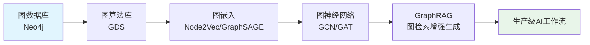

# 研讨会主题概述：从图数据库到图原生 AI

> **难度级别**：入门
> **预计阅读时间**：25 分钟
> **前置知识**：无特殊要求，了解数据库基本概念即可

---

## 一、讲座背景：关系数据复杂性的激增

### 1.1 数据形态的根本性转变

在过去二十年间，我们见证了数据形态的根本性转变。传统的关系型数据库（Relational Database，RDBMS）诞生于 20 世纪 70 年代，其核心假设是数据可以被组织为规范的二维表格（Tables），并通过外键（Foreign Keys）建立表与表之间的关联。这一模型在处理银行交易、库存管理、人事档案等结构化业务数据时表现出色。

然而，进入 Web 2.0 时代尤其是移动互联网与物联网普及之后，数据的复杂性和关联性呈现爆炸式增长。社交网络中的好友关系、引文网络中的引用链路、知识图谱（Knowledge Graph）中的实体关联、金融网络中的资金流向——这些数据的本质特征不再是"字段值的集合"，而是"实体与关系的网络"。

当我们在关系型数据库中执行多表连接查询（JOIN）来还原这些关联时，性能会随连接深度的增加呈指数级下降。具体而言，关系数据库通过索引（Index）查找关联记录，每多一层 JOIN 就需要一次额外的索引查找与磁盘 I/O，这种"指数级连接代价"使得深度关联查询在传统架构下几乎不可行。

### 1.2 传统机器学习在非欧几里得空间的局限

与此同时，机器学习（Machine Learning，ML）领域也面临着类似的挑战。传统的机器学习算法——无论是逻辑回归、支持向量机（SVM）还是早期的神经网络——大多建立在欧几里得空间（Euclidean Space）的假设之上，即数据可以被表示为规则网格上的向量，如图像的像素矩阵、文本的词向量序列。

然而，图结构数据存在于非欧几里得空间（Non-Euclidean Space）中。在图数据中：

- **节点没有固定的排列顺序**，不存在"第 1 个节点""第 2 个节点"的天然编号；
- **节点的邻居数量不固定**，有的节点可能有 2 个邻居，有的可能有 10000 个；
- **不存在平移不变性（Translation Invariance）**，无法像卷积神经网络（CNN）处理图像那样在图上滑动卷积核。

这意味着传统机器学习无法直接处理图结构数据。研究者不得不先将图"扁平化"为特征向量——例如提取度数、聚类系数等手工特征——再交给传统模型训练。这种方式不仅丢失了大量结构信息，还高度依赖领域专家的特征工程经验。

正是这两重背景——关系数据库在深度关联查询上的瓶颈，以及传统机器学习在非欧几里得数据上的局限——共同催生了图数据库（Graph Database）与图人工智能（Graph AI）的兴起。

---

## 二、核心问题解读

本次研讨会围绕一个核心命题展开：**如何让机器像人类一样理解事物之间的关系，并在此基础上进行智能推理与决策？**

这一命题可以拆解为三个层次的子问题：

| 层次 | 核心问题 | 对应技术 |
|------|---------|---------|
| 存储层 | 如何高效存储和查询具有复杂关联关系的数据？ | 图数据库（Neo4j） |
| 分析层 | 如何从关系网络中发现隐藏的模式和群体结构？ | 图算法（GDS） |
| 智能层 | 如何让机器学习模型直接在图结构上学习表征？ | 图原生 AI（Graph AI） |

对于信息资源管理（Information Resource Management）领域的研究生而言，这一命题具有特殊的现实意义。图书情报工作本质上就是在处理"实体与关系"：文献与作者的署名关系、文献之间的引用关系、概念之间的本体关系、读者与资源的借阅关系。这些场景天然适合用图模型来表达，而图数据库与图 AI 技术为传统的引文分析、知识组织、推荐系统等研究方向提供了全新的方法论工具。

---

## 三、技术路线总览

本次研讨会的技术路线遵循"由存储到智能"的递进逻辑，分为三个阶段：

### 阶段一：Neo4j 图数据库与 GDS 图算法

首先建立图思维的基础。Neo4j 是目前全球应用最广泛的原生图数据库（Native Graph Database），其查询语言 Cypher 以直观的"模式匹配"语法著称。在此基础上，图数据科学库（Graph Data Science，GDS）提供了一系列经过工程优化的图算法，包括：

- **中心性算法（Centrality Algorithms）**：识别网络中的关键节点，如 PageRank、Betweenness Centrality；
- **社区发现算法（Community Detection Algorithms）**：发现网络中的群体结构，如 Louvain、Label Propagation；
- **路径分析算法（Pathfinding Algorithms）**：寻找最短路径或所有路径，如 Dijkstra、A*；
- **相似度算法（Similarity Algorithms）**：衡量节点间的相似程度，如 Jaccard、Cosine。

### 阶段二：图原生 AI

在掌握图算法之后，进入图原生 AI 的核心。图原生 AI 区别于传统 AI 的关键在于：模型直接在图结构上进行学习，而非将图转化为向量后再处理。其核心支柱包括：

- **图嵌入（Graph Embedding）**：将图中的节点、边或子图映射到低维向量空间，同时保留图的结构信息，如 Node2Vec、GraphSAGE；
- **图神经网络（Graph Neural Network，GNN）**：通过消息传递机制（Message Passing）让节点聚合邻居信息，学习具有结构感知能力的节点表征，如 GCN、GAT、GraphSAGE；
- **图检索增强生成（GraphRAG）**：将知识图谱作为外部记忆注入大语言模型（LLM），提升生成式 AI 的事实准确性与可解释性。

### 阶段三：生产级 AI 工作流

最后聚焦工程化落地。从实验室原型到生产系统，需要解决数据管道、模型服务、性能监控等一系列工程问题。Neo4j 生态提供了从数据导入、算法调用、模型部署到可视化展示的完整工具链，使得图 AI 工作流可以在统一平台上端到端运行。

---

## 四、"AI 图像数据库服务"内涵解读

研讨会主题中"AI 图像数据库服务"这一表述具有丰富的内涵，需要从三个维度进行解读：

### 4.1 图数据库管理 AI 图像数据

第一个维度是"用图数据库管理 AI 图像数据"。在现代 AI 系统中，图像不再是孤立的像素文件，而是与大量元数据、标注信息、模型推理结果紧密关联的复合数据对象。一幅图像可能关联着：

- 图像本身的属性（分辨率、色彩空间、拍摄时间、地理位置）；
- 标注信息（边界框、语义分割掩码、关键点）；
- AI 模型的推理结果（检测到的物体类别、置信度、特征向量）；
- 业务上下文（所属数据集、使用许可、版本历史）。

用关系型数据库管理这些多维度关联数据需要大量中间表，查询效率低下。而图数据库可以自然地将图像、物体、标注、模型等作为节点，将它们之间的关系作为边，构建出直观且高效的图像数据管理底座。

### 4.2 图像知识图谱

第二个维度是"图像知识图谱（Image Knowledge Graph）"。传统图像理解仅停留在像素层面——识别图中有什么物体。而图像知识图谱进一步刻画物体之间的语义关系，例如"人-拿着-手机""车-停在-建筑旁"。这种结构化的图像理解方式使得图像不再是"黑箱"般的像素集合，而是可以被检索、推理、问答的知识载体。

### 4.3 图原生图像检索

第三个维度是"图原生图像检索（Graph-Native Image Retrieval）"。传统图像检索（Image Retrieval）依赖于特征向量的相似度匹配，即"以图搜图"。图原生图像检索在此基础上引入关系推理：不仅可以基于视觉相似性检索，还可以基于语义关系检索，例如"查找所有包含'人拿着手机'场景的图像"。这种检索方式将视觉特征与语义图谱结合，显著提升了检索的精确性与可解释性。

---

## 五、本知识库的目标与适用人群

### 5.1 知识库目标

本知识库旨在为信息资源管理领域的研究生提供一套系统、完整、可操作的图数据库与图 AI 学习材料。具体目标包括：

1. **建立图思维**：帮助读者从"表格思维"转向"图思维"，理解关系本身也是一等数据公民；
2. **掌握核心工具**：使读者能够独立使用 Neo4j 进行图数据建模、查询与分析；
3. **理解图 AI 原理**：使读者理解图嵌入与图神经网络的基本原理，并能将其应用于研究场景；
4. **连接领域实践**：将图技术与图书情报领域的经典问题（引文分析、知识组织、推荐系统）建立关联；
5. **支撑研究创新**：为读者开展图数据驱动的学术研究提供方法论基础。

### 5.2 适用人群

| 人群 | 关注重点 | 建议路径 |
|------|---------|---------|
| 图书情报学研究生 | 图技术在本领域的应用方法 | 标准路径 |
| 计算机科学研究生 | 图 AI 算法原理与工程实现 | 深度路径 |
| 数据工程师 | 图数据库在生产环境中的部署与优化 | 速览路径 + 实践 |
| 信息机构从业者 | 知识图谱构建与智能检索应用 | 标准路径 |

### 5.3 与图书情报领域的关联

本知识库在内容设计上始终注重与图书情报领域（Library and Information Science，LIS）的关联。图书情报学天然是一门"关于关系的学科"：

- **引文分析（Citation Analysis）**：文献之间的引用关系构成有向图，PageRank 等算法可直接用于学术影响力评估；
- **知识组织（Knowledge Organization）**：本体（Ontology）、叙词表（Thesaurus）、分类法（Classification）本质上是概念之间的关系网络，与知识图谱一脉相承；
- **信息检索（Information Retrieval）**：从布尔检索到语义检索，图结构为实体关系推理提供了新的检索范式；
- **推荐系统（Recommender System）**：读者-资源-主题构成的三部图是协同过滤与图推荐的基础。

在后续每一章节中，我们都将设置"与图书情报领域的关联"专栏，帮助读者建立技术方法与本领域研究问题之间的桥梁。

---

## 六、文档组织结构

本知识库采用模块化组织，共分为以下部分：

| 编号 | 模块 | 内容 |
|------|------|------|
| 00 | 概述（Overview） | 研讨会背景、学习路径、知识地图 |
| 01 | 基础（Foundations） | 图论基础、属性图模型、Neo4j 架构、Cypher 语言 |
| 02 | 图数据科学 | GDS 算法库、中心性、社区发现、路径分析 |
| 03 | 图嵌入 | Node2Vec、GraphSAGE、嵌入评估 |
| 04 | 图神经网络 | GCN、GAT、消息传递机制 |
| 05 | 图原生 AI | GraphRAG、知识图谱与大模型 |
| 06 | 应用实践 | 引文分析、推荐系统、图像知识图谱 |
| 07 | 工程化 | 部署、性能优化、生产工作流 |

---

## 小结

本章梳理了研讨会的技术背景与核心命题，解读了"AI 图像数据库服务"的三重内涵，并说明了本知识库的组织结构。后续章节将从图论基础概念出发，逐步深入到 Neo4j 实践、GDS 算法、图嵌入与图神经网络，最终回到图书情报领域的应用场景，形成完整的学习闭环。

> **下一步阅读**：建议继续阅读 [学习路径指南](./00-02-learning-path.md)，规划你的个性化学习路线。
