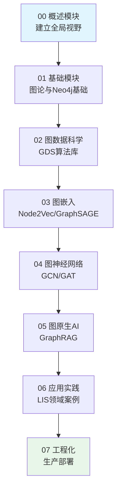
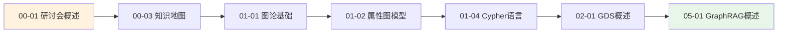

# 学习路径指南

> **难度级别**：入门
> **预计阅读时间**：20 分钟
> **前置知识**：无

---

## 一、建议学习顺序

本知识库按照"由浅入深、由理论到实践"的原则组织内容。建议读者按照以下顺序学习：



每个模块内部也遵循递进关系。例如，在"01 基础模块"中，应先学习图论基础概念（01-01），再学习属性图模型（01-02），然后进入 Neo4j 架构（01-03），最后掌握 Cypher 查询语言（01-04、01-05）。跳读可能导致概念断层，尤其是图嵌入与图神经网络部分对数学基础有较高要求。

---

## 二、先修知识要求

不同模块对先修知识的要求差异较大。下表列出各模块的先修知识要求，读者可据此评估自身基础并查漏补缺。

| 模块 | 数学基础 | 编程基础 | 领域知识 | 备注 |
|------|---------|---------|---------|------|
| 00 概述 | 无 | 无 | 无 | 零门槛入门 |
| 01 基础 | 离散数学（图论初步） | 无 | 数据库基础 | 建议复习离散数学 |
| 02 图数据科学 | 线性代数、概率论 | Python 基础 | 无 | 算法原理需要矩阵运算知识 |
| 03 图嵌入 | 线性代数、概率论、优化理论 | Python、PyTorch 基础 | 机器学习基础 | 涉及随机游走与神经网络 |
| 04 图神经网络 | 线性代数、微积分、深度学习 | Python、PyTorch | 深度学习基础 | 需理解反向传播与消息传递 |
| 05 图原生 AI | 自然语言处理基础 | Python、LangChain | 大语言模型概念 | 涉及 RAG 与提示工程 |
| 06 应用实践 | 视具体案例 | Python、Cypher | 图书情报领域知识 | 结合本领域研究问题 |
| 07 工程化 | 无特殊要求 | Docker、Python | DevOps 基础 | 面向工程落地 |

### 2.1 数学基础补课建议

对于信息资源管理背景的读者，以下数学知识较为关键：

- **线性代数（Linear Algebra）**：向量、矩阵运算、特征值分解。推荐资源：MIT 18.06 公开课（Gilbert Strang）。
- **概率论与统计（Probability and Statistics）**：概率分布、条件概率、极大似然估计。推荐资源：《概率论与数理统计》（陈希孺）。
- **离散数学（Discrete Mathematics）**：图论、集合论、逻辑。推荐资源：《离散数学及其应用》（Kenneth Rosen）。
- **优化理论（Optimization）**：梯度下降、凸优化基础。推荐资源：Boyd《Convex Optimization》前 5 章。

### 2.2 编程基础补课建议

本知识库的实践代码以 Python 为主，Cypher 为辅。建议读者具备：

- Python 基础语法、数据结构（列表、字典、集合）、文件操作；
- pandas 数据处理基础（用于数据导入导出）；
- Neo4j Python Driver 的基本用法（`neo4j` 包）；
- 后续模块需要 PyTorch 或 DGL（Deep Graph Library）基础。

---

## 三、难度标注体系

为帮助读者合理分配精力，本知识库采用三级难度标注体系：

| 难度级别 | 标识 | 含义 | 适合人群 | 阅读策略 |
|---------|------|------|---------|---------|
| 入门 | **难度级别：入门** | 概念性内容，无需数学推导 | 所有读者 | 通读，建立直觉 |
| 进阶 | **难度级别：进阶** | 需要一定数学或编程基础 | 有理工科背景的读者 | 精读，动手实践 |
| 高级 | **难度级别：高级** | 涉及复杂推导或工程细节 | 深入研究者 | 反复研读，配套论文 |

每个文件开头的标注框中会标明难度级别、预计阅读时间和前置知识。读者可根据自身情况选择阅读深度：入门级内容建议全部通读，进阶内容建议结合实践，高级内容可根据研究需要选择性深入。

---

## 四、实践环境搭建

图数据库与图 AI 的学习离不开动手实践。本节介绍三种主流的 Neo4j 实践环境搭建方式。

### 4.1 Neo4j Aura（云端服务，推荐新手）

Neo4j Aura 是 Neo4j 官方提供的全托管云服务（Managed Cloud Service），无需安装配置，注册即可使用。

| 项目 | 说明 |
|------|------|
| 适用场景 | 学习、原型开发、小规模生产 |
| 免费额度 | Aura Free 提供 200K 节点、400K 关系 |
| 优点 | 零运维、自动备份、随时访问 |
| 缺点 | 免费版资源有限，网络依赖云服务 |
| 访问地址 | https://neo4j.com/cloud/aura/ |

**搭建步骤**：

1. 访问 Neo4j Aura 官网，注册账号；
2. 创建 Free 实例，选择就近区域（如 ap-northeast-1）；
3. 保存系统生成的密码（仅显示一次）；
4. 通过浏览器 Neo4j Browser 或 Neo4j Workspace 连接实例。

### 4.2 Neo4j Desktop（本地桌面应用）

Neo4j Desktop 是面向开发者的本地桌面应用，集成了数据库引擎、浏览器、插件管理等功能。

| 项目 | 说明 |
|------|------|
| 适用场景 | 本地开发、离线学习、插件实验 |
| 系统要求 | 4GB 以上内存，2GB 可用磁盘 |
| 优点 | 离线可用、插件丰富、操作直观 |
| 缺点 | 仅限单机，性能受本机配置限制 |
| 下载地址 | https://neo4j.com/download/ |

**搭建步骤**：

1. 下载并安装 Neo4j Desktop；
2. 创建新项目（Project），在项目中创建数据库（DBMS）；
3. 启动数据库，点击"Open"打开 Neo4j Browser；
4. 在插件市场安装 GDS、APOC 等插件。

### 4.3 Docker 部署（推荐进阶用户）

Docker 部署适合需要灵活配置或多实例管理的用户，也是生产环境的基础。

| 项目 | 说明 |
|------|------|
| 适用场景 | 多实例管理、CI/CD、生产模拟 |
| 前置条件 | 已安装 Docker 与 Docker Compose |
| 优点 | 环境隔离、版本可控、便于复现 |
| 缺点 | 需要 Docker 基础 |

**快速启动命令**：

```bash
# 拉取并启动 Neo4j 容器
docker run \
    --name neo4j \
    -p 7474:7474 -p 7687:7687 \
    -e NEO4J_AUTH=neo4j/password \
    -e NEO4J_PLUGINS='["graph-data-science","apoc"]' \
    -v neo4j_data:/data \
    neo4j:5.11.0

# 浏览器访问 http://localhost:7474
# Bolt 协议地址 bolt://localhost:7687
```

三种环境的核心差异对比如下：

| 对比维度 | Neo4j Aura | Neo4j Desktop | Docker |
|---------|-----------|---------------|--------|
| 安装难度 | 最低（注册即用） | 低（一键安装） | 中（需 Docker 知识） |
| 资源限制 | 免费版有限 | 受本机配置限制 | 可灵活配置 |
| 插件支持 | 部分支持 | 全部支持 | 全部支持 |
| 离线可用 | 否 | 是 | 是 |
| 适合阶段 | 入门实践 | 进阶开发 | 高级工程 |
| 推荐指数 | ★★★★★（新手） | ★★★★（开发） | ★★★★★（工程） |

---

## 五、GraphAcademy 课程推荐

Neo4j 官方学习平台 GraphAcademy（https://graphacademy.neo4j.com/）提供大量免费在线课程，是本知识库的理想配套资源。以下课程与本知识库各模块的对应关系如下：

| GraphAcademy 课程 | 对应知识库模块 | 难度 | 时长 | 推荐度 |
|------------------|--------------|------|------|--------|
| Introduction to Neo4j | 01 基础 | 入门 | 2 小时 | ★★★★★ |
| Cypher Fundamentals | 01 基础 | 入门 | 3 小时 | ★★★★★ |
| Building Neo4j Applications with Python | 01 基础 | 进阶 | 4 小时 | ★★★★ |
| Graph Data Science Fundamentals | 02 图数据科学 | 进阶 | 4 小时 | ★★★★★ |
| Node Embeddings | 03 图嵌入 | 进阶 | 3 小时 | ★★★★ |
| GraphRAG with Neo4j | 05 图原生 AI | 高级 | 3 小时 | ★★★★★ |
| Importing Data with Neo4j | 01 基础 | 进阶 | 2 小时 | ★★★★ |

> **学习建议**：每完成本知识库一个模块的阅读后，到 GraphAcademy 完成对应课程的实操练习，形成"理论-实践"闭环。

---

## 六、三条学习路径

根据读者的时间投入与学习目标，本知识库设计了三条学习路径。

### 6.1 速览路径（约 8 小时）

**适合人群**：希望快速了解图数据库与图 AI 全貌的读者，如管理者、跨领域研究者。



| 步骤 | 文件 | 学习重点 | 时间 |
|------|------|---------|------|
| 1 | 00-01 研讨会概述 | 理解背景与核心问题 | 30 分钟 |
| 2 | 00-03 知识地图 | 建立知识全景 | 20 分钟 |
| 3 | 01-01 图论基础 | 掌握图的基本概念 | 60 分钟 |
| 4 | 01-02 属性图模型 | 理解图数据建模 | 45 分钟 |
| 5 | 01-04 Cypher 语言 | 了解查询语法 | 90 分钟 |
| 6 | 02-01 GDS 概述 | 了解图算法分类 | 60 分钟 |
| 7 | 05-01 GraphRAG | 了解图原生 AI 前沿 | 60 分钟 |
| 8 | 实践 | 在 Aura 上运行示例 | 2 小时 |

### 6.2 标准路径（约 25 小时）

**适合人群**：图书情报学研究生，希望系统掌握图技术并应用于本领域研究。

| 阶段 | 模块 | 关键文件 | 时间 |
|------|------|---------|------|
| 第一阶段 | 概述与基础 | 00 全部 + 01 全部 | 6 小时 |
| 第二阶段 | 图数据科学 | 02 全部 | 5 小时 |
| 第三阶段 | 图嵌入 | 03 全部 | 4 小时 |
| 第四阶段 | 应用实践 | 06 选读 | 5 小时 |
| 第五阶段 | 综合项目 | 完成一个引文分析项目 | 5 小时 |

标准路径的核心产出是：能够独立使用 Neo4j + GDS 完成一个图书情报领域的图数据分析项目，例如构建引文网络并分析学术影响力。

### 6.3 深度路径（约 50 小时）

**适合人群**：希望深入图 AI 算法原理并开展创新研究的读者。

深度路径在标准路径基础上增加以下内容：

| 附加模块 | 内容 | 时间 |
|---------|------|------|
| 04 图神经网络 | GCN、GAT 原理与实现 | 10 小时 |
| 05 图原生 AI | GraphRAG 完整实践 | 6 小时 |
| 07 工程化 | 生产部署与优化 | 5 小时 |
| 论文研读 | GraphSAGE、GAT、GraphRAG 原论文 | 4 小时 |

深度路径的核心产出是：能够基于图神经网络开发自定义模型，并将 GraphRAG 应用于实际研究场景。

---

## 七、学习建议与常见误区

### 7.1 学习建议

1. **先建直觉，再抠细节**：第一遍阅读时注重理解"为什么"而非"怎么做"，建立图思维的直觉后再深入技术细节。
2. **动手优先**：每学完一个概念，立即在 Neo4j 中实操验证。图数据库的查询结果具有强可视化特征，能极大加深理解。
3. **联系本领域**：将每个技术概念与图书情报领域的实际问题对应起来。例如，学习 PageRank 时思考它如何用于评估期刊影响力。
4. **善用社区**：Neo4j 社区（https://community.neo4j.com/）和 Stack Overflow 是解决问题的宝贵资源。

### 7.2 常见误区

| 误区 | 纠正 |
|------|------|
| "图数据库只是关系数据库的变种" | 图数据库采用无索引邻接，关联查询复杂度与图规模无关，这是关系数据库无法实现的 |
| "学图 AI 必须先精通深度学习" | 图嵌入（如 Node2Vec）基于随机游走，门槛低于深度学习，可作为过渡 |
| "Cypher 和 SQL 差不多" | Cypher 基于模式匹配与图遍历，思维方式与 SQL 的集合操作有本质区别 |
| "图技术只适合社交网络" | 引文网络、知识图谱、本体论等图书情报核心对象都是图结构 |
| "必须用 Python 才能做图 AI" | Neo4j GDS 内置大量算法，Cypher 即可调用，无需编程 |

---

## 小结

本章提供了本知识库的学习路径规划，包括建议学习顺序、先修知识要求、难度标注体系、实践环境搭建、配套课程推荐以及三条个性化学习路径。建议读者根据自身背景选择合适的路径，并按照"理论-实践-领域关联"的循环推进学习。

> **下一步阅读**：建议继续阅读 [知识体系思维导图](./00-03-knowledge-map.md)，获取本知识库的全景地图。
