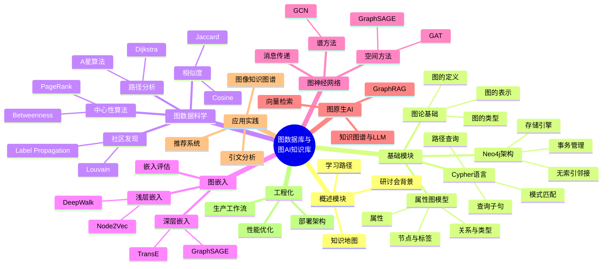
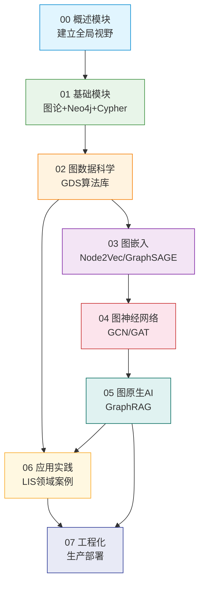
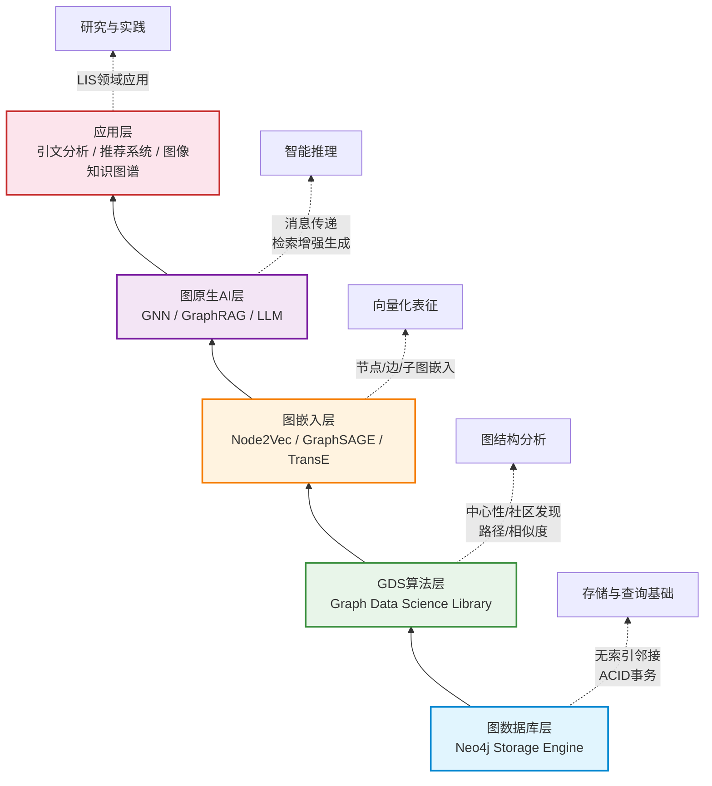
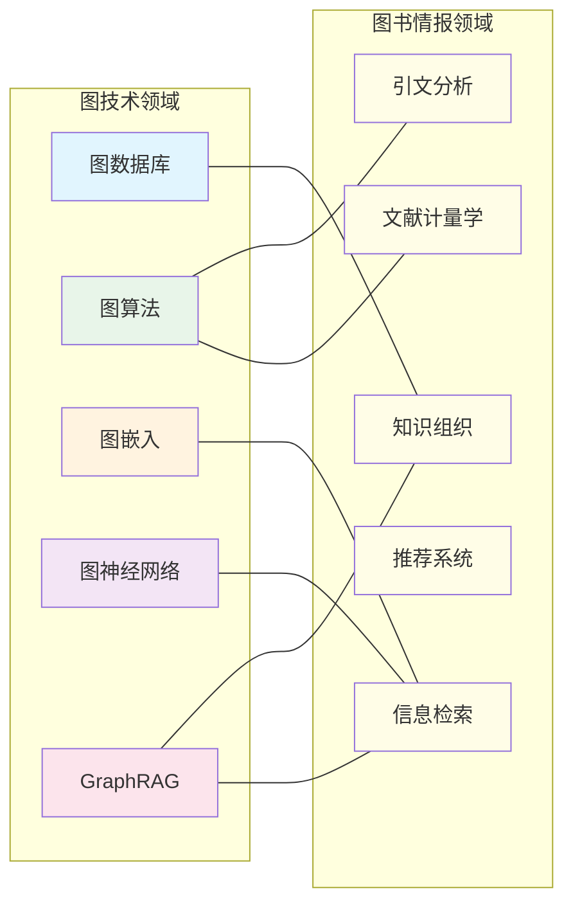

# 知识体系思维导图

> **难度级别**：入门
> **预计阅读时间**：15 分钟
> **前置知识**：建议先阅读 [研讨会主题概述](./00-01-seminar-overview.md)

---

## 一、整体知识地图

以下是本知识库的整体知识地图，使用 Mermaid mindmap 语法绘制。建议在支持 Mermaid 的 Markdown 编辑器（如 Obsidian、Typora、VS Code + Mermaid 插件）中查看。

---

## 二、七大模块关系图

以下流程图展示了七大模块之间的逻辑依赖关系。箭头表示"建议先学"的先后顺序，模块间的知识传递路径清晰可见。

### 模块关系说明

| 模块 | 核心内容 | 上游依赖 | 下游赋能 |
|------|---------|---------|---------|
| 00 概述 | 背景与路径 | 无 | 为所有模块提供导航 |
| 01 基础 | 图论与 Neo4j | 00 概述 | 为 02-06 提供数据基础 |
| 02 图数据科学 | GDS 算法 | 01 基础 | 为 03、06 提供算法工具 |
| 03 图嵌入 | 向量化方法 | 02 图数据科学 | 为 04、06 提供表征基础 |
| 04 图神经网络 | 深度学习模型 | 03 图嵌入 | 为 05 提供模型基础 |
| 05 图原生 AI | GraphRAG | 04 图神经网络 | 为 06、07 提供 AI 能力 |
| 06 应用实践 | LIS 领域案例 | 02、05 | 验证理论，启发研究 |
| 07 工程化 | 生产部署 | 05、06 | 实现工程落地 |

---

## 三、技术栈层次图

本知识库涉及的技术栈可以分为五个层次，从底层的图数据库到顶层的应用层，每一层都建立在前一层的之上。

### 各层技术要素详解

#### 第一层：图数据库层

这是整个技术栈的基石。Neo4j 作为原生图数据库，采用无索引邻接（Index-Free Adjacency）技术，使得图遍历的时间复杂度仅与遍历的子图规模相关，而与整个图的规模无关。这一层提供：

- 属性图模型的存储与查询；
- Cypher 声明式查询语言；
- ACID 事务保证；
- 高可用与集群能力。

#### 第二层：GDS 算法层

图数据科学（Graph Data Science，GDS）库构建在 Neo4j 之上，提供经过工程优化的图算法集合。GDS 采用"图投影（Graph Projection）"机制，将数据库中的图数据加载到内存中的专用图结构上运行算法，兼顾性能与灵活性。

#### 第三层：图嵌入层

图嵌入（Graph Embedding）是将图结构数据映射到低维向量空间的技术，是连接图数据库与机器学习的桥梁。这一层包括基于随机游走的浅层方法（Node2Vec、DeepWalk）和基于神经网络 的深层方法（GraphSAGE、TransE）。

#### 第四层：图原生 AI 层

图原生 AI 是本知识库的高阶内容，包括图神经网络（Graph Neural Network，GNN）和图检索增强生成（GraphRAG）。这一层将图结构感知能力注入深度学习模型与大语言模型，实现结构化的智能推理。

#### 第五层：应用层

应用层将前四层的技术能力转化为具体的研究与实践成果，本知识库聚焦图书情报领域的三大应用场景：引文分析、推荐系统、图像知识图谱。

---

## 四、知识领域维度图

除了技术栈的纵向层次，本知识库的内容还可以从知识领域维度进行横向划分。下图展示了图技术与图书情报领域知识的交叉关系。

### 交叉领域对应表

| 图技术 | 图书情报领域 | 交叉应用场景 |
|--------|------------|------------|
| 图数据库 | 知识组织 | 本体论与叙词表的图存储 |
| 中心性算法 | 引文分析 | PageRank 评估期刊/学者影响力 |
| 社区发现 | 文献计量学 | 研究主题聚类与学科边界识别 |
| 图嵌入 | 信息检索 | 基于语义向量的文献相似检索 |
| 图神经网络 | 信息检索 | 个性化文献推荐 |
| GraphRAG | 知识组织 | 知识图谱问答与智能检索 |

---

## 五、学习进度追踪表

以下表格可作为学习进度追踪工具，建议读者在学习过程中自行标记完成状态。

| 编号 | 文件 | 难度 | 状态 |
|------|------|------|------|
| 00-01 | 研讨会主题概述 | 入门 | [ ] |
| 00-02 | 学习路径指南 | 入门 | [ ] |
| 00-03 | 知识体系思维导图 | 入门 | [ ] |
| 01-01 | 图论基础概念 | 入门 | [ ] |
| 01-02 | 属性图模型 | 入门 | [ ] |
| 01-03 | Neo4j 架构与存储引擎 | 进阶 | [ ] |
| 01-04 | Cypher 查询语言详解 | 进阶 | [ ] |
| 01-05 | Cypher 实战示例集 | 进阶 | [ ] |
| 02-xx | 图数据科学（待更新） | 进阶 | [ ] |
| 03-xx | 图嵌入（待更新） | 进阶 | [ ] |
| 04-xx | 图神经网络（待更新） | 高级 | [ ] |
| 05-xx | 图原生 AI（待更新） | 高级 | [ ] |
| 06-xx | 应用实践（待更新） | 进阶 | [ ] |
| 07-xx | 工程化（待更新） | 高级 | [ ] |

---

## 六、文字描述辅助说明

### 6.1 知识库的整体架构理念

本知识库的设计遵循"一个核心、两个维度、七个模块"的架构理念。

**一个核心**：以"关系是一等数据公民"为核心认知。传统数据库将数据存储为记录，关系通过外键隐含表达；图数据库将关系显式存储为一等实体，这是所有后续技术能力的根基。

**两个维度**：纵向维度是从存储到智能的技术栈层次（图数据库→GDS→图嵌入→图原生 AI→应用），横向维度是图技术与图书情报领域的交叉映射。两个维度交织构成了知识库的内容矩阵。

**七个模块**：概述、基础、图数据科学、图嵌入、图神经网络、图原生 AI、应用实践与工程化，每个模块自成体系又相互支撑。

### 6.2 如何使用本思维导图

本思维导图有多种使用方式：

1. **导航工具**：在学习前浏览思维导图，建立全局视野，明确当前位置与目标位置；
2. **复习工具**：在学完一个模块后，对照思维导图回忆关键概念，检验掌握程度；
3. **研究启发**：观察图中模块间的连接关系，发现可能的研究交叉点，例如"图嵌入×信息检索"可能启发新的文献检索方法；
4. **进度管理**：结合学习进度追踪表，规划与管理学习节奏。

### 6.3 Mermaid 图表渲染说明

本文件使用了 Mermaid 语法绘制图表。Mermaid 是一种基于文本的图表生成工具，支持思维导图（mindmap）、流程图（flowchart）、时序图（sequence diagram）等多种图表类型。

- 在 **Obsidian** 中：原生支持 Mermaid，无需额外配置；
- 在 **Typora** 中：原生支持 Mermaid；
- 在 **VS Code** 中：安装"Markdown Preview Mermaid Support"插件；
- 在 **GitHub** 中：原生支持 Mermaid 渲染；
- 在线渲染：访问 https://mermaid.live/ 粘贴代码查看。

如果某些环境不支持 mindmap 语法（较新的 Mermaid 特性），可以参考上方的模块关系图（flowchart）与文字描述辅助理解知识体系结构。

---

## 小结

本章通过 Mermaid 思维导图、模块关系图、技术栈层次图和知识领域维度图，从多个视角呈现了本知识库的整体架构。建议读者在学习过程中经常回顾本章内容，保持对知识全局的感知，避免陷入单一模块的细节而失去方向。

> **下一步阅读**：现在你已经了解了知识库的全貌，建议进入基础模块，从 [图论基础概念](../01-foundations/01-01-graph-theory-basics.md) 开始正式学习。
