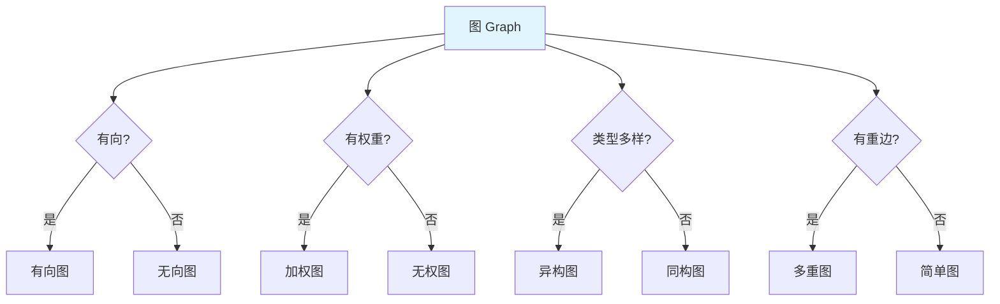
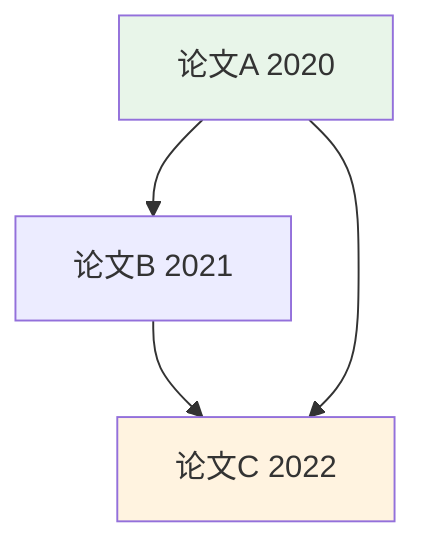

# 图论基础概念

> **难度级别**：入门
> **预计阅读时间**：30 分钟
> **前置知识**：基本数学概念（集合、映射）

---

## 一、图的定义

图论（Graph Theory）是数学的一个分支，研究由若干给定的点及连接两点的线所构成的图形。图论起源于 1736 年，瑞士数学家莱昂哈德·欧拉（Leonhard Euler）通过解决"哥尼斯堡七桥问题"奠定了这一学科的基础。

### 1.1 图的形式化定义

一个图（Graph）可以用有序二元组表示为：

$$G = (V, E)$$

其中：
- **V（Vertex Set）**：顶点集（Vertices），是图中所有节点的集合。顶点也常被称为节点（Nodes）或点（Points）；
- **E（Edge Set）**：边集（Edges），是连接顶点的边的集合。每条边由一个顶点对表示。

对于无向图，边 $e \in E$ 是无序顶点对，记作 $e = \{u, v\}$，其中 $u, v \in V$；对于有向图，边 $e \in E$ 是有序顶点对，记作 $e = (u, v)$，表示从 $u$ 指向 $v$ 的有向边。

### 1.2 顶点与边

| 概念 | 英文 | 定义 | 示例 |
|------|------|------|------|
| 顶点 | Vertex / Node | 图中的基本元素，表示一个实体 | 引文网络中的一篇论文 |
| 边 | Edge / Relationship | 连接两个顶点的连线，表示实体间的关系 | 论文 A 引用了论文 B |
| 端点 | Endpoint | 一条边所连接的两个顶点 | 边(A,B)的端点是 A 和 B |
| 自环 | Self-loop | 连接顶点到自身的边 | 论文引用了自己 |
| 重边 | Multi-edge | 两个顶点之间存在多条边 | A 和 B 之间有多种关系 |

### 1.3 一个直观的例子

以三位学者之间的合作关系为例：

```
    Alice ---合作--- Bob
      |              |
    合作            合作
      |              |
     Carol ---合作--- Bob
```

这个图可以表示为：
- $V = \{Alice, Bob, Carol\}$
- $E = \{\{Alice, Bob\}, \{Alice, Carol\}, \{Bob, Carol\}\}$

这是一个无向图，因为"合作"关系是对称的——Alice 与 Bob 合作，等价于 Bob 与 Alice 合作。

---

## 二、图的类型

图可以根据不同的属性进行分类。掌握这些分类对于后续选择合适的图算法和模型至关重要。

### 2.1 有向图与无向图

| 类型 | 英文 | 边的方向 | 示例 |
|------|------|---------|------|
| 有向图 | Directed Graph / Digraph | 边有方向，$(u,v) \neq (v,u)$ | 引文网络（A 引用 B 不等于 B 引用 A） |
| 无向图 | Undirected Graph | 边无方向，$\{u,v\} = \{v,u\}$ | 合作网络、好友关系 |

在引文分析中，论文之间的引用关系是典型的有向图：论文 A 引用论文 B 是单向的，不存在"互相引用"的对称关系。而在社交网络中，微信好友关系是无向图——双方互为好友。

### 2.2 加权图与无权图

| 类型 | 英文 | 边的属性 | 示例 |
|------|------|---------|------|
| 加权图 | Weighted Graph | 每条边带有一个权重值 | 论文合作次数、引用强度 |
| 无权图 | Unweighted Graph | 边仅表示存在与否 | 是否存在引用关系 |

权重可以表示关系的强度、频率、距离等。在图书情报领域，加权图常用于表示引用次数、合作次数、主题相似度等量化关系。

### 2.3 同构图与异构图

| 类型 | 英文 | 节点/边类型 | 示例 |
|------|------|-----------|------|
| 同构图 | Homogeneous Graph | 所有节点和边类型相同 | 仅含论文节点的引文网络 |
| 异构图 | Heterogeneous Graph | 存在多种类型的节点和边 | 论文-作者-主题-期刊的混合网络 |

异构图（Heterogeneous Graph）在图书情报领域极为常见。一个学术网络可能同时包含论文（Paper）、作者（Author）、主题（Topic）、期刊（Journal）、机构（Institution）等多种类型的节点，以及"写作""引用""发表""隶属于"等多种类型的边。异构图的表达能力更强，但算法设计也更复杂。

### 2.4 多重图与简单图

| 类型 | 英文 | 特征 | 示例 |
|------|------|------|------|
| 简单图 | Simple Graph | 无自环、无重边 | 标准引文网络 |
| 多重图 | Multigraph | 允许重边 | 同一作者多次合作、多种关系并存 |

### 2.5 图类型汇总



---

## 三、图的基本概念

### 3.1 度

顶点的度（Degree）是与该顶点相连的边的数量，记作 $\deg(v)$。

| 概念 | 英文 | 定义 | 公式 |
|------|------|------|------|
| 度 | Degree | 与顶点相连的边数 | $\deg(v) = \| \{e \in E : v \in e\} \|$ |
| 入度 | In-degree | 有向图中指向该顶点的边数 | $\deg^-(v)$ |
| 出度 | Out-degree | 有向图中从该顶点出发的边数 | $\deg^+(v)$ |

在引文网络中，一篇论文的入度等于它被引用的次数（被引频次），出度等于它引用的参考文献数量。被引频次是衡量论文影响力的最基础指标。

### 3.2 路径

路径（Path）是一个顶点序列 $v_1, v_2, \ldots, v_k$，其中每对相邻顶点之间都存在一条边。

| 概念 | 英文 | 定义 |
|------|------|------|
| 路径 | Path | 顶点序列，相邻顶点间有边相连 |
| 简单路径 | Simple Path | 不经过重复顶点的路径 |
| 路径长度 | Path Length | 路径中边的数量（无权图）或边权重之和（加权图） |
| 最短路径 | Shortest Path | 两点间长度最短的路径 |
| 距离 | Distance | 两点间最短路径的长度 |

### 3.3 连通性

| 概念 | 英文 | 定义 |
|------|------|------|
| 连通图 | Connected Graph | 任意两个顶点之间都存在路径 |
| 连通分量 | Connected Component | 极大连通子图 |
| 强连通 | Strongly Connected | 有向图中任意两点互相可达 |
| 弱连通 | Weakly Connected | 有向图忽略方向后连通 |

一个大型的引文网络通常不是连通图——某些论文可能既不引用别人也不被引用，形成孤立的连通分量。分析连通分量有助于识别研究领域的"孤岛"。

### 3.4 环与树

| 概念 | 英文 | 定义 |
|------|------|------|
| 环 | Cycle | 起点和终点相同的路径 |
| 无环图 | Acyclic Graph | 不含环的图 |
| 有向无环图 | DAG (Directed Acyclic Graph) | 不含环的有向图 |
| 树 | Tree | 连通的无环无向图 |
| 森林 | Forest | 无环的无向图（不要求连通） |

**有向无环图（DAG）**在图书情报领域有重要应用。引文网络在理想情况下是 DAG——如果论文 A 引用 B，B 引用 C，C 又引用 A，就形成了时间上的悖论（除非存在预印本等特殊情况）。DAG 的这一特性使得拓扑排序（Topological Sort）等算法可以用于分析学术传播的时序结构。



上图展示了一个简单的引文 DAG：较新的论文引用较旧的论文，不存在环路。

---

## 四、图的表示方法

在计算机中存储和处理图，需要选择合适的数据结构。常见的图表示方法有三种。

### 4.1 邻接矩阵

邻接矩阵（Adjacency Matrix）用一个 $|V| \times |V|$ 的矩阵 $A$ 表示图。对于无权图，$A_{ij} = 1$ 表示顶点 $i$ 和 $j$ 之间存在边，$A_{ij} = 0$ 表示不存在；对于加权图，$A_{ij} = w$ 表示边的权重。

以一个包含 4 篇论文的引文网络为例：

| | P1 | P2 | P3 | P4 |
|---|---|---|---|---|
| **P1** | 0 | 1 | 1 | 0 |
| **P2** | 0 | 0 | 1 | 1 |
| **P3** | 0 | 0 | 0 | 1 |
| **P4** | 0 | 0 | 0 | 0 |

其中 $A_{12}=1$ 表示 P1 引用了 P2。

**优点**：查找任意两点间是否存在边的时间复杂度为 $O(1)$。
**缺点**：空间复杂度为 $O(|V|^2)$，对于稀疏图（Sparse Graph，边数远小于 $|V|^2$）浪费大量空间。

### 4.2 邻接表

邻接表（Adjacency List）为每个顶点维护一个链表，存储与该顶点相邻的所有顶点。

```
P1 -> [P2, P3]
P2 -> [P3, P4]
P3 -> [P4]
P4 -> []
```

**优点**：空间复杂度为 $O(|V| + |E|)$，适合稀疏图。
**缺点**：查找特定边是否存在需要遍历链表，时间复杂度为 $O(\deg(v))$。

### 4.3 边列表

边列表（Edge List）直接存储所有边的列表，每条边用一个顶点对表示。

```
[(P1, P2), (P1, P3), (P2, P3), (P2, P4), (P3, P4)]
```

**优点**：结构简单，空间紧凑，适合批量导入。
**缺点**：查询特定顶点的邻居效率低。

### 4.4 三种表示方法对比

| 对比维度 | 邻接矩阵 | 邻接表 | 边列表 |
|---------|---------|--------|--------|
| 空间复杂度 | $O(V^2)$ | $O(V+E)$ | $O(E)$ |
| 查找边是否存在 | $O(1)$ | $O(\deg(v))$ | $O(E)$ |
| 遍历某顶点邻居 | $O(V)$ | $O(\deg(v))$ | $O(E)$ |
| 适合图类型 | 稠密图 | 稀疏图 | 批量处理 |
| Neo4j 采用 | 否 | 是（变体） | 用于导入 |

Neo4j 的存储引擎采用了一种增强型的邻接表——无索引邻接（Index-Free Adjacency），我们将在 [Neo4j 架构](./01-03-neo4j-architecture.md) 一章中详细讨论。

---

## 五、与引文网络和知识图谱的关系

### 5.1 引文网络

引文网络（Citation Network）是图论在图书情报领域最经典的应用之一。在引文网络中：

- **顶点**：论文、专利、书籍等文献；
- **有向边**：引用关系（A 引用 B）；
- **图类型**：有向无环图（DAG）。

引文网络的分析方法与图论概念高度对应：

| 图论概念 | 引文网络含义 | 应用 |
|---------|------------|------|
| 入度 | 被引频次 | 影响力评估 |
| 出度 | 参考文献数 | 知识广度 |
| 最短路径 | 引用链最短距离 | 学术传承分析 |
| 连通分量 | 研究领域聚类 | 学科边界识别 |
| 中心性 | 学术影响力 | 核心论文/学者识别 |

### 5.2 知识图谱

知识图谱（Knowledge Graph）是由谷歌于 2012 年提出的概念，但其理论基础可以追溯到语义网（Semantic Web）和本体论（Ontology）。知识图谱本质上是一种大规模的图结构数据：

- **顶点**：实体（Entity），如人、地点、概念；
- **边**：实体间的关系（Relation），如"出生于""属于""作者为"；
- **属性**：实体和关系的属性，如出生日期、关系强度。

知识图谱与图论的关系类似于数据库与集合论的关系——图论提供了知识图谱的数学基础，而知识图谱是图论在大规模实际数据上的工程化实现。

---

## 六、与图书情报领域的关联

图论与图书情报领域（Library and Information Science，LIS）有着天然且深厚的历史渊源。以下是几个核心的关联点。

### 6.1 引文分析

引文分析（Citation Analysis）是图书情报学的核心方法之一，由尤金·加菲尔德（Eugene Garfield）在 20 世纪 60 年代奠基。加菲尔德创立的科学引文索引（Science Citation Index，SCI）本质上就是一个超大规模的引文网络数据库。

图论为引文分析提供了精确的数学语言：

- **PageRank 算法**：谷歌创始人拉里·佩奇提出的 PageRank 算法，其灵感正是来源于引文分析。一篇论文被高影响力论文引用，其自身影响力也相应提高，这与 PageRank"被重要网页链接的网页更重要"的逻辑完全一致；
- **h 指数**：豪尔赫·赫希（Jorge Hirsch）提出的 h 指数可以看作图中顶点度数的一种变形；
- **共被引分析**：两篇论文同时被第三篇论文引用，构成共被引网络，可用于识别研究前沿。

### 6.2 本体论与知识组织

本体论（Ontology）在信息科学中指"对共享概念化的明确、形式化的说明"，是知识组织（Knowledge Organization）的核心工具。本体论天然具有图结构：

- **概念**是图的顶点；
- **概念间关系**（如"上位词""下位词""同义词""相关词"）是图的边；
- **概念的属性**是顶点的属性。

传统的叙词表（Thesaurus）、分类法（Classification Scheme，如 DDC、LCC）都可以自然地映射为图结构。图数据库为这些知识组织工具的数字化、语义化提供了理想的技术底座。

### 6.3 社会网络分析

图书情报学中的作者合作网络、机构合作网络等研究，本质上就是社会网络分析（Social Network Analysis，SNA）在学术领域的应用。图论中的中心性度量（度中心性、介数中心性、接近中心性）直接用于识别学术网络中的核心作者、知识桥梁、孤立群体。

### 6.4 信息检索

信息检索（Information Retrieval）中的超链接分析（如 HITS 算法）与图论密切相关。在数字图书馆中，文档之间的超链接构成有向图，图算法可用于改进检索排序。现代语义检索进一步引入知识图谱，使得检索系统不仅能匹配关键词，还能理解实体间的语义关系。

---

## 七、重要公式速查

以下是本章涉及的重要公式，供后续章节参考：

| 名称 | 公式 | 含义 |
|------|------|------|
| 图的定义 | $G = (V, E)$ | 图由顶点集和边集组成 |
| 度数 | $\deg(v) = \deg^+(v) + \deg^-(v)$ | 有向图中度数=入度+出度 |
| 握手定理 | $\sum_{v \in V} \deg(v) = 2\|E\|$ | 所有顶点度数之和等于边数的两倍 |
| 邻接矩阵 | $A_{ij} = \begin{cases} 1 & \text{if } (i,j) \in E \\ 0 & \text{otherwise} \end{cases}$ | 无权图的邻接矩阵 |
| 最短路径 | $d(u,v) = \min_{\text{path}} \sum_{e \in \text{path}} w(e)$ | 两点间最小权重路径 |

---

## 小结

本章介绍了图论的基础概念，包括图的定义、图的类型、基本概念（度、路径、连通性、环与树）、图的表示方法，以及图论与引文网络、知识图谱和图书情报领域的关联。这些概念是后续学习属性图模型、Neo4j 架构和图算法的基础。

> **下一步阅读**：建议继续阅读 [属性图模型](./01-02-property-graph-model.md)，了解如何在图论基础上构建实用的属性图数据模型。
