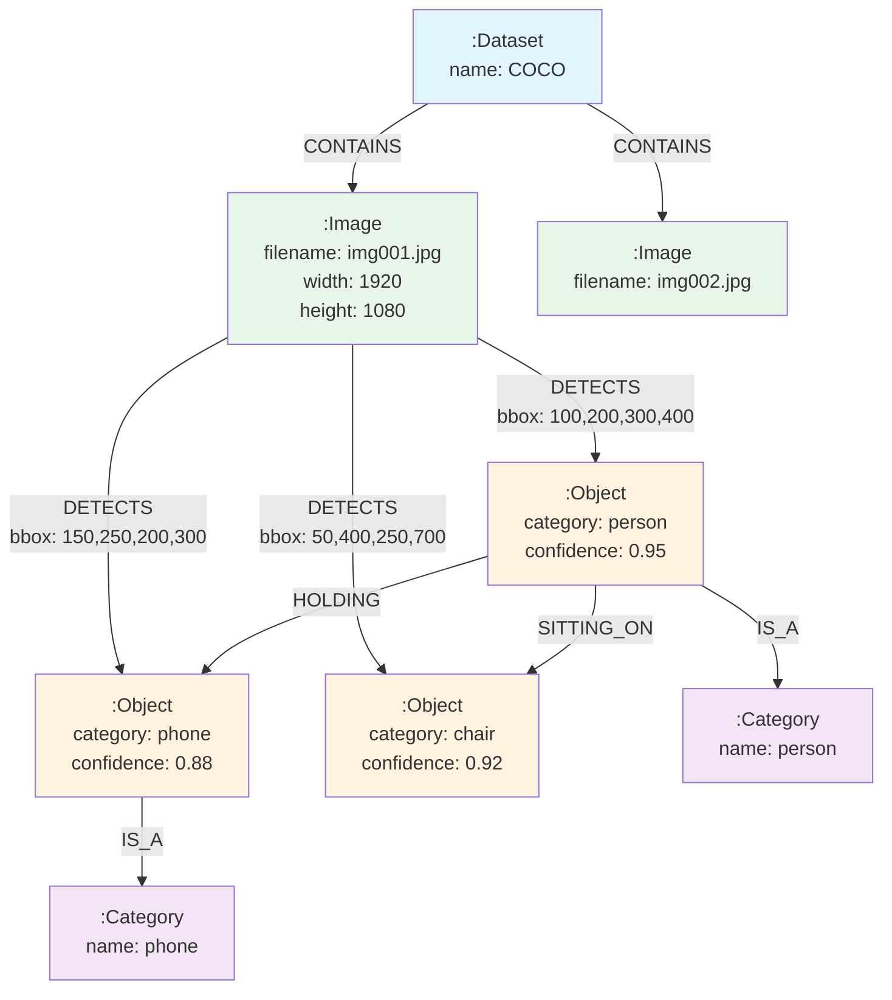

# 属性图模型

> **难度级别**：入门
> **预计阅读时间**：25 分钟
> **前置知识**：[图论基础概念](./01-01-graph-theory-basics.md)、关系型数据库基本概念

---

## 一、属性图模型概述

属性图模型（Property Graph Model）是当前图数据库领域最主流的数据模型，Neo4j、Amazon Neptune、TigerGraph 等主流图数据库均采用此模型。与图论中抽象的 $G=(V,E)$ 定义相比，属性图模型在顶点和边之上增加了"属性"和"标签"两个维度，使得图模型能够表达更丰富的现实世界信息。

属性图模型由三个核心要素构成：**节点（Nodes）**、**关系（Relationships）** 和 **属性（Properties）**。这三者的组合可以精确地刻画现实世界中的实体及其关联。

---

## 二、属性图三要素

### 2.1 节点

节点（Node）是属性图中的基本实体，对应图论中的顶点（Vertex）。节点用于表示现实世界中的实体对象，如一篇论文、一位作者、一个主题、一幅图像。

节点的核心特征：

| 特征 | 英文 | 说明 | 示例 |
|------|------|------|------|
| 唯一标识 | Internal ID | 数据库自动分配的唯一编号 | 节点 ID = 123 |
| 标签 | Label | 节点的类型标记，一个节点可有多个标签 | `:Paper`、`:Author` |
| 属性 | Property | 键值对，存储节点的属性信息 | `title: "Graph Neural Networks"` |

### 2.2 关系

关系（Relationship）是连接两个节点的有向边，对应图论中的边（Edge）。关系用于表示实体之间的关联，如"引用""合作""发表于"。

关系的核心特征：

| 特征 | 英文 | 说明 | 示例 |
|------|------|------|------|
| 方向 | Direction | 关系是有向的，从源节点指向目标节点 | (Paper A)-[:CITES]->(Paper B) |
| 类型 | Type | 关系的类型标记，一个关系仅有一个类型 | `:CITES`、`:WROTE`、`:PUBLISHED_IN` |
| 属性 | Property | 键值对，存储关系的属性信息 | `since: 2020, context: "methodology"` |
| 唯一标识 | Internal ID | 数据库自动分配的唯一编号 | 关系 ID = 456 |

**重要提示**：Neo4j 中的关系**必须**有方向，且**必须**有类型。这与图论中可选的无向边不同。如果业务上关系是对称的（如"合作"），通常约定一个方向存储，查询时使用无向模式匹配即可。

### 2.3 属性

属性（Property）是以键值对（Key-Value Pair）形式附加在节点或关系上的信息。属性的键必须是字符串，值可以是以下类型：

| 属性值类型 | 英文 | 示例 |
|-----------|------|------|
| 字符串 | String | `"Graph Neural Networks"` |
| 整数 | Integer | `2020` |
| 浮点数 | Float | `3.14159` |
| 布尔值 | Boolean | `true` |
| 字符串列表 | List of String | `["GNN", "Deep Learning", "Graph"]` |
| 数值列表 | List of Number | `[1.0, 0.5, 0.3]` |

属性图模型的核心优势在于：节点和关系都可以携带属性，这使得图数据库可以在保持图结构的同时存储丰富的元数据，无需像关系型数据库那样为每个属性建立单独的列。

---

## 三、节点标签

标签（Label）是节点的类型标记，用于对节点进行分类。标签在属性图模型中扮演着重要角色：

1. **类型标识**：标签标识节点所属的类别，类似于面向对象编程中的"类"（Class）；
2. **查询过滤**：Cypher 查询可以基于标签快速定位节点，类似 SQL 中的 `WHERE type = 'Paper'`；
3. **索引与约束**：索引和约束可以绑定到特定标签，加速查询并保证数据完整性；
4. **多标签支持**：一个节点可以拥有多个标签，实现灵活的类型层次。

**多标签示例**：一篇综述论文可以同时标记为 `:Paper` 和 `:Review`：

```
(:Paper:Review {title: "A Survey on GNN", year: 2023})
```

这与面向对象编程中的"接口"概念类似——一个对象可以实现多个接口。

---

## 四、关系类型

关系类型（Relationship Type）是关系的类型标记，类似于节点标签。每个关系**有且仅有一个类型**。

常见的关系类型命名约定：

| 关系类型 | 含义 | 图书情报领域示例 |
|---------|------|----------------|
| `:CITES` | 引用 | 论文 A 引用论文 B |
| `:WROTE` | 写作 | 作者写作论文 |
| `:PUBLISHED_IN` | 发表于 | 论文发表于期刊 |
| `:COLLABORATED_WITH` | 合作 | 作者与作者合作 |
| `:BELONGS_TO` | 属于 | 论文属于主题 |
| `:AFFILIATED_WITH` | 隶属 | 作者隶属机构 |

关系类型命名通常使用大写蛇形命名法（UPPER_SNAKE_CASE），以提高可读性。

---

## 五、属性图与关系型数据库对比

属性图模型与关系型数据库模型在思维方式上有本质差异。以下对比帮助有关系型数据库经验的读者理解二者的区别。

### 5.1 概念对应关系

| 概念 | 关系型数据库 | 属性图模型 |
|------|------------|-----------|
| 数据组织单元 | 表（Table） | 标签（Label） |
| 数据记录 | 行（Row） | 节点（Node） |
| 数据字段 | 列（Column） | 属性（Property） |
| 关联方式 | 外键（Foreign Key） | 关系（Relationship） |
| 关联存储 | 隐式（通过 JOIN 计算） | 显式（物理存储） |
| 模式 | 固定模式（Schema） | 可选模式（Schema-optional） |
| 查询方式 | SQL | Cypher / GQL |
| 关联查询 | JOIN（多表连接） | 图遍历（Graph Traversal） |

### 5.2 查询效率对比

关系型数据库通过外键建立表间关联，查询关联数据需要执行 JOIN 操作。JOIN 的本质是通过索引查找匹配的行，每增加一层关联就增加一次索引查找。

属性图模型通过无索引邻接（Index-Free Adjacency）技术，将关联关系物理存储在节点上，查询关联数据时直接遍历指针，无需索引查找。

| 查询类型 | 关系型数据库 | 图数据库 |
|---------|------------|---------|
| 单表查询 | 快（索引） | 快（标签索引） |
| 两表 JOIN | 较快 | 快（直接遍历） |
| 三表 JOIN | 变慢 | 快（直接遍历） |
| N 跳关联查询（N>3） | 极慢（指数级） | 快（线性增长） |
| 路径查询 | 几乎不可行 | 原生支持 |

### 5.3 数据建模对比示例

以"作者发表论文"为例：

**关系型数据库建模**（需要 3 张表 + 2 个外键）：

```
Authors (author_id, name, affiliation)
Papers  (paper_id, title, year)
AuthorPaper (author_id, paper_id, role)  -- 关联表
```

查询"某作者的所有论文"需要 JOIN：

```sql
SELECT p.title, p.year
FROM Authors a
JOIN AuthorPaper ap ON a.author_id = ap.author_id
JOIN Papers p ON ap.paper_id = p.paper_id
WHERE a.name = 'Alice';
```

**属性图建模**（节点 + 关系，无需关联表）：

```
(:Author {name: 'Alice'})-[:WROTE {role: 'first'}]->(:Paper {title: 'GNN Survey', year: 2023})
```

查询"某作者的所有论文"直接遍历关系：

```cypher
MATCH (a:Author {name: 'Alice'})-[:WROTE]->(p:Paper)
RETURN p.title, p.year;
```

属性图建模不需要中间关联表，关系本身就是一个有类型的、可携带属性的一等实体。

---

## 六、属性图与 RDF 三元组对比

RDF（Resource Description Framework，资源描述框架）是万维网联盟（W3C）提出的语义网数据模型，也采用图结构，但与属性图模型有重要差异。

### 6.1 模型对比

| 对比维度 | 属性图模型 | RDF 三元组 |
|---------|-----------|-----------|
| 基本单位 | 节点-关系-节点（可带属性） | 主语-谓语-宾语（三元组） |
| 边的属性 | 支持（关系可携带属性） | 不直接支持（需 Reification） |
| 节点多类型 | 支持（多标签） | 通过 rdf:type 多重继承 |
| 数据类型 | 丰富的原生类型 | 基于 XSD 的字面量 |
| 标识方式 | 内部 ID | URI（统一资源标识符） |
| 查询语言 | Cypher / GQL | SPARQL |
| 典型系统 | Neo4j, Neptune | Apache Jena, Virtuoso |

### 6.2 同一数据的两种表示

表达"Alice 写了论文 P1"：

**属性图表示**：
```
(:Author {name: "Alice"})-[:WROTE {year: 2023}]->(:Paper {title: "GNN"})
```

**RDF 三元组表示**：
```
:alice  :name    "Alice"
:alice  :wrote   :p1
:p1     :title   "GNN"
:p1     :year    2023
```

### 6.3 何时选择哪种模型

| 场景 | 推荐模型 | 原因 |
|------|---------|------|
| 需要关系携带属性 | 属性图 | RDF 不直接支持边属性 |
| 需要与语义网集成 | RDF | 原生支持 URI、本体推理 |
| 需要高性能图遍历 | 属性图 | 属性图数据库查询性能更优 |
| 需要链接开放数据 | RDF | LOD 云基于 RDF |
| 图书情报本体管理 | 两者皆可 | Neo4j 通过 n10s 插件支持 RDF |

Neo4j 通过 n10s（Neo4j Semantics）插件支持 RDF 数据的导入导出和本体推理，使得属性图与 RDF 两种模型可以在同一平台上共存。

---

## 七、图像领域属性图建模示例

本节以图像领域为例，展示如何使用属性图模型构建一个图像知识图谱（Image Knowledge Graph）。这一建模方法与本知识库"AI 图像数据库服务"的主题直接相关。

### 7.1 场景描述

假设我们需要管理一组 AI 图像数据，每幅图像包含多个检测到的物体，物体之间存在空间关系和语义关系。我们需要建模以下信息：

- 图像本身：文件名、分辨率、拍摄时间、特征向量；
- 图像中的物体：类别、位置、置信度；
- 物体间的关系：空间关系（左、右、上、下）、语义关系（拿着、坐着、属于）；
- 图像与数据集的归属关系。

### 7.2 图模型设计



### 7.3 节点设计

| 标签 | 属性 | 说明 |
|------|------|------|
| `:Dataset` | name, version, size | 图像数据集 |
| `:Image` | filename, width, height, capture_time, embedding | 图像文件 |
| `:Object` | object_id, category, confidence, bbox | 检测到的物体实例 |
| `:Category` | name, super_category | 物体类别（本体概念） |

### 7.4 关系设计

| 关系类型 | 方向 | 属性 | 说明 |
|---------|------|------|------|
| `:CONTAINS` | Dataset -> Image | - | 数据集包含图像 |
| `:DETECTS` | Image -> Object | bbox, confidence | 图像检测到物体 |
| `:IS_A` | Object -> Category | - | 物体属于某类别 |
| `:HOLDING` | Object -> Object | - | 语义关系：拿着 |
| `:SITTING_ON` | Object -> Object | - | 语义关系：坐在...上 |
| `:LEFT_OF` | Object -> Object | distance | 空间关系：在...左侧 |
| `:SIMILAR_TO` | Image -> Image | similarity_score | 图像视觉相似 |

### 7.5 建模优势

这一属性图建模方案相比关系型数据库有以下优势：

1. **关系为一等实体**：物体间的关系（HOLDING、SITTING_ON）可以直接作为边存储，无需中间表；
2. **灵活扩展**：新增关系类型（如"靠近""遮挡"）只需新增边类型，无需修改表结构；
3. **高效关系查询**：查询"包含人拿着手机的图像"只需一次图遍历，无需多表 JOIN；
4. **语义推理基础**：`:IS_A` 关系构建了物体类别层次，支持本体的继承推理；
5. **多模态关联**：图像、物体、类别、数据集在同一图中，支持跨模态检索。

### 7.6 与图书情报领域的关联

这一图像知识图谱的建模思路与图书情报领域的知识组织方法高度一致：

| 图像知识图谱概念 | 图书情报对应概念 |
|----------------|----------------|
| 物体类别层次（IS_A） | 叙词表的上位/下位关系 |
| 物体间语义关系 | 本体论中的关系定义 |
| 图像-物体-类别三层结构 | 文献-主题-分类法三层结构 |
| 图像相似度关系 | 文献相似度/引文关联 |
| 数据集-图像归属关系 | 期刊-论文发表关系 |

这说明属性图模型不仅适用于图像领域，也是一种通用的知识组织工具，其建模方法论可以直接迁移到图书情报领域的各类知识图谱构建中。

---

## 八、属性图建模的最佳实践

### 8.1 节点 vs 属性的抉择

建模时一个常见的问题是：某个信息应该作为节点还是属性？基本原则如下：

| 情况 | 选择 | 原因 |
|------|------|------|
| 信息需要与其他节点关联 | 节点 | 属性无法被直接关联 |
| 信息有多个值且需分别处理 | 节点 | 列表属性查询不便 |
| 信息是简单标量且无需关联 | 属性 | 减少节点数量，提高性能 |
| 信息需要独立查询和更新 | 节点 | 节点可独立索引 |

**示例**：图像的"拍摄时间"是简单标量，作为属性即可；但图像的"拍摄地点"如果需要与地点信息（城市、国家、经纬度）关联，则应建模为节点。

### 8.2 关系方向的设计

虽然 Neo4j 中关系有方向，但业务上的关系可能是对称的。设计原则：

| 关系性质 | 设计 | 查询方式 |
|---------|------|---------|
| 天然有向（引用、写作） | 按业务方向存储 | 有向匹配 |
| 天然无向（合作、相似） | 约定一个方向存储 | 无向匹配（忽略方向） |

### 8.3 标签的层次设计

利用多标签特性可以实现类型层次：

```
(:Publication:Paper:ConferencePaper)  -- 会议论文
(:Publication:Paper:JournalPaper)     -- 期刊论文
(:Publication:Book)                   -- 书籍
```

这样查询 `:Publication` 可以获取所有出版物，查询 `:Paper` 可以获取所有论文，查询 `:ConferencePaper` 可以只获取会议论文。

---

## 小结

本章详细介绍了属性图模型的三要素（节点、关系、属性）、节点标签与关系类型的概念、属性图与关系型数据库的对比、属性图与 RDF 三元组的对比，以及图像领域的属性图建模示例。属性图模型是 Neo4j 的数据建模基础，理解这一模型对于后续学习 Cypher 查询语言和图算法至关重要。

> **下一步阅读**：建议继续阅读 [Neo4j 架构与存储引擎](./01-03-neo4j-architecture.md)，了解属性图模型在 Neo4j 中的底层实现机制。
