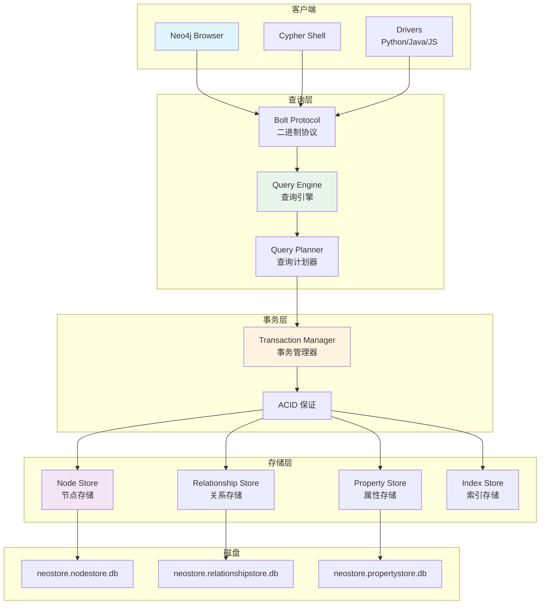
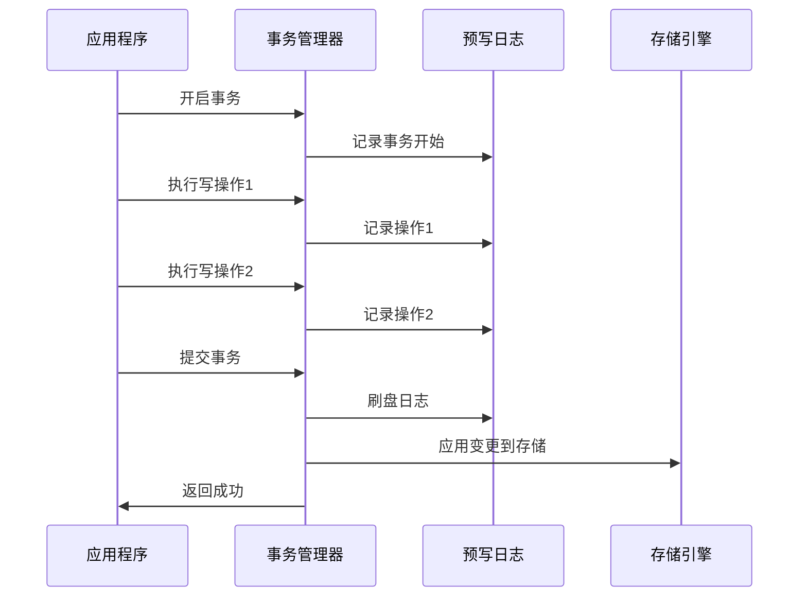
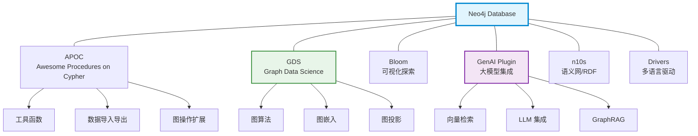

# Neo4j 架构与存储引擎

> **难度级别**：进阶
> **预计阅读时间**：30 分钟
> **前置知识**：[属性图模型](./01-02-property-graph-model.md)、数据库基础概念

---

## 一、原生图存储引擎

Neo4j 是一款原生图数据库（Native Graph Database），"原生"的含义在于它从底层存储引擎开始就是为图数据专门设计的，而非在关系型数据库或键值存储之上添加图查询层。这一设计理念使得 Neo4j 在图遍历性能上具有结构性优势。

### 1.1 原生 vs 非原生图数据库

图数据库市场存在两种技术路线：

| 类型 | 英文 | 架构特征 | 代表产品 | 优势 | 劣势 |
|------|------|---------|---------|------|------|
| 原生图数据库 | Native Graph Database | 存储引擎专为图设计 | Neo4j, TigerGraph | 图遍历性能最优 | 通用查询能力较弱 |
| 非原生图数据库 | Non-Native Graph Database | 在其他存储之上封装图接口 | Amazon Neptune, ArangoDB | 多模型灵活性 | 图遍历性能有损耗 |

Neo4j 的原生性体现在两个层面：

1. **存储层原生**：节点和关系在磁盘上有独立的存储文件，关系的物理指针直接指向关联节点；
2. **处理层原生**：查询引擎的执行计划基于图遍历优化，而非关系代数的 JOIN 优化。

### 1.2 Neo4j 架构总览



---

## 二、无索引邻接原理

无索引邻接（Index-Free Adjacency，IFA）是 Neo4j 最核心的架构创新，也是其区别于关系型数据库和其他非原生图数据库的根本所在。

### 2.1 什么是无索引邻接

在关系型数据库中，表与表之间的关联通过外键加索引实现。查询关联数据时，数据库先通过索引定位外键值，再通过索引查找对应的行。每多一层关联就多一次索引查找。

无索引邻接的核心思想是：**每个节点直接持有指向其相邻节点的物理指针**。查询某个节点的邻居时，无需查找索引，直接通过指针访问即可。

### 2.2 原理对比

**关系型数据库的关联查询**（查找 Alice 的朋友的同事）：

```
1. 在 Authors 表中查找 Alice -> 得到 author_id = 1
2. 在 Friendship 表中通过索引查找 author_id=1 -> 得到 friend_id = 2, 3
3. 对每个 friend_id，在 Authors 表中查找 -> 得到 Bob, Carol
4. 再次在 Friendship 表中查找 friend_id=2 -> 得到 colleague_id = 4, 5
5. ...（每层 JOIN 都是一次索引查找）
```

每层关联都需要索引查找，层数越深，I/O 操作越多。

**Neo4j 的图遍历**（同样查询）：

```
1. 定位 Alice 节点 -> 直接获得关系指针
2. 沿 FRIEND 关系指针遍历 -> 直接到达 Bob, Carol 节点
3. 从 Bob, Carol 沿 FRIEND 关系指针继续遍历 -> 直接到达同事节点
4. ...（每层遍历都是指针跳转，无需索引查找）
```

### 2.3 性能差异

| 查询深度 | 关系型数据库（JOIN） | Neo4j（图遍历） |
|---------|-------------------|----------------|
| 1 跳 | 快（1 次索引查找） | 快（指针跳转） |
| 2 跳 | 较快（2 次索引查找） | 快（指针跳转） |
| 3 跳 | 变慢（3 次索引查找） | 快（指针跳转） |
| 5 跳 | 很慢（5 次索引查找） | 快（指针跳转） |
| 10 跳 | 几乎不可行 | 仍然可行 |

**关键结论**：Neo4j 的图遍历时间复杂度仅与遍历的子图规模成正比，与整个图的规模无关。这意味着在一个 10 亿节点的图中查找 3 跳邻居，与在一个 10 万节点的图中查找 3 跳邻居，速度差异不大——只要遍历的子图规模相近。

### 2.4 与图书情报领域的关联

无索引邻接对图书情报领域的研究有直接价值。引文网络通常包含数千万篇论文，查询某篇论文的 N 代引用链在关系型数据库中几乎不可行，而在 Neo4j 中可以毫秒级完成。这使得以下研究成为可能：

- 学术传承分析：追溯某篇论文的引用链至 N 代；
- 影响力传播：分析某篇论文的影响如何沿引文网络传播；
- 跨学科关联：发现不同学科之间通过引用形成的隐藏联系。

---

## 三、存储结构

Neo4j 在磁盘上使用多个固定大小记录的存储文件来分别存储节点、关系和属性。这种设计使得通过 ID 访问记录的时间复杂度为 $O(1)$。

### 3.1 节点存储

节点存储文件（`neostore.nodestore.db`）中，每个节点占用固定 15 字节的记录：

| 字段 | 大小 | 说明 |
|------|------|------|
| 标志位 | 1 字节 | 节点状态标志（是否使用、是否密集等） |
| 下一关系 ID | 4 字节 | 指向该节点的第一条关系的 ID |
| 下一属性 ID | 4 字节 | 指向该节点的第一个属性的 ID |
| 标签 | 5 字节 | 节点标签的存储位置 |
| 额外 | 1 字节 | 保留字段 |

节点记录中存储的是关系和属性的**指针（ID）**，而非实际数据。这种"指针间接"设计使得节点记录紧凑高效。

### 3.2 关系存储

关系存储文件（`neostore.relationshipstore.db`）中，每个关系占用固定 34 字节的记录：

| 字段 | 大小 | 说明 |
|------|------|------|
| 标志位 | 1 字节 | 关系状态标志 |
| 起始节点 ID | 4 字节 | 源节点指针 |
| 结束节点 ID | 4 字节 | 目标节点指针 |
| 关系类型 | 4 字节 | 关系类型指针 |
| 起始节点上一关系 | 4 字节 | 起始节点关系链上的上一条关系 |
| 起始节点下一关系 | 4 字节 | 起始节点关系链上的下一条关系 |
| 结束节点上一关系 | 4 字节 | 结束节点关系链上的上一条关系 |
| 结束节点下一关系 | 4 字节 | 结束节点关系链上的下一条关系 |
| 下一属性 ID | 4 字节 | 指向该关系的第一个属性 |
| 额外 | 1 字节 | 保留字段 |

**关系链（Relationship Chain）** 是 Neo4j 实现无索引邻接的关键机制。每个节点维护一个双向链表，链表中的每个元素是该节点参与的一条关系。遍历某节点的所有关系时，只需沿着关系链表依次访问即可，无需任何索引查找。

### 3.3 属性存储

属性存储文件（`neostore.propertystore.db`）采用动态大小记录，支持多种数据类型：

- **定长属性**：如整数、布尔值，直接存储在属性记录中；
- **变长属性**：如长字符串，存储在单独的字符串存储文件中，属性记录保存指针；
- **数组属性**：存储在动态数组存储文件中。

属性以链表形式组织，每个节点或关系的属性通过属性 ID 链接为一条属性链。

### 3.4 存储结构示意图

```
节点存储                    关系存储
┌──────────┐              ┌──────────────────┐
│ Node #1  │──rel_ptr──> │ Rel #10           │
│ labels:  │              │ start: Node #1    │
│ :Author  │              │ end:   Node #2    │
│ prop_ptr │              │ type:  WROTE      │──> 属性存储
└──────────┘              │ next:  Rel #15    │
                          └──────────────────┘
┌──────────┐                    |
│ Node #2  │<───────────────────┘
│ labels:  │
│ :Paper   │
│ prop_ptr │──> 属性存储
└──────────┘
```

---

## 四、ACID 事务管理

Neo4j 是少数完全支持 ACID 事务的图数据库，这使得它适合于需要强一致性保证的业务场景。

### 4.1 ACID 四大特性

| 特性 | 英文全称 | 含义 | Neo4j 实现 |
|------|---------|------|-----------|
| 原子性 | Atomicity | 事务中的操作要么全部成功，要么全部回滚 | 预写日志（WAL） |
| 一致性 | Consistency | 事务执行前后数据库保持一致状态 | 约束检查 |
| 隔离性 | Isolation | 并发事务互不干扰 | 读写锁机制 |
| 持久性 | Durability | 事务提交后数据永久保存 | 日志刷盘 + 检查点 |

### 4.2 事务生命周期



### 4.3 与 NoSQL 数据库的对比

| 特性 | Neo4j | MongoDB | Redis |
|------|-------|---------|-------|
| ACID | 完全支持 | 单文档支持 | 不支持 |
| 事务范围 | 跨节点跨关系 | 单文档 | 单命令 |
| 隔离级别 | 可配置 | - | - |
| 适用场景 | 强一致性业务 | 灵活模式 | 缓存 |

对于图书情报领域的应用，如图书馆管理系统、引文数据库，ACID 事务保证了数据完整性——例如添加一条引用关系时，必须同时更新引用方和被引方的计数，这一操作必须在同一事务中原子完成。

---

## 五、Community vs Enterprise 版本对比

Neo4j 提供社区版（Community Edition）和企业版（Enterprise Edition），两者在功能和性能上有显著差异。

| 对比维度 | Community Edition | Enterprise Edition |
|---------|-------------------|-------------------|
| 授权协议 | GPL v3（开源免费） | 商业授权（付费） |
| 集群支持 | 不支持 | 支持（因果集群） |
| 高可用 | 不支持 | 支持 |
| 在线备份 | 不支持 | 支持 |
| 角色安全 | 不支持 | 支持（RBAC） |
| 查询并行 | 不支持 | 支持 |
| 性能监控 | 基础 | 高级监控 |
| 适合场景 | 学习、开发、小规模生产 | 企业级生产环境 |

对于本知识库的学习和实验，社区版完全足够。生产环境部署建议使用企业版以获得高可用和监控能力。

---

## 六、部署方式

### 6.1 四种部署方式对比

| 部署方式 | 英文 | 适用场景 | 运维成本 | 扩展性 |
|---------|------|---------|---------|--------|
| Neo4j Desktop | Desktop | 本地开发学习 | 极低 | 单机 |
| Docker | Container | 开发测试、CI/CD | 中 | 单机 |
| Neo4j Server | Server | 生产部署 | 中 | 单机/集群 |
| Neo4j Aura | Cloud | 云端托管 | 极低 | 云端弹性 |

### 6.2 部署架构选择

```mermaid
flowchart TD
    A[选择部署方式] --> B{使用场景?}
    B -->|学习实验| C[Neo4j Aura Free<br/>或 Desktop]
    B -->|团队开发| D[Docker Compose]
    B -->|生产部署| E{规模需求?}
    E -->|中小规模| F[Neo4j Server<br/>单节点]
    E -->|大规模高可用| G[Neo4j Enterprise<br/>因果集群]
    E -->|免运维| H[Neo4j Aura<br/>云端托管]

    style C fill:#e8f5e9
    style D fill:#fff3e0
    style F fill:#e1f5fe
    style G fill:#f3e5f5
    style H fill:#e1f5fe
```



### 6.3 推荐部署配置

| 环节 | 推荐方案 | 说明 |
|------|---------|------|
| 学习入门 | Aura Free | 零配置，注册即用 |
| 课程实验 | Desktop 或 Docker | 本地可控，支持插件 |
| 研究项目 | Docker Compose | 便于复现实验环境 |
| 论文实验 | Docker + 版本锁定 | 保证实验可复现性 |
| 生产系统 | Aura 或 Enterprise | 高可用、可监控 |

---

## 七、生态系统

Neo4j 拥有丰富的工具生态系统，覆盖从数据导入、查询分析、算法计算到可视化展示的全流程。

### 7.1 生态系统总览



### 7.2 核心组件详解

#### APOC（Awesome Procedures on Cypher）

APOC 是 Neo4j 最知名的社区插件库，提供数百个实用存储过程（Stored Procedures），大幅扩展 Cypher 的能力。

| 功能类别 | 示例 | 说明 |
|---------|------|------|
| 数据导入 | `apoc.load.csv` | 从 CSV 批量导入 |
| 数据导出 | `apoc.export.json` | 导出为 JSON |
| 图操作 | `apoc.path.expand` | 路径扩展配置 |
| 工具函数 | `apoc.text.toUpperCase` | 文本处理 |
| 数据清洗 | `apoc.data.clean` | 数据清洗 |

#### GDS（Graph Data Science）

GDS 是 Neo4j 官方的图数据科学库，提供 65+ 种图算法和图嵌入方法，是本知识库后续模块的核心工具。

| 功能类别 | 示例算法 | 应用场景 |
|---------|---------|---------|
| 中心性 | PageRank, Betweenness | 影响力评估 |
| 社区发现 | Louvain, Label Propagation | 主题聚类 |
| 路径分析 | Dijkstra, A* | 最短路径 |
| 相似度 | Jaccard, Cosine | 相似推荐 |
| 图嵌入 | Node2Vec, GraphSAGE | 向量化表征 |

#### Bloom

Neo4j Bloom 是一款可视化图探索工具，支持无代码的图数据交互式探索。

| 功能 | 说明 |
|------|------|
| 可视化搜索 | 通过类自然语言搜索图数据 |
| 路径高亮 | 高亮显示路径 |
| 样式定制 | 根据属性自定义节点/边样式 |
| 交互式扩展 | 点击节点展开邻居 |

#### GenAI 插件

GenAI 插件（Generative AI Plugin）是 Neo4j 面向大语言模型（LLM）时代的核心组件，支持向量检索和 GraphRAG。

| 功能 | 说明 |
|------|------|
| 向量索引 | 存储和检索嵌入向量 |
| 语义搜索 | 基于向量相似度的搜索 |
| LLM 集成 | 与 OpenAI、LangChain 等集成 |
| GraphRAG | 图检索增强生成 |

#### n10s（Neo4j Semantics）

n10s 插件使 Neo4j 具备处理 RDF 数据和本体推理的能力。

| 功能 | 说明 |
|------|------|
| RDF 导入 | 将 RDF 数据导入为属性图 |
| RDF 导出 | 将属性图导出为 RDF |
| 本体推理 | 基于 OWL 本体的推理 |
| SPARQL 支持 | 部分 SPARQL 查询支持 |

### 7.3 驱动与客户端

Neo4j 提供多种编程语言的官方驱动：

| 语言 | 驱动包 | 典型用途 |
|------|--------|---------|
| Python | `neo4j` | 数据科学、机器学习 |
| Java | `neo4j-java-driver` | 企业级应用 |
| JavaScript | `neo4j-driver` | Web 应用 |
| .NET | `Neo4j.Driver` | 微软生态 |
| Go | `neo4j-go-driver` | 云原生应用 |

Python 驱动示例：

```python
from neo4j import GraphDatabase

driver = GraphDatabase.driver("bolt://localhost:7687",
                               auth=("neo4j", "password"))

with driver.session() as session:
    result = session.run("MATCH (a:Author) RETURN a.name LIMIT 5")
    for record in result:
        print(record["a.name"])

driver.close()
```

### 7.4 与图书情报领域的关联

Neo4j 生态系统与图书情报领域的需求高度契合：

| Neo4j 组件 | LIS 领域应用 |
|-----------|-------------|
| GDS 中心性算法 | 引文影响力评估（PageRank） |
| GDS 社区发现 | 研究主题聚类、学科边界识别 |
| GDS 相似度 | 文献相似推荐 |
| n10s | 本体管理、叙词表存储 |
| GenAI | 智能文献问答、知识图谱检索 |
| APOC | 批量导入 MARC、Dublin Core 数据 |
| Bloom | 知识图谱可视化探索 |

特别值得注意的是，n10s 插件使 Neo4j 能够直接处理 RDF 数据和 OWL 本体，这意味着图书情报领域长期积累的 SKOS（Simple Knowledge Organization System）叙词表、Dublin Core 元数据等都可以在 Neo4j 中统一管理和分析。

---

## 小结

本章深入介绍了 Neo4j 的架构设计，重点讲解了无索引邻接这一核心创新、节点/关系/属性的存储结构、ACID 事务管理、版本与部署方式，以及涵盖 APOC、GDS、Bloom、GenAI、n10s 的丰富生态系统。理解 Neo4j 的架构原理有助于后续高效使用 Cypher 查询语言和 GDS 图算法库。

> **下一步阅读**：建议继续阅读 [Cypher 查询语言详解](./01-04-cypher-query-language.md)，学习如何在 Neo4j 上查询和操作图数据。
