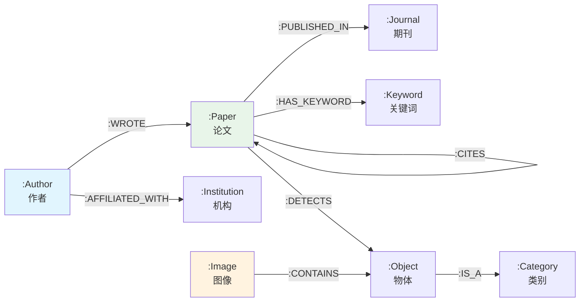

# Cypher 实战示例集

> **难度级别**：进阶
> **预计阅读时间**：40 分钟
> **前置知识**：[Cypher 查询语言详解](./01-04-cypher-query-language.md)、[属性图模型](./01-02-property-graph-model.md)

---

## 概述

本章通过 6 个完整实战示例，将 Cypher 查询语言的核心语法应用于图书情报与图像知识图谱的真实场景。每个示例包含四个部分：**问题描述**、**Cypher 代码**、**结果解读**、**优化建议**。

所有示例基于以下图数据模型：



---

## 示例 1：创建图像知识图谱

### 问题描述

我们需要在 Neo4j 中创建一个小型图像知识图谱，包含 3 幅图像、若干检测到的物体、物体间的语义关系，以及物体类别层次。这一示例对应"AI 图像数据库服务"中的图像知识图谱构建场景。

### Cypher 代码

```cypher
// 清空数据库（仅实验环境使用）
MATCH (n) DETACH DELETE n;

// 第一步：创建类别本体
CREATE (cat_person:Category {name: "person", super_category: "living_being"}),
       (cat_phone:Category {name: "phone", super_category: "electronics"}),
       (cat_chair:Category {name: "chair", super_category: "furniture"}),
       (cat_laptop:Category {name: "laptop", super_category: "electronics"});

// 第二步：创建图像和物体节点，以及检测关系
CREATE (img1:Image {
    filename: "img001.jpg",
    width: 1920,
    height: 1080,
    capture_time: "2024-01-15T10:30:00",
    embedding: [0.12, 0.45, 0.78, 0.33]
}),
(img2:Image {
    filename: "img002.jpg",
    width: 1280,
    height: 720,
    capture_time: "2024-01-16T14:20:00",
    embedding: [0.22, 0.55, 0.68, 0.43]
}),
(img3:Image {
    filename: "img003.jpg",
    width: 1920,
    height: 1080,
    capture_time: "2024-01-17T09:00:00",
    embedding: [0.15, 0.42, 0.80, 0.30]
});

// 第三步：创建物体实例
CREATE (obj1:Object {object_id: "obj001", category: "person", confidence: 0.95, bbox: [100, 200, 300, 600]}),
       (obj2:Object {object_id: "obj002", category: "phone", confidence: 0.88, bbox: [280, 350, 340, 420]}),
       (obj3:Object {object_id: "obj003", category: "chair", confidence: 0.92, bbox: [50, 500, 350, 900]}),
       (obj4:Object {object_id: "obj004", category: "laptop", confidence: 0.90, bbox: [400, 300, 800, 600]}),
       (obj5:Object {object_id: "obj005", category: "person", confidence: 0.87, bbox: [600, 150, 900, 700]});

// 第四步：建立检测关系（Image -> Object）
MATCH (img1:Image {filename: "img001.jpg"}),
      (obj1:Object {object_id: "obj001"}),
      (obj2:Object {object_id: "obj002"}),
      (obj3:Object {object_id: "obj003"})
CREATE (img1)-[:DETECTS]->(obj1),
       (img1)-[:DETECTS]->(obj2),
       (img1)-[:DETECTS]->(obj3);

MATCH (img2:Image {filename: "img002.jpg"}),
      (obj4:Object {object_id: "obj004"}),
      (obj5:Object {object_id: "obj005"})
CREATE (img2)-[:DETECTS]->(obj4),
       (img2)-[:DETECTS]->(obj5);

// 第五步：建立语义关系（Object -> Object）
MATCH (obj1:Object {object_id: "obj001"}),
      (obj2:Object {object_id: "obj002"}),
      (obj3:Object {object_id: "obj003"})
CREATE (obj1)-[:HOLDING {confidence: 0.85}]->(obj2),
       (obj1)-[:SITTING_ON {confidence: 0.90}]->(obj3);

// 第六步：建立 IS_A 关系（Object -> Category）
MATCH (obj1:Object {object_id: "obj001"}), (cat_person:Category {name: "person"})
CREATE (obj1)-[:IS_A]->(cat_person);

MATCH (obj2:Object {object_id: "obj002"}), (cat_phone:Category {name: "phone"})
CREATE (obj2)-[:IS_A]->(cat_phone);

MATCH (obj3:Object {object_id: "obj003"}), (cat_chair:Category {name: "chair"})
CREATE (obj3)-[:IS_A]->(cat_chair);

MATCH (obj4:Object {object_id: "obj004"}), (cat_laptop:Category {name: "laptop"})
CREATE (obj4)-[:IS_A]->(cat_laptop);

MATCH (obj5:Object {object_id: "obj005"}), (cat_person:Category {name: "person"})
CREATE (obj5)-[:IS_A]->(cat_person);

// 第七步：建立图像间相似关系
MATCH (img1:Image {filename: "img001.jpg"}),
      (img3:Image {filename: "img003.jpg"})
CREATE (img1)-[:SIMILAR_TO {score: 0.92}]->(img3);
```

### 结果解读

执行后数据库中将包含：
- 4 个 `:Category` 节点（person、phone、chair、laptop）；
- 3 个 `:Image` 节点，每个携带嵌入向量属性；
- 5 个 `:Object` 节点，每个携带边界框（Bounding Box）和置信度（Confidence）；
- 检测关系 `:DETECTS` 连接图像与物体；
- 语义关系 `:HOLDING`、`:SITTING_ON` 连接物体间关系；
- `:IS_A` 关系建立物体到类别的本体链接；
- `:SIMILAR_TO` 关系记录图像间的视觉相似度。

### 优化建议

1. **使用 MERGE 替代 CREATE**：生产环境中应使用 `MERGE` 避免重复创建，尤其是批量导入时；
2. **批量操作**：使用 `UNWIND` 批量创建节点，减少查询次数；
3. **添加约束**：为 `object_id`、`filename`、`name` 等字段添加唯一约束；
4. **事务批处理**：大量数据导入时，每 5000-10000 条提交一次事务。

```cypher
// 推荐的批量创建方式
UNWIND [
    {filename: "img001.jpg", w: 1920, h: 1080},
    {filename: "img002.jpg", w: 1280, h: 720}
] AS row
MERGE (img:Image {filename: row.filename})
SET img.width = row.w, img.height = row.h
```

---

## 示例 2：多跳关系查询

### 问题描述

在引文网络中，查询某篇论文的 2 代引用链——即该论文引用的论文所引用的论文。这在学术传承分析中用于了解一篇论文的知识源头。

### Cypher 代码

```cypher
// 前提：先创建示例引文网络
MERGE (p1:Paper {title: "Graph Neural Networks: A Review", year: 2021})
MERGE (p2:Paper {title: "Semi-Supervised Classification with GCN", year: 2017})
MERGE (p3:Paper {title: "GraphSAGE: Inductive Representation Learning", year: 2017})
MERGE (p4:Paper {title: "GAT: Graph Attention Networks", year: 2018})
MERGE (p5:Paper {title: "Deep Learning", year: 2016})
MERGE (p6:Paper {title: "Spectral Networks on Graphs", year: 2014})

MERGE (p1)-[:CITES]->(p2)
MERGE (p1)-[:CITES]->(p3)
MERGE (p1)-[:CITES]->(p4)
MERGE (p2)-[:CITES]->(p5)
MERGE (p2)-[:CITES]->(p6)
MERGE (p3)-[:CITES]->(p5)
MERGE (p4)-[:CITES]->p2;

// 查询：P1 的 2 代引用链
MATCH (p1:Paper {title: "Graph Neural Networks: A Review"})
      -[:CITES]->(p2:Paper)
      -[:CITES]->(p3:Paper)
RETURN p1.title AS source, p2.title AS intermediate, p3.title AS origin,
       p3.year AS origin_year
ORDER BY origin_year ASC;
```

### 结果解读

查询结果将返回 P1 通过两跳引用到达的所有原始论文：

| source | intermediate | origin | origin_year |
|--------|-------------|--------|-------------|
| GNN: A Review | GCN | Deep Learning | 2016 |
| GNN: A Review | GCN | Spectral Networks | 2014 |
| GNN: A Review | GraphSAGE | Deep Learning | 2016 |

这揭示了 GNN 综述论文的知识传承路径：它通过引用 GCN 和 GraphSAGE，间接继承了深度学习和谱图理论的基础工作。

### 优化建议

1. **使用变长路径**：如果跳数可变，使用 `*1..2` 语法更灵活：

```cypher
MATCH path = (p1:Paper {title: "Graph Neural Networks: A Review"})-[:CITES*1..2]->(p3:Paper)
RETURN [n IN nodes(path) | n.title] AS citation_chain, length(path) AS hops
ORDER BY hops;
```

2. **避免笛卡尔积爆炸**：多跳查询可能产生大量中间结果，使用 `LIMIT` 或更精确的模式限制；

3. **使用 APOC 路径扩展**：复杂路径查询可使用 `apoc.path.expandConfig`：

```cypher
MATCH (p1:Paper {title: "Graph Neural Networks: A Review"})
CALL apoc.path.expandConfig(p1, {
    relationshipFilter: 'CITES>',
    minLevel: 1,
    maxLevel: 2
})
YIELD path
RETURN [n IN nodes(path) | n.title] AS chain;
```

---

## 示例 3：模式匹配查询

### 问题描述

查找所有"包含人拿着手机"场景的图像。这是一个典型的图模式匹配问题——我们需要匹配一个特定的子图结构：Image -> Object(person) -> HOLDING -> Object(phone)。

### Cypher 代码

```cypher
// 查询：包含"人拿着手机"模式的图像
MATCH (img:Image)-[:DETECTS]->(person:Object)-[:IS_A]->(:Category {name: "person"}),
      (img)-[:DETECTS]->(phone:Object)-[:IS_A]->(:Category {name: "phone"}),
      (person)-[:HOLDING]->(phone)
RETURN img.filename AS image,
       person.object_id AS person_id,
       person.confidence AS person_conf,
       phone.object_id AS phone_id,
       phone.confidence AS phone_conf
ORDER BY person.confidence DESC;
```

### 结果解读

基于示例 1 创建的数据，查询结果为：

| image | person_id | person_conf | phone_id | phone_conf |
|-------|-----------|-------------|----------|------------|
| img001.jpg | obj001 | 0.95 | obj002 | 0.88 |

只有 img001.jpg 同时包含"人"和"手机"物体，且它们之间存在 `:HOLDING` 语义关系。img002 虽然包含物体，但没有匹配的"人拿着手机"模式。

### 优化建议

1. **使用参数化查询**：避免硬编码类别名，使用参数提高复用性：

```cypher
// 参数化版本
MATCH (img:Image)-[:DETECTS]->(person:Object)-[:IS_A]->(:Category {name: $subject}),
      (img)-[:DETECTS]->(obj:Object)-[:IS_A]->(:Category {name: $object}),
      (person)-[r:$relation]->(obj)
RETURN img.filename
// 参数: {subject: "person", object: "phone", relation: "HOLDING"}
```

2. **推广为通用场景搜索**：可以定义"场景模板"并批量查询：

```cypher
// 查询多种场景模式
MATCH (img:Image)
MATCH (img)-[:DETECTS]->(o1:Object)-[r]->(o2:Object)
WHERE type(r) IN ['HOLDING', 'SITTING_ON', 'LEFT_OF']
RETURN img.filename,
       collect({
           subject: o1.category,
           relation: type(r),
           object: o2.category,
           confidence: r.confidence
       }) AS scenes;
```

3. **与图书情报领域的关联**：这一模式匹配查询与信息检索中的"关系检索"（Relational Search）直接对应。传统检索只能匹配关键词，而图模式匹配可以检索"关系模式"——例如检索"A 方法应用于 B 领域"的论文：

```cypher
// 图书情报版：查找方法-领域关系
MATCH (paper:Paper)-[:USES_METHOD]->(method:Method),
      (paper)-[:IN_DOMAIN]->(domain:Domain)
WHERE method.name = "Graph Neural Network" AND domain.name = "Bibliometrics"
RETURN paper.title, paper.year;
```

---

## 示例 4：聚合统计

### 问题描述

统计每个物体类别的出现频次、平均置信度，以及包含该类别物体的图像数量。这用于了解图像数据集中各类别的分布情况。

### Cypher 代码

```cypher
// 统计物体类别分布
MATCH (img:Image)-[:DETECTS]->(obj:Object)-[:IS_A]->(cat:Category)
WITH cat.name AS category,
     count(obj) AS total_detections,
     count(DISTINCT img) AS image_count,
     avg(obj.confidence) AS avg_confidence,
     min(obj.confidence) AS min_confidence,
     max(obj.confidence) AS max_confidence,
     collect(DISTINCT img.filename) AS images
RETURN category,
       total_detections,
       image_count,
       round(avg_confidence * 1000) / 1000 AS avg_conf,
       round(min_confidence * 1000) / 1000 AS min_conf,
       round(max_confidence * 1000) / 1000 AS max_conf,
       images
ORDER BY total_detections DESC;
```

### 结果解读

基于示例 1 的数据，查询结果为：

| category | total_detections | image_count | avg_conf | min_conf | max_conf | images |
|----------|-----------------|-------------|----------|----------|----------|--------|
| person | 2 | 2 | 0.910 | 0.870 | 0.950 | [img001.jpg, img002.jpg] |
| phone | 1 | 1 | 0.880 | 0.880 | 0.880 | [img001.jpg] |
| chair | 1 | 1 | 0.920 | 0.920 | 0.920 | [img001.jpg] |
| laptop | 1 | 1 | 0.900 | 0.900 | 0.900 | [img002.jpg] |

分析结论：
- "person" 类别出现最频繁（2 次），分布在 2 幅图像中；
- "person" 的检测置信度波动最大（0.87-0.95），说明某些图像中的人物识别难度较高；
- img001.jpg 包含最多类别（person、phone、chair），是内容最丰富的图像。

### 优化建议

1. **分层聚合**：使用 `WITH` 分阶段聚合，避免复杂聚合降低性能：

```cypher
// 先按图像聚合，再按类别聚合
MATCH (img:Image)-[:DETECTS]->(obj:Object)-[:IS_A]->(cat:Category)
WITH cat, img, count(obj) AS detections_in_image
RETURN cat.name AS category,
       count(img) AS image_count,
       sum(detections_in_image) AS total_detections;
```

2. **与图书情报领域的关联**：这一聚合统计与文献计量学（Bibliometrics）的统计方法高度一致。将 `:DETECTS` 替换为 `:WROTE`，`:Category` 替换为 `:Journal`，就得到了期刊发文量统计：

```cypher
// 图书情报版：期刊发文统计
MATCH (j:Journal)<-[:PUBLISHED_IN]-(p:Paper)<-[:WROTE]-(a:Author)
WITH j.name AS journal,
     count(p) AS paper_count,
     count(DISTINCT a) AS author_count,
     collect(DISTINCT a.affiliation) AS institutions
RETURN journal, paper_count, author_count, size(institutions) AS inst_count
ORDER BY paper_count DESC LIMIT 10;
```

---

## 示例 5：路径查询

### 问题描述

在图像知识图谱中，查找两幅图像之间的"语义关联路径"——即通过共享物体类别或相似关系连接两幅图像的路径。这用于图像关联发现和跨图像推理。

### Cypher 代码

```cypher
// 前提：补充一些跨图像关联
MATCH (img1:Image {filename: "img001.jpg"}),
      (img2:Image {filename: "img002.jpg"})
MERGE (img1)-[:SIMILAR_TO {score: 0.75}]->(img2);

// 查询：img001 到 img003 的所有路径（最多 4 跳）
MATCH (img1:Image {filename: "img001.jpg"}),
      (img3:Image {filename: "img003.jpg"}),
      path = allShortestPaths((img1)-[*1..4]-(img3))
RETURN
    [n IN nodes(path) | coalesce(n.filename, n.object_id, n.name)] AS path_nodes,
    [r IN relationships(path) | type(r)] AS path_relations,
    length(path) AS path_length;
```

### 结果解读

查询返回 img001 和 img003 之间的所有最短路径。可能的路径包括：

| path_nodes | path_relations | path_length |
|-----------|---------------|-------------|
| [img001.jpg, img003.jpg] | [SIMILAR_TO] | 1 |
| [img001.jpg, obj001, obj005, img002.jpg, img003.jpg] | [DETECTS, IS_A, DETECTS, SIMILAR_TO] | 4 |

第一条路径是直接相似关系（1 跳），第二条路径通过共享类别"person"间接关联（4 跳）。这说明 img001 和 img003 既在视觉上相似，也通过"都包含人物"建立了语义关联。

### 优化建议

1. **限制关系类型**：全路径查询可能遍历所有关系类型，应限定相关类型：

```cypher
// 只走特定关系类型的路径
MATCH path = allShortestPaths(
    (img1:Image {filename: "img001.jpg"})
    -[:DETECTS|:IS_A|:SIMILAR_TO*1..4]-
    (img3:Image {filename: "img003.jpg"})
)
RETURN path;
```

2. **使用 APOC 进行更精细的路径控制**：

```cypher
MATCH (img1:Image {filename: "img001.jpg"}), (img3:Image {filename: "img003.jpg"})
CALL apoc.path.expandConfig(img1, {
    relationshipFilter: 'DETECTS>|IS_A>|SIMILAR_TO',
    minLevel: 1,
    maxLevel: 4,
    endNodeFilter: img3,
    uniqueness: 'NODE_GLOBAL'
})
YIELD path
RETURN path LIMIT 5;
```

3. **与图书情报领域的关联**：路径查询在引文分析中极为重要。查找两篇论文之间的"学术传承路径"是一个经典应用：

```cypher
// 图书情报版：两篇论文的引用关联路径
MATCH (p1:Paper {title: "Graph Neural Networks: A Review"}),
      (p2:Paper {title: "Deep Learning"}),
      path = allShortestPaths((p1)-[:CITES*1..6]-(p2))
RETURN
    [n IN nodes(path) | n.title + " (" + n.year + ")"] AS citation_chain,
    length(path) AS distance;
```

这可以揭示任意两篇论文之间通过引用关系建立的最短学术关联路径。

---

## 示例 6：从 CSV 批量导入

### 问题描述

从 CSV 文件批量导入作者-论文-期刊的学术网络数据。这是图书情报领域最常见的场景——从 Web of Science、Scopus 等数据库导出文献数据后导入图数据库进行分析。

### Cypher 代码

假设有两个 CSV 文件：

**authors.csv**:
```csv
author_id,name,affiliation,country
A001,Alice,Tsinghua University,China
A002,Bob,MIT,USA
A003,Carol,Peking University,China
```

**papers.csv**:
```csv
paper_id,title,year,journal,author_ids
P001,Semi-Supervised Classification with GCN,2017,NIPS,A001|A002
P002,GraphSAGE,2017,NIPS,A001|A003
P003,Graph Attention Networks,2018,ICLR,A002
```

```cypher
// 第一步：创建约束（确保数据完整性）
CREATE CONSTRAINT IF NOT EXISTS FOR (a:Author) REQUIRE a.author_id IS UNIQUE;
CREATE CONSTRAINT IF NOT EXISTS FOR (p:Paper) REQUIRE p.paper_id IS UNIQUE;
CREATE CONSTRAINT IF NOT EXISTS FOR (j:Journal) REQUIRE j.name IS UNIQUE;

// 第二步：导入作者数据
LOAD CSV WITH HEADERS FROM 'file:///authors.csv' AS row
MERGE (a:Author {author_id: row.author_id})
SET a.name = row.name,
    a.affiliation = row.affiliation,
    a.country = row.country;

// 第三步：导入论文和期刊数据
LOAD CSV WITH HEADERS FROM 'file:///papers.csv' AS row
MERGE (p:Paper {paper_id: row.paper_id})
SET p.title = row.title,
    p.year = toInteger(row.year)
WITH p, row
MERGE (j:Journal {name: row.journal})
MERGE (p)-[:PUBLISHED_IN]->(j);

// 第四步：导入作者-论文关系（处理多作者）
LOAD CSV WITH HEADERS FROM 'file:///papers.csv' AS row
WITH row, split(row.author_ids, '|') AS author_ids
UNWIND author_ids AS aid
MATCH (a:Author {author_id: aid})
MATCH (p:Paper {paper_id: row.paper_id})
MERGE (a)-[:WROTE]->(p);

// 第五步：验证导入结果
MATCH (a:Author)-[:WROTE]->(p:Paper)-[:PUBLISHED_IN]->(j:Journal)
RETURN a.name AS author, p.title AS paper, p.year AS year, j.name AS journal
ORDER BY year;
```

### 结果解读

导入完成后，数据库中的关系网络如下：

| author | paper | year | journal |
|--------|-------|------|---------|
| Alice | Semi-Supervised Classification with GCN | 2017 | NIPS |
| Bob | Semi-Supervised Classification with GCN | 2017 | NIPS |
| Alice | GraphSAGE | 2017 | NIPS |
| Carol | GraphSAGE | 2017 | NIPS |
| Bob | Graph Attention Networks | 2018 | ICLR |

可以看到 Alice 和 Bob 合作了 P001，Alice 和 Carol 合作了 P002，形成了作者合作网络。

### 优化建议

1. **大批量导入使用 APOC**：当 CSV 文件较大时，使用 `apoc.periodic.iterate` 分批处理：

```cypher
// 大批量导入（每批 5000 条）
CALL apoc.periodic.iterate(
    "LOAD CSV WITH HEADERS FROM 'file:///large_authors.csv' AS row RETURN row",
    "MERGE (a:Author {author_id: row.author_id})
     SET a.name = row.name, a.affiliation = row.affiliation",
    {batchSize: 5000, parallel: false}
)
YIELD batches, total, timeTaken
RETURN batches, total, timeTaken;
```

2. **使用 `USING PERIODIC COMMIT`**（Neo4j 4.x 语法）：

```cypher
// 每 1000 行提交一次事务
:auto LOAD CSV WITH HEADERS FROM 'file:///papers.csv' AS row
MERGE (p:Paper {paper_id: row.paper_id})
SET p.title = row.title, p.year = toInteger(row.year);
```

3. **预处理数据**：导入前对 CSV 数据进行清洗和标准化，特别是作者名消歧、期刊名统一等；

4. **与图书情报领域的关联**：从 Web of Science 导出引文数据的标准流程：

```cypher
// 从 WoS 导出格式导入引用关系
// 假设 citations.csv 包含: citing_id, cited_doi
LOAD CSV WITH HEADERS FROM 'file:///citations.csv' AS row
MATCH (citing:Paper {paper_id: row.citing_id})
MERGE (cited:Paper {doi: row.cited_doi})
MERGE (citing)-[:CITES]->(cited);

// 导入后进行引文网络分析
// 计算每篇论文的被引频次（入度）
MATCH (p:Paper)<-[:CITES]-(citing:Paper)
WITH p, count(citing) AS citation_count
SET p.citations = citation_count
RETURN p.title, p.citations
ORDER BY p.citations DESC LIMIT 10;
```

5. **导入后建立索引**：确保常用查询字段有索引：

```cypher
CREATE INDEX IF NOT EXISTS FOR (p:Paper) ON (p.title);
CREATE INDEX IF NOT EXISTS FOR (p:Paper) ON (p.doi);
CREATE INDEX IF NOT EXISTS FOR (a:Author) ON (a.name);
```

---

## 综合练习

完成以上 6 个示例后，建议尝试以下综合练习：

| 练习 | 难度 | 提示 |
|------|------|------|
| 查询与"人拿着手机"图像最相似的 3 幅图像 | 中等 | 结合 `:SIMILAR_TO` 和 `:DETECTS` |
| 统计每幅图像中物体间的语义关系数量 | 中等 | 聚合 `:HOLDING`、`:SITTING_ON` 等 |
| 查找所有"人坐在椅子上且拿着手机"的图像 | 中等 | 三节点模式匹配 |
| 计算两幅图像在物体类别上的 Jaccard 相似度 | 进阶 | 使用集合函数 |
| 从 WoS 格式 CSV 导入并构建完整引文网络 | 进阶 | 参考 `示例 6` |
| 在引文网络上运行 PageRank 评估论文影响力 | 高级 | 需要安装 GDS 插件 |

---

## 小结

本章通过 6 个实战示例涵盖了 Cypher 的核心应用场景：图数据创建（示例 1）、多跳关系查询（示例 2）、模式匹配查询（示例 3）、聚合统计（示例 4）、路径查询（示例 5）和批量数据导入（示例 6）。每个示例都建立了图像知识图谱与图书情报领域的双关联，帮助读者在两个场景中融会贯通地理解 Cypher 的应用方法。

> **下一步阅读**：基础模块已全部完成，建议进入图数据科学模块，学习如何使用 GDS 算法库进行图分析。或回顾 [知识地图](../00-overview/00-03-knowledge-map.md) 规划下一阶段学习。
