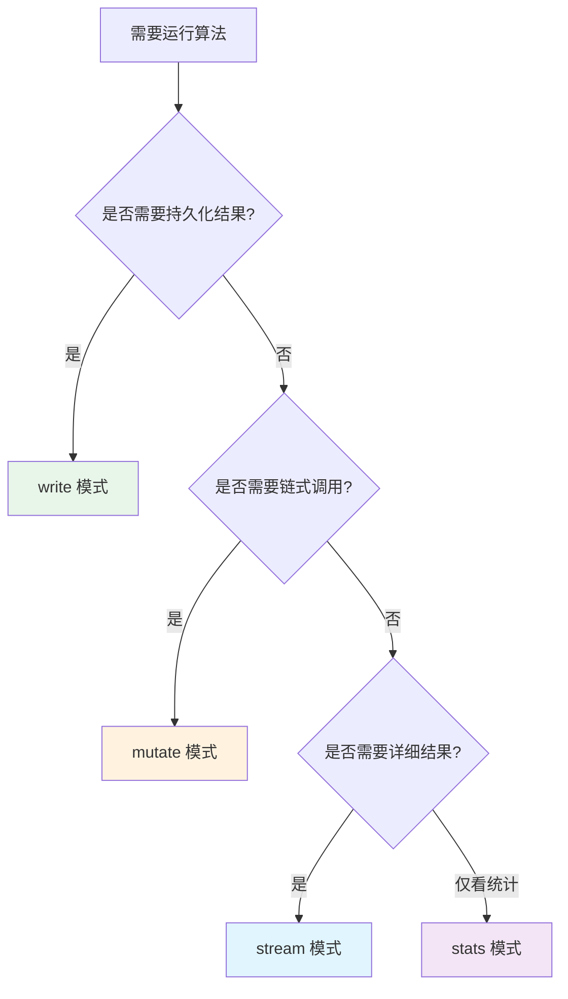

# Neo4j GDS 图数据科学库总体介绍

> **难度级别**：入门到进阶
> **预计阅读时间**：35 分钟
> **前置知识**：[Neo4j 架构与存储引擎](../01-foundations/01-03-neo4j-architecture.md)、[Cypher 查询语言](../01-foundations/01-04-cypher-query-language.md)

---

## 一、GDS 的定位

Neo4j Graph Data Science（GDS，图数据科学库）是 Neo4j 官方推出的图分析与机器学习解决方案。如果说 Cypher 让我们能够"查询"图数据，那么 GDS 则让我们能够"计算"图数据——它把图论中经典的算法工程化、产品化，使开发者无需自己实现算法细节，就能在真实数据上运行大规模图分析。

GDS 的核心定位可以用三句话概括：

1. **图分析工具箱**：提供 65 种以上经过工程优化的图算法，覆盖中心性、社区发现、相似度、路径查找、链接预测、图嵌入等六大类；
2. **图机器学习平台**：内置图嵌入（Graph Embedding）与机器学习管道（ML Pipeline），支持节点分类、链路预测等任务，是连接图数据库与深度学习的桥梁；
3. **内存计算引擎**：通过图投影（Graph Projection）机制将数据加载到内存中的专用图结构上运行，兼顾计算性能与灵活性。

对于信息资源管理领域的研究者而言，GDS 的意义尤为突出。传统文献计量学（Bibliometrics）中的影响力评估、共现分析、主题聚类等任务，往往依赖专门软件（如 VOSviewer、CiteSpace、Gephi）完成，而这些软件通常只能处理静态数据快照。GDS 把这些分析能力直接嵌入数据库，使得"数据更新—实时分析—结果写回"形成闭环，为动态知识图谱的分析提供了基础设施。

---

## 二、65+ 图算法能力矩阵

GDS 提供的算法可以划分为六大类。下表列出了每一类的核心算法及其在图书情报与图像领域的典型应用。

| 算法类别 | 英文 | 代表算法 | 解决的核心问题 | 图像领域应用 | 图书情报应用 |
|---------|------|---------|--------------|------------|------------|
| 中心性 | Centrality | PageRank、Betweenness、Closeness、Eigenvector | 衡量节点重要性 | 识别核心物体/关键图像 | 论文/学者影响力评估 |
| 社区发现 | Community Detection | Louvain、Label Propagation、Connected Components | 识别群组结构 | 图像聚类/场景分组 | 研究主题聚类、学科边界识别 |
| 相似度 | Similarity | Node Similarity、KNN | 衡量节点相似程度 | 相似图像检索 | 相似文献推荐 |
| 路径查找 | Path Finding | Dijkstra、A*、Yen's | 寻找最优路径 | 图像关联路径分析 | 学术传承路径追踪 |
| 链接预测 | Link Prediction | Adamic Adar、Common Neighbors | 预测潜在连接 | 物体关系补全 | 潜在合作预测 |
| 图嵌入 | Node Embeddings | Node2Vec、FastRP、GraphSAGE | 向量化表征 | 图像特征融合 | 文献语义向量化 |

需要注意的是，"图嵌入"这一类在 GDS 中占据重要地位，它是通向图神经网络（GNN）的门户。本知识库的第 4 篇将专门深入图嵌入与 GNN，本篇及后续章节主要聚焦前五类"传统"图算法。

### 2.1 算法数量统计

| 类别 | 算法数量（约） | 说明 |
|------|-------------|------|
| 中心性 | 8 | 含 ArticleRank、Harmonic 等 |
| 社区发现 | 9 | 含 Leiden、Triangle Count 等 |
| 相似度 | 5 | 含 KNN、Node Similarity |
| 路径查找 | 7 | 含 BFS、DFS、Shortest Path |
| 链接预测 | 8 | 含 Preferential Attachment 等 |
| 图嵌入 | 6 | 含 HashGNN、FastRP 等 |
| 其他工具 | 20+ | 拓扑函数、相似度函数等 |
| **合计** | **65+** | 持续增加中 |

---

## 三、GDS 版本与 Neo4j 兼容性

GDS 作为 Neo4j 的插件库，其版本与 Neo4j 数据库版本之间存在兼容性要求。选择匹配的版本是安装的第一步。

| GDS 版本 | 兼容 Neo4j 版本 | 重要特性 | 发布时间 |
|---------|---------------|---------|---------|
| GDS 2.3 | Neo4j 4.4 / 5.x | 引入 HashGNN | 2022 |
| GDS 2.4 | Neo4j 5.9+ | 改进 KNN、Python 客户端增强 | 2023 |
| GDS 2.5 | Neo4j 5.13+ | 模型目录重构、Alpha 算法稳定化 | 2023 |
| GDS 2.6 | Neo4j 5.18+ | 嵌入可视化、性能优化 | 2024 |

版本匹配的通用原则：GDS 的次版本号（minor version）通常对应 Neo4j 5.x 的某个最低版本。例如 GDS 2.5 需要 Neo4j 5.13 及以上。如果版本不匹配，数据库启动时会报错并提示所需版本。建议学习者始终使用最新的稳定版本组合，以获得最新的算法和性能改进。

---

## 四、安装方式

GDS 提供两种主要安装方式：插件安装与 Docker 安装。

### 4.1 插件安装（Neo4j Desktop / Server）

插件安装是最常用的方式，适用于本地开发与学习环境。

```bash
# Neo4j Desktop 中安装：
# 1. 打开 Neo4j Desktop
# 2. 选择对应的数据库项目
# 3. 点击 "Add" -> "Plugins"
# 4. 找到 "Graph Data Science" 并点击 "Install"

# Neo4j Server 手动安装：
# 1. 下载对应版本的 GDS jar 包
# 2. 将 jar 包放入 $NEO4J_HOME/plugins 目录
# 3. 修改 neo4j.conf 配置：
#    dbms.security.procedures.unrestricted=gds.*
# 4. 重启 Neo4j
```

安装后，需要在 `neo4j.conf` 中添加配置以解除 GDS 过程的安全限制：

```properties
# 允许 GDS 过程完全访问
dbms.security.procedures.unrestricted=gds.*
# 设置 GDS 内存上限（建议为可用内存的 60%-70%）
server.memory.heap.max_size=4G
```

### 4.2 Docker 安装

Docker 安装方式适合需要快速搭建可复现环境的场景，如论文实验。

```bash
# 使用官方镜像（自带 GDS 插件）
docker run \
    -p 7474:7474 -p 7687:7687 \
    -e NEO4J_AUTH=neo4j/password \
    -e NEO4JLABS_PLUGINS='["graph-data-science"]' \
    neo4j:5.18

# 该镜像会自动安装最新兼容版本的 GDS 插件
# 启动后访问 http://localhost:7474 进入 Neo4j Browser
```

| 安装方式 | 适用场景 | 优点 | 缺点 |
|---------|---------|------|------|
| Neo4j Desktop 插件 | 本地学习 | 图形化操作简单 | 需安装 Desktop |
| Server 手动安装 | 生产部署 | 完全可控 | 配置较繁琐 |
| Docker 镜像 | 实验复现 | 一键启动、版本锁定 | 需熟悉 Docker |

### 4.3 验证安装

安装完成后，通过以下 Cypher 命令验证 GDS 是否可用：

```cypher
// 查看 GDS 版本
RETURN gds.version();

// 列出所有已安装的算法
CALL gds.list();

// 查看 GDS 系统信息
CALL gds.debug.sysInfo();
```

---

## 五、图目录（Graph Catalog）概念

图目录（Graph Catalog）是 GDS 的核心管理机制。理解图目录是使用 GDS 的前提，因为所有算法都运行在图目录中管理的"内存图"之上。

GDS 的工作流程可以简化为三步：

1. **创建图投影**：从数据库中选取节点和关系，加载到内存中构建一个专用的内存图（In-Memory Graph）；
2. **运行算法**：在该内存图上执行图算法；
3. **处理结果**：将算法结果流式返回、写回数据库或仅查看统计信息。

图目录就是管理这些内存图生命周期的组件。它负责图的创建、列举、删除、内存监控等操作。所有图目录操作都以 `gds.graph` 为前缀。

```cypher
// 创建一个图投影
CALL gds.graph.create('myGraph', 'Paper', 'CITES');

// 列出当前所有图投影
CALL gds.graph.list();

// 删除图投影（释放内存）
CALL gds.graph.drop('myGraph');
```

关于图目录的详细操作将在 [下一章](./02-02-graph-catalog.md) 深入讲解，这里只需建立"图投影是 GDS 的输入"这一概念即可。

---

## 六、四种执行模式

GDS 的每个算法都支持四种执行模式（Execution Modes），它们决定了算法结果的去向。理解这四种模式的区别是高效使用 GDS 的关键。

| 执行模式 | 英文 | 结果去向 | 是否修改图投影 | 是否修改数据库 | 典型用途 |
|---------|------|---------|-------------|-------------|---------|
| stream | Stream | 流式返回给调用方 | 否 | 否 | 实时查看、自定义分析 |
| write | Write | 写回数据库节点/关系属性 | 否 | 是 | 持久化结果、后续 Cypher 查询 |
| mutate | Mutate | 写入图投影内存图 | 是 | 否 | 算法链式调用、中间结果 |
| stats | Stats | 仅返回统计摘要 | 否 | 否 | 快速评估、参数调优 |

### 6.1 stream 模式

stream 模式将算法结果作为数据流返回，不修改任何状态。适合探索性分析和自定义后处理。

```cypher
// 以 stream 模式运行 PageRank，结果直接返回
CALL gds.pageRank.stream('myGraph')
YIELD nodeId, score
RETURN gds.util.asNode(nodeId).title AS paper, score
ORDER BY score DESC LIMIT 10;
```

### 6.2 write 模式

write 模式将算法结果写回数据库节点的属性中，持久化保存。适合需要长期使用或后续 Cypher 查询的场景。

```cypher
// 以 write 模式运行 PageRank，结果写入 paper.pagerank 属性
CALL gds.pageRank.write('myGraph', {
    writeProperty: 'pagerank'
});
```

### 6.3 mutate 模式

mutate 模式将结果写入图投影的内存图中，而非数据库。适合多个算法链式调用——前一个算法的结果作为后一个算法的输入。

```cypher
// 第一步：运行 PageRank，结果写入内存图
CALL gds.pageRank.mutate('myGraph', {
    mutateProperty: 'pagerank'
});

// 第二步：基于 pagerank 属性运行社区发现
CALL gds.louvain.mutate('myGraph', {
    nodeWeightProperty: 'pagerank',
    mutateProperty: 'community'
});
```

### 6.4 stats 模式

stats 模式仅返回算法的统计摘要，不修改任何状态。适合快速评估算法效果或调参。

```cypher
// 以 stats 模式运行 Louvain，仅查看社区统计
CALL gds.louvain.stats('myGraph')
YIELD communityCount, modularity;
```

### 6.5 模式选择决策



---

## 七、Python 客户端 graphdatascience

除了通过 Cypher 调用 GDS，Neo4j 还提供了官方的 Python 客户端库 `graphdatascience`，使得在 Python 环境中调用 GDS 更加便捷。这一客户端特别适合数据科学工作流，因为它能与 Pandas、NumPy、scikit-learn 等生态无缝集成。

```bash
# 安装 Python 客户端
pip install graphdatascience
```

```python
from graphdatascience import GraphDataScience

# 连接到 Neo4j 实例
gds = GraphDataScience(
    "bolt://localhost:7687",
    auth=("neo4j", "password"),
    database="neo4j"
)

# 查看 GDS 版本
print(gds.version())

# 创建图投影
G, result = gds.graph.project(
    "citation_graph",
    "Paper",
    "CITES"
)

# 运行 PageRank 算法（stream 模式）
df = gds.pageRank.stream(G)
print(df.head())

# 运行 Louvain 社区发现（write 模式）
gds.louvain.write(
    G,
    writeProperty="community"
)

# 清理图投影
G.drop()
```

Python 客户端的优势在于：算法结果直接以 Pandas DataFrame 返回，便于后续的统计分析与可视化；同时支持与机器学习库集成，构建端到端的图机器学习管道。

| 调用方式 | 适用场景 | 优势 |
|---------|---------|------|
| Cypher（CALL 子句） | 数据库内操作、查询集成 | 无需切换环境 |
| Python 客户端 | 数据科学工作流 | 与 ML 生态集成、DataFrame 输出 |

---

## 八、GDS 与 APOC 的区别

GDS 和 APOC（Awesome Procedures on Cypher）都是 Neo4j 的重要插件库，但定位截然不同。初学者容易混淆两者，下表帮助厘清边界。

| 对比维度 | GDS | APOC |
|---------|-----|------|
| 全称 | Graph Data Science | Awesome Procedures on Cypher |
| 定位 | 图分析与机器学习 | Cypher 工具函数库 |
| 核心能力 | 图算法、图嵌入、ML 管道 | 数据导入导出、工具函数、路径扩展 |
| 计算模式 | 内存图计算 | 数据库内即时计算 |
| 算法规模 | 65+ 专用图算法 | 数百个工具过程 |
| 典型用途 | PageRank、社区发现、节点嵌入 | CSV 导入、JSON 导出、文本处理 |
| 是否需图投影 | 是（多数算法） | 否 |
| 来源 | Neo4j 官方 | 社区 + 官方维护 |

简而言之：**APOC 是 Cypher 的"瑞士军刀"**，解决日常数据操作的琐碎问题；**GDS 是 Cypher 的"科学计算引擎"**，解决复杂的图分析问题。两者可以同时安装、协同使用——例如用 APOC 导入数据，用 GDS 分析数据。

### 8.1 协同使用示例

```cypher
// 第一步：用 APOC 从 JSON 批量导入数据
CALL apoc.load.json('file:///citations.json')
YIELD value
MERGE (p:Paper {id: value.id})
SET p.title = value.title;

// 第二步：用 GDS 创建图投影并运行算法
CALL gds.graph.create('citationGraph', 'Paper', 'CITES');
CALL gds.pageRank.write('citationGraph', {writeProperty: 'pagerank'});

// 第三步：用 APOC 导出分析结果
CALL apoc.export.json.query(
    'MATCH (p:Paper) RETURN p.id, p.title, p.pagerank ORDER BY p.pagerank DESC LIMIT 100',
    'file:///top_papers.json'
);
```

---

## 九、与图书情报领域的关联

GDS 的算法能力与图书情报领域的研究方法有着天然的对应关系。理解这种对应，有助于研究者将既有的方法论迁移到图计算框架中。

| GDS 能力 | 传统 LIS 工具/方法 | 迁移价值 |
|---------|------------------|---------|
| PageRank 中心性 | 影响因子（Impact Factor）、h 指数 | 基于网络结构的影响力，超越简单计数 |
| Louvain 社区发现 | 共词聚类、文献耦合聚类 | 基于图拓扑的社区，无需预设簇数 |
| Node Similarity | 文献耦合、共被引分析 | 基于结构相似度的推荐 |
| 路径查找 | 引文追溯、知识基因追踪 | 自动发现最短关联路径 |
| 图嵌入 | LSA、LDA 主题模型 | 融合结构与语义的向量化表征 |

一个典型的对比是：传统的期刊影响因子（Journal Impact Factor）只统计被引次数，本质上是度中心性（Degree Centrality）；而 PageRank 考虑了引用方的"质量"，被高影响力论文引用会获得更高权重，这与图书情报领域对"质量加权影响力"的追求一致。GDS 让这种先进指标的计算变得触手可及。

---

## 小结

本章介绍了 Neo4j GDS 图数据科学库的总体定位、65+ 算法能力矩阵、版本兼容性、两种安装方式（插件/Docker）、图目录核心概念、四种执行模式（stream/write/mutate/stats）、Python 客户端 graphdatascience，以及 GDS 与 APOC 的区别。GDS 把图论算法工程化为开箱即用的工具，是连接图数据库与数据科学的桥梁。

> **下一步阅读**：建议继续阅读 [图目录与图投影](./02-02-graph-catalog.md)，学习如何为算法运行准备内存图。
