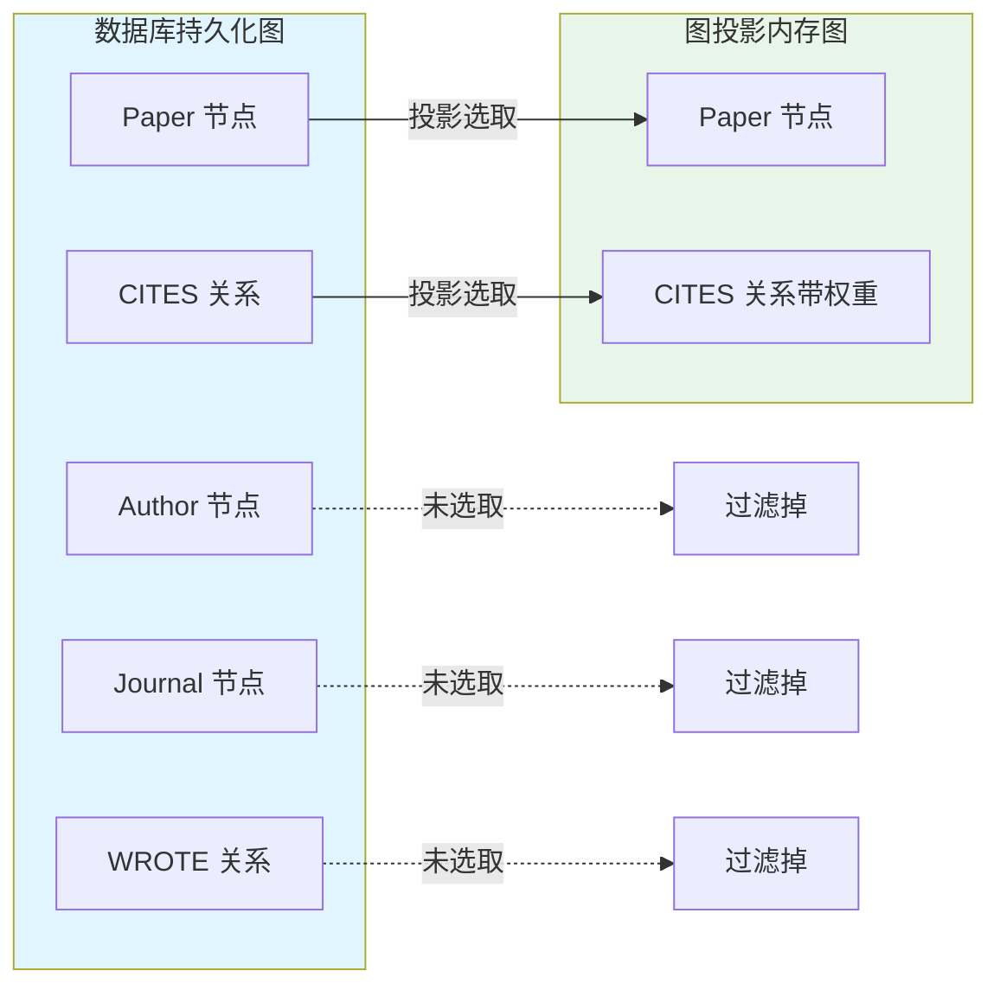
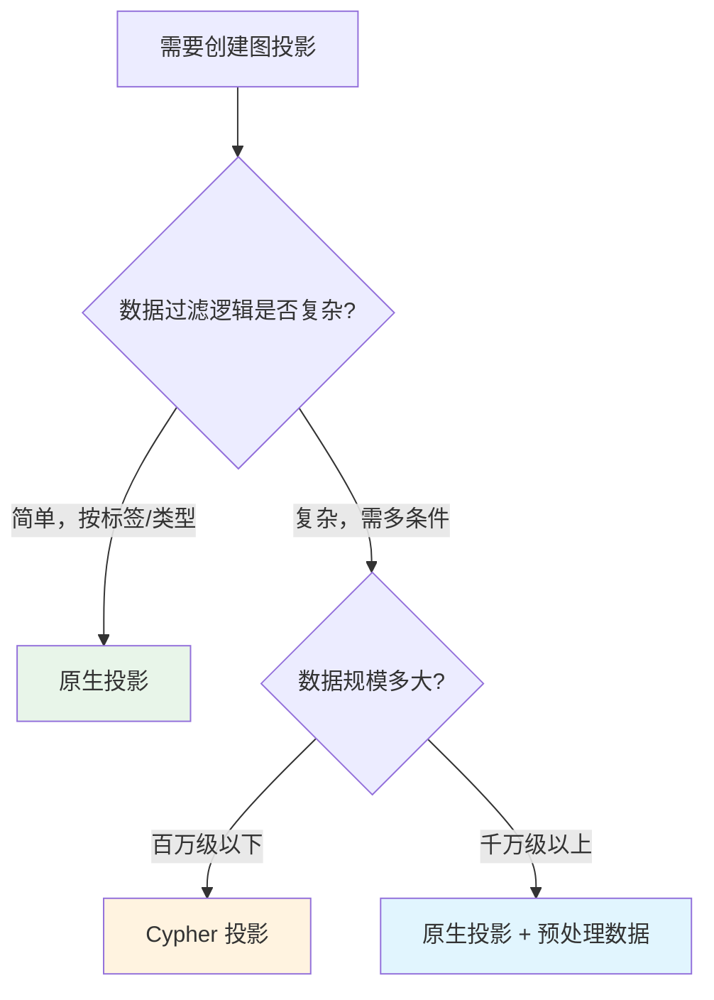

# 图目录与图投影

> **难度级别**：进阶
> **预计阅读时间**：35 分钟
> **前置知识**：[GDS 总体介绍](./02-01-gds-overview.md)、[属性图模型](../01-foundations/01-02-property-graph-model.md)

---

## 一、图投影概念

图投影（Graph Projection）是 GDS 中最核心的概念之一。要理解图投影，需要先理解 GDS 的双层架构。

Neo4j 数据库中的图是"持久化图"——节点和关系存储在磁盘上，通过 Cypher 查询访问。但图算法通常需要对图进行反复的全图遍历，如果每次都从磁盘读取，性能会非常低下。GDS 的解决方案是：在运行算法前，先从数据库中选取一部分节点和关系，加载到内存中，构建一个专用的内存图（In-Memory Graph）。这个"从数据库到内存图"的加载过程，就是图投影。

图投影的本质是**子图选取与格式转换**：

1. **子图选取**：你可以只选取特定标签的节点和特定类型的关系，过滤掉与分析无关的数据；
2. **格式转换**：将属性图格式转换为算法友好的压缩格式，例如将关系属性转为权重、将节点属性转为数值向量。



### 1.1 为什么需要图投影

| 原因 | 说明 |
|------|------|
| 性能 | 内存图遍历比磁盘读取快数百倍 |
| 聚焦 | 只加载分析所需的子图，减少计算量 |
| 灵活 | 同一数据库可创建多个不同视角的图投影 |
| 隔离 | 算法运行在内存图上，不影响数据库读写 |
| 增强 | 可在投影时添加虚拟属性、聚合关系 |

### 1.2 与图书情报领域的类比

图投影的概念可以用图书情报领域的"专题索引"来类比。一个图书馆的馆藏目录（数据库）包含所有文献的完整著录信息，但当研究者要做"引文分析"时，只需抽取论文及其引用关系构建一个"引文索引"（图投影）。这个索引是为特定分析目的定制的视图，不包含与引文分析无关的编目字段，但可能包含分析所需的新字段（如归一化权重）。GDS 的图投影正是这一思路的技术实现。

---

## 二、原生投影 vs Cypher 投影

GDS 提供两种创建图投影的方式：原生投影（Native Projection）和 Cypher 投影（Cypher Projection）。两者的核心区别在于如何从数据库选取数据。

| 对比维度 | 原生投影 Native Projection | Cypher 投影 Cypher Projection |
|---------|--------------------------|------------------------------|
| 创建命令 | `gds.graph.project` | `gds.graph.project.cypher` |
| 数据选取方式 | 按标签和关系类型声明 | 用 Cypher 查询语句选取 |
| 性能 | 高（直接读取存储） | 较低（需执行 Cypher 查询） |
| 灵活性 | 低（只能按标签/类型过滤） | 高（任意 Cypher 过滤逻辑） |
| 适用规模 | 大规模（千万级节点） | 中小规模（百万级以下） |
| 聚合支持 | 支持关系聚合 | 不直接支持 |
| 学习曲线 | 低（声明式配置） | 中（需编写 Cypher） |

### 2.1 原生投影示例

原生投影通过声明标签和关系类型来选取数据，语法简洁、性能最优，是生产环境的首选。

```cypher
// 基本原生投影：选取所有 Paper 节点和 CITES 关系
CALL gds.graph.project(
    'citationGraph',
    'Paper',
    'CITES'
);

// 带属性的原生投影：选取节点属性和关系权重
CALL gds.graph.project(
    'citationGraph',
    {
        Paper: {
            properties: ['year', 'title']
        }
    },
    {
        CITES: {
            properties: ['weight'],
            orientation: 'NATURAL'
        }
    }
);
```

### 2.2 Cypher 投影示例

Cypher 投影允许用任意 Cypher 查询来定义节点和关系的集合，灵活性最高，适合需要复杂过滤逻辑的场景。

```cypher
// Cypher 投影：只选取 2020 年后的论文
CALL gds.graph.project.cypher(
    'recentCitations',
    'MATCH (p:Paper) WHERE p.year >= 2020 RETURN id(p) AS id',
    'MATCH (p1:Paper)-[:CITES]->(p2:Paper) WHERE p1.year >= 2020 AND p2.year >= 2020 RETURN id(p1) AS source, id(p2) AS target'
);
```

### 2.3 选择建议



---

## 三、节点投影与关系投影配置

原生投影支持丰富的配置选项，用于精细控制加载哪些数据以及如何处理。

### 3.1 节点投影配置

```cypher
CALL gds.graph.project(
    'myGraph',
    {
        // 可以指定多个标签（取并集）
        Paper: {
            label: 'Paper',          // 可选，重命名
            properties: [
                'year',               // 加载原始属性
                {
                    title: {          // 带配置的属性
                        defaultValue: 'unknown'
                    }
                },
                {
                    // 聚合属性
                    citationCount: {
                        property: 'citations',
                        aggregation: 'SUM'
                    }
                }
            ]
        },
        Author: {
            properties: ['name', 'hindex']
        }
    },
    'CITES'
);
```

| 节点配置项 | 说明 | 默认值 |
|-----------|------|--------|
| `label` | 节点标签 | 与键名相同 |
| `properties` | 加载的属性列表 | 空 |
| `defaultValue` | 属性缺失时的默认值 | null |

### 3.2 关系投影配置

```cypher
CALL gds.graph.project(
    'myGraph',
    'Paper',
    {
        CITES: {
            orientation: 'NATURAL',    // 方向：原始方向
            aggregation: 'DEFAULT',    // 多重关系聚合方式
            properties: ['weight']     // 关系属性（权重）
        },
        CO_AUTHOR: {
            orientation: 'UNDIRECTED', // 方向：无向
            properties: ['strength']
        }
    }
);
```

| 关系配置项 | 可选值 | 说明 |
|-----------|--------|------|
| `orientation` | `NATURAL` / `REVERSE` / `UNDIRECTED` | 关系方向处理 |
| `aggregation` | `DEFAULT` / `SUM` / `MIN` / `MAX` / `AVG` | 多重关系聚合 |
| `properties` | 属性列表 | 加载的关系属性 |

`orientation` 是关系投影中最重要的配置，三种方向的含义如下：

| 方向 | 英文 | 含义 | 适用场景 |
|------|------|------|---------|
| NATURAL | Natural | 保持原始方向 | 有向图：引文网络、关注网络 |
| REVERSE | Reverse | 反转方向 | 反向遍历：被引分析 |
| UNDIRECTED | Undirected | 视为无向 | 对称关系：合作网络、相似度网络 |

---

## 四、图过滤与子图选取

在实际分析中，我们经常需要在不同子图上运行算法。GDS 提供了多种子图过滤机制。

### 4.1 在投影时过滤

最直接的过滤方式是在创建图投影时通过 Cypher 投影限定范围：

```cypher
// 只投影特定年份的论文
CALL gds.graph.project.cypher(
    'papers2020',
    'MATCH (p:Paper) WHERE p.year = 2020 RETURN id(p) AS id, p.year AS year',
    'MATCH (p1:Paper)-[:CITES]->(p2:Paper) WHERE p1.year = 2020 AND p2.year = 2020 RETURN id(p1) AS source, id(p2) AS target'
);
```

### 4.2 算法运行时过滤

GDS 算法支持 `nodeLabels` 和 `relationshipTypes` 参数，在运行时进一步过滤：

```cypher
// 在已创建的图投影上，只对特定标签的节点运行算法
CALL gds.pageRank.stream('myGraph', {
    nodeLabels: ['Paper']           // 只考虑 Paper 节点
});
```

### 4.3 使用子图投影

GDS 还支持基于已有图投影创建子图投影，避免重新从数据库加载：

```cypher
// 从已有图投影创建子图
CALL gds.graph.project.subgraph(
    'papersSubset',
    'myGraph',
    'n.year >= 2020',               // 节点过滤谓词
    '*'                             // 保留所有关系类型
);
```

---

## 五、图目录管理操作

图目录（Graph Catalog）是管理图投影生命周期的接口。掌握图目录操作是高效使用 GDS 的基础。

### 5.1 创建图投影

```cypher
// 基本创建
CALL gds.graph.project('myGraph', 'Paper', 'CITES');

// 带配置创建
CALL gds.graph.project(
    'myGraph',
    {Paper: {properties: ['year']}},
    {CITES: {properties: ['weight']}}
)
YIELD graphName, nodeCount, relationshipCount, projectMillis;
```

### 5.2 列举图投影

```cypher
// 列出所有图投影
CALL gds.graph.list()
YIELD graphName, nodeCount, relationshipCount, memoryUsage;

// 查看特定图投影的详细信息
CALL gds.graph.list('myGraph')
YIELD graphName, schema, nodeCount, relationshipCount;
```

### 5.3 删除图投影

```cypher
// 删除图投影（释放内存）
CALL gds.graph.drop('myGraph');

// 删除并查看详情
CALL gds.graph.drop('myGraph', false)   // false: 不抛出异常如果图不存在
YIELD graphName, nodeCount, relationshipCount;
```

**重要原则**：图投影使用完毕后必须删除，否则会持续占用内存。建议养成"用完即删"的习惯。

### 5.4 图目录操作汇总表

| 操作 | 命令 | 用途 |
|------|------|------|
| 创建 | `gds.graph.project` | 创建原生投影 |
| 创建 | `gds.graph.project.cypher` | 创建 Cypher 投影 |
| 创建 | `gds.graph.project.subgraph` | 基于已有投影创建子图 |
| 列举 | `gds.graph.list` | 查看所有或特定投影 |
| 删除 | `gds.graph.drop` | 删除投影释放内存 |
| 导出 | `gds.graph.export` | 导出为另一个数据库 |
| 内存 | `gds.graph.memoryUsage` | 查看内存占用 |

---

## 六、内存管理

GDS 在内存中维护图投影，因此内存管理至关重要。内存不足是 GDS 使用中最常见的问题。

### 6.1 内存配置

GDS 使用两类内存：堆内存（Heap）和堆外内存（Off-Heap）。

| 内存类型 | 英文 | 存储内容 | 配置项 |
|---------|------|---------|--------|
| 堆内存 | Heap | GDS 运行时对象 | `server.memory.heap.max_size` |
| 堆外内存 | Off-Heap | 图投影数据 | `dbms.memory.off_heap.max_size` |

```properties
# neo4j.conf 中的 GDS 内存配置
server.memory.heap.max_size=8G
server.memory.heap.initial_size=4G
dbms.memory.off_heap.max_size=16G
```

### 6.2 内存估算

创建图投影前，可以先估算所需内存：

```cypher
// 估算图投影所需内存（不实际创建）
CALL gds.graph.project.estimate(
    'Paper',
    'CITES'
)
YIELD requiredMemory, nodeCount, relationshipCount;
```

### 6.3 监控内存使用

```cypher
// 查看所有图投影的内存占用
CALL gds.graph.list()
YIELD graphName, memoryUsage
RETURN graphName, memoryUsage
ORDER BY memoryUsage DESC;
```

### 6.4 内存管理建议

| 建议 | 说明 |
|------|------|
| 先估算后创建 | 使用 `estimate` 预估内存，避免 OOM |
| 及时删除 | 算法运行完毕立即 `drop` 图投影 |
| 控制并发 | 避免同时维护过多图投影 |
| 监控使用 | 定期查看 `memoryUsage` |
| 合理分区 | 大图按时间/类别分区创建多个小投影 |

---

## 七、实战：为图像知识图谱创建图投影

下面通过一个完整示例，展示如何为图像知识图谱创建图投影。这个图像知识图谱基于本知识库 [Cypher 示例](../01-foundations/01-05-cypher-examples.md) 中的数据模型，包含图像、物体、类别等节点。

### 7.1 场景描述

假设数据库中已存在以下数据：

- `:Image` 节点：图像元数据
- `:Object` 节点：图像中检测到的物体
- `:Category` 节点：物体类别本体
- `:DETECTS` 关系：图像检测到物体
- `:IS_A` 关系：物体属于某类别
- `:SIMILAR_TO` 关系：图像间视觉相似

我们需要创建一个图投影，用于后续的相似图像检索和场景聚类分析。

### 7.2 创建图投影

```cypher
// 场景一：为相似图像检索创建图投影
// 选取 Image 节点和 SIMILAR_TO 关系，加载相似度作为权重
CALL gds.graph.project(
    'imageSimilarity',
    {
        Image: {
            properties: ['filename']
        }
    },
    {
        SIMILAR_TO: {
            orientation: 'UNDIRECTED',     // 相似关系是无向的
            properties: ['score']          // 相似度分数作为权重
        }
    }
)
YIELD graphName, nodeCount, relationshipCount, projectMillis
RETURN graphName, nodeCount, relationshipCount, projectMillis;
```

```cypher
// 场景二：为场景聚类创建图投影
// 选取 Object 节点和语义关系，用于社区发现
CALL gds.graph.project(
    'objectRelations',
    {
        Object: {
            properties: ['category', 'confidence']
        }
    },
    {
        HOLDING: {
            orientation: 'UNDIRECTED',
            properties: ['confidence']
        },
        SITTING_ON: {
            orientation: 'UNDIRECTED',
            properties: ['confidence']
        },
        LEFT_OF: {
            orientation: 'UNDIRECTED',
            properties: ['confidence']
        }
    }
)
YIELD graphName, nodeCount, relationshipCount;
```

### 7.3 验证图投影

```cypher
// 查看创建的图投影详情
CALL gds.graph.list('imageSimilarity')
YIELD graphName, nodeCount, relationshipCount, schema;
```

### 7.4 运行算法并清理

```cypher
// 在图投影上运行 Louvain 社区发现（场景聚类）
CALL gds.louvain.write('imageSimilarity', {
    writeProperty: 'sceneCommunity',
    relationshipWeightProperty: 'score'
})
YIELD communityCount, modularity;

// 算法运行完毕，删除图投影释放内存
CALL gds.graph.drop('imageSimilarity');
```

---

## 八、与图书情报领域的关联

图投影机制与图书情报领域的多个概念存在对应关系。

| 图投影概念 | 图书情报类比 | 说明 |
|-----------|------------|------|
| 图投影 | 专题索引/专题数据库 | 从全库中抽取特定主题的子集 |
| 节点投影配置 | 字段选择 | 编目时选择哪些字段进入索引 |
| 关系方向 | 引用方向 | 正向引用 vs 反向被引 |
| 子图过滤 | 限定检索范围 | 按年份、学科等限定分析范围 |
| 内存管理 | 索引维护 | 索引占用存储，需定期清理 |

一个实际的研究场景：分析某学科领域的引文网络时，研究者不需要加载整个数据库的论文，而是通过图投影只选取该学科的论文及其引用关系。这就像在 Web of Science 中限定学科类别进行检索一样，但 GDS 的图投影更进一步——它不仅过滤范围，还将数据加载到内存中以支持高效的算法计算。

---

## 小结

本章深入讲解了 GDS 的图投影与图目录机制。图投影是 GDS 的输入接口，将数据库中的持久化图加载为内存中的算法友好格式；原生投影性能最优，Cypher 投影灵活性最高；节点和关系投影支持丰富的配置（属性、方向、聚合）；图目录提供了创建、列举、删除、内存监控等全生命周期管理能力。掌握图投影是使用 GDS 算法的前提。

> **下一步阅读**：建议继续阅读 [中心性算法](./02-03-centrality-algorithms.md)，学习如何用 PageRank、介数中心性等算法衡量节点重要性。
