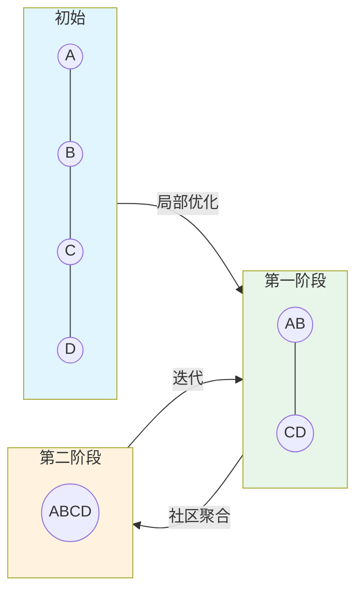

# 社区发现算法

> **难度级别**：进阶
> **预计阅读时间**：40 分钟
> **前置知识**：[中心性算法](./02-03-centrality-algorithms.md)、[图目录与图投影](./02-02-graph-catalog.md)

---

## 一、社区发现概念

社区发现（Community Detection）是图分析中识别网络内部群组结构的技术。现实世界中的网络往往呈现出"模块化"特征——节点不是均匀连接的，而是形成若干密集连接的群组（社区），群组内部连接紧密，群组之间连接稀疏。

社区发现的目标就是自动识别这些群组，无需预先指定群组数量或成员。这与传统的聚类分析（如 K-Means）有相似之处，但社区发现专门针对图结构数据，利用拓扑连接关系而非属性相似度进行分组。

理解社区发现的关键概念是**模块度（Modularity）**，它是衡量一个社区划分质量的指标：

```
Q = (1/2m) * Σ [ Aij - (ki * kj) / (2m) ] * δ(ci, cj)
```

其中 `Aij` 是邻接矩阵元素，`ki` 是节点 i 的度，`m` 是边总数，`δ(ci, cj)` 当 i 和 j 同属一社区时为 1 否则为 0。模块度 Q 越高，社区结构越明显，通常 Q > 0.3 表示有显著的社区结构。

| 概念 | 英文 | 含义 |
|------|------|------|
| 社区 | Community | 内部连接密集的节点群组 |
| 模块度 | Modularity | 社区划分质量的度量 |
| 层次聚类 | Hierarchical Clustering | 递归合并/分裂形成层次结构 |
| 标签传播 | Label Propagation | 通过邻居标签传播实现聚类 |

在图书情报领域，社区发现有着极其重要的应用。共词网络中的社区对应研究主题，引文网络中的社区对应学科领域，合作网络中的社区对应研究团队。传统上这些分析依赖聚类软件完成，GDS 把社区发现算法内置到数据库中，使得动态、大规模的社区分析成为可能。

---

## 二、Louvain 算法

Louvain 算法是目前最流行的社区发现算法之一，由比利时鲁汶大学（Université catholique de Louvain）的 Vincent Blondel 等人于 2008 年提出。它通过模块度优化实现层次聚类，兼顾效率与效果。

### 2.1 算法原理

Louvain 算法是一个迭代的两阶段过程：

**第一阶段：局部优化**
- 初始时每个节点自成一个社区；
- 对每个节点，尝试将其移入邻居所在的社区，计算模块度变化；
- 如果移入能增加模块度，则执行移动；否则保留原社区；
- 反复遍历所有节点，直到没有移动能增加模块度。

**第二阶段：社区聚合**
- 将同一社区的节点聚合为一个"超级节点"；
- 社区内的边变为超级节点的自环边，社区间的边变为超级节点间的边；
- 在新的聚合图上重复第一阶段。

这两个阶段交替进行，直到模块度不再增加。Louvain 的优势在于：时间复杂度接近线性 O(n)，适合大规模网络；层次聚合机制能发现不同粒度的社区结构。



### 2.2 关键参数

| 参数 | 英文 | 默认值 | 说明 |
|------|------|--------|------|
| `maxIterations` | Max Iterations | 10 | 每层最大迭代次数 |
| `maxLevels` | Max Levels | 10 | 最大层次数 |
| `tolerance` | Tolerance | 0.0001 | 收敛阈值 |
| `includeIntermediateCommunities` | Include Intermediate | false | 是否返回中间层次社区 |
| `relationshipWeightProperty` | Relationship Weight | 无 | 关系权重属性 |

### 2.3 Cypher 调用示例

```cypher
// 创建引文网络图投影
CALL gds.graph.project('citationGraph', 'Paper', {
    CITES: {orientation: 'UNDIRECTED'}
});

// stream 模式：查看社区划分
CALL gds.louvain.stream('citationGraph')
YIELD nodeId, communityId
RETURN gds.util.asNode(nodeId).title AS paper, communityId
ORDER BY communityId, paper;

// write 模式：将社区 ID 写回数据库
CALL gds.louvain.write('citationGraph', {
    writeProperty: 'researchCommunity'
})
YIELD communityCount, modularity, ranLevels;

// 查看社区统计
MATCH (p:Paper)
RETURN p.researchCommunity AS community,
       count(p) AS paperCount,
       collect(p.title)[0..3] AS samplePapers
ORDER BY paperCount DESC;

CALL gds.graph.drop('citationGraph');
```

---

## 三、Label Propagation（标签传播）

标签传播算法（Label Propagation Algorithm，LPA）是一种近乎线性的快速社区发现算法，由 Raghavan 等人于 2007 年提出。

### 3.1 算法原理

LPA 的思想极其简洁：

1. 初始时每个节点赋予唯一标签；
2. 每个节点采用其邻居中出现最频繁的标签；
3. 迭代传播直到标签稳定。

标签传播无需优化目标函数，完全依赖局部信息传播，因此速度极快。但结果可能不稳定——不同运行可能产生不同社区划分。

### 3.2 Louvain 与 LPA 对比

| 对比维度 | Louvain | Label Propagation |
|---------|---------|------------------|
| 优化目标 | 模块度最大化 | 无明确目标 |
| 时间复杂度 | O(n) | O(n) |
| 结果稳定性 | 高 | 较低 |
| 社区质量 | 高 | 中等 |
| 适用规模 | 大规模 | 超大规模 |
| 适合场景 | 需要高质量社区 | 需要快速预览 |

### 3.3 Cypher 调用示例

```cypher
CALL gds.graph.project('keywordGraph', 'Keyword', {
    CO_OCCURS: {orientation: 'UNDIRECTED'}
});

// 标签传播发现关键词社区（研究主题）
CALL gds.labelPropagation.write('keywordGraph', {
    writeProperty: 'topicCluster'
})
YIELD communityCount, ranIterations;

CALL gds.graph.drop('keywordGraph');
```

---

## 四、Connected Components（连通组件）

连通组件（Connected Components）算法识别图中互相可达的节点集合。在无向图中，如果节点 A 和 B 之间存在路径，则它们属于同一连通组件。这是最基础的社区发现——它不区分社区内部结构，只关注连通性。

### 4.1 算法原理

连通组件算法通过图遍历（BFS 或 DFS）标记所有可达节点，属于同一遍历集合的节点构成一个连通组件。

| 概念 | 英文 | 含义 |
|------|------|------|
| 连通图 | Connected Graph | 任意两节点间有路径 |
| 连通组件 | Connected Component | 极大连通子图 |
| 弱连通 | Weakly Connected | 忽略方向后连通 |
| 强连通 | Strongly Connected | 有向路径双向可达 |

### 4.2 Cypher 调用示例

```cypher
CALL gds.graph.project('coauthorGraph', 'Author', {
    CO_AUTHOR: {orientation: 'UNDIRECTED'}
});

// 识别合作网络中的孤立群组
CALL gds.wcc.write('coauthorGraph', {
    writeProperty: 'componentId'
})
YIELD componentCount;

// 查看各连通组件大小
MATCH (a:Author)
RETURN a.componentId AS component, count(a) AS size
ORDER BY size DESC LIMIT 10;

CALL gds.graph.drop('coauthorGraph');
```

---

## 五、Strongly Connected Components（强连通组件）

强连通组件（Strongly Connected Components，SCC）是有向图中的概念：如果一组节点中任意两个节点之间都存在有向路径（A 能到 B，B 也能到 A），则它们构成一个强连通组件。

### 5.1 应用场景

强连通组件在有向网络中有特殊意义。在引文网络中，强连通组件表示一组互相引用的论文——这通常意味着一个紧密的研究共识圈。在 Web 网络中，强连通组件表示互相链接的网页群。

```cypher
CALL gds.graph.project('citationGraph', 'Paper', 'CITES');

// 识别互相引用的论文群
CALL gds.scc.write('citationGraph', {
    writeProperty: 'sccId'
})
YIELD componentCount;

// 查找最大的强连通组件
MATCH (p:Paper)
WITH p.sccId AS scc, count(p) AS size, collect(p.title) AS papers
WHERE size > 1
RETURN scc, size, papers
ORDER BY size DESC;

CALL gds.graph.drop('citationGraph');
```

---

## 六、Triangle Counting 与 Local Clustering Coefficient

三角计数（Triangle Counting）和局部聚类系数（Local Clustering Coefficient）衡量网络的"团聚"程度，是社区结构分析的基础指标。

### 6.1 三角计数

三角形是三个互相连接的节点。一个网络中三角形越多，说明节点倾向于"抱团"，社区结构越明显。

### 6.2 局部聚类系数

节点 v 的局部聚类系数衡量 v 的邻居之间互连的程度：

```
CC(v) = 2 * Tv / [ kv * (kv - 1) ]
```

其中 `Tv` 是 v 参与的三角形数，`kv` 是 v 的度数。CC(v) = 1 表示 v 的所有邻居都互相连接（完全图），CC(v) = 0 表示 v 的邻居之间没有连接。

### 6.3 Cypher 调用示例

```cypher
CALL gds.graph.project('coauthorGraph', 'Author', {
    CO_AUTHOR: {orientation: 'UNDIRECTED'}
});

// 三角计数
CALL gds.triangleCount.write('coauthorGraph', {
    writeProperty: 'triangleCount'
})
YIELD triangleCount;

// 局部聚类系数
CALL gds.localClusteringCoefficient.stream('coauthorGraph')
YIELD nodeId, coefficient
RETURN gds.util.asNode(nodeId).name AS author, coefficient
ORDER BY coefficient DESC LIMIT 10;

CALL gds.graph.drop('coauthorGraph');
```

---

## 七、图像领域应用

社区发现算法在图像知识图谱分析中可用于图像聚类、场景分组、物体类别发现等任务。

### 7.1 图像聚类

在图像相似网络中，Louvain 可以自动发现图像群组——相似图像聚为同一社区，对应视觉主题或场景类别。

```cypher
// 场景：图像相似网络的自动聚类
CALL gds.graph.project('imageCluster', 'Image', {
    SIMILAR_TO: {
        orientation: 'UNDIRECTED',
        properties: ['score']
    }
});

CALL gds.louvain.write('imageCluster', {
    writeProperty: 'visualCluster',
    relationshipWeightProperty: 'score'
})
YIELD communityCount, modularity;

// 查看聚类结果
MATCH (img:Image)
RETURN img.visualCluster AS cluster,
       count(img) AS imageCount,
       collect(img.filename)[0..3] AS sampleImages
ORDER BY imageCount DESC;

CALL gds.graph.drop('imageCluster');
```

### 7.2 场景分组

在物体共现网络中，社区发现可以识别常见的物体组合模式——例如"桌椅电脑"社区、"花草树木"社区，对应不同的场景类型。

```cypher
// 场景：物体共现网络的场景分组
CALL gds.graph.project('objectCooccur', 'Object', {
    CO_OCCURS: {orientation: 'UNDIRECTED'}
});

CALL gds.louvain.stream('objectCooccur')
YIELD nodeId, communityId
RETURN communityId AS sceneType,
       collect(gds.util.asNode(nodeId).category) AS objects
ORDER BY size(objects) DESC;

CALL gds.graph.drop('objectCooccur');
```

### 7.3 应用场景汇总

| 算法 | 图像领域应用 | 价值 |
|------|------------|------|
| Louvain | 图像聚类、场景分组 | 发现视觉主题群组 |
| Label Propagation | 快速图像预分类 | 大规模快速分组 |
| Connected Components | 孤立图像检测 | 识别独立图像群 |
| Strongly Connected | 物体关系环路检测 | 发现循环依赖 |
| Triangle Counting | 场景紧密程度 | 评估场景一致性 |

---

## 八、与图书情报领域的关联

社区发现算法与图书情报领域的研究主题分析、学科边界识别等任务高度契合。

| 算法 | 传统 LIS 方法 | 图分析升级 |
|------|-------------|-----------|
| Louvain | 共词聚类、文献耦合聚类 | 基于图拓扑，无需预设簇数 |
| Label Propagation | 快速主题扫描 | 近乎线性复杂度 |
| Connected Components | 孤立文献检测 | 识别研究孤岛 |
| Triangle Counting | 合作紧密程度 | 量化合作网络密度 |
| 模块度 | 聚类质量评估 | 统一的质量度量 |

一个典型的图书情报应用：构建某学科的关键词共现网络，运行 Louvain 算法自动发现研究主题。与传统 K-Means 聚类相比，Louvain 无需预设主题数量，且能发现层次化的主题结构——大主题下细分小主题，这与学科体系的树状结构天然吻合。

另一个应用是在引文网络上运行社区发现，可以识别"无形学院"（Invisible College）——那些通过频繁引用形成紧密群体但可能没有正式组织关系的研究者社群。这是科学计量学的经典研究对象，而 GDS 让这种分析变得可计算、可复现。

---

## 小结

本章介绍了 GDS 提供的主要社区发现算法：Louvain（模块度优化的层次聚类）、Label Propagation（快速标签传播）、Connected Components（连通组件识别）、Strongly Connected Components（强连通组件）、Triangle Counting 与 Local Clustering Coefficient（团聚度度量）。这些算法从不同角度识别网络中的群组结构，在图像领域可用于图像聚类与场景分组，在图书情报领域可用于研究主题发现与学科边界识别。

> **下一步阅读**：建议继续阅读 [相似性算法](./02-05-similarity-algorithms.md)，学习如何用 Jaccard、KNN 等方法衡量节点相似度并构建相似图。
