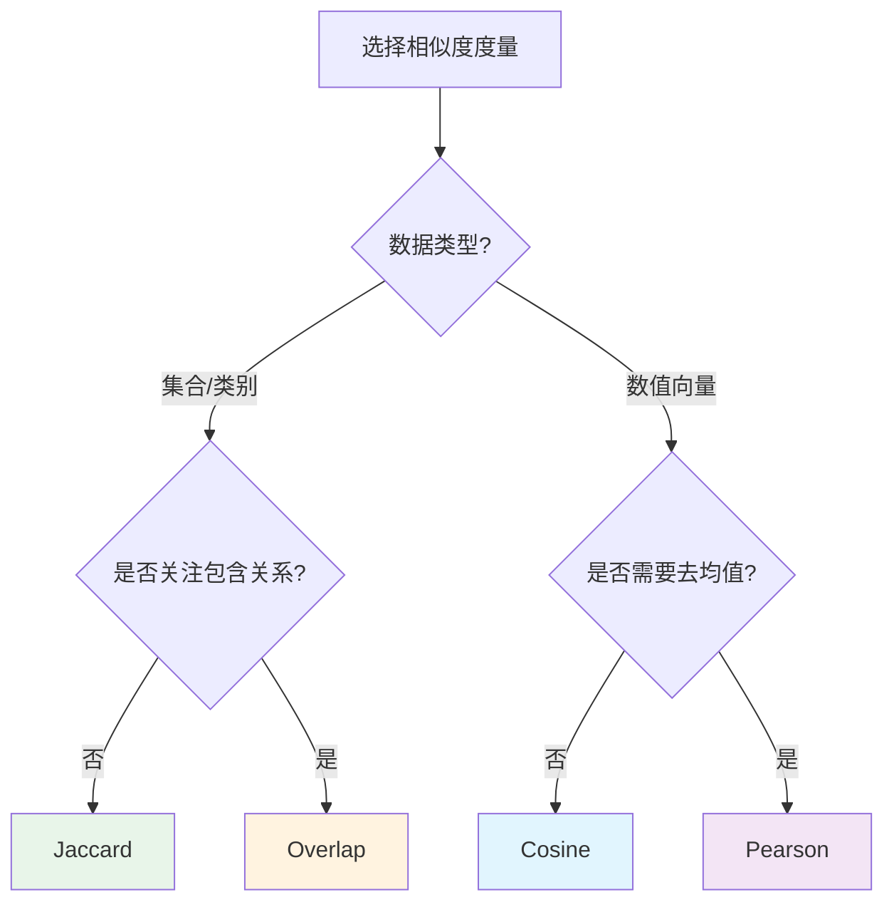

# 相似性算法

> **难度级别**：进阶
> **预计阅读时间**：35 分钟
> **前置知识**：[社区发现算法](./02-04-community-detection.md)、[图目录与图投影](./02-02-graph-catalog.md)

---

## 一、相似性计算在图分析中的作用

相似性（Similarity）是图分析中的核心概念。在前面的章节中，中心性算法衡量"谁重要"，社区发现算法衡量"谁属于一群"，而相似性算法则衡量"谁像谁"。这三类算法构成了图分析的三大支柱。

在图数据中，相似性可以从两个维度衡量：

1. **结构相似性（Structural Similarity）**：基于节点的连接模式判断相似。两个节点如果连接到相似的邻居集合，则它们在结构上相似。这是"物以类聚"的图论表达。
2. **属性相似性（Attribute Similarity）**：基于节点的属性值判断相似。两个节点如果属性值接近（如嵌入向量余弦相似度高），则它们在属性上相似。

GDS 的相似性算法主要关注结构相似性，并提供了构建"相似图"的能力——即把相似度高的节点用边连接起来，形成新的图结构，用于后续分析。

| 相似性维度 | 衡量依据 | 典型方法 | 应用 |
|-----------|---------|---------|------|
| 结构相似性 | 邻居集合 | Jaccard、Overlap | 推荐系统、链接预测 |
| 属性相似性 | 属性向量 | Cosine、Pearson | 语义检索、聚类 |
| 混合相似性 | 结构 + 属性 | KNN（带属性） | 综合推荐 |

在图书情报领域，相似性计算是信息检索的核心。文献耦合（Bibliographic Coupling）和共被引分析（Co-citation Analysis）本质上就是基于引文结构的相似性计算。GDS 把这些分析方法算法化、工程化，使其能在大规模数据上高效运行。

---

## 二、Node Similarity（节点相似性）

Node Similarity 是 GDS 提供的基于结构相似性的算法，它通过比较节点的邻居集合来计算相似度，并构建相似关系。

### 2.1 算法原理

Node Similarity 算法的核心是比较节点的邻居集合。给定两个节点 A 和 B，它们的邻居集合分别为 N(A) 和 N(B)，常用的相似度度量有：

- **Jaccard 相似度**：|N(A) ∩ N(B)| / |N(A) ∪ N(B)|，交集除以并集；
- **Overlap 相似度**：|N(A) ∩ N(B)| / min(|N(A)|, |N(B)|)，交集除以较小集合；
- **Cosine 相似度**：|N(A) ∩ N(B)| / sqrt(|N(A)| * |N(B)|)，交集除以几何平均。

算法流程：

1. 对每个节点，收集其邻居集合；
2. 对每对节点，计算邻居集合的相似度；
3. 保留相似度超过阈值的节点对，创建相似关系。

### 2.2 关键参数

| 参数 | 英文 | 默认值 | 说明 |
|------|------|--------|------|
| `similarityMetric` | Similarity Metric | JACCARD | 相似度度量方法 |
| `similarityCutoff` | Similarity Cutoff | 0 | 相似度阈值 |
| `topK` | Top K | 10 | 每个节点保留的最相似邻居数 |
| `degreeCutoff` | Degree Cutoff | 0 | 节点最小度数过滤 |

### 2.3 Cypher 调用示例

```cypher
// 创建作者-论文二部图投影
CALL gds.graph.project('authorPaper', ['Author', 'Paper'], {
    WROTE: {orientation: 'UNDIRECTED'}
});

// 计算作者间的结构相似性（基于共同写作的论文）
CALL gds.nodeSimilarity.write('authorPaper', {
    writeRelationshipType: 'SIMILAR_AUTHOR',
    writeProperty: 'similarity',
    similarityMetric: 'JACCARD',
    similarityCutoff: 0.2,
    topK: 5
})
YIELD nodesCompared, relationshipsWritten;

// 查看最相似的作者对
MATCH (a1:Author)-[r:SIMILAR_AUTHOR]->(a2:Author)
RETURN a1.name, a2.name, r.similarity
ORDER BY r.similarity DESC LIMIT 10;

CALL gds.graph.drop('authorPaper');
```

这个示例实现了文献耦合分析——两个作者如果合写了大量共同论文，他们的结构相似度就高。这是图书情报领域经典的作者相似性度量方法。

---

## 三、K-Nearest Neighbors（KNN）

K-Nearest Neighbors（KNN，K 近邻）算法在 GDS 中用于构建基于节点属性的相似图。与 Node Similarity 基于结构不同，KNN 基于节点的数值属性计算相似度。

### 3.1 算法原理

KNN 算法的工作流程：

1. 读取每个节点的属性向量（如嵌入向量）；
2. 对每对节点计算属性向量的相似度（如余弦相似度）；
3. 为每个节点选取相似度最高的 K 个邻居；
4. 创建 K 近邻关系。

GDS 的 KNN 实现采用了高效的近似算法，避免了 O(n²) 的全对比，适合大规模节点集。

### 3.2 关键参数

| 参数 | 英文 | 默认值 | 说明 |
|------|------|--------|------|
| `topK` | Top K | 10 | 每个节点保留的近邻数 |
| `nodeProperties` | Node Properties | 必填 | 用于计算相似度的属性 |
| `sampleRate` | Sample Rate | 0.5 | 采样率（近似计算） |
| `perInitialSampler` | Initial Sampler | 100 | 初始采样数 |
| `concurrency` | Concurrency | 4 | 并发度 |

### 3.3 Cypher 调用示例

```cypher
// 前提：论文节点已有 embedding 属性（如图嵌入结果）
CALL gds.graph.project('paperEmbeddings', 'Paper', '*', {
    nodeProperties: ['embedding']
});

// 基于嵌入向量构建 KNN 相似图
CALL gds.knn.write('paperEmbeddings', {
    topK: 10,
    nodeProperties: ['embedding'],
    writeRelationshipType: 'SIMILAR_PAPER',
    writeProperty: 'score'
})
YIELD nodesCompared, relationshipsWritten;

// 查询与某论文最相似的 5 篇论文
MATCH (p1:Paper {title: "Graph Neural Networks: A Review"})
      -[r:SIMILAR_PAPER]->(p2:Paper)
RETURN p2.title, r.score
ORDER BY r.score DESC LIMIT 5;

CALL gds.graph.drop('paperEmbeddings');
```

---

## 四、相似度度量方法对比

GDS 支持多种相似度度量方法，下表对比了它们的特点和适用场景。

| 度量方法 | 英文 | 公式 | 取值范围 | 特点 | 适用场景 |
|---------|------|------|---------|------|---------|
| Jaccard | Jaccard Index | 交集 / 并集 | [0, 1] | 对集合大小敏感 | 稀疏集合、推荐 |
| Cosine | Cosine Similarity | 点积 / (范数积) | [0, 1] 或 [-1,1] | 关注方向 | 向量相似、文本 |
| Pearson | Pearson Correlation | 协方差 / (标准差积) | [-1, 1] | 去均值化 | 相关性分析 |
| Overlap | Overlap Coefficient | 交集 / min(集合) | [0, 1] | 偏向包含关系 | 层次关系、本体 |

### 4.1 度量方法选择指南



### 4.2 度量方法直观示例

假设有三篇论文，它们的参考文献集合如下：

```
论文 A 的引用: {P1, P2, P3, P4}
论文 B 的引用: {P3, P4, P5, P6}
论文 C 的引用: {P1, P2, P3, P4, P5, P6}
```

A 与 B 的相似度：

| 度量方法 | 计算 | 结果 |
|---------|------|------|
| Jaccard | {P3,P4} / {P1,P2,P3,P4,P5,P6} | 0.33 |
| Overlap | {P3,P4} / min(4,4) | 0.50 |
| Cosine | {P3,P4} / sqrt(4*4) | 0.50 |

A 与 C 的相似度：

| 度量方法 | 计算 | 结果 |
|---------|------|------|
| Jaccard | {P1,P2,P3,P4} / {P1,P2,P3,P4,P5,P6} | 0.67 |
| Overlap | {P1,P2,P3,P4} / min(4,6) | 1.00 |
| Cosine | {P1,P2,P3,P4} / sqrt(4*6) | 0.82 |

可以看到，Overlap 对"A 完全包含于 C"的情况给出满分 1.0，而 Jaccard 和 Cosine 则更为保守。这就是为什么 Overlap 适合层次关系分析（如本体中的父子类），而 Jaccard 更适合对等的推荐场景。

---

## 五、图像领域应用

相似性算法在图像领域有广泛的应用，特别是在相似图像检索和相关物体推荐方面。

### 5.1 相似图像检索

通过图像知识图谱中的物体共现结构，Node Similarity 可以发现"内容相似"的图像——即使它们没有直接的视觉相似关系，只要包含相似的物体组合，就会被判定为相似。

```cypher
// 场景：基于物体结构相似性的图像检索
CALL gds.graph.project('imageObjects', ['Image', 'Object'], {
    DETECTS: {orientation: 'UNDIRECTED'}
});

// 计算图像间的结构相似性（基于共同检测的物体）
CALL gds.nodeSimilarity.write('imageObjects', {
    writeRelationshipType: 'CONTENT_SIMILAR',
    writeProperty: 'structuralSim',
    similarityMetric: 'JACCARD',
    similarityCutoff: 0.3,
    topK: 5
})
YIELD relationshipsWritten;

// 查询与指定图像内容相似的图像
MATCH (img1:Image {filename: "img001.jpg"})
      -[r:CONTENT_SIMILAR]->(img2:Image)
RETURN img2.filename, r.structuralSim
ORDER BY r.structuralSim DESC;

CALL gds.graph.drop('imageObjects');
```

### 5.2 相关物体推荐

基于物体的共现模式，可以发现"经常一起出现"的物体对，用于物体关系补全和场景理解。

```cypher
// 场景：基于共现的物体关联推荐
CALL gds.graph.project('objectCooccur', 'Object', {
    CO_OCCURS: {orientation: 'UNDIRECTED'}
});

CALL gds.nodeSimilarity.stream('objectCooccur', {
    similarityMetric: 'JACCARD',
    topK: 3
})
YIELD node1, node2, similarity
RETURN gds.util.asNode(node1).category AS object1,
       gds.util.asNode(node2).category AS object2,
       similarity
ORDER BY similarity DESC LIMIT 10;

CALL gds.graph.drop('objectCooccur');
```

### 5.3 基于嵌入的图像相似检索

如果图像节点存储了视觉嵌入向量，可以用 KNN 算法进行高效的相似检索，这是"以图搜图"的图数据库实现。

```cypher
// 场景：基于视觉嵌入的以图搜图
CALL gds.graph.project('imageEmbeddings', 'Image', '*', {
    nodeProperties: ['embedding']
});

CALL gds.knn.write('imageEmbeddings', {
    topK: 10,
    nodeProperties: ['embedding'],
    writeRelationshipType: 'VISUALLY_SIMILAR',
    writeProperty: 'visualScore'
});

CALL gds.graph.drop('imageEmbeddings');
```

---

## 六、Node Similarity 与 KNN 对比

| 对比维度 | Node Similarity | KNN |
|---------|----------------|-----|
| 相似性基础 | 结构（邻居集合） | 属性（数值向量） |
| 计算复杂度 | 依赖邻居重叠度 | 依赖向量维度和采样 |
| 是否需要属性 | 否 | 是（数值属性） |
| 适用数据 | 二部图、稀疏图 | 带嵌入向量的图 |
| 典型应用 | 文献耦合、共被引 | 语义检索、以图搜图 |

两者可以组合使用：先用 Node Similarity 发现结构相似性，再用 KNN 发现属性相似性，综合两者得到更全面的相似度评估。

---

## 七、与图书情报领域的关联

相似性算法与图书情报领域的信息检索、文献耦合、共被引分析等方法有着深层的对应关系。

| GDS 算法 | 传统 LIS 方法 | 对应关系 |
|---------|-------------|---------|
| Node Similarity (Jaccard) | 文献耦合 | 基于共同参考文献的论文相似性 |
| Node Similarity (Jaccard) | 共被引分析 | 基于共同引用者的论文相似性 |
| Node Similarity (Overlap) | 本体相似度 | 基于父类层次的概念相似性 |
| KNN (Cosine) | 向量空间模型检索 | 基于嵌入向量的语义相似性 |
| KNN (Pearson) | 相关性分析 | 变量间线性相关 |

文献耦合（Bibliographic Coupling）是 Kessler 于 1963 年提出的经典方法：两篇论文如果引用了相同的参考文献，则它们在主题上相似。这本质上就是 Node Similarity 在二部图上的应用——论文通过"引用"关系连接到参考文献，两篇论文的共同邻居（共同引用的文献）越多，相似度越高。GDS 的 Node Similarity 算法正是这一思想的工程实现，但能在千万级论文的网络上高效运行。

一个实际的研究示例：对某领域的论文构建引文网络，运行 Node Similarity 算法，可以得到一个"论文相似图"。这个相似图可以用于：
- 论文推荐系统：为读者推荐与其已读论文相似的新论文；
- 研究前沿识别：相似度高的论文群构成研究前沿；
- 综述生成：识别覆盖某主题的核心论文集。

---

## 小结

本章介绍了 GDS 的相似性算法：Node Similarity（基于邻居集合的结构相似性）和 KNN（基于属性向量的相似性）。Node Similarity 适合基于连接模式的相似度计算，KNN 适合基于嵌入向量的语义相似度计算。GDS 支持四种相似度度量（Jaccard、Cosine、Pearson、Overlap），各有适用场景。在图像领域，相似性算法可实现相似图像检索和相关物体推荐；在图书情报领域，它们是文献耦合和共被引分析的现代化实现。

> **下一步阅读**：建议继续阅读 [路径查找算法](./02-06-pathfinding-algorithms.md)，学习如何用 Dijkstra、A* 等算法寻找最优路径。
