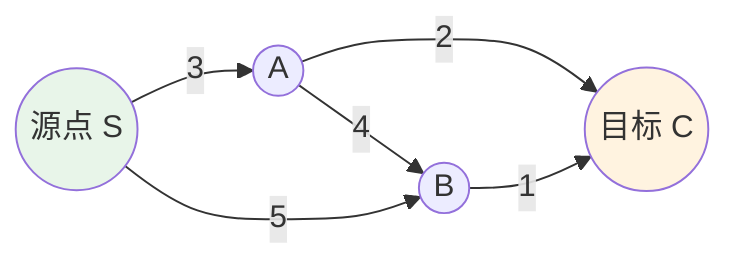

# 路径查找算法

> **难度级别**：进阶
> **预计阅读时间**：40 分钟
> **前置知识**：[相似性算法](./02-05-similarity-algorithms.md)、[图论基础概念](../01-foundations/01-01-graph-theory-basics.md)

---

## 一、路径问题类型

路径查找（Path Finding）是图分析中最古老也最实用的算法族。从 GPS 导航到网络路由，从学术传承追踪到知识推理，路径查找无处不在。

在图分析中，路径问题可以分为几类：

| 问题类型 | 英文 | 问题描述 | 典型算法 |
|---------|------|---------|---------|
| 最短路径 | Shortest Path | 两点间权重和最小的路径 | Dijkstra |
| 启发式最短路径 | Heuristic Shortest Path | 利用启发信息加速搜索 | A* |
| K 条最短路径 | K Shortest Paths | 找前 K 条最短路径 | Yen's |
| 单源最短路径 | Single-Source Shortest Path | 一个源点到所有其他节点 | Dijkstra（全图） |
| 全对最短路径 | All-Pairs Shortest Path | 所有节点对之间的最短路径 | Floyd-Warshall |
| 图遍历 | Graph Traversal | 系统访问所有节点 | BFS、DFS |

理解路径问题的关键在于区分"跳数最少"和"权重最小"：

- **跳数最少（Fewest Hops）**：不考虑权重，只数经过的边数。适合关系均匀的网络，如社交网络中的"几度分隔"。
- **权重最小（Minimum Weight）**：考虑边的权重，寻找总权重最小的路径。适合有权重的网络，如带距离的地理网络。

Cypher 本身已提供 `shortestPath` 和 `allShortestPaths` 函数，但它们基于跳数。GDS 的路径算法支持权重计算，且在内存图上运行效率更高。

---

## 二、Dijkstra 算法

Dijkstra 算法由荷兰计算机科学家 Edsger W. Dijkstra 于 1959 年提出，是解决加权最短路径问题的经典算法。

### 2.1 算法原理

Dijkstra 算法采用贪心策略，从源点出发逐步扩展最短路径树：

1. 初始化：源点距离设为 0，其他节点距离设为无穷大；
2. 选择当前距离最小的未访问节点；
3. 更新该节点所有邻居的距离（如果经过当前节点更近，则更新）；
4. 标记当前节点为已访问；
5. 重复步骤 2-4，直到目标节点被访问或所有节点都被访问。

Dijkstra 要求所有边的权重非负，这是保证贪心策略正确性的前提。



在上图中，S 到 C 的最短路径是 S→A→C（权重 3+2=5），而非 S→B→C（权重 5+1=6）。

### 2.2 关键参数

| 参数 | 英文 | 默认值 | 说明 |
|------|------|--------|------|
| `sourceNode` | Source Node | 必填 | 源节点 |
| `targetNode` | Target Node | 必填 | 目标节点 |
| `relationshipWeightProperty` | Weight Property | 必填 | 权重属性名 |

### 2.3 Cypher 调用示例

```cypher
// 创建带权重的引文网络图投影
CALL gds.graph.project('weightedCitation', 'Paper', {
    CITES: {
        properties: ['influenceWeight']   // 引用影响力作为权重
    }
});

// 查找两篇论文之间的加权最短路径
MATCH (p1:Paper {title: "Deep Learning"}),
      (p2:Paper {title: "Graph Attention Networks"})
CALL gds.shortestPath.dijkstra.stream('weightedCitation', {
    sourceNode: p1,
    targetNode: p2,
    relationshipWeightProperty: 'influenceWeight'
})
YIELD index, sourceNode, targetNode, totalCost, nodeIds, costs, path
RETURN index,
       totalCost,
       [nodeId IN nodeIds | gds.util.asNode(nodeId).title] AS pathTitles,
       costs;

CALL gds.graph.drop('weightedCitation');
```

---

## 三、A* 算法

A*（A-star）算法是 Dijkstra 的改进版，由 Peter Hart 等人于 1968 年提出。它通过引入启发式函数（Heuristic Function）来引导搜索方向，显著减少搜索空间。

### 3.1 算法原理

A* 算法评估每个节点的"代价"为两部分之和：

```
f(n) = g(n) + h(n)
```

其中 `g(n)` 是从源点到节点 n 的实际代价，`h(n)` 是从节点 n 到目标点的估计代价（启发式估计）。

如果 `h(n)` 永远不超过实际最短距离（即启发式是"可采纳的"），A* 能保证找到最优解。当 `h(n) = 0` 时，A* 退化为 Dijkstra。

### 3.2 Dijkstra 与 A* 对比

| 对比维度 | Dijkstra | A* |
|---------|---------|-----|
| 搜索策略 | 全向扩展 | 启发式引导 |
| 是否需要目标 | 单源全图或单目标 | 需要明确目标 |
| 启发式函数 | 无 | 必需 |
| 搜索空间 | 大 | 小（如果启发式好） |
| 适用场景 | 单源多目标 | 明确的源-目标对 |
| 最优性 | 保证 | 保证（启发式可采纳时） |

### 3.3 Cypher 调用示例

```cypher
CALL gds.graph.project('weightedCitation', 'Paper', {
    CITES: {properties: ['influenceWeight']}
});

// A* 算法（需要提供 latitude/longitude 等坐标属性作为启发式）
// 在引文网络中通常使用 Dijkstra，A* 更适合地理网络
MATCH (p1:Paper {title: "Deep Learning"}),
      (p2:Paper {title: "Graph Attention Networks"})
CALL gds.allShortestPaths.delta.stream('weightedCitation', {
    sourceNode: p1,
    targetNode: p2,
    relationshipWeightProperty: 'influenceWeight',
    delta: 3.0
})
YIELD sourceNodeId, targetNodeId, totalCost, nodeIds
RETURN totalCost,
       [nodeId IN nodeIds | gds.util.asNode(nodeId).title] AS path;

CALL gds.graph.drop('weightedCitation');
```

---

## 四、Yen's Algorithm（K 条最短路径）

Yen's 算法由 Jin Y. Yen 于 1971 年提出，用于寻找图中两节点之间的 K 条最短路径。当我们不仅想知道最优路径，还想知道次优、第三优路径时，Yen's 算法就派上用场了。

### 4.1 算法原理

Yen's 算法基于 Dijkstra，通过以下步骤找到 K 条路径：

1. 用 Dijkstra 找到第 1 条最短路径；
2. 对于每条已找到的路径，依次"禁止"其中的某条边，重新运行 Dijkstra 找候选路径；
3. 从候选路径中选择最短的作为下一条最短路径；
4. 重复直到找到 K 条路径。

### 4.2 Cypher 调用示例

```cypher
CALL gds.graph.project('weightedCitation', 'Paper', {
    CITES: {properties: ['influenceWeight']}
});

// 查找两篇论文之间的 3 条最短路径
MATCH (p1:Paper {title: "Deep Learning"}),
      (p2:Paper {title: "Graph Attention Networks"})
CALL gds.shortestPath.yens.stream('weightedCitation', {
    sourceNode: p1,
    targetNode: p2,
    k: 3,
    relationshipWeightProperty: 'influenceWeight'
})
YIELD index, totalCost, nodeIds
RETURN index AS pathRank,
       totalCost,
       [nodeId IN nodeIds | gds.util.asNode(nodeId).title] AS path;

CALL gds.graph.drop('weightedCitation');
```

K 条最短路径在学术传承分析中很有价值——它不仅能找到两篇论文之间最主要的学术关联路径，还能发现备选的关联路径，帮助研究者理解知识的多元传播渠道。

---

## 五、BFS 与 DFS

广度优先搜索（BFS，Breadth-First Search）和深度优先搜索（DFS，Depth-First Search）是两种基础的图遍历算法，它们是许多高级算法的基础。

### 5.1 算法对比

| 对比维度 | BFS | DFS |
|---------|-----|-----|
| 英文全称 | Breadth-First Search | Depth-First Search |
| 遍历策略 | 逐层扩展 | 一路深入再回溯 |
| 数据结构 | 队列（FIFO） | 栈（LIFO） |
| 是否找最短路径 | 是（无权图） | 否 |
| 适用场景 | 最短跳数路径、层次分析 | 连通性检测、拓扑排序 |
| GDS 函数 | `gds.bfs` | `gds.dfs` |

### 5.2 Cypher 调用示例

```cypher
CALL gds.graph.project('citationGraph', 'Paper', 'CITES');

// BFS：从某论文出发的广度优先遍历（限制深度）
MATCH (p:Paper {title: "Deep Learning"})
CALL gds.bfs.stream('citationGraph', {
    sourceNode: p,
    maxDepth: 3
})
YIELD path
RETURN [node IN nodes(path) | gds.util.asNode(node).title] AS bfsPath
LIMIT 5;

// DFS：深度优先遍历
MATCH (p:Paper {title: "Deep Learning"})
CALL gds.dfs.stream('citationGraph', {
    sourceNode: p,
    maxDepth: 3
})
YIELD path
RETURN [node IN nodes(path) | gds.util.asNode(node).title] AS dfsPath
LIMIT 5;

CALL gds.graph.drop('citationGraph');
```

---

## 六、图像领域应用

路径查找算法在图像知识图谱中可用于图像关联路径分析和知识推理路径发现。

### 6.1 图像关联路径分析

在图像知识图谱中，两幅图像可能通过多个中间物体间接关联。路径查找算法可以发现这些关联路径，揭示图像间的深层联系。

```cypher
// 场景：发现两幅图像之间的语义关联路径
CALL gds.graph.project('imageGraph', ['Image', 'Object', 'Category'], {
    DETECTS: {orientation: 'NATURAL'},
    IS_A: {orientation: 'NATURAL'},
    SIMILAR_TO: {orientation: 'UNDIRECTED', properties: ['score']}
});

// 用 BFS 找最短关联路径
MATCH (img1:Image {filename: "img001.jpg"}),
      (img2:Image {filename: "img002.jpg"})
CALL gds.bfs.stream('imageGraph', {
    sourceNode: img1,
    targetNode: img2,
    maxDepth: 6
})
YIELD path
RETURN [n IN nodes(path) | coalesce(n.filename, n.object_id, n.name)] AS associationPath,
       [r IN relationships(path) | type(r)] AS relations;

CALL gds.graph.drop('imageGraph');
```

### 6.2 知识推理路径

在物体关系网络中，路径查找可以辅助知识推理——发现物体 A 到物体 B 之间的推理链条，用于补全缺失的关系。

```cypher
// 场景：发现物体间的推理路径
CALL gds.graph.project('objectRelations', 'Object', {
    HOLDING: {orientation: 'UNDIRECTED', properties: ['confidence']},
    SITTING_ON: {orientation: 'UNDIRECTED', properties: ['confidence']},
    LEFT_OF: {orientation: 'UNDIRECTED', properties: ['confidence']}
});

// 用 Dijkstra 找置信度最高的关联路径
MATCH (o1:Object {object_id: "obj001"}),
      (o2:Object {object_id: "obj005"})
CALL gds.shortestPath.dijkstra.stream('objectRelations', {
    sourceNode: o1,
    targetNode: o2,
    relationshipWeightProperty: 'confidence'
})
YIELD totalCost, nodeIds
RETURN totalCost,
       [nodeId IN nodeIds | gds.util.asNode(nodeId).category] AS objectPath;

CALL gds.graph.drop('objectRelations');
```

### 6.3 应用场景汇总

| 算法 | 图像领域应用 | 价值 |
|------|------------|------|
| Dijkstra | 物体关联路径（带置信度） | 发现最强关联链 |
| A* | 地理空间图像路径 | 启发式加速 |
| Yen's | 多条关联路径 | 多元关联发现 |
| BFS | 最短关联路径 | 最少中介的关联 |
| DFS | 物体关系深度遍历 | 完整关系链探索 |

---

## 七、各算法适用场景对比表

下表系统对比了 GDS 路径查找算法的适用场景，帮助读者根据需求选择算法。

| 算法 | 问题类型 | 是否支持权重 | 是否需要目标节点 | 时间复杂度 | 适用场景 |
|------|---------|------------|---------------|-----------|---------|
| Dijkstra | 单源最短路径 | 是 | 否（单源）/是（单目标） | O((n+m)log n) | 加权最短路径 |
| A* | 启发式最短路径 | 是 | 是 | 依赖启发式质量 | 地理导航、明确目标 |
| Yen's | K 条最短路径 | 是 | 是 | O(k*n*(n+m)log n) | 多路径选择、容错 |
| BFS | 最短跳数 | 否 | 否 | O(n+m) | 无权图最短路径 |
| DFS | 图遍历 | 否 | 否 | O(n+m) | 连通性、环检测 |
| Delta-Stepping | 并行最短路径 | 是 | 否 | 并行优化 | 大规模并行计算 |

---

## 八、与图书情报领域的关联

路径查找算法与图书情报领域的引文追踪、学术传承分析、知识扩散研究等任务密切相关。

| GDS 算法 | 传统 LIS 应用 | 图分析价值 |
|---------|-------------|-----------|
| Dijkstra | 引文加权路径 | 考虑引用质量的传承路径 |
| Yen's | 多元学术关联 | 发现多条知识传播路径 |
| BFS | 引文追溯（最少跳数） | 最近学术关联 |
| DFS | 引文链完整追溯 | 完整知识树 |

一个经典的应用场景是"学术传承路径分析"：给定两位学者 A 和 B，找到他们之间通过师生关系或引用关系连接的最短路径。这类似于社交网络中的"六度分隔"理论，但在学术网络中，这种路径反映了知识的代际传承。

另一个应用是"知识扩散路径"：追踪一个概念或方法从提出到被广泛采用的传播路径。通过在概念共现网络上运行路径查找算法，可以可视化知识的扩散轨迹，这是情报学（Informetrics）的经典研究主题。

与 Cypher 原生的 `shortestPath` 相比，GDS 路径算法的优势在于：支持权重计算（而不只是跳数）、支持 K 条路径、在内存图上运行效率更高、支持更复杂的过滤条件。对于需要精确控制路径搜索行为的场景，GDS 是更好的选择。

---

## 小结

本章介绍了 GDS 提供的路径查找算法：Dijkstra（加权最短路径）、A*（启发式最短路径）、Yen's（K 条最短路径）、BFS（广度优先遍历）和 DFS（深度优先遍历）。这些算法解决不同类型的路径问题，从最简单的最短跳数到复杂的加权 K 条路径。在图像领域，路径算法可发现图像间的语义关联路径；在图书情报领域，它们是引文追踪和学术传承分析的有力工具。

> **下一步阅读**：建议继续阅读 [GDS 实战操作指南](./02-07-gds-practice.md)，通过一个完整的工作流演示将所有算法串联起来。
