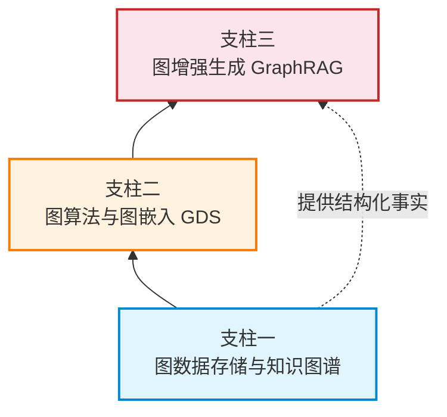
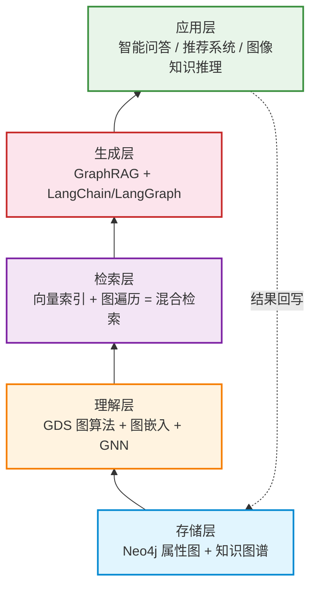

# 图原生 AI 概念解析

> **难度级别**：进阶
> **预计阅读时间**：40 分钟
> **前置知识**：[Neo4j 架构与存储引擎](../01-foundations/01-03-neo4j-architecture.md)、[GDS 总体介绍](../02-graph-data-science/02-01-gds-overview.md)

---

## 一、什么是图原生 AI

图原生 AI（Graph-Native AI）是 Neo4j 公司在 2023 年前后系统提出的一种技术范式（Technical Paradigm），其核心主张是：**以图结构作为人工智能系统的第一性数据结构**，让模型在感知、检索、推理的整个生命周期中持续地"看见"数据之间的关系，而不是把关系压缩成表格行或稠密张量后再交给模型去"猜测"。

需要特别强调的是，"图原生"中的"原生"（Native）一词与 Neo4j 所倡导的"原生图数据库"（Native Graph Database）一脉相承。原生图数据库指的是存储引擎在物理层面即以图的方式组织数据（无索引邻接、关系指针直接寻址），而非在关系型存储之上叠加图查询层。同理，图原生 AI 指的是 AI 工作流在设计之初即以图结构为中心来组织数据流、检索流与生成流，而不是在以表格/张量为中心的流程之外"事后补一个知识图谱"。

从工程哲学的角度看，图原生 AI 试图回答一个根本问题：当大语言模型（Large Language Model，LLM）已经具备强大的语言理解与生成能力时，如何让它"言之有据、推之有路"？Neo4j 给出的答案是——把结构化的事实与关系以图的形式持久化存储，并在检索与生成环节持续地把图的子结构（Subgraph）注入到模型上下文中。这就是本模块后续要展开的 GraphRAG、向量索引、混合检索、生成式 AI 集成等主题的共同出发点。

---

## 二、核心理念：图结构作为 AI 的基础数据结构

图原生 AI 的核心理念可以凝练为一句话：**关系即数据，上下文即图**。

传统 AI 把世界抽象为"样本—特征"矩阵：每一条样本是表格中的一行，特征是列，样本之间的关系被丢弃或仅以隐式方式（如协同过滤中的用户—物品矩阵）表达。这种抽象在处理独立同分布（i.i.d.）的样本时是高效的，但在真实世界中，实体之间普遍存在着引用、共现、隶属、因果、时空邻近等丰富的关系结构，强行将这些关系展平为表格会造成巨大的信息损失。

图原生 AI 则主张：

1. **显式建模关系**：把实体作为节点（Node），把关系作为边（Edge），关系本身可以带属性（Property），从而保留关系的类型、强度、时序等元信息；
2. **以子图为上下文单元**：在向模型提供上下文时，以"子图"（Subgraph）而非"文档片段"为单位，让模型同时获得实体、关系及其邻域结构；
3. **结构化的事实验证**（Grounding）：模型生成的每一个陈述都应能回溯到图中的具体节点与边，从而实现可验证、可追溯的生成。

这种理念与图书情报领域对"知识组织"（Knowledge Organization）的追求高度一致。传统叙词表（Thesaurus）、本体（Ontology）、分类法（Classification Scheme）本质上都是图结构的知识表示，图原生 AI 可以被视为这些经典知识组织工具在生成式 AI 时代的工程化延续。

---

## 三、图原生 AI 与传统 AI 的区别

理解图原生 AI，最直观的方式是将其与传统 AI 范式进行对比。下表从数据表示、上下文构造、推理方式等多个维度展开。

| 对比维度 | 传统 AI（表格/张量为中心） | 图原生 AI（图结构为中心） |
|---------|--------------------------|--------------------------|
| 基础数据结构 | 二维表、稠密/稀疏张量 | 属性图（节点+边+属性） |
| 关系处理方式 | 展平为特征列或外键，关系信息易丢失 | 关系作为一等实体显式存储与遍历 |
| 上下文构造 | 文档片段拼接、定长 token 窗口 | 子图提取，保留拓扑结构 |
| 检索方式 | 关键词匹配、向量相似度 | 向量相似度 + 图遍历（多跳） |
| 推理能力 | 单步相似度匹配为主 | 多跳推理、路径推理、结构推理 |
| 事实依据 | 难以追溯，易产生幻觉 | 结构化事实 grounding，可追溯 |
| 适合的数据空间 | 欧几里得数据（Euclidean Data），如图像、表格 | 非欧几里得数据（Non-Euclidean Data），如社交网络、引文网络 |
| 典型代表 | 经典 ML、CNN/RNN、纯向量 RAG | GraphRAG、图神经网络、知识图谱增强 LLM |

一个关键的区别在于"上下文的形状"。传统 RAG（Retrieval-Augmented Generation，检索增强生成）给模型的上下文本质上是若干文本块的线性拼接，模型需要从平铺的文字中自行推断实体间关系；而图原生 AI 给模型的上下文是一张"关系网"，实体间的连接是显式的，模型只需"读懂"这张网即可进行结构化推理。

---

## 四、图原生 AI 的三大支柱

Neo4j 在阐述图原生 AI 时，通常将其分解为三大相互支撑的技术支柱。这三根支柱从底层数据存储到顶层智能生成，构成了完整的技术栈。

### 4.1 支柱一：图数据存储与知识图谱

第一根支柱是图数据存储，即以属性图模型持久化存储实体与关系，并在此基础上构建知识图谱（Knowledge Graph，KG）。知识图谱是图原生 AI 的"事实底座"，它提供了：

- **结构化事实**：以三元组（主语—谓词—宾语）形式存储事实，可被精确查询与验证；
- **模式约束**（Schema）：可选的模式定义保证数据质量，支持推理与一致性检查；
- **统一标识**：同一实体在不同来源中出现时可在图中合并为同一节点，消除歧义。

在图书情报领域，知识图谱对应着本体、叙词表、关联数据（Linked Data）等成熟概念。把 MARC 记录、规范文档（Authority File）、主题词表迁移为知识图谱，是图原生 AI 落地该领域的基础工作。

### 4.2 支柱二：图算法与图嵌入（GDS）

第二根支柱是图数据科学能力，即通过 GDS 提供的图算法与图嵌入（Graph Embedding）对图结构进行计算与向量化。这根支柱解决的是"如何让机器理解图结构"的问题：

- **图算法**：PageRank、社区发现、相似度等算法从拓扑层面提取结构特征；
- **图嵌入**：Node2Vec、FastRP、GraphSAGE 等方法将节点/子图映射为低维向量，使图结构能够参与向量检索与神经网络计算；
- **图神经网络**（Graph Neural Network，GNN）：在嵌入基础上进一步学习节点与边的表示，支持节点分类、链路预测等任务。

图嵌入是连接"图"与"AI"的关键桥梁——它让原本只能被 Cypher 遍历的图结构，转化为可以与 LLM 嵌入空间对齐的向量，从而使向量检索与图遍历得以在同一框架内协同工作。

### 4.3 支柱三：图增强生成（GraphRAG）

第三根支柱是图检索增强生成（Graph Retrieval-Augmented Generation，GraphRAG），它把前两根支柱的能力注入到大语言模型的生成流程中。GraphRAG 的核心是"图检索 + 向量检索 = 混合检索"，再用检索到的子图上下文增强 LLM 的生成。这一支柱是图原生 AI 面向终端用户能力的直接体现，将在 [下一章](./03-02-graphrag-architecture.md) 详细展开。

三大支柱的关系是递进且闭环的：存储提供事实，算法与嵌入提供理解能力，GraphRAG 提供智能生成能力，而生成的结果又可回写图存储，形成"数据—理解—生成—反馈"的飞轮。

---

## 五、为何图原生 AI 适合处理非欧几里得数据

图原生 AI 之所以强调"图结构作为基础数据结构"，根本原因在于真实世界的大量数据是非欧几里得数据（Non-Euclidean Data）。

### 5.1 欧几里得数据与非欧几里得数据

- **欧几里得数据**：具有规则的空间结构，如图像（二维网格像素）、音频（一维时序）、表格（行列矩阵）。这类数据可以用卷积（Convolution）、池化等操作高效处理，因为每个数据点都有固定数量的邻居（如像素周围恒为 8 邻域）。
- **非欧几里得数据**：没有规则的空间结构，节点邻居数量可变、不存在平移不变性。社交网络、引文网络、知识图谱、分子结构、交通路网都属于此类。

传统深度学习的卷积操作依赖于数据的规则网格结构，直接应用于图这种"每个节点邻居数不同"的结构会失效。图神经网络与图嵌入正是为解决这一问题而生——它们通过消息传递（Message Passing）机制，让每个节点聚合其可变数量的邻居信息，从而在非欧几里得空间上实现了类似卷积的特征提取。

### 5.2 图原生 AI 的适配性

| 数据类型 | 是否欧几里得 | 传统 AI 处理方式 | 图原生 AI 处理方式 |
|---------|------------|----------------|------------------|
| 图像像素 | 是 | CNN 卷积 | （传统方式已足够） |
| 表格记录 | 是 | 特征工程 + 树模型/神经网络 | 可图谱化以引入外部关系 |
| 社交网络 | 否 | 强行矩阵化，信息损失 | 原生图遍历 + GNN |
| 引文网络 | 否 | 共现矩阵 | 图算法 + 图嵌入 |
| 知识图谱 | 否 | 三元组转张量 | 图查询 + 子图注入 |

正因为真实世界的知识本质上是非欧几里得的（实体间关系是任意图结构而非规则网格），图原生 AI 才成为处理知识密集型任务的天然选择。这也解释了为何 GraphRAG 在多跳问答、复杂推理等任务上显著优于纯向量 RAG——后者本质上仍把文本当作欧几里得的向量空间来处理。

---

## 六、讲座核心论点解读

本知识库所围绕的讲座提出了一个高度凝练的核心论点：**"抽象图论与生产级 AI 工作流完美衔接"**。理解这句话，有助于把握图原生 AI 的精神内核。

### 6.1 "抽象图论"的所指

图论（Graph Theory）作为数学的一个分支，已有近三百年历史，起源于欧拉对柯尼斯堡七桥问题的研究。它提供了节点、边、路径、连通性、中心性等一整套抽象概念与理论工具。这些概念长期停留在"抽象"层面——理论上优美，但在工程实践中往往需要研究者自行实现算法、管理数据结构，难以直接服务于生产系统。

### 6.2 "生产级 AI 工作流"的所指

生产级 AI 工作流（Production-grade AI Workflow）指的是能够支撑真实业务运行的 AI 系统链路，它要求：高可用与可扩展的存储、低延迟的检索、可追溯的生成结果、与现有 DevOps 体系集成的工程能力。学术原型往往达不到这一标准。

### 6.3 "完美衔接"的意义

Neo4j 通过 GDS、向量索引、GraphRAG、GenAI 插件生态等一整套产品化能力，使得三百年前欧拉提出的抽象图论概念，能够以"开箱即用的过程调用"的形式直接嵌入到生产级 AI 工作流中。具体而言：

- 图论中的"最短路径"→ GDS 的 Dijkstra/A* 算法过程；
- 图论中的"中心性"→ GDS 的 PageRank/Betweenness 过程；
- 图论中的"子图"→ GraphRAG 中注入 LLM 上下文的检索单元；
- 图论中的"同构/相似"→ 图嵌入空间中的向量相似度检索。

这种衔接的价值在于：研究者不再需要在"理论的优美"与"工程的可用"之间做取舍。图书情报领域的研究者尤其能感受到这一点——过去用 VOSviewer 做共词分析是"离线快照"，现在用 Neo4j + GDS 可以做到"数据更新即分析更新"，理论与工程终于合流。

---

## 七、图原生 AI 的技术栈全景

综合上述概念，图原生 AI 的技术栈可以呈现为如下分层结构：

本模块的后续四章分别对应这一技术栈的关键环节：

| 章节 | 主题 | 对应技术栈层 |
|------|------|------------|
| 03-02 | GraphRAG 架构详解 | 检索层 + 生成层 |
| 03-03 | Neo4j 向量索引 | 检索层（向量部分） |
| 03-04 | 混合检索（图+向量） | 检索层（融合部分） |
| 03-05 | 与生成式 AI 集成 | 生成层 + 应用层 |

---

## 八、与图书情报领域的关联

图原生 AI 并非凭空出现的技术概念，它与图书情报领域（Library and Information Science，LIS）的研究传统存在深层的同构关系。

| 图原生 AI 概念 | 图书情报领域对应概念 | 关联说明 |
|---------------|-------------------|---------|
| 知识图谱 | 本体、叙词表、关联数据 | 同为结构化知识表示，图原生 AI 是其在 AI 时代的延续 |
| 图检索 | 信息检索（Information Retrieval） | 图遍历是布尔检索的结构化升级 |
| 向量检索 | 语义检索、向量空间模型 | 嵌入空间是 LSA/词向量的继承与发展 |
| 混合检索 | 混合检索系统（Hybrid Retrieval） | 图+向量融合是检索范式的新演进 |
| GraphRAG | 智能问答、参考咨询 | 子图注入是参考咨询的自动化升级 |
| 事实 grounding | 文献溯源、引证核查 | 结构化事实可追溯，强化学术规范 |
| 多跳推理 | 引文链追溯、知识发现 | 图遍历天然支持多跳关联发现 |

一个值得强调的对应是：图书情报领域长期追求的"可溯源的知识服务"（Traceable Knowledge Service），与图原生 AI 强调的"结构化事实 grounding"在目标上完全一致。传统生成式 AI 最大的痛点是"幻觉"（Hallucination）——模型生成看似合理却无法核实的内容；而图原生 AI 通过把生成锚定在知识图谱的具体节点与边上，使每一句生成都可回溯到数据源，这正是参考咨询服务质量保证的技术实现路径。

此外，图原生 AI 的"多跳推理"能力，对应着图书情报领域的引文链追溯、知识基因追踪等经典研究方法。过去这些工作依赖人工或半自动的链式检索，现在可以通过 Cypher 的多跳查询与 GraphRAG 的子图推理自动化完成，极大提升了知识发现的效率与广度。

---

## 小结

本章系统阐述了图原生 AI 的概念体系：它是以图结构为第一性数据结构的 AI 技术范式，由 Neo4j 提出；其核心理念是"关系即数据，上下文即图"，与传统以表格/张量为中心的 AI 形成对照；它建立在图数据存储、图算法与图嵌入、GraphRAG 三大支柱之上；它之所以适合处理知识密集型任务，是因为真实世界的知识本质上是非欧几里得数据；讲座"抽象图论与生产级 AI 工作流完美衔接"的论点，揭示了图原生 AI 把三百年图论理论工程化的价值。理解了这一概念框架，后续关于 GraphRAG、向量索引、混合检索、生成式 AI 集成的技术细节就有了统摄性的全局视角。

> **下一步阅读**：建议继续阅读 [GraphRAG 架构详解](./03-02-graphrag-architecture.md)，深入图原生 AI 第三根支柱的内部构造。
