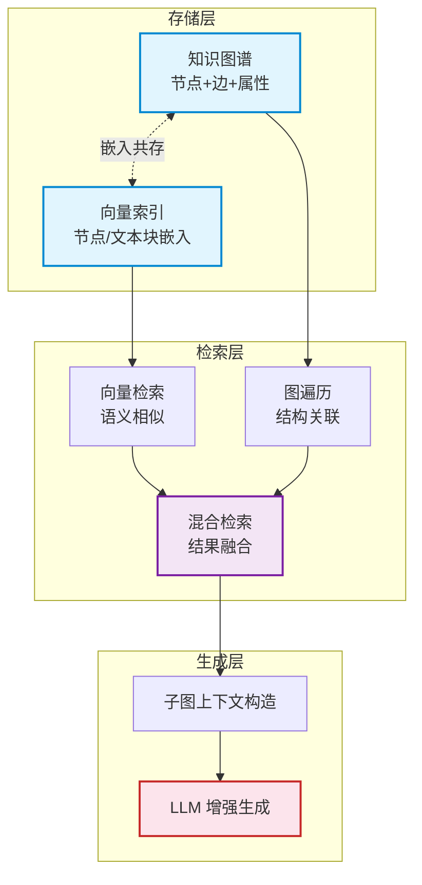

# GraphRAG 架构详解

> **难度级别**：进阶
> **预计阅读时间**：45 分钟
> **前置知识**：[图原生 AI 概念解析](./03-01-graph-native-ai-concept.md)、[GDS 总体介绍](../02-graph-data-science/02-01-gds-overview.md)

---

## 一、RAG 基础概念与局限

### 1.1 什么是 RAG

检索增强生成（Retrieval-Augmented Generation，RAG）是一种把外部知识检索与大语言模型（Large Language Model，LLM）生成相结合的技术架构。其核心思想是：在不改变模型参数的前提下，通过在生成前"检索"相关外部知识并注入到提示词（Prompt）中，让模型基于检索到的事实进行回答，从而缓解模型知识滞后与事实幻觉（Hallucination）问题。

一个典型的 RAG 流程包括三步：

1. **索引**（Indexing）：将外部文档切分为文本块（Chunk），用嵌入模型（Embedding Model）把每个文本块编码为向量，存入向量数据库；
2. **检索**（Retrieval）：将用户查询同样编码为向量，在向量数据库中通过相似度搜索（如 KNN）召回最相关的若干文本块；
3. **生成**（Generation）：将召回的文本块拼接为上下文，与用户问题一同送入 LLM，由 LLM 生成最终回答。

### 1.2 传统向量 RAG 的局限

传统向量 RAG（Vector RAG）在简单事实问答上表现良好，但在复杂知识任务上存在结构性局限：

| 局限类型 | 具体表现 | 根本原因 |
|---------|---------|---------|
| 语义碎片化 | 文本块切分破坏了实体间的完整关系 | 文本块是平铺的，无结构 |
| 多跳推理乏力 | 难以回答"A 的导师的合作者研究什么"这类需要跨多实体关联的问题 | 向量相似度只能匹配单步语义相近 |
| 全局视角缺失 | 无法回答"整个领域的研究趋势是什么" | 检索只返回局部相关片段，缺乏整体结构 |
| 事实不可追溯 | 难以核实生成内容的来源 | 文本块来源粒度粗，无结构化事实锚点 |
| 实体消歧困难 | 同名不同实体、异名同实体易混淆 | 缺乏统一实体标识与关系网络 |

这些局限的根源在于：传统向量 RAG 把知识表示为"独立的文本块向量"，丢弃了知识本应具有的关系结构。GraphRAG 正是为弥补这一缺陷而生。

---

## 二、GraphRAG 架构详解

图检索增强生成（Graph Retrieval-Augmented Generation，GraphRAG）是在向量 RAG 基础上引入知识图谱与图遍历的增强架构。它的核心理念是：**知识不仅以向量形式存在，更以图结构存在；检索不仅做语义相似匹配，更做结构化关联推理**。

### 2.1 GraphRAG 的三层架构

GraphRAG 的架构可以划分为三个层次：存储层、检索层、生成层。



### 2.2 存储层：知识图谱作为存储底座

GraphRAG 的存储层以知识图谱（Knowledge Graph，KG）为核心。与传统向量数据库只存文本块向量不同，GraphRAG 的存储层同时维护：

- **图结构数据**：实体节点、关系边、属性，构成结构化事实网络；
- **向量嵌入**：节点或文本块的向量表示，与图结构共存于同一数据库。

这种"嵌入与图共存"是 Neo4j 实现 GraphRAG 的关键特性——向量索引作为节点属性上的索引存在，使得一次查询既能用向量找到语义相近的节点，又能立即从该节点出发进行图遍历，无需跨数据库切换。

### 2.3 检索层：图检索 + 向量检索 = 混合检索

GraphRAG 的检索层是其区别于传统 RAG 的核心。它采用混合检索（Hybrid Retrieval）策略：

1. **向量检索**（Vector Retrieval）：将用户问题编码为向量，在节点嵌入索引上做 KNN 搜索，召回语义相近的"入口节点"；
2. **图遍历**（Graph Traversal）：从入口节点出发，用 Cypher 模式匹配或多跳查询，沿关系边扩展，召回相关的子图（Subgraph）；
3. **结果融合**：将向量召回的节点与图遍历扩展的子图合并、去重、排序，形成最终检索结果。

图遍历的价值在于：向量检索只能找到"和问题长得像"的节点，而图遍历能找到"和问题相关但在语义上不那么像"的节点。例如，问题"张三的合作者研究什么"，向量检索可能召回"张三"这一节点，但只有通过 `CO_AUTHOR` 关系的一跳遍历才能找到他的合作者，再通过 `RESEARCHES` 关系二跳遍历才能找到合作者的研究主题。这种多跳关联是向量相似度无法企及的。

### 2.4 生成层：子图上下文注入 Prompt

检索完成后，GraphRAG 将召回的子图转化为 LLM 可理解的自然语言上下文，注入到提示词中。这一过程称为子图上下文注入（Subgraph Context Injection）。

一个典型的子图上下文模板如下：

```text
你是一个基于知识图谱的问答助手。请根据以下知识图谱子图信息回答用户问题。

【知识图谱子图】
- (张三:学者)-[CO_AUTHOR]->(李四:学者)
- (李四:学者)-[RESEARCHES]->(图神经网络:主题)
- (李四:学者)-[AFFILIATED_WITH]->(清华大学:机构)

【用户问题】
张三的合作者研究什么领域？

【要求】
仅依据上述子图事实回答，不要编造未在子图中出现的信息。
```

子图上下文相比文本块上下文的优势在于：它显式地给出了实体间的关系，LLM 无需从自然语言中推断关系，只需"读懂"结构化的事实三元组即可。这极大降低了幻觉风险，并使多跳推理成为可能。

---

## 三、Neo4j GraphRAG 的独特优势

在众多实现 GraphRAG 的方案中，Neo4j 具有若干独特优势，这些优势源于其作为原生图数据库的工程特性。

### 3.1 嵌入与图共存

Neo4j 5.x 引入了原生向量索引（Vector Index），使得节点向量嵌入可以作为节点属性存储，并建立向量索引。这意味着：

- 向量检索的结果直接是图中的节点，可立即用于图遍历；
- 无需维护独立的向量数据库与图数据库，避免数据同步开销；
- 嵌入与图结构在同一事务中更新，保证一致性。

| 架构方案 | 数据存储 | 一致性 | 跨库开销 |
|---------|---------|--------|---------|
| 纯向量 RAG | 向量数据库 | 单库一致 | 无 |
| 拼接式 GraphRAG | 向量库 + 图库（分离） | 需同步，弱一致 | 高 |
| Neo4j GraphRAG | 向量索引 + 图（共库） | 事务一致 | 无 |

### 3.2 结构化事实 grounding

Neo4j 的知识图谱以属性图存储结构化事实，每个事实对应具体的关系边。LLM 生成的陈述可直接回溯到图中的节点 ID 与关系类型，实现精确的事实依据（Grounding）。例如，生成"李四研究图神经网络"这一陈述，可标注其来源为图中 `(李四)-[:RESEARCHES]->(图神经网络)` 这条边，便于后续校验。

### 3.3 多跳推理能力

Neo4j 的 Cypher 查询语言天然支持任意深度的图遍历，使得多跳推理（Multi-hop Reasoning）可以直接表达为查询语句。例如：

```cypher
// 三跳推理：张三的合作者的研究主题的合作机构
MATCH (a:Scholar {name: '张三'})
      -[:CO_AUTHOR]->(b:Scholar)
      -[:RESEARCHES]->(t:Topic)
      -[:STUDIED_AT]->(org:Institution)
RETURN b.name AS collaborator, t.name AS topic, org.name AS institution;
```

这种多跳推理在纯向量 RAG 中几乎无法实现——向量相似度只能回答"什么和什么像"，无法回答"什么通过什么关联到什么"。

---

## 四、GraphRAG vs 传统 Vector RAG 对比

下表从多个维度系统对比两种架构。

| 对比维度 | 传统 Vector RAG | GraphRAG |
|---------|----------------|----------|
| 知识表示 | 文本块向量 | 知识图谱 + 向量嵌入 |
| 检索单元 | 文本块 | 节点 + 子图 |
| 检索方式 | 向量相似度（单步） | 向量相似度 + 图遍历（多跳） |
| 推理深度 | 单跳（语义相近） | 多跳（结构关联） |
| 全局视角 | 弱（局部片段） | 强（子图与社区结构） |
| 事实可追溯 | 弱（文本块粒度） | 强（节点/边粒度） |
| 实体消歧 | 难（无统一标识） | 易（图中实体唯一标识） |
| 幻觉控制 | 弱 | 强（结构化 grounding） |
| 构建成本 | 低（切块+向量化） | 高（需构建知识图谱） |
| 适合任务 | 简单事实问答 | 复杂推理、多跳问答、知识发现 |
| 适合数据 | 非结构化文本 | 结构化+半结构化知识 |

一个直观的判断标准是：如果用户问题只需"找一段相关文字"，传统向量 RAG 足够；如果问题需要"跨多个实体关联推理"或"给出可溯源的结构化答案"，则 GraphRAG 更优。两者并非互斥，GraphRAG 实际上是在向量 RAG 基础上的超集——它保留了向量检索能力，并叠加了图遍历能力。

---

## 五、GraphRAG 开发者指南要点

Neo4j 官方提供了 GraphRAG 的开发者指南（Developer Guide），其要点可归纳为以下几条工程原则。

### 5.1 知识图谱构建先行

GraphRAG 的质量上限取决于知识图谱的质量。构建时应注意：

- **实体抽取**：用 LLM 或 NLP 管道从原始文本抽取实体与关系，构建三元组；
- **实体消歧与合并**：同名实体需消歧，异名同实体需合并，保证图中实体唯一性；
- **模式设计**：预先设计节点标签与关系类型的模式（Schema），避免图谱过于松散；
- **增量更新**：支持新知识持续写入图谱，保持图谱的时效性。

### 5.2 嵌入与索引的协同

- **节点嵌入 vs 文本块嵌入**：可选择对节点（实体）做嵌入，也可对节点关联的文本块做嵌入，前者利于结构检索，后者利于语义检索，二者可共存；
- **索引选择**：Neo4j 支持基于余弦相似度（Cosine Similarity）的向量索引，应根据嵌入模型选择匹配的相似度度量；
- **重嵌入策略**：当图谱结构或文本更新时，需重新计算受影响节点的嵌入以保持检索质量。

### 5.3 检索策略调优

- **入口节点数量**：向量检索召回的入口节点不宜过多（通常 3-10 个），以免子图过大；
- **遍历深度**：图遍历深度通常控制在 1-3 跳，过深会导致子图爆炸、上下文过长；
- **子图裁剪**：对召回的子图按相关性裁剪，只保留与问题高度相关的部分；
- **重排序**（Reranking）：对检索结果用交叉编码器（Cross-encoder）重排序，提升精度。

### 5.4 Prompt 工程与上下文管理

- **子图序列化**：将子图序列化为 LLM 易读的格式（如三元组列表、自然语言描述、JSON）；
- **上下文长度控制**：监控注入子图的 token 数，避免超出模型上下文窗口；
- **事实约束提示**：在 Prompt 中明确要求"仅依据子图事实回答"，强化 grounding。

```python
# 一个简化的 GraphRAG 检索+生成伪代码
from neo4j import GraphDatabase
from openai import OpenAI

driver = GraphDatabase.driver("bolt://localhost:7687", auth=("neo4j", "password"))
llm = OpenAI()

def graphrag_answer(question: str, question_embedding: list[float]) -> str:
    with driver.session() as session:
        # 第一步：向量检索入口节点
        entries = session.run("""
            CALL db.index.vector.queryNodes('scholar_embedding_index', 5, $emb)
            YIELD node, score
            RETURN node.name AS name, node AS entry_node
        """, emb=question_embedding).data()

        # 第二步：图遍历扩展子图
        subgraph = session.run("""
            MATCH (n:Scholar) WHERE n.name IN $entry_names
            MATCH path = (n)-[:CO_AUTHOR|:RESEARCHES|:AFFILIATED_WITH*1..2]-(m)
            RETURN nodes(path) AS ns, relationships(path) AS rs LIMIT 50
        """, entry_names=[e['name'] for e in entries]).data()

        # 第三步：子图序列化为上下文
        context = serialize_subgraph(subgraph)

        # 第四步：注入 Prompt 生成
        prompt = f"依据以下知识图谱子图回答问题：\n{context}\n\n问题：{question}"
        return llm.chat.completions.create(
            model="gpt-4o",
            messages=[{"role": "user", "content": prompt}]
        ).choices[0].message.content
```

---

## 六、与图书情报领域的关联

GraphRAG 与图书情报领域的关系是"知识图谱 + 信息检索"的当代融合，二者在方法论上具有深刻的承续性。

### 6.1 知识图谱承续

图书情报领域是知识组织（Knowledge Organization）的发源地，本体、叙词表、分类法、关联数据等都是结构化知识表示的早期形态。GraphRAG 的知识图谱存储层，可以被视为这些传统知识组织工具在生成式 AI 时代的工程化载体。具体而言：

| 传统知识组织工具 | GraphRAG 中的对应 | 转化价值 |
|----------------|-----------------|---------|
| 叙词表（词间关系：BT/NT/RT） | 知识图谱中的 `BROADER`/`NARROWER`/`RELATED` 边 | 词间关系可被 LLM 直接遍历推理 |
| 本体（类层次、属性约束） | 节点标签与关系类型的 Schema | 支持图遍历与推理约束 |
| 规范文档（实体规范） | 图中实体的唯一标识与合并 | 解决实体消歧，支撑多跳推理 |
| 关联数据（RDF/URI） | 属性图节点与关系 | 从语义网走向工程化图存储 |

### 6.2 信息检索演进

GraphRAG 的检索层体现了信息检索（Information Retrieval）范式的演进。回顾检索范式的历史：

1. **布尔检索**（Boolean Retrieval）：基于关键词的逻辑组合，精确但无语义；
2. **向量空间模型**（Vector Space Model）：TF-IDF 向量，引入语义相似度；
3. **概率检索**（Probabilistic Retrieval）：BM25 等，基于概率相关性排序；
4. **学习排序**（Learning to Rank）：机器学习驱动的排序；
5. **神经检索**（Neural Retrieval）：基于深度学习的稠密向量检索；
6. **GraphRAG 混合检索**：向量检索 + 图遍历，融合语义与结构。

GraphRAG 处于这一演进链的最新环节。它没有否定向量检索的价值，而是在向量检索的基础上叠加了图的结构化检索能力，使检索系统既能"理解语义"又能"推理关系"。这与图书情报领域长期追求的"语义检索 + 知识关联"目标完全一致。

### 6.3 对参考咨询与知识服务的启示

GraphRAG 对图书情报领域最直接的应用启示在于智能参考咨询（Reference Consultation）。传统参考咨询依赖馆员的专业知识与检索经验，难以规模化；基于向量 RAG 的问答系统虽能规模化，却难以处理需要多步关联的复杂咨询。GraphRAG 通过知识图谱的多跳推理，能够自动回答诸如"某学者的合作网络涉及哪些研究主题""某主题的发展脉络与关键学者"等复杂咨询问题，并将答案溯源到具体的文献与关系，兼顾了规模化与专业性。

---

## 小结

本章系统解析了 GraphRAG 的架构：它以知识图谱为存储底座，以"向量检索 + 图遍历"的混合检索为检索层，以子图上下文注入 Prompt 为生成层，克服了传统向量 RAG 在多跳推理、全局视角、事实可追溯上的局限。Neo4j 凭借"嵌入与图共存""结构化事实 grounding""Cypher 多跳推理"等独特优势，成为实现 GraphRAG 的理想平台。开发者指南强调了知识图谱构建、嵌入索引协同、检索策略调优、Prompt 工程等工程要点。对图书情报领域而言，GraphRAG 是知识组织传统与信息检索范式在生成式 AI 时代的融合，为智能参考咨询与可溯源知识服务提供了技术路径。

> **下一步阅读**：建议继续阅读 [Neo4j 向量索引](./03-03-vector-index-neo4j.md)，学习 GraphRAG 检索层中向量检索部分的具体实现。
