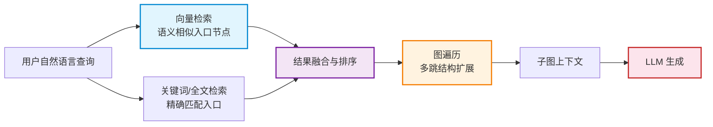

# 混合检索：图遍历与向量的融合

> **难度级别**：进阶
> **预计阅读时间**：45 分钟
> **前置知识**：[GraphRAG 架构详解](./03-02-graphrag-architecture.md)、[Neo4j 向量索引](./03-03-vector-index-neo4j.md)、[Cypher 查询语言](../01-foundations/01-04-cypher-query-language.md)

---

## 一、为什么需要混合检索

前两章分别介绍了 GraphRAG 的整体架构与向量索引。向量索引擅长"语义相似匹配"，能根据自然语言查询召回语义相近的节点；但它无法处理"跨实体的结构关联"。图遍历擅长"结构关联推理"，能沿着关系边发现多跳连接；但它需要一个"入口节点"才能开始遍历，而用户用自然语言提问时往往不会直接给出节点标识。

混合检索（Hybrid Retrieval）的本质，就是将这两种互补的能力融合：**用向量检索找到语义入口，用图遍历扩展结构关联，再融合二者结果**。这种融合使检索系统既能"理解用户的语义意图"，又能"推理数据的关系结构"，从而回答单纯向量检索或单纯图遍历都无法回答的复杂问题。



---

## 二、混合检索架构设计

### 2.1 两阶段检索模型

混合检索通常采用"两阶段"架构：召回阶段（Recall）与精排阶段（Rerank）。

**召回阶段**并行执行多种检索，各自产生候选集：

- **向量检索**：将查询编码为向量，在向量索引上做 KNN 搜索，召回语义相近的节点；
- **图遍历**：从向量召回的入口节点出发，沿关系边做多跳扩展，召回结构关联的子图；
- （可选）**全文检索**：对精确术语、实体名做 BM25 匹配，补充向量检索可能遗漏的精确命中。

**精排阶段**对合并后的候选集做统一排序，常用方法包括：

- 加权分数融合（Weighted Score Fusion）；
- 倒数排名融合（Reciprocal Rank Fusion，RRF）；
- 交叉编码器重排序（Cross-encoder Reranking）。

### 2.2 向量检索与图遍历的分工

| 检索方式 | 擅长 | 不擅长 | 在混合检索中的角色 |
|---------|------|--------|------------------|
| 向量检索 | 语义相似、自然语言理解 | 结构关联、多跳推理 | 提供语义入口节点 |
| 图遍历 | 结构关联、多跳推理 | 语义理解、模糊匹配 | 扩展结构化子图 |
| 全文检索 | 精确术语匹配 | 语义相似、关联推理 | 补充精确召回 |

三者的分工可以这样理解：向量检索回答"什么和我的问题意思相近"，全文检索回答"什么和我的关键词精确匹配"，图遍历回答"找到的东西还和什么有关系"。混合检索把三者组合，形成"语义入口 + 精确补充 + 结构扩展"的完整检索链。

### 2.3 检索深度的控制

图遍历的深度（跳数）是混合检索的关键参数。深度过浅会遗漏关联，深度过深则导致"子图爆炸"——召回节点指数增长，上下文超出 LLM 窗口。

| 遍历深度 | 召回规模 | 适用场景 | 风险 |
|---------|---------|---------|------|
| 1 跳 | 小 | 直接关联（作者-论文） | 关联不够丰富 |
| 2 跳 | 中 | 二级关联（作者-论文-主题） | 平衡之选（推荐） |
| 3 跳 | 大 | 复杂关联链 | 子图过大，需裁剪 |
| 4+ 跳 | 极大 | 极少使用 | 性能与上下文不可控 |

实践中，2-3 跳是混合检索图遍历的常见深度，配合子图裁剪策略控制最终规模。

---

## 三、检索结果融合策略

### 3.1 加权分数融合

不同检索方式返回的分数量纲不同（向量检索是余弦相似度 0-1，全文检索是 BM25 分数可能远大于 1），直接相加无意义。加权分数融合先对每种检索的分数做归一化（如 min-max 归一化到 0-1），再按权重加权求和。

```python
# 加权分数融合示例
def weighted_fusion(vector_results, graph_results, alpha=0.6):
    """
    alpha: 向量检索权重
    1-alpha: 图遍历权重
    """
    scores = {}
    # 归一化向量检索分数
    max_v = max(r['score'] for r in vector_results) or 1
    for r in vector_results:
        scores[r['node_id']] = alpha * (r['score'] / max_v)
    # 归一化图遍历分数（如按跳数倒数作为关联强度）
    for r in graph_results:
        norm = 1 / r['hops']  # 跳数越多，权重越低
        scores[r['node_id']] = scores.get(r['node_id'], 0) + (1 - alpha) * norm
    return sorted(scores.items(), key=lambda x: -x[1])
```

### 3.2 倒数排名融合（RRF）

RRF（Reciprocal Rank Fusion）不依赖原始分数，只依赖每个结果在不同检索中的排名，对分数量纲不敏感，是一种稳健的融合方法。

公式为：`RRF(d) = Σ 1 / (k + rank_i(d))`，其中 `rank_i(d)` 是文档 d 在第 i 个检索结果列表中的排名，k 是平滑常数（常取 60）。

```python
def rrf_fusion(result_lists, k=60):
    """
    result_lists: 多个检索的结果列表，每个元素为 (node_id, score)
    """
    scores = {}
    for result_list in result_lists:
        for rank, (node_id, _) in enumerate(result_list, start=1):
            scores[node_id] = scores.get(node_id, 0) + 1 / (k + rank)
    return sorted(scores.items(), key=lambda x: -x[1])
```

### 3.3 融合策略对比

| 融合策略 | 依赖原始分数 | 对量纲敏感 | 实现复杂度 | 适用场景 |
|---------|------------|-----------|-----------|---------|
| 加权分数融合 | 是 | 是（需归一化） | 中 | 分数可信且可归一化 |
| 倒数排名融合（RRF） | 否 | 否 | 低 | 多源异构检索 |
| 交叉编码器重排 | 是（需模型） | 否 | 高 | 最终精排、追求精度 |

实践中常用"RRF 做初融合 + 交叉编码器做精排"的组合，兼顾效率与精度。

---

## 四、Cypher + 向量查询的联合调用示例

混合检索在 Neo4j 中通过在单条 Cypher 查询中组合 `db.index.vector.queryNodes` 与图遍历模式来实现。这种"一次查询完成向量检索 + 图遍历"的能力，是 Neo4j 实现混合检索的核心优势。

### 4.1 基础示例：向量检索 + 一跳图遍历

```cypher
// 查询：找与"图神经网络文献推荐"语义相近的论文，并返回其作者与主题
CALL db.index.vector.queryNodes('paper_embedding_index', 5, $queryVector)
YIELD node, score
WITH node AS paper, score
MATCH (paper)-[:WRITTEN_BY]->(a:Author)
OPTIONAL MATCH (paper)-[:ABOUT]->(t:Topic)
RETURN paper.title AS title, score,
       collect(DISTINCT a.name) AS authors,
       collect(DISTINCT t.name) AS topics
ORDER BY score DESC;
```

### 4.2 进阶示例：向量检索 + 多跳图遍历 + 过滤

```cypher
// 查询：找与查询语义相近的论文，再找其作者的其他论文（二跳），并按引用量排序
CALL db.index.vector.queryNodes('paper_embedding_index', 3, $queryVector)
YIELD node, score
WITH node AS seed_paper, score AS seed_score
// 二跳遍历：seed_paper -> 作者 -> 作者的其他论文
MATCH (seed_paper)-[:WRITTEN_BY]->(a:Author)-[:WRITTEN_BY]->(related:Paper)
WHERE related <> seed_paper AND related.year >= 2020
WITH seed_paper, seed_score, related,
     count(DISTINCT a) AS shared_authors
// 按共著者数与种子相似度综合排序
RETURN seed_paper.title AS seed_title, seed_score,
       related.title AS related_title, related.year AS year,
       related.citation_count AS citations, shared_authors
ORDER BY (seed_score * 0.5 + shared_authors * 0.1) DESC, citations DESC
LIMIT 10;
```

这条查询同时利用了向量相似度（语义入口）与图结构（共著者关联），是混合检索的典型范式。

### 4.3 三路融合示例：向量 + 全文 + 图遍历

```cypher
// 第一路：向量检索
CALL db.index.vector.queryNodes('paper_embedding_index', 10, $queryVector)
YIELD node, score
WITH collect({node: node, score: score, source: 'vector'}) AS vec_hits

// 第二路：全文检索
CALL db.index.fulltext.queryNodes('paper_fulltext', $queryText)
YIELD node, score
WITH vec_hits, collect({node: node, score: score, source: 'fulltext'}) AS ft_hits

// 合并两路入口节点
UNWIND (vec_hits + ft_hits) AS hit
WITH hit.node AS entry, hit.score AS raw_score, hit.source AS source
// 去重：同一节点取最高分
ORDER BY raw_score DESC
WITH entry, max(raw_score) AS best_score, collect(DISTINCT source) AS sources

// 第三路：图遍历扩展
OPTIONAL MATCH (entry)-[:ABOUT]->(t:Topic)
RETURN entry.title AS title, best_score, sources,
       collect(DISTINCT t.name) AS topics
ORDER BY best_score DESC LIMIT 10;
```

这种三路融合充分利用了 Neo4j 在同一数据库内同时支持向量索引、全文索引与图遍历的优势，是 GraphRAG 混合检索的完整形态。

---

## 五、图像领域的混合检索示例

本知识库以"利用 Neo4j 的 AI 图像数据库服务"为应用背景，图像领域的混合检索是一个重要场景。下面以图像知识图谱为例，说明语义搜索与知识图谱推理如何协同。

### 5.1 图像知识图谱的构建

在图像知识图谱中，节点包括图像（Image）、物体（Object）、场景（Scene）、属性（Attribute）、概念（Concept）；边表示"包含"（CONTAINS）、"出现于"（APPEARS_IN）、"属于"（IS_A）等关系。每个图像节点存储其视觉特征向量嵌入。

```cypher
// 图像知识图谱模式示例
// (img:Image)-[:CONTAINS]->(obj:Object)-[:IS_A]->(cat:Concept)
// (obj:Object)-[:HAS_ATTRIBUTE]->(attr:Attribute)
// (img:Image)-[:IN_SCENE]->(scene:Scene)
```

### 5.2 场景一：语义搜索 + 知识图谱推理

用户查询："在户外草地上奔跑的狗"

- **向量检索**：将查询文本编码为向量，在图像嵌入索引上召回视觉语义相近的图像（可能召回狗、草地、户外场景的图像）；
- **图遍历**：从召回的图像节点出发，遍历 `CONTAINS` 关系找到其中的物体，再遍历 `IS_A` 关系确认物体是否属于"狗"概念，遍历 `IN_SCENE` 确认场景是否为"户外草地"；
- **融合**：保留同时满足语义相似与结构约束的图像。

```cypher
// 图像领域混合检索示例
CALL db.index.vector.queryNodes('image_embedding_index', 20, $queryVector)
YIELD node, score
WITH node AS img, score
// 图遍历：确认图像包含"狗"类物体且场景为户外
MATCH (img)-[:CONTAINS]->(o:Object)-[:IS_A]->(c:Concept {name: 'dog'})
MATCH (img)-[:IN_SCENE]->(s:Scene)
WHERE s.name IN ['outdoor', 'grassland', 'meadow']
RETURN img.url AS image_url, score, 
       collect(DISTINCT o.name) AS objects, s.name AS scene
ORDER BY score DESC LIMIT 5;
```

### 5.3 场景二：基于关系的图像推荐

向量检索只考虑图像本身的视觉相似，而图遍历可以基于"共现场景""共现物体"等关系做推荐。例如"与某图像在同一场景下出现的其他图像"这类推荐，纯向量检索难以完成，但通过 `IN_SCENE` 关系的一跳遍历即可实现。

| 检索任务 | 纯向量检索 | 混合检索 |
|---------|-----------|---------|
| 找视觉相似的图像 | 强 | 强 |
| 找包含特定物体的图像 | 弱（靠语义猜测） | 强（CONTAINS 遍历） |
| 找同场景的其他图像 | 弱 | 强（IN_SCENE 遍历） |
| 找与某概念相关的图像 | 弱 | 强（IS_A 推理） |

图像领域的混合检索体现了图原生 AI 的核心价值：把视觉特征（向量）与语义关系（图结构）统一在同一检索框架中。

---

## 六、性能考量与优化策略

混合检索融合了多种检索方式，性能优化需要从多个层面入手。

### 6.1 向量检索性能优化

| 优化策略 | 说明 | 效果 |
|---------|------|------|
| 控制召回数（topK） | 向量召回数不宜过大，通常 5-20 | 减少后续处理压力 |
| 选择合适维度 | 高维精度高但开销大，按需选择 | 平衡精度与速度 |
| 嵌入预计算缓存 | 查询向量可缓存复用 | 降低嵌入 API 调用 |
| 索引参数调优 | 调整 ANN 算法的 ef_construction/ef_search | 平衡精度与延迟 |

### 6.2 图遍历性能优化

| 优化策略 | 说明 | 效果 |
|---------|------|------|
| 限制遍历深度 | 控制在 2-3 跳 | 避免子图爆炸 |
| 使用 LIMIT | 遍历结果加 LIMIT | 控制返回规模 |
| 关系类型定向 | 遍历时指定关系类型，而非全图遍历 | 大幅减少扫描 |
| 利用无索引邻接 | Neo4j 原生图遍历本身高效 | 多跳遍历快 |
| 子图裁剪 | 遍历后按相关性裁剪 | 控制上下文长度 |

### 6.3 融合与上下文优化

- **并行召回**：向量检索、全文检索可并行执行，降低端到端延迟；
- **增量融合**：先融合向量与全文结果确定入口，再做图遍历，避免对低质量入口做无效遍历；
- **上下文裁剪**：对最终子图按相关性裁剪，只保留 top-N 节点注入 LLM；
- **Token 预算管理**：为子图上下文设定 token 预算，超限时按相关性截断。

### 6.4 性能指标监控

| 指标 | 含义 | 目标 |
|------|------|------|
| 检索延迟（Latency） | 单次检索端到端耗时 | < 500ms |
| 召回率（Recall） | 相关结果被召回的比例 | > 90% |
| 精确率（Precision） | 召回结果中相关的比例 | > 80% |
| 上下文 token 数 | 注入 LLM 的子图 token | < 模型窗口的 50% |

---

## 七、与图书情报领域的关联

混合检索与图书情报领域的信息检索范式演进有着深层的对应关系，理解这一对应有助于研究者把握技术脉络。

### 7.1 信息检索范式演进的延续

图书情报领域是信息检索（Information Retrieval）理论的发源地。从布尔检索到向量空间模型，再到概率检索与学习排序，每一次范式演进都在试图"更准确地匹配用户信息需求与文档"。混合检索可以被视为这一演进在生成式 AI 时代的最新环节：

| 演进阶段 | 代表方法 | 核心思想 | 是否考虑关系结构 |
|---------|---------|---------|----------------|
| 第一代 | 布尔检索 | 精确逻辑匹配 | 否 |
| 第二代 | 向量空间模型（TF-IDF） | 词频统计相似 | 否 |
| 第三代 | 概率检索（BM25） | 概率相关性排序 | 否 |
| 第四代 | 学习排序 | 机器学习排序 | 弱（特征工程） |
| 第五代 | 神经检索（稠密向量） | 语义相似 | 否 |
| 第六代 | 混合检索（向量+图） | 语义相似 + 结构关联 | 是 |

混合检索首次在检索范式中系统性地引入了"关系结构"维度，这正是图书情报领域长期关注却受限于技术手段未能充分实现的——传统检索系统只把文档当作独立的"袋子"（bag of words），而混合检索把文档置于知识网络中，使检索结果具有了"结构上下文"。

### 7.2 与知识发现的关联

图书情报领域的知识发现（Knowledge Discovery）研究长期依赖共现分析、引文分析、文献耦合等方法揭示文献间的隐含关联。这些方法本质上是在"重建"文档间的关系图，然后在该图上做分析。混合检索则把这一过程"前置"——知识图谱本身即存储了文档间的关系，检索时直接遍历即可，无需每次重建。这使知识发现从"离线分析"走向"在线检索"，是检索与发现融合的重要一步。

### 7.3 对检索系统设计的启示

| 传统检索系统设计原则 | 混合检索下的新原则 |
|-------------------|------------------|
| 文档独立索引 | 文档与关系统一索引 |
| 单一相似度匹配 | 多源融合匹配 |
| 返回文档列表 | 返回带上下文的子图 |
| 检索与发现分离 | 检索即发现 |
| 结果不可解释 | 关联路径可追溯 |

对图书情报领域的研究者与实践者而言，混合检索提示我们：未来的检索系统不应只关注"匹配算法"，更应关注"知识表示"——如何把领域知识组织成可遍历的图结构，决定了检索系统能力上限。这与该领域"重知识组织"的传统不谋而合，是图原生 AI 与图书情报的交汇点。

---

## 小结

本章系统阐述了混合检索的架构与实现：它通过"向量检索找语义入口 + 图遍历扩结构关联"的两阶段模型，弥补了单一检索方式的局限；通过加权分数融合、RRF、交叉编码器重排等策略整合多源结果；在 Cypher 中通过 `db.index.vector.queryNodes` 与图遍历模式的组合实现一次查询完成混合检索；在图像领域展现了语义搜索与知识图谱推理协同的价值；并通过多层面的性能优化策略保障检索效率。对图书情报领域而言，混合检索是信息检索范式演进的最新环节，它首次在检索中系统性引入关系结构维度，使检索从"独立文档匹配"走向"知识网络发现"，与该领域"重知识组织"的传统深度契合。

> **下一步阅读**：建议继续阅读 [与生成式 AI 集成](./03-05-genai-integration.md)，学习如何把混合检索的子图上下文与 LLM 生成能力结合，构建完整的智能问答系统。
