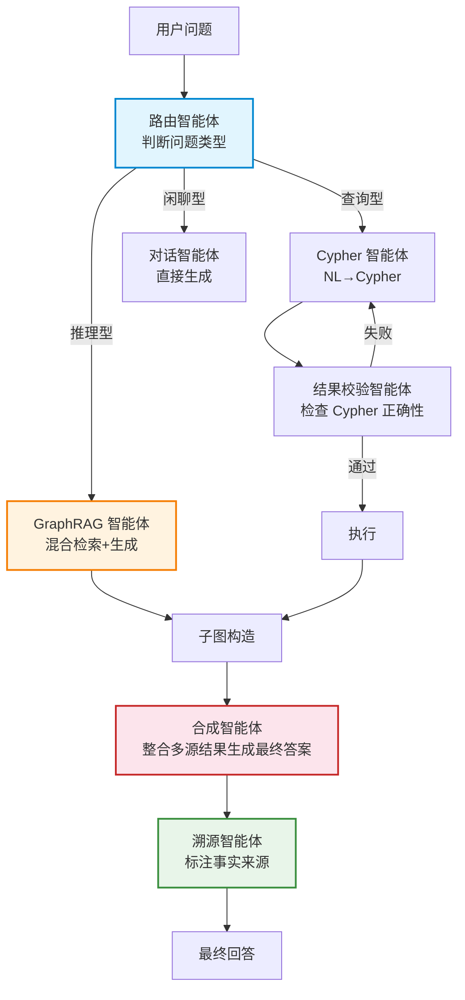
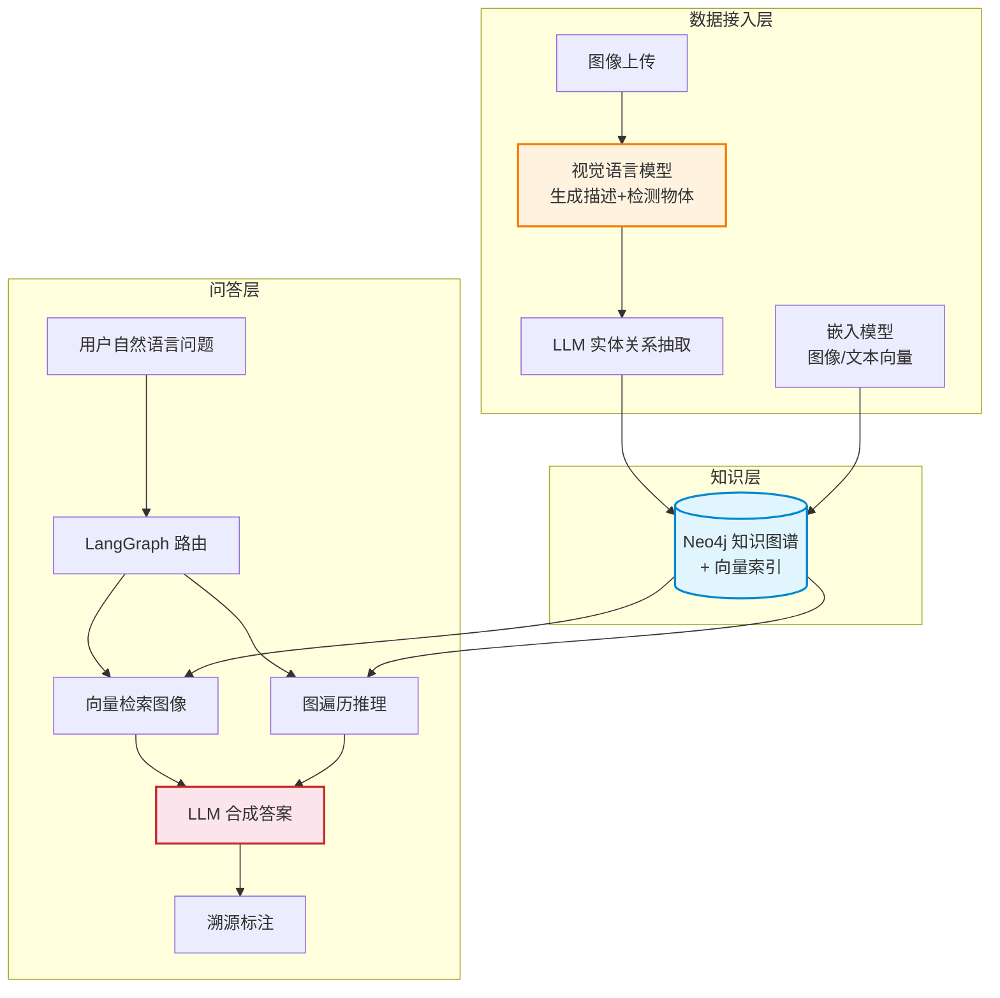

# 与生成式 AI 集成

> **难度级别**：进阶
> **预计阅读时间**：50 分钟
> **前置知识**：[GraphRAG 架构详解](./03-02-graphrag-architecture.md)、[混合检索](./03-04-hybrid-retrieval.md)、[Cypher 查询语言](../01-foundations/01-04-cypher-query-language.md)

---

## 一、Neo4j GenAI 插件生态概述

Neo4j 围绕图原生 AI 构建了一套完整的生成式 AI（Generative AI，GenAI）插件生态，使得开发者无需从零搭建集成层，就能把知识图谱与大语言模型（Large Language Model，LLM）的能力无缝衔接。这一生态由若干组件构成，分别覆盖不同的集成层次。

| 插件/组件 | 定位 | 核心能力 |
|----------|------|---------|
| APOC（含 ml 扩展） | Cypher 工具库 + LLM 调用 | 在 Cypher 中直接调用 OpenAI 等嵌入与补全 API |
| Neo4j GenAI Python 客户端 | Python 集成层 | 封装向量检索、GraphRAG 流程的 Python API |
| LangChain 集成 | 编排框架集成 | 提供 Neo4j VectorStore、GraphQA、GraphCypherQA 链 |
| LangGraph 集成 | 多智能体编排 | 支持基于图的 多智能体（Multi-agent）协作 |
| LlamaIndex 集成 | 数据框架集成 | 知识图谱构建与 GraphRAG 检索 |
| Neo4j GraphRAG Python 包 | 官方 GraphRAG 框架 | 提供检索器、生成器、管道的标准实现 |

这些组件并非互斥，而是按需组合。例如，可以用 APOC 在数据库内做轻量 LLM 调用，用 LangChain 编排完整的问答链路，用 LangGraph 构建多智能体协作系统。本章重点讲解 LangChain 集成与 LangGraph 多智能体两条主线。

### 1.1 APOC 的 LLM 调用能力

APOC（Awesome Procedures on Cypher）的 `apoc.ml` 命名空间提供了在 Cypher 中直接调用 LLM 的能力，包括嵌入生成（`apoc.ml.openai.embedding`）与文本补全（`apoc.ml.openai.completion`）。

```cypher
// 在 Cypher 中直接调用 OpenAI 生成文本
CALL apoc.ml.openai.completion(
    ['请用一句话概括以下知识图谱子图：' + $subgraphText],
    'your-api-key'
)
YIELD value
RETURN value.choices[0].text AS summary;
```

这种"数据库内调用 LLM"的方式适合轻量任务（如批量生成摘要、实体抽取），但对于复杂的多步推理与对话管理，则需要借助 LangChain 等编排框架。

---

## 二、LangChain + Neo4j 集成方案

LangChain 是当前最流行的 LLM 应用编排框架之一，Neo4j 是 LangChain 官方支持的向量存储与图存储后端。二者的集成为构建 GraphRAG 应用提供了标准化的组件。

### 2.1 集成组件概览

LangChain 为 Neo4j 提供了三类核心集成组件：

| 组件 | 类名 | 功能 |
|------|------|------|
| 向量存储 | `Neo4jVector` | 节点向量嵌入存储与 KNN 检索 |
| 图问答（自然语言转 Cypher） | `GraphCypherQAChain` | LLM 把自然语言转为 Cypher 并执行 |
| 图问答（GraphRAG） | 自定义 RetrievalQA | 混合检索 + 子图注入 + LLM 生成 |

### 2.2 Neo4jVector：向量存储集成

`Neo4jVector` 将 Neo4j 作为 LangChain 的向量存储后端，支持文档嵌入的写入与相似度检索。

```python
from langchain_neo4j import Neo4jVector
from langchain_openai import OpenAIEmbeddings

# 连接 Neo4j 并创建/加载向量索引
vector_index = Neo4jVector.from_existing_index(
    embedding=OpenAIEmbeddings(model="text-embedding-3-small"),
    url="bolt://localhost:7687",
    username="neo4j",
    password="password",
    index_name="paper_embedding_index",
    node_label="Paper",
    text_node_property="abstract",
    embedding_node_property="embedding",
)

# 相似度检索
results = vector_index.similarity_search("图神经网络在推荐系统中的应用", k=5)
for doc in results:
    print(doc.page_content, doc.metadata)
```

### 2.3 GraphCypherQAChain：自然语言转 Cypher

`GraphCypherQAChain` 是 LangChain 提供的一种图问答模式：它把数据库的 Schema 提供给 LLM，让 LLM 把用户的自然语言问题翻译为 Cypher 查询，执行查询后把结果再交给 LLM 组织为自然语言回答。这种模式适合结构化查询场景。

```python
from langchain_neo4j import Neo4jGraph
from langchain.chains import GraphCypherQAChain
from langchain_openai import ChatOpenAI

# 连接图数据库
graph = Neo4jGraph(url="bolt://localhost:7687", username="neo4j", password="password")

# 构建自然语言转 Cypher 问答链
chain = GraphCypherQAChain.from_llm(
    llm=ChatOpenAI(model="gpt-4o", temperature=0),
    graph=graph,
    verbose=True,
    allow_dangerous_requests=True,  # 允许执行生成的 Cypher
)

# 提问
answer = chain.invoke({"query": "哪些学者合作发表了关于图神经网络的论文？"})
print(answer["result"])
```

需要注意的是，`GraphCypherQAChain` 依赖 LLM 生成正确的 Cypher，对于复杂查询可能生成不准确的语句，因此需要配合 Schema 提示、查询校验等机制保障质量。它适合"查询型"问题，而对于"推理型"问题，GraphRAG 模式更合适。

### 2.4 两种图问答模式对比

| 维度 | GraphCypherQAChain | GraphRAG（自定义链） |
|------|-------------------|-------------------|
| 工作原理 | NL→Cypher→执行→NL | 混合检索→子图注入→生成 |
| 适合问题 | 精确查询型（"有哪些"） | 推理型（"为什么""如何关联"） |
| 对图 Schema 依赖 | 强（需明确 Schema） | 中（依赖嵌入与图结构） |
| 结果可解释性 | 高（可查看 Cypher） | 中（子图可溯源） |
| 复杂查询稳定性 | 取决于 LLM 生成 Cypher 质量 | 较稳定（检索+生成解耦） |

实践中，可根据问题类型选择模式，或用路由（routing）机制动态选择。

---

## 三、LangGraph 多智能体系统与 GraphRAG

### 3.1 LangGraph 简介

LangGraph 是 LangChain 团队推出的多智能体编排框架，它把 LLM 应用建模为"状态图"（State Graph）——节点是智能体或处理步骤，边是状态流转。这与 Neo4j 的图模型在思想上形成呼应：用图来编排智能体协作。LangGraph 特别适合需要多步推理、工具调用、人机协作的复杂任务。

### 3.2 多智能体 GraphRAG 架构

在复杂的 GraphRAG 场景中，单一检索-生成链往往不够。可以用 LangGraph 构建多智能体系统，让不同智能体各司其职：



各智能体职责如下：

| 智能体 | 职责 | 输入 | 输出 |
|-------|------|------|------|
| 路由智能体 | 判断问题类型，决定走哪条链 | 用户问题 | 问题类型标签 |
| Cypher 智能体 | 把查询型问题转为 Cypher | 问题 + Schema | Cypher 语句 |
| GraphRAG 智能体 | 对推理型问题做混合检索 | 问题 + 嵌入 | 检索子图 |
| 结果校验智能体 | 检查 Cypher 语法与安全性 | Cypher 语句 | 通过/拒绝 |
| 合成智能体 | 整合多源结果生成答案 | 子图 + 中间结果 | 自然语言回答 |
| 溯源智能体 | 标注答案的事实来源 | 回答 + 子图 | 带引用的回答 |

### 3.3 LangGraph 实现示例

```python
from langgraph.graph import StateGraph, END
from typing import TypedDict, Annotated
import operator

# 定义状态
class AgentState(TypedDict):
    question: str
    question_type: str
    cypher: str
    subgraph: str
    answer: str
    citations: list

# 路由智能体
def router(state: AgentState) -> AgentState:
    # 用 LLM 判断问题类型
    q = state["question"]
    if "有哪些" in q or "列出" in q:
        state["question_type"] = "query"
    elif "为什么" in q or "如何" in q or "关系" in q:
        state["question_type"] = "reasoning"
    else:
        state["question_type"] = "chat"
    return state

# 路由决策函数
def route_decision(state: AgentState) -> str:
    if state["question_type"] == "query":
        return "cypher_agent"
    elif state["question_type"] == "reasoning":
        return "graphrag_agent"
    else:
        return "chat_agent"

# 构建状态图
workflow = StateGraph(AgentState)
workflow.add_node("router", router)
workflow.add_node("cypher_agent", cypher_agent_fn)
workflow.add_node("graphrag_agent", graphrag_agent_fn)
workflow.add_node("chat_agent", chat_agent_fn)
workflow.add_node("synthesizer", synthesizer_fn)

workflow.set_entry_point("router")
workflow.add_conditional_edges("router", route_decision, {
    "cypher_agent": "synthesizer",
    "graphrag_agent": "synthesizer",
    "chat_agent": END,
})
workflow.add_edge("synthesizer", END)

app = workflow.compile()
result = app.invoke({"question": "图神经网络与推荐系统有什么关联？"})
```

LangGraph 的价值在于：它把复杂的多智能体协作显式建模为图结构，使流程可观察、可调试、可扩展，与 GraphRAG 的"图原生"理念在编排层面形成统一。

---

## 四、LLM 与知识图谱的协作模式

LLM 与知识图谱的协作并非单向，而是双向闭环。理解几种典型协作模式，有助于设计合理的系统架构。

### 4.1 四种协作模式

| 协作模式 | 方向 | 说明 | 典型应用 |
|---------|------|------|---------|
| 知识图谱增强 LLM（KG→LLM） | 图驱动模型 | 用子图事实增强 LLM 生成，减少幻觉 | GraphRAG 问答 |
| LLM 增强知识图谱（LLM→KG） | 模型驱动图 | 用 LLM 从非结构化文本抽取实体关系，构建/扩充图谱 | 知识图谱自动化构建 |
| 双向闭环（KG↔LLM） | 互增强 | LLM 抽取事实写入图谱，图谱再增强 LLM 生成 | 自演进知识系统 |
| LLM 作为图查询接口 | 模型即接口 | LLM 把自然语言转为 Cypher，降低图查询门槛 | 自然语言图查询 |

### 4.2 LLM 驱动的知识图谱构建

这是"LLM→KG"模式的典型应用。利用 LLM 的信息抽取能力，从论文摘要、文献全文中抽取实体（学者、机构、主题、方法）与关系（合作、隶属、研究、引用），自动构建学术知识图谱。

```python
# 用 LLM 从论文摘要抽取三元组
from langchain_openai import ChatOpenAI
from langchain.prompts import PromptTemplate

llm = ChatOpenAI(model="gpt-4o", temperature=0)

extraction_prompt = PromptTemplate.from_template("""
从以下论文摘要中抽取实体与关系，输出为 JSON 三元组列表。
实体类型：Scholar, Institution, Topic, Method
关系类型：CO_AUTHOR, AFFILIATED_WITH, RESEARCHES, USES_METHOD

摘要：{abstract}

输出格式：[{{"subject": "", "relation": "", "object": ""}}]
""")

def extract_triples(abstract):
    response = llm.invoke(extraction_prompt.format(abstract=abstract))
    import json
    return json.loads(response.content)

# 抽取结果可写入 Neo4j 构建图谱
```

### 4.3 自演进知识系统

最理想的协作模式是双向闭环：LLM 持续从新文献中抽取事实扩充图谱，图谱持续增强 LLM 的问答能力，形成"越用越聪明"的自演进系统。这种模式对图书情报领域的动态知识库建设具有吸引力——知识图谱不再是一次性构建的静态资产，而是随文献增长持续演进的活体知识网络。

---

## 五、图像领域的 GenAI 应用

本知识库以"利用 Neo4j 的 AI 图像数据库服务"为应用背景。在图像领域，生成式 AI 与知识图谱的结合催生了多种应用形态。

### 5.1 图像描述生成（Image Captioning）

利用视觉语言模型（Vision-Language Model，VLM）为图像生成自然语言描述，并将描述中的实体与关系抽取到知识图谱中，使图像从"像素"变为"可查询的知识"。

```python
# 图像描述生成 + 知识抽取流程
def caption_to_graph(image_url):
    # 1. VLM 生成图像描述
    caption = vlm.generate_caption(image_url)
    # 如："一只金毛犬在草地上奔跑，背景是蓝天"
    
    # 2. LLM 从描述抽取实体关系
    triples = extract_triples(caption)
    # 如：[("金毛犬", "IS_A", "狗"), ("金毛犬", "ON", "草地"), ...]
    
    # 3. 写入图像知识图谱
    write_to_neo4j(image_url, caption, triples)
```

### 5.2 视觉问答（Visual Question Answering，VQA）

视觉问答是图像领域的核心 GenAI 应用。结合知识图谱，VQA 可以回答需要跨图像推理的问题。例如"这张图里的物体和另一张图里的物体有什么共同点"——这需要先识别各图物体，再在知识图谱中比较其概念关系，纯视觉模型难以完成。

| VQA 类型 | 纯 VLM 能力 | VLM + 知识图谱能力 |
|---------|------------|------------------|
| 单图事实问答（"图里有什么"） | 强 | 强 |
| 单图推理问答（"这个物体是什么材质"） | 中 | 强（属性遍历） |
| 跨图对比问答（"两张图的共同物体"） | 弱 | 强（图遍历比较） |
| 概念推理问答（"这是不是哺乳动物"） | 弱 | 强（IS_A 层次遍历） |

### 5.3 图像知识推理

知识图谱赋予图像系统"推理"能力。例如，用户问"这张图里的动物会不会游泳"，系统可以：识别图中的动物（如金毛犬），在知识图谱中遍历 `(金毛犬)-[:IS_A]->(犬科)-[:IS_A]->(哺乳动物)`，再查找 `(犬科)-[:ABILITY]->(游泳)` 这类常识关系，给出推理答案。这种推理超越了视觉模型单张图的感知范围，借助知识图谱的常识网络实现。

---

## 六、实际案例：Neo4j + LLM 构建图像智能问答系统

下面给出一个完整的图像智能问答系统架构，综合运用本章所讲的集成能力。

### 6.1 系统架构



### 6.2 数据接入流程

1. 图像上传后，视觉语言模型（如 GPT-4o）生成图像描述并检测物体；
2. LLM 从描述中抽取实体与关系三元组；
3. 嵌入模型为图像与文本生成向量；
4. 实体、关系、向量写入 Neo4j，构建图像知识图谱。

### 6.3 问答流程

1. 用户用自然语言提问；
2. LangGraph 路由智能体判断问题类型；
3. 向量检索召回语义相近图像，图遍历做结构推理；
4. LLM 合成答案，并标注事实来源（溯源到具体图像节点与关系）。

### 6.4 关键代码集成

```python
from langchain_neo4j import Neo4jGraph, Neo4jVector
from langchain_openai import ChatOpenAI, OpenAIEmbeddings
from langgraph.graph import StateGraph, END

# 初始化各组件
graph = Neo4jGraph(url="bolt://localhost:7687", username="neo4j", password="password")
llm = ChatOpenAI(model="gpt-4o", temperature=0)
embeddings = OpenAIEmbeddings(model="text-embedding-3-small")
vector_store = Neo4jVector.from_existing_index(
    embedding=embeddings,
    url="bolt://localhost:7687", username="neo4j", password="password",
    index_name="image_embedding_index", node_label="Image",
    text_node_property="caption", embedding_node_property="embedding",
)

# GraphRAG 检索智能体
def graphrag_agent(state):
    question = state["question"]
    q_emb = embeddings.embed_query(question)
    # 向量检索入口图像
    with graph._driver.session() as session:
        records = session.run("""
            CALL db.index.vector.queryNodes('image_embedding_index', 5, $emb)
            YIELD node, score
            OPTIONAL MATCH (node)-[:CONTAINS]->(o:Object)-[:IS_A]->(c:Concept)
            RETURN node.url AS url, node.caption AS caption, score,
                   collect(DISTINCT c.name) AS concepts
            ORDER BY score DESC
        """, emb=q_emb).data()
    state["subgraph"] = str(records)
    return state

# 合成智能体
def synthesizer(state):
    prompt = f"依据以下图像知识子图回答问题。\n子图：{state['subgraph']}\n问题：{state['question']}"
    state["answer"] = llm.invoke(prompt).content
    return state

# 构建并运行
workflow = StateGraph(dict)
workflow.add_node("graphrag", graphrag_agent)
workflow.add_node("synth", synthesizer)
workflow.set_entry_point("graphrag")
workflow.add_edge("graphrag", "synth")
workflow.add_edge("synth", END)
app = workflow.compile()
result = app.invoke({"question": "哪些图像中出现了犬科动物？"})
```

### 6.5 系统能力总结

| 能力 | 实现方式 | 价值 |
|------|---------|------|
| 自然语言图像检索 | 向量索引 + 图遍历 | 用户无需精确描述即可找图 |
| 跨图像知识推理 | 知识图谱多跳遍历 | 回答需要关联多张图的问题 |
| 可溯源回答 | 子图注入 + 溯源标注 | 回答可追溯到具体图像与关系 |
| 持续知识积累 | LLM 抽取写入图谱 | 系统随图像增加而增强 |

---

## 七、与图书情报领域的关联：智能问答与参考咨询

生成式 AI 与知识图谱的集成，对图书情报领域的智能问答与参考咨询服务具有直接的应用价值。

### 7.1 参考咨询的智能化升级

参考咨询（Reference Service）是图书情报领域的核心服务之一，传统上依赖馆员的专业知识与检索经验。GenAI + 知识图谱的集成，使参考咨询能够实现规模化与智能化的统一：

| 参考咨询维度 | 传统人工模式 | GenAI + 知识图谱模式 |
|------------|------------|---------------------|
| 服务规模 | 受馆员数量限制 | 可并发服务大量用户 |
| 响应速度 | 依赖馆员在线 | 实时响应 |
| 复杂问题处理 | 馆员人工多步检索 | 多智能体自动多跳推理 |
| 答案溯源 | 馆员口头说明来源 | 结构化事实标注，可点击溯源 |
| 知识积累 | 馆员个人经验 | 知识图谱持续沉淀 |
| 服务一致性 | 因馆员而异 | 标准化且有深度 |

### 7.2 智能问答系统的知识图谱基础

图书情报领域构建智能问答系统时，知识图谱是天然的"事实底座"。馆藏在编目过程中已经积累了丰富的结构化元数据（作者、主题、分类、关联），这些数据可以迁移为知识图谱，作为 GraphRAG 问答系统的基础。这比从零构建知识图谱成本低很多，是该领域落地 GenAI 的独特优势。

| 馆藏数据 | 知识图谱对应 | GraphRAG 问答价值 |
|---------|------------|-----------------|
| MARC 记录 | 文献节点 + 属性 | 文献事实问答 |
| 主题词表 | 主题节点 + 词间关系 | 主题导航与推荐 |
| 规范文档 | 实体唯一标识 | 实体消歧与精确检索 |
| 引文数据 | 引用关系边 | 引文链追溯问答 |
| 馆藏位置 | 馆藏节点 + 索书号 | 馆藏定位问答 |

### 7.3 从"检索"到"对话"的范式转移

GenAI 集成使图书情报服务从"检索式"（用户输入查询，系统返回结果列表）走向"对话式"（用户用自然语言提问，系统给出带溯源的答案）。这一范式转移对该领域意义重大：

- 检索式要求用户掌握检索语法与领域术语，门槛高；
- 对话式用自然语言交互，降低使用门槛，扩大服务人群；
- 检索式返回文档列表，用户需自行阅读整合；
- 对话式直接给出整合后的答案并标注来源，提升信息获取效率。

这与该领域长期追求的"以用户为中心的信息服务"理念一致，而知识图谱的 grounding 能力保证了对话式服务不牺牲准确性与可追溯性——这正是图原生 AI 对图书情报领域最实在的价值贡献。

---

## 小结

本章系统介绍了 Neo4j 与生成式 AI 的集成方案：从 APOC 的数据库内 LLM 调用，到 LangChain 的 Neo4jVector、GraphCypherQAChain 等标准组件，再到 LangGraph 的多智能体编排与 GraphRAG 协作；阐述了 LLM 与知识图谱的四种协作模式（KG 增强 LLM、LLM 增强 KG、双向闭环、LLM 作为查询接口）；在图像领域展现了图像描述生成、视觉问答、图像知识推理等应用形态；并给出了 Neo4j + LLM 构建图像智能问答系统的完整架构与代码集成。对图书情报领域而言，GenAI 与知识图谱的集成使参考咨询走向规模化、智能化、可溯源化，推动信息服务从"检索式"向"对话式"范式转移，是该领域落地图原生 AI 的核心场景。

> **模块总结**：至此，图原生 AI 模块的五章已全部完成。从概念解析到 GraphRAG 架构，从向量索引到混合检索，再到生成式 AI 集成，构成了"图原生 AI"的完整知识体系。建议回顾 [图原生 AI 概念解析](./03-01-graph-native-ai-concept.md) 的技术栈全景图，检验对各环节整体关系的把握。
