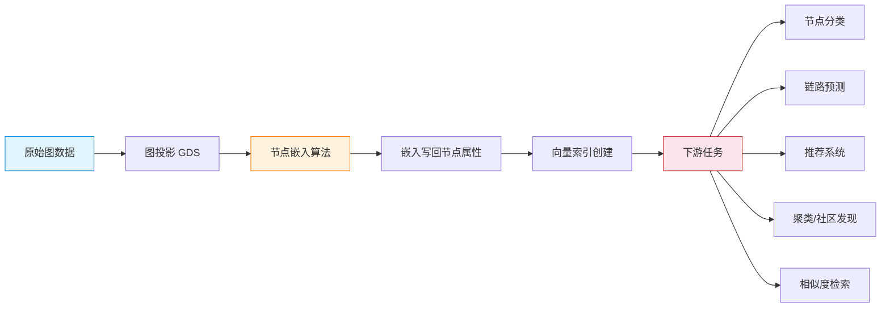
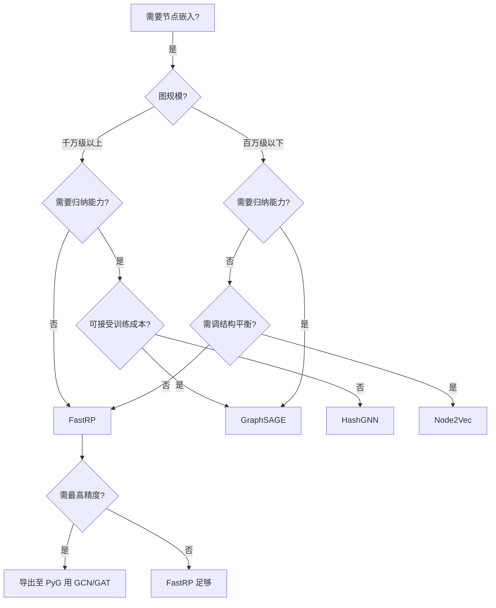

# Neo4j 中的 GNN 实践

> **难度级别**：高级
> **预计阅读时间**：50 分钟
> **前置知识**：[GCN 与 GAT](04-06-gcn-gat.md)、[GraphSAGE 算法](04-05-graphsage.md)、[FastRP 算法](04-04-fastrp.md)

---

## 一、Neo4j GDS 节点嵌入算法全景

前几章分别从原理层面介绍了 Node2Vec、FastRP、GraphSAGE、GCN/GAT 等图嵌入与图神经网络方法。本章回到工程实践，系统梳理 Neo4j GDS（Graph Data Science）库中可用的节点嵌入算法，以及如何在真实项目中选型与落地。

Neo4j GDS 当前提供四种主流节点嵌入算法，覆盖了从传统图嵌入到图神经神经网络的主要技术路线：

1. **FastRP**：基于矩阵分解的高效嵌入，生产首选；
2. **Node2Vec**：基于随机游走的经典嵌入，灵活可控；
3. **GraphSAGE**：基于深度学习的归纳式 GNN，支持新节点；
4. **HashGNN**：基于哈希的无训练嵌入，极速基线。

这四种算法共享同一套 GDS 工程基础设施：图投影（Graph Projection）、命名图目录（Named Graph Catalog）、执行模式（stream/mutate/write/stats）、并发控制等。理解这套基础设施，是高效使用任何嵌入算法的前提。

---

## 二、四种算法详细对比

| 对比维度 | FastRP | Node2Vec | GraphSAGE | HashGNN |
|---------|--------|----------|-----------|---------|
| 技术路线 | 矩阵分解 + 随机投影 | 随机游走 + Word2Vec | 邻域采样 + 神经网络聚合 | 局部敏感哈希 |
| 学习范式 | 直推式 | 直推式 | 归纳式 | 归纳式（近似） |
| 节点特征利用 | 可选（featureProperties） | 不支持 | 必须 | 支持 |
| 训练需求 | 无需训练 | 需训练 Word2Vec | 需训练神经网络 | 无需训练 |
| 典型速度（百万节点） | 10-30 秒 | 10-30 分钟 | 30-60 分钟 | 5-15 秒 |
| 嵌入质量 | 良好 | 良好 | 优秀 | 良好 |
| 确定性 | 是（设种子） | 否（随机游走） | 否（随机初始化+采样） | 是 |
| 参数复杂度 | 低 | 中 | 高 | 低 |
| 归纳能力 | 部分（保留投影矩阵） | 无 | 强 | 强 |
| 可扩展性 | 极强 | 中 | 中 | 强 |
| 适用图规模 | 千万级 | 百万级 | 百万级 | 千万级 |
| GDS 成熟度 | GA（正式） | GA | Beta | Beta |
| 典型场景 | 大图快速嵌入、基线 | 中图、需调结构 | 动态图、有特征 | 超大图、快速 |

### 2.1 各算法的工程定位

- **FastRP**：GDS 中的"瑞士军刀"。速度快、质量稳、支持特征融合、确定性可复现。除非有明确的归纳需求或需要 GraphSAGE 的高精度，FastRP 应作为默认选择。
- **Node2Vec**：当任务明确需要平衡同质性与结构等价，且图规模适中时使用。它的 p/q 参数提供了 FastRP 不具备的结构控制灵活性。
- **GraphSAGE**：当图动态变化、有丰富节点特征、需要处理新节点时使用。它的归纳能力是其他三种算法无法替代的。
- **HashGNN**：当需要在超大图上快速获得"可用"嵌入，且不愿承担训练成本时使用。适合作为初筛或在线服务的快速基线。

---

## 三、嵌入结果可视化

嵌入生成后，通常需要通过可视化来直观评估质量。由于嵌入维度通常在 128-256 维，无法直接绘制，需要降维到 2 维或 3 维。

### 3.1 降维方法对比

| 方法 | 全称 | 原理 | 优点 | 缺点 |
|------|------|------|------|------|
| t-SNE | t-Distributed Stochastic Neighbor Embedding | 保留局部邻域结构，用 t 分布建模高维/低维相似度 | 局部簇清晰，适合可视化 | 速度慢；全局结构失真；参数敏感 |
| UMAP | Uniform Manifold Approximation and Projection | 基于流形学习与拓扑数据分析 | 速度快；保留全局与局部结构；可监督 | 结果有随机性 |
| PCA | Principal Component Analysis | 线性投影到方差最大的方向 | 极快；确定性；可解释 | 只捕捉线性结构 |

实践建议：

- **快速查看全局结构**：PCA（秒级）；
- **查看局部簇与社区**：t-SNE（分钟级，调 perplexity）；
- **兼顾速度与质量**：UMAP（推荐，秒到分钟级）。

### 3.2 可视化流程

```cypher
// 1. 生成嵌入（FastRP）
CALL gds.fastRP.write('myGraph', {
  writeProperty: 'embedding',
  embeddingDimension: 256
}) YIELD nodePropertiesWritten;

// 2. 用 Python/Neo4j Bloom 可视化
// 导出嵌入到 Python 做 UMAP 降维：
```

```python
# Python 端：从 Neo4j 读取嵌入并降维可视化
from neo4j import GraphDatabase
import umap
import matplotlib.pyplot as plt

driver = GraphDatabase.driver("bolt://localhost:7687", auth=("neo4j", "password"))
with driver.session() as session:
    result = session.run("""
        MATCH (n:Paper)
        RETURN n.embedding AS emb, n.field AS label
    """)
    embs = [r["emb"] for r in result]
    labels = [r["label"] for r in result]

# UMAP 降维到 2D
reducer = umap.UMAP(n_components=2, random_state=42)
coords = reducer.fit_transform(embs)

# 绘图，按学科着色
plt.scatter(coords[:, 0], coords[:, 1], c=labels, cmap='tab10', s=5)
plt.savefig("embedding_vis.png", dpi=150)
```

Neo4j Bloom 与 Neo4j Arrow 也支持在数据库内直接做 PCA 降维与可视化，无需导出数据。

### 3.3 可视化评估要点

好的嵌入可视化应呈现：

- **同类节点聚成簇**：同标签/同社区的节点在 2D 图中聚集；
- **簇间有合理分隔**：不同类别的簇不应严重重叠；
- **社区结构可见**：若图有社区结构，可视化应呈现分团。

若可视化呈现"一团散沙"或"所有节点挤在一起"，说明嵌入参数需要调整（维度过低、权重不当、特征质量差等）。

---

## 四、从嵌入到下游任务的完整流程

嵌入本身不是目的，服务于下游任务才是。GDS 中典型的端到端流程如下：



### 4.1 流程步骤详解

1. **数据准备**：确保图数据已加载到 Neo4j，节点有必要的属性（特征、标签）；
2. **图投影**：用 `gds.graph.project` 把感兴趣的子图加载到内存图目录，指定节点/边类型与属性；
3. **嵌入计算**：选择合适的嵌入算法（FastRP/Node2Vec/GraphSAGE/HashGNN）运行，生成向量；
4. **结果写回**：用 write 模式把嵌入写到节点属性，持久化供后续使用；
5. **索引构建**：在嵌入属性上创建向量索引，支持高效相似度查询；
6. **下游任务**：把嵌入作为特征喂给分类器/聚类/推荐算法，或直接用向量索引做检索。

### 4.2 向量索引与嵌入的结合

```cypher
// 在嵌入属性上创建向量索引
CREATE VECTOR INDEX paperEmbeddingIndex
FOR (p:Paper) ON (p.embedding)
OPTIONS {
  indexConfig: {
    `vector.dimensions`: 256,
    `vector.similarity_function`: 'cosine'
  }
};

// 向量相似度查询：找结构最相似的论文
CALL db.index.vector.queryNodes('paperEmbeddingIndex', 10, $queryVector)
YIELD node, score
RETURN node.title AS title, node.year AS year, score
ORDER BY score DESC;
```

这种"嵌入 + 向量索引"的组合是 Neo4j 图原生 AI 的标志性能力——把图结构相似性转化为向量相似性，并在数据库内高效检索。

---

## 五、外部 GNN 框架集成

当 GDS 内置的 GraphSAGE 无法满足需求（如需要 GCN/GAT 的多头注意力、复杂架构、自定义损失）时，可以与外部 GNN 框架集成。两大主流框架是 PyTorch Geometric（PyG）与 DGL。

### 5.1 PyTorch Geometric (PyG)

PyG 是基于 PyTorch 的图神经网络库，特点：

- 丰富的模型实现：GCN、GAT、GraphSAGE、GIN、GINE 等开箱即用；
- 灵活的模型定制：可自定义消息函数、聚合算子、注意力机制；
- 与 PyTorch 生态无缝集成：可接入任何 PyTorch 模块与训练流程。

### 5.2 DGL (Deep Graph Library)

DGL 是另一主流 GNN 框架，特点：

- 框架无关：支持 PyTorch、TensorFlow、MXNET 后端；
- 高性能内核：针对大图优化的消息传递内核；
- 内置大量模型库：与 PyG 模型覆盖度相当。

### 5.3 Neo4j 与外部框架的集成模式

| 集成模式 | 数据流向 | 优点 | 缺点 |
|---------|---------|------|------|
| 导出训练 | Neo4j → 导出边表/节点特征 → PyG/DGL 训练 → 嵌入导回 Neo4j | 可用最完整 GNN 功能 | 数据搬运成本；需维护两套系统 |
| APOC + Python | APOC 导出数据，Python 训练，写回属性 | 灵活 | 非实时 |
| Neo4j Arrow | Arrow 协议高效传输图数据到 Python | 高速 | 需配置 Arrow 服务 |
| Neo4j GDS Client | GDS Python Client 直接调用 GDS 算法 | 一体化 | 仅限 GDS 内置算法 |

典型集成代码（Neo4j → PyG）：

```python
from neo4j import GraphDatabase
from torch_geometric.data import Data
import torch

# 1. 从 Neo4j 导出图数据
driver = GraphDatabase.driver("bolt://localhost:7687", auth=("neo4j", "password"))
with driver.session() as session:
    # 导出节点
    nodes = session.run("MATCH (n:Paper) RETURN id(n) AS id, n.tfidf AS feat")
    node_map = {r["id"]: i for i, r in enumerate(nodes)}
    # 导出边
    edges = session.run("MATCH (a)-[:CITES]->(b) RETURN id(a) AS src, id(b) AS dst")

# 2. 构造 PyG Data 对象
edge_index = torch.tensor([[node_map[e["src"]], node_map[e["dst"]] for e in edges]]).t()
x = torch.tensor([r["feat"] for r in nodes])
data = Data(x=x, edge_index=edge_index)

# 3. 用 PyG 训练 GAT
from torch_geometric.nn import GATConv
class GAT(torch.nn.Module):
    def __init__(self):
        super().__init__()
        self.conv1 = GATConv(data.num_features, 64, heads=8)
        self.conv2 = GATConv(64*8, 32, heads=1)
    def forward(self, data):
        x, edge_index = data.x, data.edge_index
        x = self.conv1(x, edge_index).relu()
        x = self.conv2(x, edge_index)
        return x
```

---

## 六、选择指南

综合前述各节，给出以下选型决策树：



### 6.1 决策要点

1. **先问规模**：千万级以上图，排除 Node2Vec 与 GraphSAGE（训练成本过高），在 FastRP 与 HashGNN 中选；
2. **再问归纳**：需要处理新节点的动态图，排除 Node2Vec，在 GraphSAGE 与 HashGNN 中选；
3. **再问精度**：需要最高精度且有工程能力，导出至 PyG 用 GCN/GAT；
4. **其余情况**：FastRP 是最稳妥的默认选择。

### 6.2 工程实践建议

- **从 FastRP 起步**：任何新项目，先用 FastRP 跑通端到端流程，建立基线；
- **逐步升级**：若 FastRP 基线不达标，再尝试 Node2Vec（调结构）或 GraphSAGE（加特征+归纳）；
- **评估为准**：嵌入质量最终以下游任务指标为准，不要迷信算法复杂度；
- **可复现优先**：生产环境优先选确定性算法（FastRP/HashGNN），便于调试与审计；
- **增量更新**：动态图优先选归纳式算法（GraphSAGE/HashGNN），避免全量重算。

---

## 七、与图书情报领域的关联

Neo4j GDS 的嵌入能力对图书情报领域有直接的工程价值。

### 7.1 一体化的引文分析平台

传统引文分析需要把数据从数据库导出到 Python/R，做嵌入后再导回。GDS 把"存储—查询—嵌入—检索"统一在 Neo4j 内，使图书情报工作者可以用 Cypher 完成从数据到嵌入的全流程，无需编程。这对于缺乏深度工程能力的图书馆与情报机构尤为重要。

### 7.2 向量检索与图遍历的融合

Neo4j 的独特优势是"向量检索 + 图遍历"可在同一查询中完成。例如：

```cypher
// 找到与给定论文结构相似的论文，再看它们的引用社区
CALL db.index.vector.queryNodes('paperEmbeddingIndex', 50, $queryVector)
YIELD node, score
WITH node AS similarPaper, score
MATCH (similarPaper)-[:CITES]->(ref:Paper)-[:CITED_BY]->(citing:Paper)
RETURN similarPaper.title, collect(DISTINCT citing.field) AS relatedFields
```

这种"向量找相似 + 图遍历看关系"的混合查询，是纯向量数据库做不到的，也是图原生 AI 在图书情报领域的核心价值。

### 7.3 实时推荐与增量更新

图书馆推荐系统需要实时响应新用户与新资源。GraphSAGE 的归纳能力使新论文/新用户的嵌入可以即时生成，配合向量索引实现实时推荐。而 FastRP 的速度使每日批量重算全图嵌入成为可能，支持离线分析。

---

## 八、小结

Neo4j GDS 提供了从传统嵌入（FastRP、Node2Vec）到图神经网络（GraphSAGE、HashGNN）的完整算法栈，覆盖了直推式与归纳式、训练与无训练、结构与特征融合等多种需求。选型的核心权衡是"速度—质量—归纳能力"三角。对于绝大多数场景，FastRP 是最佳起点；对于动态图与高精度需求，GraphSAGE 或外部 PyG/DGL 框架是进阶选择。下一章将介绍如何把这些嵌入能力组织成完整的机器学习管道，服务于节点分类、链路预测等具体任务。
