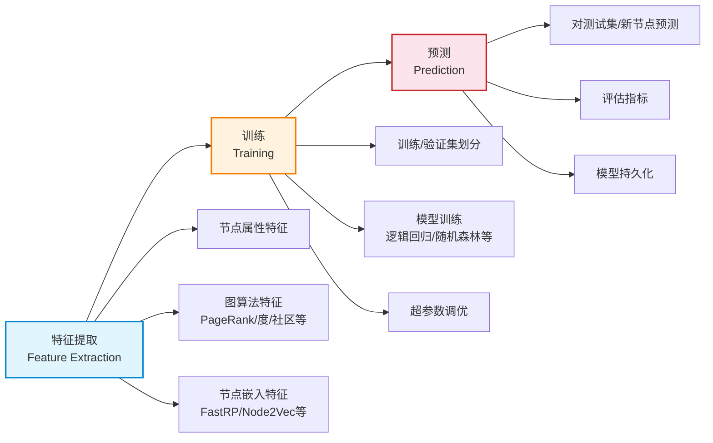

# GDS 机器学习管道

> **难度级别**：高级
> **预计阅读时间**：55 分钟
> **前置知识**：[Neo4j 中的 GNN 实践](04-07-gnn-in-neo4j.md)、[GraphSAGE 算法](04-05-graphsage.md)

---

## 一、从嵌入到管道：GDS ML 的工程化

前面几章介绍的节点嵌入算法（FastRP、Node2Vec、GraphSAGE）解决的是"如何把图结构转化为向量"的问题。但在真实业务中，我们最终要解决的是具体的预测任务——一篇论文属于哪个学科？两个用户是否会建立好友关系？一篇论文的未来被引次数是多少？

这些任务需要把嵌入作为特征，喂给分类器或回归器，并完成训练、评估、部署的完整闭环。Neo4j GDS 把这一闭环封装为**机器学习管道**（Machine Learning Pipeline），使整个流程可以在数据库内用 Cypher 完成，无需把数据导出到外部训练框架。

GDS ML 管道是图原生 AI 范式的工程结晶——它把"图存储—图算法—图嵌入—机器学习"统一在 Neo4j 内，形成闭环。

---

## 二、GDS ML 管道架构

GDS 的机器学习管道遵循一个统一的架构模式，分为三个阶段：



### 2.1 特征提取阶段

特征提取（Feature Extraction）是管道的第一步，也是最关键的一步。GDS 允许把三类特征组合进管道：

| 特征类型 | 来源 | 示例 | 获取方式 |
|---------|------|------|---------|
| 节点属性特征 | 节点自身属性 | 论文的发表年份、TF-IDF 向量 | 直接读取节点属性 |
| 图算法特征 | 图拓扑算法计算 | PageRank、度、聚类系数、社区标签 | 运行 GDS 算法写回属性 |
| 节点嵌入特征 | 嵌入算法计算 | FastRP/Node2Vec/GraphSAGE 向量 | 运行嵌入算法写回属性 |

这三类特征分别对应"内容侧""结构侧""混合侧"的信息。管道的核心价值在于把它们统一组织、自动组合，形成最终的训练特征矩阵。

### 2.2 训练阶段

训练阶段（Training）负责用特征与标签训练模型。GDS 支持：

- 训练/验证集自动划分（按节点或按边）；
- 多种分类/回归算法（逻辑回归、随机森林、MLP 等）；
- 超参数网格搜索与交叉验证；
- 评估指标自动计算（F1、AUC、RMSE 等）。

### 2.3 预测阶段

预测阶段（Prediction）用训练好的模型对新数据做预测。预测结果可写回节点/边属性，供下游查询与应用使用。模型可持久化到模型目录（Model Catalog），供后续重用。

---

## 三、节点分类管道

节点分类管道（Node Classification Pipeline）是最常用的管道类型，目标是预测节点的类别标签。典型应用：预测论文学科领域、预测用户兴趣类别。

### 3.1 管道构建与训练流程

```cypher
// 1. 创建节点分类管道
CALL gds.beta.pipeline.nodeClassification.create('paperClassifier');

// 2. 添加节点属性特征（直接特征）
CALL gds.beta.pipeline.nodeClassification.addNodeProperty(
  'paperClassifier',
  'year'
);

// 3. 添加 FastRP 嵌入作为特征（在管道内自动计算）
CALL gds.beta.pipeline.nodeClassification.addNodeProperty(
  'paperClassifier',
  'fastRP',
  {
    embeddingDimension: 256,
    iterationWeights: [0.0, 1.0, 1.0],
    mutateProperty: 'fastrpFeat',
    randomSeed: 42
  }
);

// 4. 配置特征组合（用哪些属性作为模型输入特征）
CALL gds.beta.pipeline.nodeClassification.selectFeatures(
  'paperClassifier',
  ['year', 'fastrpFeat']
);

// 5. 配置训练参数与候选模型
CALL gds.beta.pipeline.nodeClassification.configureSplit(
  'paperClassifier',
  { testFraction: 0.2, validationFolds: 5 }
);

CALL gds.beta.pipeline.nodeClassification.addLogisticRegression(
  'paperClassifier',
  { penalty: 0.0, patience: 2 }
);

CALL gds.beta.pipeline.nodeClassification.addRandomForest(
  'paperClassifier',
  { numDecisionTrees: 50, maxDepth: 6 }
);

// 6. 训练管道（在图投影上）
CALL gds.beta.pipeline.nodeClassification.train(
  'citationGraph',
  {
    pipeline: 'paperClassifier',
    targetNodeLabel: 'Paper',
    targetProperty: 'field',    // 论文学科标签
    modelName: 'paperFieldModel'
  }
) YIELD modelInfo, trainMetrics;
```

### 3.2 预测与写回

```cypher
// 用训练好的模型预测节点类别
CALL gds.beta.pipeline.nodeClassification.predict.write(
  'citationGraph',
  {
    modelName: 'paperFieldModel',
    predictedPropertyName: 'predictedField',
    confidencePropertyName: 'confidence'
  }
) YIELD nodePropertiesWritten;
```

预测结果（类别与置信度）写回节点属性，可用 Cypher 查询：

```cypher
MATCH (p:Paper)
WHERE p.predictedField IS NOT NULL
RETURN p.title, p.field AS actual, p.predictedField AS predicted, p.confidence
ORDER BY p.confidence DESC LIMIT 20;
```

---

## 四、链路预测管道

链路预测管道（Link Prediction Pipeline）目标是预测两个节点之间是否应存在边。典型应用：论文引用推荐、好友推荐、资源推荐。

### 4.1 链路预测的特殊性

链路预测与节点分类的关键区别在于：

- **样本是节点对而非单个节点**：每条训练样本是 (节点A, 节点B, 是否有边)；
- **需要边嵌入**：把两个节点的嵌入组合为边特征，常用 Hadamard 积、L1/L2 距离、加权平均等；
- **正负样本不平衡**：图中存在的边（正样本）远少于不存在的边（负样本），需负采样平衡。

### 4.2 边嵌入组合方式

| 组合方式 | 公式 | 特点 |
|---------|------|------|
| Hadamard 积 | e = a ⊙ b | 逐元素相乘，捕捉特征交互 |
| L1 距离 | e = |a − b| | 绝对差，反映差异 |
| L2 距离 | e = (a − b)² | 平方差，强调大差异 |
| 加权平均 | e = (a + b)/2 | 简单平均 |
| Concat | e = [a ‖ b] | 拼接，保留各自信息 |

### 4.3 管道构建示例

```cypher
// 1. 创建链路预测管道
CALL gds.beta.pipeline.linkPrediction.create('citePredictor');

// 2. 添加嵌入特征
CALL gds.beta.pipeline.linkPrediction.addNodeProperty(
  'citePredictor',
  'fastRP',
  { embeddingDimension: 256, mutateProperty: 'fastrpFeat' }
);

// 3. 配置边特征组合（用 Hadamard 积）
CALL gds.beta.pipeline.linkPrediction.addFeature(
  'citePredictor',
  'hadamard',
  { featureProperties: ['fastrpFeat'] }
);

// 4. 配置训练
CALL gds.beta.pipeline.linkPrediction.configureSplit(
  'citePredictor',
  { testFraction: 0.2, validationFolds: 5, negativeSamplingRatio: 1.0 }
);

CALL gds.beta.pipeline.linkPrediction.addRandomForest('citePredictor', { numDecisionTrees: 100 });

// 5. 训练
CALL gds.beta.pipeline.linkPrediction.train(
  'citationGraph',
  {
    pipeline: 'citePredictor',
    sourceNodeLabel: 'Paper',
    targetNodeLabel: 'Paper',
    targetRelationshipType: 'CITES',
    modelName: 'citeModel'
  }
) YIELD modelInfo, trainMetrics;

// 6. 预测：推荐最可能的新引用关系
CALL gds.beta.pipeline.linkPrediction.predict.write(
  'citationGraph',
  {
    modelName: 'citeModel',
    topK: 1000,
    writeRelationshipType: 'SUGGESTED_CITE'
  }
) YIELD relationshipsWritten;
```

预测生成的 `SUGGESTED_CITE` 边可直接用于推荐："论文 A 应当引用论文 B"。

---

## 五、节点回归管道

节点回归管道（Node Regression Pipeline）目标是预测节点的连续数值属性。典型应用：预测论文未来被引次数、预测用户活跃度评分。

### 5.1 与节点分类的区别

节点回归与节点分类的管道结构几乎相同，唯一区别在于：

- **目标属性是连续值而非类别**：如被引次数（整数）、活跃度（浮点）；
- **评估指标不同**：用 RMSE、MAE、R² 而非 F1、AUC；
- **候选模型不同**：用回归模型（线性回归、随机森林回归）而非分类模型。

### 5.2 管道构建示例

```cypher
// 创建节点回归管道
CALL gds.beta.pipeline.nodeRegression.create('citationRegressor');

// 添加特征（嵌入 + 图算法特征）
CALL gds.beta.pipeline.nodeRegression.addNodeProperty('citationRegressor', 'fastRP',
  { embeddingDimension: 256, mutateProperty: 'fastrpFeat' });

CALL gds.beta.pipeline.nodeRegression.addNodeProperty('citationRegressor', 'pageRank',
  { mutateProperty: 'prFeat' });

CALL gds.beta.pipeline.nodeRegression.selectFeatures('citationRegressor',
  ['fastrpFeat', 'prFeat']);

CALL gds.beta.pipeline.nodeRegression.configureSplit('citationRegressor',
  { testFraction: 0.2, validationFolds: 5 });

CALL gds.beta.pipeline.nodeRegression.addRandomForest('citationRegressor',
  { numDecisionTrees: 100, maxDepth: 8 });

// 训练（目标属性为 futureCitations）
CALL gds.beta.pipeline.nodeRegression.train(
  'citationGraph',
  {
    pipeline: 'citationRegressor',
    targetNodeLabel: 'Paper',
    targetProperty: 'futureCitations',
    modelName: 'citeCountModel'
  }
) YIELD modelInfo, trainMetrics;

// 预测
CALL gds.beta.pipeline.nodeRegression.predict.write(
  'citationGraph',
  {
    modelName: 'citeCountModel',
    predictedPropertyName: 'predictedCitations'
  }
) YIELD nodePropertiesWritten;
```

---

## 六、管道目录与模型目录管理

GDS 维护两个目录来管理管道与模型的生命周期。

### 6.1 管道目录（Pipeline Catalog）

管道目录存储已配置但尚未训练的管道定义。管道可以是命名管道（Named Pipeline，绑定到某数据库）或匿名管道。

```cypher
// 列出所有管道
CALL gds.beta.pipeline.list();

// 删除管道
CALL gds.beta.pipeline.drop('paperClassifier');
```

### 6.2 模型目录（Model Catalog）

训练完成后，模型存入模型目录，可被多次预测调用重用。模型也分命名模型与匿名模型。

```cypher
// 列出所有模型
CALL gds.beta.model.list();

// 查看模型详情
CALL gds.beta.model.exists('paperFieldModel') YIELD exists;

// 删除模型
CALL gds.beta.model.drop('paperFieldModel');

// 导出模型（用于版本管理或迁移）
CALL gds.beta.model.store('paperFieldModel');
```

### 6.3 目录管理对比

| 目录 | 存储内容 | 生命周期 | 典型操作 |
|------|---------|---------|---------|
| 管道目录 | 管道配置（特征、模型、分割） | 创建到训练前 | create / addNodeProperty / selectFeatures / drop |
| 模型目录 | 训练好的模型 | 训练后持久化 | list / exists / drop / store / load |

---

## 七、训练方法与超参数调优

### 7.1 训练方法

GDS 支持的训练方法：

| 方法 | 类型 | 适用管道 | 特点 |
|------|------|---------|------|
| Logistic Regression | 线性分类 | 节点分类、链路预测 | 简单、可解释、快；线性假设 |
| Random Forest | 集成分类/回归 | 全部 | 非线性、稳健；需调树数与深度 |
| MLP | 神经网络 | 节点分类、链路预测 | 表达力强；需调层数与学习率 |

### 7.2 超参数调优

GDS 管道支持超参数的候选值列表，训练时自动做网格搜索与交叉验证：

```cypher
// 为逻辑回归指定多个 penalty 候选值
CALL gds.beta.pipeline.nodeClassification.addLogisticRegression(
  'paperClassifier',
  { penalty: [0.0, 0.01, 0.1, 1.0], patience: 2 }
);

// 为随机森林指定多组超参数
CALL gds.beta.pipeline.nodeClassification.addRandomForest(
  'paperClassifier',
  {
    numDecisionTrees: [50, 100, 200],
    maxDepth: [4, 6, 8]
  }
);
```

训练时，GDS 会对所有候选组合做交叉验证，自动选择验证集上最优的超参数组合。`trainMetrics` 与 `modelMetrics` 返回各候选的表现，便于分析。

### 7.3 调优建议

- **特征工程优先于模型调参**：增加有信息量的特征（如 PageRank、嵌入）比调模型超参数收益更大；
- **从简单模型起步**：先用逻辑回归建立基线，再尝试随机森林/MLP；
- **注意过拟合**：图数据中训练与测试节点可能邻接重叠，设置合理的 validationFolds；
- **嵌入质量决定上限**：管道效果很大程度取决于嵌入质量，应先优化嵌入再调管道。

---

## 八、预处理：特征工程与图特征组合

GDS 管道的特征工程是其区别于传统 ML 的核心。一个优秀的管道通常组合三类特征：

### 8.1 特征组合策略

| 特征组合 | 包含内容 | 适用场景 |
|---------|---------|---------|
| 纯属性 | 节点自身属性 | 内容主导任务 |
| 纯结构 | 度、PageRank、社区标签 | 结构主导任务 |
| 纯嵌入 | FastRP/Node2Vec 向量 | 无明确特征时 |
| 属性 + 结构 | 属性 + 图算法特征 | 兼顾内容与位置 |
| 属性 + 嵌入 | 属性 + 嵌入向量 | 兼顾内容与隐式结构 |
| 全组合 | 属性 + 结构 + 嵌入 | 追求最高精度 |

### 8.2 图算法特征的添加

管道内可直接调用 GDS 算法生成结构特征：

```cypher
// 在管道中添加 PageRank 作为特征
CALL gds.beta.pipeline.nodeClassification.addNodeProperty(
  'paperClassifier', 'pageRank',
  { mutateProperty: 'prFeat' }
);

// 添加度中心性
CALL gds.beta.pipeline.nodeClassification.addNodeProperty(
  'paperClassifier', 'degree',
  { mutateProperty: 'degreeFeat' }
);

// 添加社区标签（Louvain）
CALL gds.beta.pipeline.nodeClassification.addNodeProperty(
  'paperClassifier', 'louvain',
  { mutateProperty: 'communityFeat' }
);

// 最终特征组合
CALL gds.beta.pipeline.nodeClassification.selectFeatures(
  'paperClassifier',
  ['year', 'prFeat', 'degreeFeat', 'communityFeat', 'fastrpFeat']
);
```

这种"属性 + 图算法 + 嵌入"的全组合，通常能取得最佳效果，因为它们从不同角度刻画了节点。

---

## 九、完整示例：图像分类管道

把图像数据建模为图后，可以用 GDS 管道做图像分类。假设我们有一组图像，构建了相似度图（相似图像连边），目标是分类图像类别。

```cypher
// 1. 图投影：图像相似度图
CALL gds.graph.project(
  'imageGraph',
  {
    Image: { properties: ['cnnFeature', 'label'] }
  },
  { SIMILAR_TO: { orientation: 'UNDIRECTED' } }
);

// 2. 创建节点分类管道
CALL gds.beta.pipeline.nodeClassification.create('imageClassifier');

// 3. 添加 CNN 视觉特征
CALL gds.beta.pipeline.nodeClassification.addNodeProperty(
  'imageClassifier', 'cnnFeature'
);

// 4. 添加 FastRP 结构嵌入（捕捉相似度图结构）
CALL gds.beta.pipeline.nodeClassification.addNodeProperty(
  'imageClassifier', 'fastRP',
  {
    embeddingDimension: 256,
    iterationWeights: [0.0, 1.0, 1.0],
    mutateProperty: 'structEmb',
    featureProperties: ['cnnFeature'],   // 融合视觉特征
    propertyRatio: 0.5
  }
);

// 5. 特征选择：视觉特征 + 结构嵌入
CALL gds.beta.pipeline.nodeClassification.selectFeatures(
  'imageClassifier',
  ['cnnFeature', 'structEmb']
);

// 6. 训练配置
CALL gds.beta.pipeline.nodeClassification.configureSplit(
  'imageClassifier', { testFraction: 0.2, validationFolds: 5 }
);
CALL gds.beta.pipeline.nodeClassification.addRandomForest(
  'imageClassifier', { numDecisionTrees: 100, maxDepth: 8 }
);

// 7. 训练
CALL gds.beta.pipeline.nodeClassification.train(
  'imageGraph',
  {
    pipeline: 'imageClassifier',
    targetNodeLabel: 'Image',
    targetProperty: 'label',
    modelName: 'imageClassModel'
  }
) YIELD modelInfo, trainMetrics, testMetrics;

// 8. 预测未标注图像
CALL gds.beta.pipeline.nodeClassification.predict.write(
  'imageGraph',
  {
    modelName: 'imageClassModel',
    predictedPropertyName: 'predictedLabel'
  }
) YIELD nodePropertiesWritten;
```

这个管道的关键价值在于：**FastRP 嵌入融合了 CNN 视觉特征与相似度图结构**，使分类器同时看到"图像看起来像什么"与"图像在相似度网络中处于什么位置"。这种"视觉+结构"的融合通常优于纯视觉分类。

---

## 十、与图书情报领域的关联

GDS ML 管道对图书情报领域有直接的落地价值。

### 10.1 论文自动分类

引文网络中的新论文需要分配学科分类号（如中图法分类号）。用节点分类管道，以已标注论文为训练集，以 FastRP 嵌入 + PageRank + 发表年份为特征，训练分类器，可自动预测新论文的分类号。这种"结构+内容"分类比纯文本分类更准确，因为引用结构提供了文本无法揭示的学科归属信号。

### 10.2 引用推荐

链路预测管道可以预测"论文 A 应当引用论文 B"，生成 `SUGGESTED_CITE` 边。这在以下场景有用：

- **写作辅助**：作者写论文时，系统推荐应当引用的相关工作；
- **引文补全**：检查已发表论文是否遗漏了重要引用；
- **检索扩展**：用户检索一篇论文时，推荐"应当一起阅读"的论文。

### 10.3 论文影响力预测

节点回归管道可以预测论文未来的被引次数。以历史论文的训练集（已知发表后 N 年的被引数），训练回归模型，预测新论文的未来影响力。特征组合嵌入（引用结构）、PageRank（当前影响力）、发表年份、期刊影响因子等。这对科研评价、资源采购决策有参考价值。

### 10.4 个性化资源推荐

在"用户—资源"二部图上用链路预测管道，预测"用户 U 可能借阅/检索资源 R"，生成推荐边。这是图书馆与数据库个性化推荐的核心技术，且整个流程在 Neo4j 内闭环，无需外部系统。

### 10.5 主题词自动标引

把叙词表建模为图后，用节点分类管道预测文献应当标注的主题词。以已标引文献为训练集，以文本嵌入 + 主题词图嵌入为特征，训练多标签分类器，可辅助甚至自动化主题标引工作，减轻编目人员的负担。

---

## 十一、小结

GDS 机器学习管道把"图嵌入—特征工程—模型训练—预测部署"统一在 Neo4j 数据库内，形成了图原生 AI 的完整工程闭环。三种管道类型（节点分类、链路预测、节点回归）覆盖了图书情报领域最常见的预测任务：论文分类、引用推荐、影响力预测、资源推荐。管道的核心价值在于把图结构特征（嵌入、图算法）与节点属性特征自动组合，让模型同时看到"内容"与"关系"——这正是图原生 AI 区别于传统 ML 的本质优势。掌握 GDS 管道，意味着能在不离开图数据库的前提下，完成从数据到预测的全流程机器学习。
