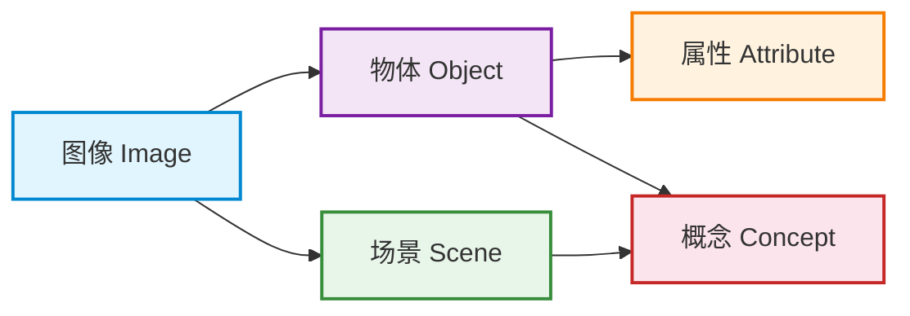
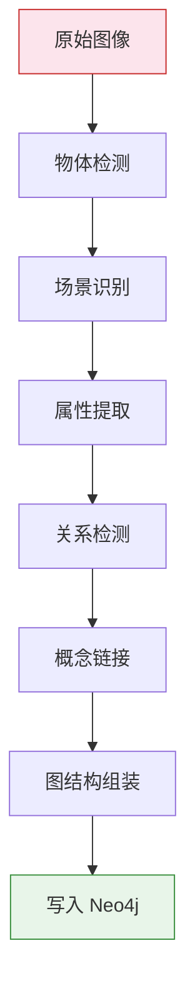

# 图像知识图谱构建

> **难度级别**：进阶
> **预计阅读时间**：50 分钟
> **前置知识**：[属性图模型](../01-foundations/01-02-property-graph-model.md)、[GraphRAG 架构详解](../03-graph-native-ai/03-02-graphrag-architecture.md)

---

## 一、图像知识图谱概念与价值

### 1.1 从图像到知识图谱

图像知识图谱（Image Knowledge Graph）是将图像所承载的视觉内容，转化为以实体、关系、属性为核心的结构化知识网络的一种知识表示形式。传统图像数据以像素矩阵或压缩文件的形式存储，计算机难以直接理解"图中有什么""它们之间有何联系"。图像知识图谱的价值在于：把非结构化的视觉信号映射为结构化的语义图，使图像从"看得见"变为"算得懂"。

对于图书情报（Library and Information Science，LIS）领域而言，这一转变具有特殊意义。长久以来，图像资源的组织依赖于人工著录的元数据（Metadata），如题名、创作者、主题词等，这些描述停留在"关于图像的描述"，而非"图像本身的内容"。图像知识图谱则将描述下沉到图像内容层面，让每一幅图像都拥有可计算、可推理、可检索的语义骨架。

### 1.2 图像知识图谱的核心价值

图像知识图谱相较传统图像元数据，具备以下核心价值：

| 价值维度 | 传统元数据编目 | 图像知识图谱 |
|---------|--------------|------------|
| 描述粒度 | 整图级别（一幅图一条记录） | 实体级别（一幅图可拆解为多个物体节点） |
| 关系表达 | 主题词平铺，无显式关系 | 显式标注物体间的空间、动作、语义关系 |
| 检索能力 | 关键词匹配 | 图结构匹配与多跳推理检索 |
| 推理能力 | 无 | 支持基于关系网络的归纳与演绎 |
| 复用能力 | 难以跨图像复用知识 | 概念节点可被多幅图像共享 |

### 1.3 与通用知识图谱的区别

图像知识图谱属于领域知识图谱（Domain Knowledge Graph）的一种，但它具有显著的视觉特性：

- **节点带视觉锚点**：每个物体节点都可关联到图像中的具体区域（Bounding Box，边界框），知识不是抽象的，而是"看得见"的；
- **关系以空间为先**：图像中物体间最直观的关系是空间关系（上下、内外、前后），这与文本知识图谱以语义关系为主不同；
- **属性多为视觉属性**：颜色、形状、纹理等视觉属性在图像知识图谱中占据重要地位，而这些属性在文本知识图谱中往往缺失。

---

## 二、节点类型设计

构建图像知识图谱的第一步是设计节点（Node）类型体系。一个合理的节点类型设计应能覆盖图像从底层像素到高层语义的各个层次。

### 2.1 核心节点类型

图像知识图谱通常包含以下五类核心节点：



下表对各节点类型进行详细说明：

| 节点类型 | 标签 | 含义 | 示例 |
|---------|------|------|------|
| 图像 | `Image` | 一幅完整的图像资源 | 一张照片、一幅画作 |
| 物体 | `Object` | 图像中可识别的具体事物 | 人、车、桌椅、建筑 |
| 场景 | `Scene` | 图像所处的整体环境 | 厨房、街道、海滩 |
| 属性 | `Attribute` | 物体的视觉特征 | 红色、圆形、木质 |
| 概念 | `Concept` | 抽象的语义类别 | 交通工具、家具、情绪 |

### 2.2 节点属性设计

每个节点类型除了标签外，还需设计合适的属性以承载细粒度信息。

**图像节点（Image）** 的典型属性包括：

- `image_id`：唯一标识符；
- `file_path`：存储路径；
- `width` / `height`：图像尺寸；
- `captured_at`：拍摄时间；
- `embedding`：图像整体的视觉特征向量（用于向量检索）。

**物体节点（Object）** 的典型属性包括：

- `object_id`：物体唯一标识；
- `label`：物体类别标签（如 person、car）；
- `bbox`：边界框坐标 `[x_min, y_min, x_max, y_max]`；
- `confidence`：检测置信度；
- `embedding`：物体区域的特征向量。

> **图书情报视角**：节点属性设计与传统编目中的"数据元素"（Data Element）设计一脉相承。Dublin Core 元数据标准定义了 15 个核心元素，而图像知识图谱的节点属性可视为对 Dublin Core 的细粒度扩展——将"覆盖范围（Coverage）"细化为具体的物体与场景节点，将"主题（Subject）"细化为可推理的概念网络。

---

## 三、关系类型设计

节点之间通过关系（Relationship）连接，关系类型设计决定了知识图谱的表达能力。

### 3.1 核心关系类型

图像知识图谱的典型关系类型如下：

| 关系类型 | 方向 | 含义 | 示例 |
|---------|------|------|------|
| `DEPICTS` | Image → Object | 图像包含某物体 | 一张照片"描绘"了一辆车 |
| `SIMILAR_TO` | Object → Object | 物体视觉相似 | 两辆车外观相似 |
| `PART_OF` | Object → Scene | 物体属于某场景 | 沙发是客厅的一部分 |
| `HAS_ATTRIBUTE` | Object → Attribute | 物体具有某属性 | 苹果"具有"红色属性 |
| `INSTANCE_OF` | Object → Concept | 物体是某概念的实例 | 一辆轿车是"交通工具"的实例 |
| `LOCATED_IN` | Object → Object | 空间包含关系 | 杯子在桌子上方 |

### 3.2 关系的属性化

与节点一样，关系也可携带属性。例如 `DEPICTS` 关系可携带 `detection_score`（检测得分）和 `region_id`（区域编号）；`SIMILAR_TO` 关系可携带 `similarity_score`（相似度分数），用于后续检索排序。

---

## 四、从图像到知识图谱的构建流程

### 4.1 整体构建流程

从原始图像到知识图谱的完整构建流程包含以下阶段：



各阶段说明如下：

| 阶段 | 输入 | 输出 | 关键技术 |
|------|------|------|---------|
| 物体检测 | 图像像素 | 物体边界框与标签 | YOLO / DETR 等检测模型 |
| 场景识别 | 图像整体 | 场景类别标签 | 图像分类 CNN |
| 属性提取 | 物体区域 | 颜色/形状/材质属性 | 属性识别模型 |
| 关系检测 | 物体对 | 主谓客三元组 | 视觉关系检测模型 |
| 概念链接 | 物体标签 | 概念层级节点 | 本体映射 / WordNet |
| 图结构组装 | 全部元素 | 节点与边的集合 | 数据工程脚本 |
| 写入 Neo4j | 图结构数据 | 持久化知识图谱 | Cypher / LOAD CSV |

### 4.2 构建流程的关键挑战

1. **长尾分布问题**：图像中常见物体（人、车）检测准确率高，但稀有物体检测困难，导致知识图谱在长尾类别上出现"空洞"；
2. **关系歧义性**：同一对物体可能存在多种关系（如"人"和"马"既可能是"骑"也可能是"牵着"），需要上下文消歧；
3. **概念对齐**：不同检测模型输出的标签体系不一致，需要建立统一的本体（Ontology）进行对齐。

---

## 五、Neo4j 数据模型设计

### 5.1 图像领域属性图建模

将上述节点与关系类型落地为 Neo4j 的属性图模型，需要定义约束（Constraint）与索引（Index）以保证查询性能与数据完整性。

```cypher
// 创建唯一性约束
CREATE CONSTRAINT image_id_unique IF NOT EXISTS
FOR (i:Image) REQUIRE i.image_id IS UNIQUE;

CREATE CONSTRAINT object_id_unique IF NOT EXISTS
FOR (o:Object) REQUIRE o.object_id IS UNIQUE;

CREATE CONSTRAINT concept_name_unique IF NOT EXISTS
FOR (c:Concept) REQUIRE c.name IS UNIQUE;

// 为标签字段创建索引以加速检索
CREATE INDEX object_label_index IF NOT EXISTS
FOR (o:Object) ON (o.label);

CREATE INDEX scene_type_index IF NOT EXISTS
FOR (s:Scene) ON (s.scene_type);
```

### 5.2 向量索引设计

为支持基于视觉特征的相似度检索，需要为图像节点和物体节点建立向量索引（Vector Index）：

```cypher
// 为图像整体嵌入创建向量索引
CREATE VECTOR INDEX image_embedding_index IF NOT EXISTS
FOR (i:Image) ON (i.embedding)
OPTIONS {
  indexConfig: {
    `vector.dimensions`: 512,
    `vector.similarity_function`: 'cosine'
  }
};

// 为物体区域嵌入创建向量索引
CREATE VECTOR INDEX object_embedding_index IF NOT EXISTS
FOR (o:Object) ON (o.embedding)
OPTIONS {
  indexConfig: {
    `vector.dimensions`: 256,
    `vector.similarity_function`: 'cosine'
  }
};
```

这种"图结构 + 向量索引"共存的建模方式，使得一次查询即可同时利用语义相似度与图结构关联，是 Neo4j 服务图像知识图谱的核心优势。

---

## 六、批量导入图像元数据

### 6.1 数据准备

大规模图像知识图谱的构建通常涉及数十万乃至上百万个节点，需要使用批量导入工具。假设物体检测的结果已整理为 CSV 文件：

```csv
object_id,image_id,label,x_min,y_min,x_max,y_max,confidence
obj_00001,img_0001,person,120,80,340,520,0.95
obj_00002,img_0001,car,400,200,780,450,0.91
obj_00003,img_0002,dog,50,150,300,400,0.88
```

### 6.2 使用 LOAD CSV 导入

```cypher
// 导入图像节点
LOAD CSV WITH HEADERS FROM 'file:///images.csv' AS row
CREATE (i:Image {
  image_id: row.image_id,
  file_path: row.file_path,
  width: toInteger(row.width),
  height: toInteger(row.height),
  captured_at: datetime(row.captured_at)
});

// 导入物体节点并建立与图像的 DEPICTS 关系
LOAD CSV WITH HEADERS FROM 'file:///objects.csv' AS row
MATCH (i:Image {image_id: row.image_id})
CREATE (o:Object {
  object_id: row.object_id,
  label: row.label,
  bbox: [toFloat(row.x_min), toFloat(row.y_min),
         toFloat(row.x_max), toFloat(row.y_max)],
  confidence: toFloat(row.confidence)
})
CREATE (i)-[:DEPICTS {region_id: row.object_id}]->(o);
```

### 6.3 关系批量导入

```cypher
// 导入物体间的关系
LOAD CSV WITH HEADERS FROM 'file:///relations.csv' AS row
MATCH (s:Object {object_id: row.subject_id})
MATCH (o:Object {object_id: row.object_id})
CALL apoc.create.relationship(
  s, row.predicate,
  {confidence: toFloat(row.confidence)}, o
) YIELD rel
RETURN count(rel) AS imported;
```

此处使用 `apoc.create.relationship` 动态创建关系类型，因为谓词（Predicate）名称存储在 CSV 中，无法在 Cypher 中直接作为静态关系类型使用。

---

## 七、图书情报视角

### 7.1 图像资源组织与编目

在图书情报领域，图像资源的组织长期遵循"以描述代内容"的范式。以 MARC（Machine-Readable Cataloging，机读编目格式）和 Dublin Core 为代表的元数据标准，主要记录的是图像的外部属性——题名、责任者、出版信息、主题词等。这些元数据回答的是"这幅图像是什么"的问题，而非"这幅图像里有什么"。

图像知识图谱的引入，使得图像编目从"描述性编目"（Descriptive Cataloging）迈向"内容性编目"（Content Cataloging）。每一幅图像不再只是一条扁平的元数据记录，而成为一个以图像为根节点、以物体与场景为子节点、以关系为边的语义子图。

### 7.2 与传统元数据编目对比

下表系统对比传统元数据编目与图像知识图谱编目：

| 对比维度 | 传统元数据编目 | 图像知识图谱编目 |
|---------|--------------|----------------|
| 编目对象 | 整体资源 | 资源及其内部构成 |
| 描述方法 | 字段-值对 | 节点-关系-属性 |
| 主题标引 | 受控词表（如 LCSH） | 概念节点层级体系 |
| 关系表达 | 无显式关系 | 显式空间/动作/语义关系 |
| 检索模式 | 布尔检索 / 关键词 | 图遍历 / 多跳推理 |
| 知识复用 | 标引不跨资源复用 | 概念节点跨图像共享 |
| 编目成本 | 人工为主，成本高 | AI 辅助，可批量生成 |
| 标准依据 | ISBD / RDA / Dublin Core | 属性图模型 / 本体工程 |

### 7.3 对知识组织的启示

图像知识图谱对图书情报领域的知识组织（Knowledge Organization）实践有三点启示：

1. **从扁平标引到网络标引**：传统主题标引将主题词以列表形式挂在资源记录上，主题词之间无显式关系。知识图谱要求主题词本身成为节点，主题词之间的关系（上下位、相关、等同）成为边，从而构建可推理的概念网络；
2. **从人工编目到人机协同编目**：计算机视觉模型可自动完成物体检测、场景识别、关系抽取等繁重工作，编目员的角色从"逐字段著录"转向"审核与质量控制"，这与编目领域从原始编目（Original Cataloging）向套录编目（Copy Cataloging）的演进逻辑一致；
3. **从资源检索到知识发现**：基于知识图谱的检索不再局限于"找到包含某关键词的图像"，而能支持"找到所有'在厨房场景中、桌上放着红色苹果'的图像"这类细粒度组合查询，乃至通过多跳推理发现隐含关联。

---

## 八、小结

图像知识图谱构建是连接计算机视觉与知识工程的桥梁。它将图像从像素层面提升到语义层面，使图像资源具备可计算、可推理、可检索的图结构基础。对于图书情报领域而言，图像知识图谱不仅是一种新技术，更是图像资源编目与知识组织范式的演进——从描述性元数据走向内容性知识网络。

在 Neo4j 中落地图像知识图谱，需要合理设计节点与关系类型、建立约束与索引、并利用批量导入工具高效入库。下一章将聚焦于知识图谱构建流程中最为关键的一环——场景图生成（Scene Graph Generation），探讨如何从图像自动生成结构化的语义图。

---

> **延伸阅读**：
> - [场景图生成](./05-02-scene-graph-generation.md)
> - [视觉关系检测](./05-03-visual-relationship.md)
> - [属性图模型](../01-foundations/01-02-property-graph-model.md)
