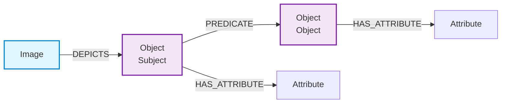

# 视觉关系检测

> **难度级别**：进阶
> **预计阅读时间**：50 分钟
> **前置知识**：[场景图生成](./05-02-scene-graph-generation.md)、[图像知识图谱构建](./05-01-image-knowledge-graph.md)

---

## 一、视觉关系定义

### 1.1 什么是视觉关系

视觉关系（Visual Relationship）是对图像中两个物体之间交互或关联的结构化描述，采用"主体-谓词-客体"（Subject-Predicate-Object）三元组的形式表示。其中主体（Subject）与客体（Object）是图像中被检测出的物体，谓词（Predicate）描述两者之间的关系。

例如，在一张"女孩拿着书"的图像中，视觉关系表示为三元组 `(girl, holding, book)`，其中 `girl` 是主体，`holding` 是谓词，`book` 是客体。每条视觉关系都锚定在图像中的具体区域上——主体与客体各自拥有边界框（Bounding Box），谓词关系隐含在两个边界框之间的空间与视觉交互中。

视觉关系检测（Visual Relationship Detection，VRD）是场景图生成的核心子任务。如果说场景图生成是构建一座大厦，那么视觉关系检测就是烧制每一块砖。

### 1.2 视觉关系的三要素

一条完整的视觉关系包含三个层次的信息：

| 要素 | 内容 | 作用 |
|------|------|------|
| 主体（Subject） | 物体类别 + 边界框 + 视觉特征 | 关系的发起者 |
| 谓词（Predicate） | 关系类别 + 置信度 | 关系的语义类型 |
| 客体（Object） | 物体类别 + 边界框 + 视觉特征 | 关系的承受者 |

值得注意的是，主体与客体的角色不可互换。`(man, riding, horse)` 与 `(horse, riding, man)` 是两条语义完全不同的关系——前者描述人骑马，后者描述马骑人（通常不成立）。因此视觉关系是有向的，这一有向性在 Neo4j 中体现为有向边。

### 1.3 视觉关系与自然语言关系的区别

视觉关系虽然采用与自然语言相同的"主谓宾"结构，但它具有独特的视觉属性：

- **空间可验证性**：视觉关系的有效性往往可从物体间的空间关系验证。例如 `above`（在上方）要求主体的边界框确实位于客体上方；
- **视觉证据性**：谓词的判断依赖于视觉证据而非语言推理。`(man, wearing, hat)` 要求图像中确实可见人头上戴着帽子；
- **封闭类别性**：大多数 VRD 模型在预定义的谓词集合上工作，而非像自然语言那样开放。

---

## 二、视觉关系检测数据集对比

### 2.1 主流数据集

视觉关系检测的发展离不开大规模标注数据集的支撑。下表对比三个主流数据集：

| 数据集 | 全称 | 图像数 | 物体类别 | 谓词类别 | 三元组数 | 标注特点 |
|-------|------|-------|---------|---------|---------|---------|
| VRD | Visual Relationship Dataset | 5,000 | 100 | 70 | 37,993 | 关系类别丰富，但图像规模小 |
| Visual Genome | Visual Genome | 108,077 | 33,877 | 1,327 | 1,474,708 | 规模大，含区域描述与问答 |
| Open Images | Open Images V6 | 约 9M | 600 | 31 | 约 3.3M | 工业级规模，关系类别精简 |

### 2.2 数据集特性分析

**VRD 数据集**是最早专门为视觉关系检测设计的数据集，它定义了 70 种谓词类别，涵盖空间关系（above、below、inside）、动作关系（riding、holding、wearing）和拥有关系（has、of）。虽然规模较小，但其清晰的谓词体系成为早期 VRD 研究的标准基准。

**Visual Genome**（视觉基因组）是目前使用最广泛的视觉关系数据集。它不仅标注了物体间的视觉关系，还标注了区域描述（Region Description）、对象属性（Object Attribute）和问答对（QA Pair），为场景图生成提供了全面的训练信号。其缺点是物体类别极为分散（33,877 类），长尾分布严重。

**Open Images V6** 由 Google 发布，图像规模达百万级，但谓词类别精简为 31 种。它采用众包标注，数据质量较高，适合工业级应用。

> **图书情报视角**：数据集的标注体系与图书情报领域的"叙词表"（Thesaurus）构建密切相关。Visual Genome 的 1,327 种谓词相当于一个庞大的关系叙词表，而 Open Images 的 31 种谓词则类似于一个经过优选的"核心关系词表"。在构建图像知识图谱时，需要根据应用需求选择合适的谓词体系——追求覆盖广度可选 Visual Genome，追求标注质量与效率可选 Open Images。

---

## 三、语言先验在关系检测中的作用

### 3.1 为什么需要语言先验

视觉关系检测面临一个核心难题：视觉信号往往不足以唯一确定关系。例如，"人-马"这一物体对既可能是 `riding`（骑），也可能是 `leading`（牵着），还可能是 `standing next to`（站在旁边）。仅凭两个物体区域的视觉特征，模型难以区分这些关系。

语言先验（Language Priors）的核心思想是：利用自然语言中词汇共现的统计规律，为视觉关系检测提供补充信号。在自然语言语料中，"人骑马"远比"马骑人"常见，这种语言层面的统计先验可以有效约束视觉模型的输出空间。

### 3.2 语言先验的实现方式

语言先验在 VRD 中的实现主要有三种方式：

| 实现方式 | 核心思想 | 技术手段 | 优势 | 局限 |
|---------|---------|---------|------|------|
| 词向量先验 | 利用词嵌入捕捉语义相似度 | Word2Vec / GloVe | 简单高效 | 语义粒度粗 |
| 语言模型先验 | 利用语言模型估计三元组概率 | RNN / Transformer | 上下文感知 | 计算开销大 |
| 知识库先验 | 利用外部知识库的关系约束 | ConceptNet / WordNet | 语义丰富 | 覆盖范围有限 |

**词向量先验**是最简单的实现方式。它将主体、谓词、客体的词向量拼接或组合，计算三元组的"语言合理性"分数。例如 `(person, riding, horse)` 的词向量组合在语义空间中较为一致，因此获得较高的先验分数。

**语言模型先验**更为精细。它将三元组视为一个"句子"（如"person riding horse"），用预训练语言模型计算该句子的概率。概率越高，说明该三元组在语言层面越合理。这种方式能捕捉上下文依赖，但计算开销较大。

**知识库先验**利用 ConceptNet、WordNet 等常识知识库中已存在的关系约束。例如 ConceptNet 中明确标注了 `horse` 的 `CapableOf` 关系为 `person ride`，这可直接作为关系检测的先验约束。

### 3.3 视觉与语言的融合

现代 VRD 模型通常采用视觉-语言融合（Vision-Language Fusion）策略，将视觉特征与语言先验加权融合：

$$ \text{score}(s, p, o) = \alpha \cdot f_{\text{vis}}(s, p, o) + (1 - \alpha) \cdot f_{\text{lang}}(s, p, o) $$

其中 $f_{\text{vis}}$ 是视觉特征给出的分数，$f_{\text{lang}}$ 是语言先验给出的分数，$\alpha$ 是平衡系数。视觉信号负责"看得见"的关系（如 above、below），语言先验负责"看不见"的语义关系（如 wearing、made of），两者互补。

---

## 四、从视觉关系到图数据库的关系映射

### 4.1 关系映射的基本原则

将视觉关系三元组映射为 Neo4j 中的图结构，需要遵循以下原则：

| 原则 | 说明 | 示例 |
|------|------|------|
| 主体映射为源节点 | 三元组的主体对应关系的起始节点 | `(girl)` → `(:Object {label:'girl'})` |
| 客体映射为目标节点 | 三元组的客体对应关系的终止节点 | `(book)` → `(:Object {label:'book'})` |
| 谓词映射为关系类型 | 三元组的谓词对应边的类型 | `holding` → `[:HOLDING]` |
| 置信度映射为关系属性 | 检测置信度存储在边上 | `{confidence: 0.92}` |
| 边界框映射为节点属性 | 物体位置存储在节点上 | `{bbox: [x,y,w,h]}` |

### 4.2 关系方向的考量

视觉关系是有向的，在 Neo4j 中以有向边表示。但某些关系在语义上是对称的（如 next to、similar to），这类关系可考虑用无向边或双向边表示。需要注意的是，Neo4j 中的边本质上是有向的，无向匹配只是在查询时忽略方向（使用 `--` 而非 `-->`），存储时仍需指定方向。

---

## 五、关系类型设计

### 5.1 三大类视觉关系

视觉关系按语义类型可分为三大类，每类的检测难度与映射方式有所不同：

| 关系类型 | 英文 | 典型谓词 | 视觉可判断性 | 数量占比 |
|---------|------|---------|------------|---------|
| 空间关系 | Spatial Relations | above/below/inside/outside/behind | 强（可从边界框推断） | 约 40% |
| 动作关系 | Action Relations | riding/holding/wearing/eating | 中（需识别交互姿态） | 约 35% |
| 语义关系 | Semantic Relations | has/made of/part of/belong to | 弱（需常识推理） | 约 25% |

### 5.2 空间关系

空间关系（Spatial Relations）描述物体间的位置关系，是视觉关系中最易检测的一类，因为它们可以直接从边界框的几何关系推断：

- `above`（在上方）：主体的边界框 y 坐标小于客体；
- `below`（在下方）：主体的边界框 y 坐标大于客体；
- `inside`（在内部）：主体边界框完全包含于客体边界框内；
- `next to`（在旁边）：两边界框水平相邻且 y 坐标相近。

空间关系的这一特性意味着，即便没有深度学习模型，简单的几何规则也能检测一部分空间关系。这在实际工程中可用于"快速预标注"，降低模型推理的计算压力。

### 5.3 动作关系

动作关系（Action Relations）描述物体间的交互行为，如 `riding`（骑）、`holding`（拿）、`wearing`（穿）、`eating`（吃）。这类关系的判断不仅需要知道物体是什么，还需要识别物体的姿态与交互方式，难度中等。

例如判断 `riding` 关系，模型需要识别出人处于骑坐姿态、且位于马或自行车的上方——这需要融合人的姿态估计（Pose Estimation）信息与空间关系信息。

### 5.4 语义关系

语义关系（Semantic Relations）描述物体间的语义关联，如 `has`（拥有）、`made of`（由...制成）、`part of`（...的一部分）、`belong to`（属于）。这类关系难以从视觉特征直接判断，往往依赖语言先验与常识推理。

例如 `made of` 关系——"桌子 made of 木头"——无法从图像中直接看到"木头"这一材料概念，需要模型从桌子的纹理特征推断其材质，并结合语言先验确认"桌子通常由木头制成"的可能性。

---

## 六、Neo4j 中存储与查询视觉关系示例

### 6.1 数据模型回顾

在 Neo4j 中，视觉关系的存储模型如下：



### 6.2 写入视觉关系

以下示例展示如何在 Neo4j 中写入一条完整的视觉关系：

```cypher
// 写入一条 (person, holding, cup) 视觉关系
MATCH (img:Image {image_id: 'img_0001'})
CREATE (p:Object {
  object_id: 'img_0001_obj_1',
  label: 'person',
  bbox: [100, 80, 320, 560],
  embedding: $person_embedding
})
CREATE (c:Object {
  object_id: 'img_0001_obj_2',
  label: 'cup',
  bbox: [250, 200, 320, 300],
  embedding: $cup_embedding
})
CREATE (img)-[:DEPICTS]->(p)
CREATE (img)-[:DEPICTS]->(c)
CREATE (p)-[:HOLDING {confidence: 0.94, model: 'vrd_v2'}]->(c);
```

### 6.3 查询视觉关系

**按关系类型查询**——找到所有"人骑马"的图像：

```cypher
MATCH (p:Object {label: 'person'})
      -[r:RIDING]->(horse:Object {label: 'horse'})
MATCH (img:Image)-[:DEPICTS]->(p)
WHERE r.confidence > 0.8
RETURN img.image_id, img.file_path, r.confidence
ORDER BY r.confidence DESC
LIMIT 20;
```

**多跳关系查询**——找到"人骑着在草地上的马"的图像：

```cypher
MATCH (p:Object {label: 'person'})
      -[:RIDING]->(horse:Object {label: 'horse'})
      -[:ON]->(grass:Object {label: 'grass'})
MATCH (img:Image)-[:DEPICTS]->(p)
RETURN DISTINCT img.image_id, img.file_path;
```

**关系统计查询**——统计数据库中各关系类型的分布：

```cypher
MATCH ()-[r]->()
WHERE NOT type(r) = 'DEPICTS'
RETURN type(r) AS predicate, count(r) AS freq
ORDER BY freq DESC
LIMIT 10;
```

这一查询在图书情报视角下，类似于对叙词表中主题词的使用频次统计，可用于分析图像知识库中"核心关系区"与"边缘关系区"的分布，为关系体系的优化提供数据支持。

### 6.4 结合向量与关系的混合查询

在实际应用中，视觉关系查询常与向量相似度查询结合，实现"语义相似 + 结构匹配"的混合检索：

```cypher
// 先用向量检索找到视觉相似的图像入口
CALL db.index.vector.queryNodes('image_embedding_index', 50, $query_vector)
YIELD node AS img, score AS vis_score
// 再从相似图像出发，匹配特定视觉关系
MATCH (img)-[:DEPICTS]->(p:Object {label: 'person'})
MATCH (p)-[:RIDING]->(h:Object {label: 'horse'})
RETURN img.image_id, vis_score
ORDER BY vis_score DESC
LIMIT 10;
```

这种混合查询先通过向量索引快速缩小候选集，再通过图结构匹配精确筛选，兼顾了检索效率与准确性。这是后续章节"图结构图像检索"的基础。

---

## 七、小结

视觉关系检测是图像知识图谱构建的基本单元。每一条视觉关系——从空间关系到动作关系再到语义关系——都在 Neo4j 中转化为一条有向边，承载着图像内容的结构化语义。语言先验的引入为视觉信号不足的关系检测提供了重要补充，而数据集的选择则决定了关系体系的覆盖广度与标注质量。

对于图书情报领域而言，视觉关系体系的设计与传统叙词表（Thesaurus）构建一脉相承——都需要在覆盖率与精炼度之间寻找平衡，都需要区分核心关系与边缘关系。下一章将在此基础上，探讨如何利用图结构实现高效的图像检索。

---

> **延伸阅读**：
> - [场景图生成](./05-02-scene-graph-generation.md)
> - [图结构图像检索](./05-04-graph-image-retrieval.md)
> - [图像知识图谱构建](./05-01-image-knowledge-graph.md)
