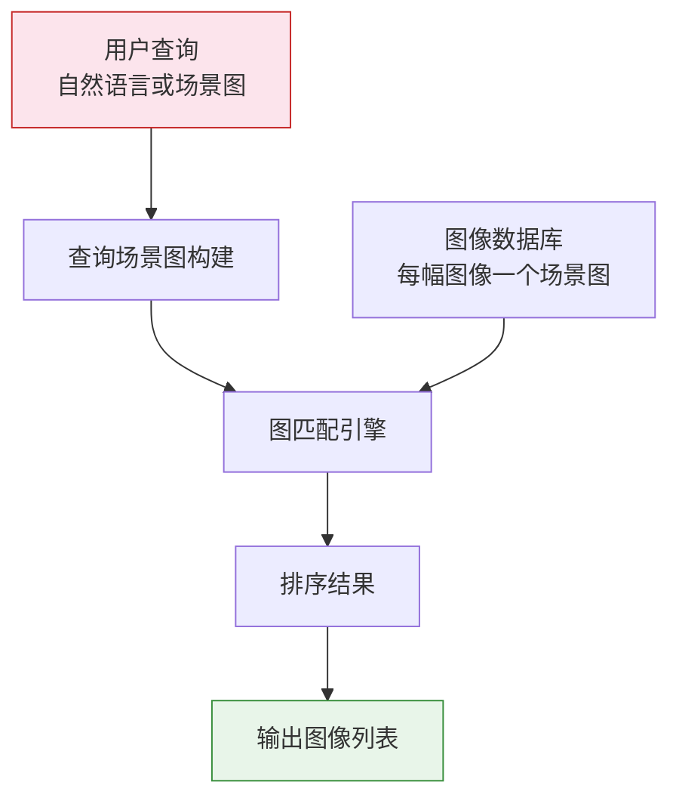
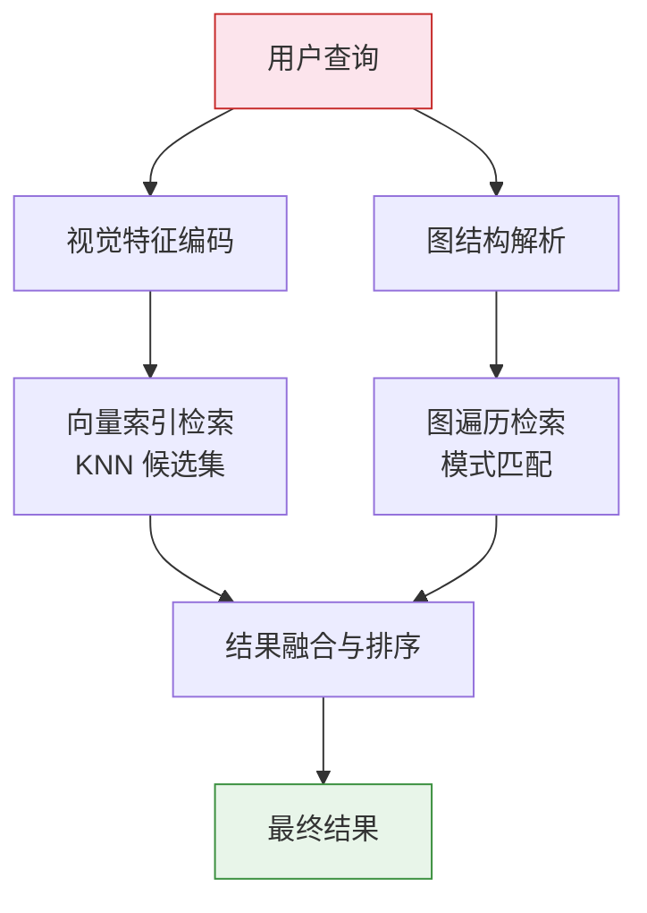
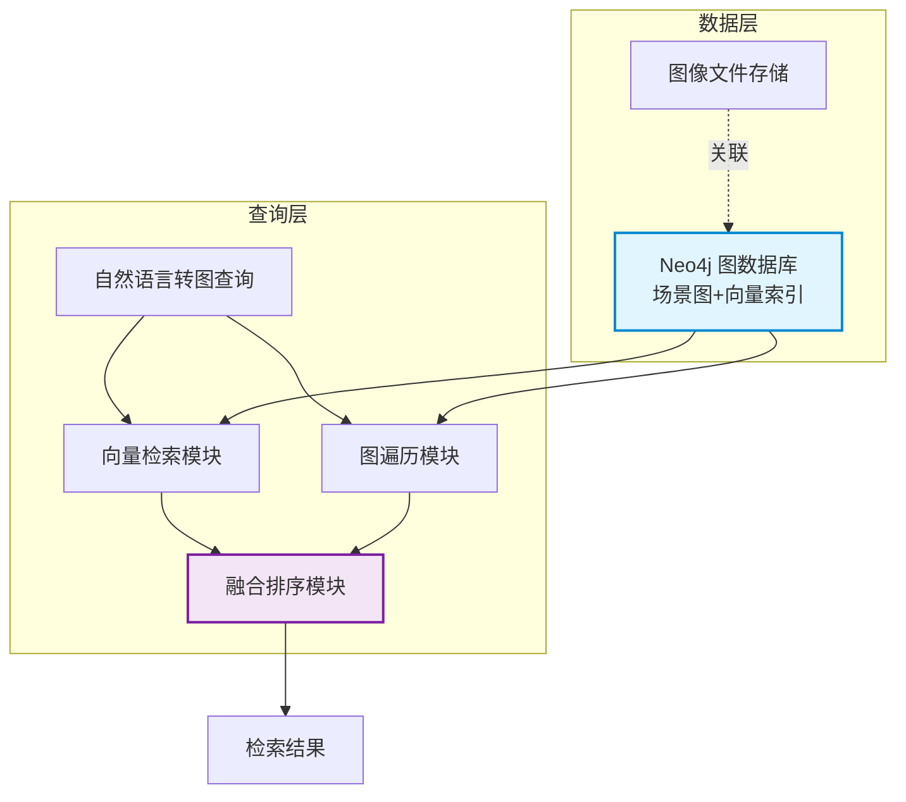

# 图结构图像检索

> **难度级别**：进阶
> **预计阅读时间**：55 分钟
> **前置知识**：[视觉关系检测](./05-03-visual-relationship.md)、[场景图生成](./05-02-scene-graph-generation.md)、[混合检索](../03-graph-native-ai/03-04-hybrid-retrieval.md)

---

## 一、传统图像检索 vs 图结构图像检索

### 1.1 两种检索范式的根本差异

图像检索（Image Retrieval）按照查询方式与匹配机制的不同，可分为传统图像检索与图结构图像检索两大范式。传统图像检索以"视觉特征相似度"为核心，图结构图像检索以"语义图结构匹配"为核心。

| 对比维度 | 传统图像检索 | 图结构图像检索 |
|---------|------------|--------------|
| 查询方式 | 示例图像 / 关键词 | 场景图 / 自然语言描述 |
| 匹配对象 | 整图视觉特征向量 | 物体节点与关系边的图结构 |
| 匹配机制 | 向量相似度（KNN） | 子图同构匹配 / 图遍历 |
| 语义粒度 | 整图级（粗粒度） | 物体与关系级（细粒度） |
| 可解释性 | 低（黑盒相似度） | 高（可追溯匹配路径） |
| 组合查询 | 不支持 | 支持（多物体多关系组合） |
| 典型方法 | CBIR、哈希检索 | 场景图匹配、图神经网络检索 |

### 1.2 传统图像检索的局限

传统基于内容的图像检索（Content-Based Image Retrieval，CBIR）依赖图像的全局或局部视觉特征（如颜色直方图、SIFT 特征、CNN 特征向量），通过计算特征向量间的距离（如欧氏距离、余弦相似度）来衡量图像相似度。这一范式存在根本局限：

- **语义鸿沟（Semantic Gap）**：视觉特征相似的两幅图像，语义可能截然不同。例如蓝色背景下的猫与蓝色背景下的狗，视觉特征高度相似但语义不同；
- **缺乏组合性**：传统检索无法表达"一幅图中同时包含 A 和 B，且 A 在 B 上方"这类组合约束，只能返回整体最相似的图像；
- **不可解释**：向量相似度是黑盒分数，用户无法知道"为什么检索到这幅图像"，难以进行精细的反馈与调整。

### 1.3 图结构图像检索的优势

图结构图像检索（Graph-based Image Retrieval）以场景图为核心，将查询与数据库图像都表示为图结构，通过图匹配（Graph Matching）找到结构一致的图像。其优势在于：

- **细粒度语义匹配**：检索不再停留在"整图相似"，而能精确到"图中包含哪些物体、物体间有何关系"；
- **组合查询能力**：用户可以描述"一个人骑着马，马站在草地上"这样的复杂场景，系统能精确匹配；
- **可解释性**：匹配结果可以追溯到具体的节点与边对应关系，用户可理解"为什么这幅图像被检索到"。

> **图书情报视角**：图结构图像检索的演进，与文献检索从"布尔检索"到"相关度检索"再到"知识图谱检索"的演进如出一辙。传统 CBIR 类似于早期的关键词匹配检索，而图结构检索类似于基于知识图谱的语义检索——后者不仅匹配"字面"，更匹配"结构"。

---

## 二、基于场景图的图像检索原理

### 2.1 检索流程

基于场景图的图像检索（Scene Graph based Image Retrieval，SGIR）的基本流程如下：



检索的关键步骤是：用户输入查询（自然语言描述或直接的场景图），系统将其转化为"查询场景图"（Query Scene Graph），然后在数据库中所有图像的场景图中查找与之匹配的子图。

### 2.2 匹配的三种层次

场景图匹配可分为三个层次，从严到宽：

| 匹配层次 | 定义 | 适用场景 |
|---------|------|---------|
| 完全匹配 | 查询图与数据库图完全同构 | 精确查找特定场景 |
| 子图匹配 | 查询图是数据库图的子图 | 查找包含特定场景的图像 |
| 模糊匹配 | 允许部分节点/边不一致 | 容错检索、相似场景查找 |

实际应用中，子图匹配最为常用——用户通常只描述关心的核心物体与关系，而非图像中的全部内容。

---

## 三、图匹配算法在检索中的应用

### 3.1 子图同构问题

图结构图像检索的核心计算问题是子图同构（Subgraph Isomorphism）问题：给定查询图 $G_q$ 和数据库图 $G_d$，判断 $G_q$ 是否与 $G_d$ 的某个子图同构。这是一个 NP 完全问题，在大规模图像数据库上直接求解计算开销极大。

### 3.2 图匹配算法对比

为应对子图同构的计算复杂性，实践中采用多种策略：

| 算法/策略 | 核心思想 | 时间复杂度 | 适用场景 |
|----------|---------|-----------|---------|
| VF2 算法 | 基于状态空间搜索的精确匹配 | 指数级（最坏） | 小规模精确匹配 |
| 图编辑距离 | 计算将一图变为另一图的最小编辑代价 | NP-hard | 模糊匹配 |
| 图神经网络 | 学习图嵌入，用嵌入相似度近似匹配 | 近线性 | 大规模近似匹配 |
| 过滤-验证 | 先用索引过滤候选，再精确验证 | 准线性 | 工程实践首选 |

### 3.3 过滤-验证策略

工程实践中最常用的是"过滤-验证"（Filter-and-Verification）两阶段策略：

1. **过滤阶段**：利用节点标签索引、关系类型索引或图嵌入，快速排除明显不匹配的图像，缩小候选集；
2. **验证阶段**：对候选集中的图像执行精确的子图同构验证，确认匹配。

在 Neo4j 中，过滤阶段可由索引驱动的 Cypher 查询完成，验证阶段由 Cypher 的模式匹配引擎自动执行。

---

## 四、语义检索：从自然语言到图查询

### 4.1 自然语言到场景图的转换

语义检索（Semantic Retrieval）允许用户用自然语言描述想要检索的图像内容，系统自动将自然语言转化为结构化的图查询。这一过程通常借助大语言模型（Large Language Model，LLM）完成：


### 4.2 LLM 生成 Cypher 查询

借助 LangChain 等框架，可以将自然语言查询直接转化为 Cypher 语句：

```python
from langchain.chains import GraphCypherQAChain
from langchain.graphs import Neo4jGraph

graph = Neo4jGraph(url=NEO4J_URI, username=NEO4J_USER, password=NEO4J_PWD)

chain = GraphCypherQAChain.from_llm(
    llm=llm,
    graph=graph,
    verbose=True
)

# 自然语言查询直接转化为图检索
response = chain.run("找到所有人在骑马的图像，按置信度排序")
```

LLM 将自然语言解析为结构化意图后，生成的 Cypher 查询类似于：

```cypher
MATCH (p:Object {label: 'person'})
      -[r:RIDING]->(h:Object {label: 'horse'})
MATCH (img:Image)-[:DEPICTS]->(p)
RETURN img.image_id, img.file_path, r.confidence
ORDER BY r.confidence DESC;
```

这种"自然语言 → 图查询"的语义检索模式，使得非技术用户也能用日常语言检索图像库，极大降低了图结构检索的使用门槛。

> **图书情报视角**：自然语言到图查询的转换，本质上是一种"自动标引"——将用户的自然语言查询自动映射为结构化的查询图，这与信息检索领域中"查询扩展"（Query Expansion）和"查询翻译"（Query Translation）的研究一脉相承。

---

## 五、混合检索架构

### 5.1 视觉特征向量与图结构关系的融合

单纯的图结构检索虽然语义精确，但依赖于图像知识图谱的完整性——如果场景图生成遗漏了某些物体或关系，图匹配就会失败。单纯的向量检索虽然容错性好，但缺乏组合查询能力。混合检索架构（Hybrid Retrieval Architecture）将两者融合，取长补短。

### 5.2 混合检索流程



混合检索的三个阶段：

| 阶段 | 检索方式 | 输入 | 输出 |
|------|---------|------|------|
| 向量检索 | KNN 向量相似度 | 查询图像/文本的向量 | 候选图像集合 |
| 图检索 | Cypher 模式匹配 | 查询场景图 | 结构匹配的图像 |
| 结果融合 | 分数加权 / RRF | 两路检索结果 | 排序后的最终结果 |

### 5.3 结果融合策略

两路检索结果的融合常用倒数排名融合（Reciprocal Rank Fusion，RRF）方法：

$$ \text{RRF}(d) = \sum_{r \in R} \frac{1}{k + \text{rank}_r(d)} $$

其中 $R$ 为检索结果列表集合，$\text{rank}_r(d)$ 为文档 $d$ 在结果列表 $r$ 中的排名，$k$ 为平滑常数（通常取 60）。RRF 不依赖原始分数的绝对值，只依赖排名，因此适合融合不同尺度的检索分数。

---

## 六、Neo4j 实现图结构图像检索的架构设计

### 6.1 整体架构



### 6.2 核心查询实现

以下 Cypher 展示了图结构图像检索的核心实现——先通过向量检索找到候选，再通过图遍历精确匹配：

```cypher
// 混合检索：向量相似 + 图结构匹配
// 第一步：向量检索找到视觉相似的候选图像
CALL db.index.vector.queryNodes(
  'image_embedding_index', 100, $query_vector
)
YIELD node AS img, score AS vis_score

// 第二步：在候选图像上执行图结构匹配
MATCH (img)-[:DEPICTS]->(p:Object {label: 'person'})
MATCH (p)-[r:RIDING]->(h:Object {label: 'horse'})
MATCH (img)-[:DEPICTS]->(h)

// 第三步：融合分数排序
WITH img, vis_score, r.confidence AS rel_score
RETURN img.image_id, img.file_path,
       vis_score * 0.6 + rel_score * 0.4 AS final_score
ORDER BY final_score DESC
LIMIT 20;
```

这一查询体现了 Neo4j 的核心优势：向量索引与图遍历在同一查询中无缝衔接，无需跨数据库切换，避免了数据同步开销。

---

## 七、检索效率与准确性评估指标

### 7.1 效率指标

| 指标 | 含义 | 目标 |
|------|------|------|
| 查询延迟 | 单次查询的平均响应时间 | < 200ms |
| 吞吐量 | 单位时间可处理的查询数 | > 100 QPS |
| 索引构建时间 | 构建向量索引与图索引的时间 | 小时级（百万级数据） |
| 候选集大小 | 向量检索返回的候选数量 | 50-200（需平衡效率与召回） |

### 7.2 准确性指标

| 指标 | 含义 | 计算方式 |
|------|------|---------|
| Precision@K | 前 K 个结果中相关图像的比例 | 相关结果数 / K |
| Recall@K | 所有相关图像中被检索到的比例 | 检索到的相关数 / 总相关数 |
| mAP | 平均精度均值 | 各查询 AP 的平均 |
| nDCG | 归一化折损累积增益 | 考虑排序位置的增益 |

### 7.3 图结构特有指标

图结构图像检索还引入了特有的评估维度：

- **子图匹配率**：查询图中被成功匹配的节点与边的比例，衡量检索对查询意图的覆盖程度；
- **匹配保真度**：检索结果的场景图与查询场景图的结构相似度，衡量语义一致性。

> **图书情报视角**：检索评估指标体系与信息检索领域的 Cranfield 评测范式一脉相承。Precision、Recall、mAP 等指标正是信息检索研究的经典评估工具，图结构检索在此基础上增加了结构层面的评估维度。这与图书情报领域对"检准率"与"检全率"的关注高度一致。

---

## 八、小结

图结构图像检索代表了图像检索从"视觉特征匹配"到"语义结构匹配"的范式跃迁。它以场景图为核心，支持细粒度的组合查询，具备可解释性，并能通过混合检索架构兼顾效率与准确性。在 Neo4j 中，向量索引与图遍历的无缝融合，为实现这一范式提供了天然的工程基础。

对于图书情报领域而言，图结构图像检索的意义在于：它将信息检索从"基于关键词"推进到"基于知识结构"，使得检索不再依赖人工标引的关键词，而是直接利用图像内容的结构化语义。下一章将从系统层面，探讨如何设计一个完整的 Neo4j 图像数据库服务。

---

> **延伸阅读**：
> - [Neo4j 图像数据库服务设计](./05-05-neo4j-image-database.md)
> - [混合检索](../03-graph-native-ai/03-04-hybrid-retrieval.md)
> - [视觉关系检测](./05-03-visual-relationship.md)
