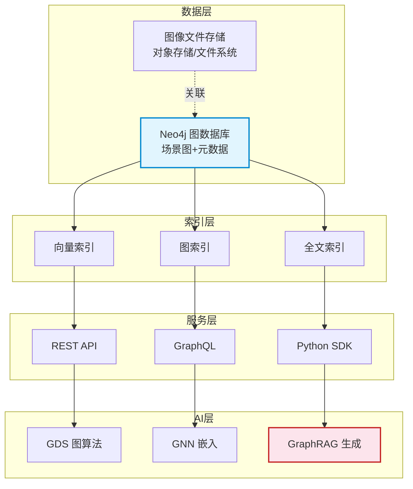
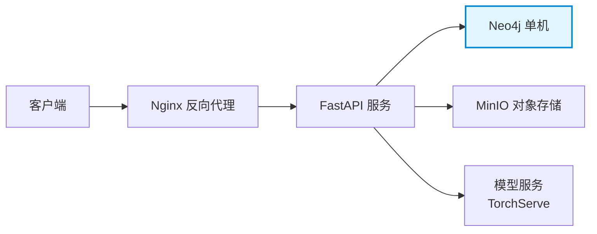

# Neo4j 图像数据库服务设计

> **难度级别**：进阶
> **预计阅读时间**：60 分钟
> **前置知识**：[图结构图像检索](./05-04-graph-image-retrieval.md)、[GraphRAG 架构详解](../03-graph-native-ai/03-02-graphrag-architecture.md)、[Neo4j 架构](../01-foundations/01-03-neo4j-architecture.md)

---

## 一、AI 图像数据库服务整体架构

### 1.1 设计目标

"AI 图像数据库服务"（AI Image Database Service）是面向图像资源的智能化数据管理系统。它不仅存储图像文件与元数据，还构建图像内容的语义图结构，并提供基于向量、图结构与自然语言的智能检索与生成能力。其设计目标包括：

- **内容可理解**：图像不仅以文件形式存储，更以语义图结构被理解；
- **检索智能化**：支持向量检索、图结构检索、自然语言语义检索的混合模式；
- **知识可推理**：基于图结构支持多跳推理与知识发现；
- **生成可增强**：结合 GraphRAG，支持基于图像知识的智能问答与内容生成。

### 1.2 四层架构设计

整个服务架构分为四层：数据层、索引层、服务层、AI 层。



### 1.3 各层职责说明

| 层次 | 组件 | 职责 | 关键技术 |
|------|------|------|---------|
| 数据层 | 图像存储 + 图数据库 | 存储图像文件与结构化语义图 | 对象存储 + Neo4j |
| 索引层 | 向量索引 + 图索引 + 全文索引 | 加速多模态检索 | Neo4j Vector Index / B-Tree / Lucene |
| 服务层 | REST API / GraphQL / SDK | 对外提供查询与写入接口 | FastAPI / Strawberry |
| AI 层 | GDS 算法 + GNN 嵌入 + GraphRAG | 智能分析与生成 | Neo4j GDS / PyTorch / LangChain |

---

## 二、数据层设计

### 2.1 图像文件存储

图像文件采用对象存储（Object Storage）方案（如 MinIO、AWS S3），原因有三：

- **海量扩展性**：对象存储天然支持海量小文件，适合图像数量动辄百万级的场景；
- **CDN 友好**：对象存储可无缝对接 CDN，加速图像访问；
- **存算分离**：图像文件存储与 Neo4j 计算分离，避免大文件传输拖慢图数据库。

图像文件在 Neo4j 中仅存储引用路径，而非二进制数据本身。

### 2.2 图数据库存储

Neo4j 存储图像的结构化语义信息，包括：

- 图像元数据节点（`Image`）：文件路径、尺寸、拍摄时间、版权信息；
- 物体节点（`Object`）：类别、边界框、视觉特征向量；
- 场景节点（`Scene`）：场景类型、环境标签；
- 概念节点（`Concept`）：抽象语义类别；
- 各类关系边：`DEPICTS`、`RIDING`、`ON`、`SIMILAR_TO` 等。

---

## 三、索引层设计

### 3.1 三类索引协同

索引层是检索性能的关键。系统维护三类索引，分别服务于不同的检索需求：

| 索引类型 | 服务对象 | 实现方式 | 典型查询 |
|---------|---------|---------|---------|
| 向量索引 | 视觉相似检索 | Neo4j Vector Index（HNSW） | "找到视觉相似的图像" |
| 图索引 | 结构匹配检索 | Neo4j 原生索引 + 关系索引 | "找到人骑马的图像" |
| 全文索引 | 文本检索 | Neo4j Lucene 全文索引 | "找到标题含'日落'的图像" |

### 3.2 向量索引

Neo4j 5.x 的原生向量索引基于 HNSW（Hierarchical Navigable Small World）算法，支持近似最近邻搜索（Approximate Nearest Neighbor，ANN）。图像整体嵌入与物体区域嵌入分别建立向量索引：

```cypher
// 图像整体嵌入索引（512 维）
CREATE VECTOR INDEX image_vec_index IF NOT EXISTS
FOR (i:Image) ON (i.embedding)
OPTIONS {
  indexConfig: {
    `vector.dimensions`: 512,
    `vector.similarity_function`: 'cosine'
  }
};

// 物体区域嵌入索引（256 维）
CREATE VECTOR INDEX object_vec_index IF NOT EXISTS
FOR (o:Object) ON (o.embedding)
OPTIONS {
  indexConfig: {
    `vector.dimensions`: 256,
    `vector.similarity_function`: 'cosine'
  }
};
```

### 3.3 图索引与全文索引

图索引包括节点属性索引（B-Tree）与关系类型索引，用于加速 Cypher 模式匹配。全文索引基于 Lucene，支持对图像标题、描述等文本字段进行分词检索。

---

## 四、服务层设计

### 4.1 REST API 设计

服务层对外提供 RESTful API，核心接口如下：

| 接口 | 方法 | 功能 | 示例路径 |
|------|------|------|---------|
| 图像上传 | POST | 上传图像并自动生成场景图 | `/api/v1/images` |
| 图像检索 | GET | 多模态图像检索 | `/api/v1/images/search` |
| 关系查询 | GET | 查询视觉关系 | `/api/v1/relations` |
| 知识问答 | POST | 基于 GraphRAG 的问答 | `/api/v1/qa` |

### 4.2 GraphQL 设计

GraphQL（Graph Query Language）天然适合图数据的查询。相比 REST 的多端点模式，GraphQL 允许客户端用单一查询精确指定所需字段与关联深度：

```graphql
query FindImagesWithRiding {
  images(where: { objects_SOME: { label: "person" } }) {
    image_id
    file_path
    objects(where: { label_IN: ["person", "horse"] }) {
      label
      bbox
      outgoing(where: { type: "RIDING" }) {
        type
        confidence
        to { label }
      }
    }
  }
}
```

### 4.3 Python SDK

为方便 AI 应用开发，提供 Python SDK 封装常用操作：

```python
from image_kb import ImageKnowledgeBase

kb = ImageKnowledgeBase(
    neo4j_uri="bolt://localhost:7687",
    neo4j_user="neo4j",
    neo4j_password="password"
)

# 上传图像并自动构建场景图
kb.ingest_image("photo_001.jpg", auto_scene_graph=True)

# 混合检索
results = kb.search(
    query="一个人骑着马在草地上",
    mode="hybrid",
    limit=20
)

# GraphRAG 问答
answer = kb.ask("数据库中有多少幅人骑马的图像？")
```

---

## 五、AI 层设计

### 5.1 GDS 图算法应用

Neo4j 图数据科学（Graph Data Science，GDS）库提供丰富的图算法，可用于图像知识图谱的智能分析：

| 算法类别 | 代表算法 | 图像应用场景 |
|---------|---------|------------|
| 中心性 | PageRank | 发现图像库中的"核心物体" |
| 社区发现 | Louvain | 发现图像内容的主题聚类 |
| 相似度 | Node Similarity | 发现视觉相似的物体群 |
| 路径发现 | A* / Dijkstra | 推理物体间的隐含关联路径 |

### 5.2 GNN 嵌入

图神经网络（Graph Neural Network，GNN）可学习图像知识图谱中节点与关系的低维嵌入，用于下游任务：

- **节点嵌入**：将物体节点映射为向量，支持基于图结构的相似度检索；
- **链接预测**：预测图像中尚未检测到的潜在关系，弥补场景图生成的遗漏；
- **图分类**：对图像场景图进行整体分类，辅助场景识别。

Neo4j GDS 内置了 Node2Vec、FastRP、GraphSAGE 等图嵌入算法，可直接在图数据库内完成嵌入计算。

### 5.3 GraphRAG 生成

GraphRAG（Graph Retrieval-Augmented Generation）将图像知识图谱与大语言模型结合，实现基于图像知识的智能问答：

```python
from langchain.chains import GraphCypherQAChain

# 自然语言查询图像知识库
chain = GraphCypherQAChain.from_llm(llm=llm, graph=graph)
answer = chain.run("找出所有在厨房场景中、桌上有红色苹果的图像")
```

GraphRAG 的优势在于：它不是让 LLM "看图说话"，而是让 LLM 基于结构化的图像知识图谱进行推理，从而保证回答的事实可追溯性。

---

## 六、技术栈选型

### 6.1 技术栈选型表

| 层次 | 技术组件 | 选型 | 选型理由 |
|------|---------|------|---------|
| 图数据库 | 核心存储 | Neo4j 5.x | 原生向量索引 + 图遍历共库 |
| 后端框架 | API 服务 | Python + FastAPI | 异步高性能、AI 生态丰富 |
| AI 编排 | LLM 集成 | LangChain | 原生 Neo4j 集成、GraphRAG 支持 |
| 向量模型 | 图像嵌入 | CLIP / ResNet | 视觉特征提取成熟稳定 |
| 视觉模型 | 物体检测与关系 | DETR + VRD 模型 | 端到端场景图生成 |
| 图算法 | 图分析 | Neo4j GDS | 内置丰富图算法库 |
| 图嵌入 | GNN | PyG + GDS | 灵活的图嵌入训练 |
| 对象存储 | 图像文件 | MinIO / S3 | 海量小文件存储 |
| 容器化 | 部署 | Docker + Kubernetes | 弹性伸缩 |

### 6.2 选型逻辑

技术栈的核心选型逻辑是"以 Neo4j 为中心的一体化"。传统方案往往需要图数据库 + 向量数据库 + 全文搜索引擎三套独立系统，数据同步与一致性维护成本高昂。Neo4j 5.x 将向量索引、图索引、全文索引整合于同一数据库中，使得一次查询即可同时利用三种检索能力，无需跨库切换。

---

## 七、部署架构建议

### 7.1 单机部署（开发与小型应用）



### 7.2 集群部署（生产环境）

生产环境建议采用分集群部署：

| 组件 | 部署方式 | 扩展策略 |
|------|---------|---------|
| Neo4j | 因果集群（Causal Cluster） | 读副本水平扩展 |
| FastAPI | 多实例 + 负载均衡 | 水平扩展 |
| MinIO | 分布式集群 | 数据分片 |
| 模型服务 | GPU 节点池 | 弹性伸缩 |
| Redis | 缓存集群 | 减轻数据库压力 |

Neo4j 因果集群（Causal Cluster）保证写入的强一致性，同时通过读副本分担查询负载。对于以读为主（检索）的图像数据库场景，读副本可水平扩展至数十个节点。

---

## 八、与传统 DAM 系统对比

### 8.1 什么是 DAM 系统

数字资产管理系统（Digital Asset Management，DAM）是图书情报与数字内容管理领域的传统系统，用于存储、组织、检索图像、视频等数字资产。传统 DAM 系统以元数据编目为核心，以关键词检索为主要检索方式。

### 8.2 对比表

| 对比维度 | 传统 DAM 系统 | Neo4j 图像数据库服务 |
|---------|-------------|-------------------|
| 数据模型 | 关系型数据库 + 文件存储 | 属性图模型 + 向量索引 |
| 内容理解 | 人工编目元数据 | AI 自动生成场景图 |
| 检索方式 | 关键词 / 标签 | 向量 + 图结构 + 自然语言 |
| 关系表达 | 无 | 显式视觉关系网络 |
| 推理能力 | 无 | 多跳图推理 |
| 生成能力 | 无 | GraphRAG 智能问答 |
| 编目成本 | 高（人工为主） | 低（AI 辅助） |
| 检索粒度 | 整图级 | 物体与关系级 |
| 可扩展性 | 受限于关系型架构 | 图原生水平扩展 |

### 8.3 演进路径

从传统 DAM 到 Neo4j 图像数据库服务，并非全盘推翻，而是渐进式增强：

1. **阶段一：图增强元数据**——在现有 DAM 基础上，为图像元数据增加图结构层，用 Neo4j 存储图像间的关系；
2. **阶段二：内容图谱接入**——引入场景图生成，将图像内容的语义图写入 Neo4j；
3. **阶段三：智能检索升级**——将检索从关键词升级为向量 + 图结构的混合模式；
4. **阶段四：AI 生成融合**——引入 GraphRAG，实现基于图像知识的智能问答与生成。

---

## 九、图书情报视角：数字资产管理系统演进

### 9.1 从资源管理到知识管理

图书情报领域对数字资产的管理经历了从"资源管理"到"知识管理"的演进。传统 DAM 系统关注的是资源的存储、编目与检索，回答的是"我们有哪些资源"的问题。而基于 Neo4j 的图像数据库服务，将管理对象从"资源"提升到"知识"——不仅管理图像文件，更管理图像所承载的内容与关系，回答的是"这些图像意味着什么"的问题。

### 9.2 编目范式的变迁

这一演进映射到编目实践上，是从"以资源为中心的编目"到"以知识为中心的编目"的变迁：

| 编目范式 | 以资源为中心 | 以知识为中心 |
|---------|------------|------------|
| 编目对象 | 图像资源 | 图像内容与关系 |
| 编目方法 | 字段著录 | 图谱构建 |
| 编目主体 | 人工编目员 | AI 模型 + 人工审核 |
| 知识形态 | 扁平元数据 | 网络化知识图 |
| 检索能力 | 关键词匹配 | 图推理与语义检索 |

### 9.3 对信息资源管理的启示

Neo4j 图像数据库服务对信息资源管理（Information Resource Management）实践的启示在于：

1. **元数据的图化**：传统元数据以"记录"为单位，记录间的关系难以表达。将元数据图化后，记录变为节点，记录间的关系变为边，元数据本身成为可推理的知识网络；
2. **AI 赋能编目**：计算机视觉与图技术的结合，使得图像编目从纯人工走向"AI 生成 + 人工审核"的协同模式，这与 RDA（Resource Description and Access，资源描述与检索）标准中强调的"数据效率"理念一致；
3. **服务智能化**：GraphRAG 使得图像数据库不仅是存储系统，更是智能问答系统。用户可以像与图书管理员对话一样，用自然语言查询图像库——这本质上是将参考咨询服务（Reference Service）的理念引入了图像资源管理。

---

## 十、小结

Neo4j 图像数据库服务以"数据-索引-服务-AI"四层架构为基础，将图像存储、语义图构建、多模态检索与智能生成融为一体。其核心优势在于：Neo4j 将向量索引、图索引与全文索引整合于同一数据库，避免了多系统拼接的数据同步开销。

对于图书情报领域而言，这一架构代表了数字资产管理系统（DAM）的演进方向——从资源管理走向知识管理，从人工编目走向 AI 赋能编目，从关键词检索走向图推理与语义检索。下一章将通过五个具体案例，展示这一架构在不同领域的落地实践。

---

> **延伸阅读**：
> - [应用案例分析](./05-06-case-studies.md)
> - [GraphRAG 架构详解](../03-graph-native-ai/03-02-graphrag-architecture.md)
> - [图结构图像检索](./05-04-graph-image-retrieval.md)
