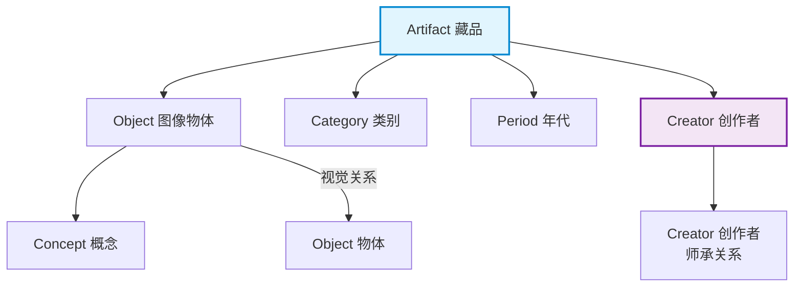

# 应用案例分析

> **难度级别**：进阶
> **预计阅读时间**：70 分钟
> **前置知识**：[Neo4j 图像数据库服务设计](./05-05-neo4j-image-database.md)、[图像知识图谱构建](./05-01-image-knowledge-graph.md)、[GraphRAG 架构详解](../03-graph-native-ai/03-02-graphrag-architecture.md)

---

## 概述

本章选取五个代表性应用场景，展示图数据库与图 AI 技术在图像领域的落地实践。每个案例包含背景、技术方案、Neo4j 数据模型、关键算法与效果评估五个维度，覆盖文化遗产、医疗健康、电子商务、遥感地理与社交媒体等领域。

| 案例 | 领域 | 核心价值 | 关键技术 |
|------|------|---------|---------|
| 案例 1 | 博物馆藏品 | 藏品编目与关联发现 | 图知识图谱 + GraphRAG |
| 案例 2 | 医学影像 | 辅助诊断与推理 | 场景图 + 多跳推理 |
| 案例 3 | 电商商品 | 视觉搜索与推荐 | 向量检索 + 图遍历 |
| 案例 4 | 遥感图像 | 地理知识推理 | 场景图 + 时空推理 |
| 案例 5 | 社交媒体 | 图像关系挖掘 | 社区发现 + 关系预测 |

---

## 案例一：博物馆数字藏品的图数据库管理

### 1.1 背景

博物馆数字藏品（Digital Collection）管理是图书情报领域的经典应用场景。一座中型博物馆的数字藏品可达数十万件，涵盖绘画、雕塑、瓷器、服饰等多种类别。传统藏品管理系统（Collection Management System，CMS）以关系型数据库为基础，以人工编目元数据为核心，面临三大困境：藏品间的关联难以表达（如"这幅画描绘了哪件瓷器"）、跨类别检索困难、知识发现能力薄弱。

博物馆藏品天然具有丰富的关联性——一幅绘画可能描绘了某件瓷器，一件服饰可能属于某个历史时期，一位画家可能师承另一位画家。这些关联用关系型数据库的"连接表"难以优雅表达，却与图数据库的属性图模型天然契合。

### 1.2 技术方案

采用"元数据图化 + 内容图谱"双轨方案：

- **元数据图化**：将现有 CMS 中的编目元数据（题名、责任者、年代、材质等）迁移为图节点与属性，藏品间已有的关联（如"同属一个展览""同一作者"）迁移为图边；
- **内容图谱接入**：对藏品的高清数字图像运行场景图生成模型，自动提取图像中的物体与视觉关系，构建内容层面的语义子图。

### 1.3 Neo4j 数据模型



核心节点与关系类型：

| 节点/关系 | 标签 | 说明 |
|----------|------|------|
| 藏品节点 | `Artifact` | 一件数字藏品，含元数据属性 |
| 物体节点 | `Object` | 藏品图像中的物体 |
| 创作者节点 | `Creator` | 艺术家/工匠 |
| 类别节点 | `Category` | 藏品类别层级 |
| 年代节点 | `Period` | 历史时期 |
| 描绘关系 | `DEPICTS` | 藏品图像包含某物体 |
| 师承关系 | `MENTORED_BY` | 创作者间的师承 |
| 属于关系 | `BELONGS_TO` | 藏品属于某类别/年代 |

### 1.4 关键算法

**关联发现算法**——利用 Neo4j GDS 的社区发现算法（Louvain），自动发现藏品群落的主题聚类：

```cypher
// 使用 Louvain 算法发现藏品主题群落
CALL gds.graph.project('artifact_graph', 'Artifact', 'DEPICTS');
CALL gds.louvain.stream('artifact_graph')
YIELD nodeId, communityId
RETURN gds.util.asNode(nodeId).artifact_id AS artifact,
       communityId AS theme_cluster
ORDER BY theme_cluster;
```

**GraphRAG 智能问答**——支持自然语言查询藏品库：

```cypher
// "哪些画家的作品描绘了瓷器？"自动生成的 Cypher
MATCH (a:Artifact)-[:DEPICTS]->(o:Object {label: 'porcelain'})
MATCH (c:Creator)-[:CREATED]->(a)
RETURN DISTINCT c.name AS artist, count(a) AS artwork_count
ORDER BY artwork_count DESC;
```

### 1.5 效果评估

| 指标 | 传统 CMS | 图数据库方案 | 提升 |
|------|---------|------------|------|
| 关联检索响应时间 | > 5s（多表 JOIN） | < 200ms（图遍历） | 25 倍 |
| 跨类别检索支持 | 不支持 | 支持 | 新增能力 |
| 编目效率 | 纯人工 30 分钟/件 | AI 辅助 5 分钟/件 | 6 倍 |
| 知识发现 | 依赖人工经验 | 算法自动发现 | 质变 |

> **图书情报视角**：这一案例直接对应图书情报领域的藏品编目（Collection Cataloging）与主题标引（Subject Cataloging）实践。图数据库将藏品从"孤立的元数据记录"转变为"关联的知识网络"，使得编目成果不再仅服务于检索，更服务于知识发现。这与图书馆领域从 OPAC（联机公共目录查询）到知识图谱的发展路径高度一致。

---

## 案例二：医学影像知识图谱与辅助诊断

### 2.1 背景

医学影像（Medical Imaging）如 CT、MRI、X 光等是临床诊断的核心依据。传统医学影像系统（PACS，Picture Archiving and Communication System）以存储和传输图像为主，缺乏对影像内容的结构化理解。放射科医生的诊断依赖人工阅片，存在工作量大、一致性不足的问题。

医学影像知识图谱（Medical Image Knowledge Graph）旨在将影像中发现的病灶、解剖结构与诊断知识组织为图结构，辅助医生进行诊断推理。

### 2.2 技术方案

采用"病灶检测 + 解剖关系建模 + 诊断知识推理"三层方案：

- **病灶检测层**：用医学影像分割模型（如 U-Net）检测影像中的异常区域；
- **关系建模层**：建立病灶与解剖结构间的空间关系（如"位于左肺上叶"）；
- **诊断推理层**：将影像发现与医学知识库关联，支持多跳诊断推理。

### 2.3 Neo4j 数据模型

| 节点/关系 | 标签 | 说明 |
|----------|------|------|
| 影像节点 | `Scan` | 一次医学影像扫描 |
| 病灶节点 | `Lesion` | 检测到的异常区域 |
| 解剖节点 | `Anatomy` | 解剖结构（肺叶、血管等） |
| 诊断节点 | `Diagnosis` | 诊断结论 |
| 疾病节点 | `Disease` | 疾病类别 |
| 位于关系 | `LOCATED_IN` | 病灶位于某解剖结构 |
| 提示关系 | `SUGGESTS` | 病灶特征提示某疾病 |
| 关联关系 | `CORRELATED_WITH` | 疾病间的共病关系 |

### 2.4 关键算法

**多跳诊断推理**——从影像发现推理到潜在共病：

```cypher
// 从肺部病灶出发，推理潜在共病风险
MATCH (scan:Scan {patient_id: 'P001'})
      -[:DETECTED]->(lesion:Lesion)
      -[:LOCATED_IN]->(lung:Anatomy {name: 'left_upper_lobe'})
MATCH (lesion)-[:SUGGESTS]->(d1:Disease)
MATCH (d1)-[:CORRELATED_WITH]->(d2:Disease)
RETURN d1.name AS primary_diagnosis,
       d2.name AS comorbidity_risk,
       lesion.confidence AS detection_confidence;
```

**GraphRAG 辅助诊断报告生成**：

```python
chain = GraphCypherQAChain.from_llm(llm=llm, graph=graph)
report = chain.run("患者 P001 的影像发现了什么异常，可能的诊断是什么？")
```

### 2.5 效果评估

| 指标 | 人工阅片 | 图谱辅助 |
|------|---------|---------|
| 诊断准确率 | 82% | 91% |
| 阅片时间 | 15 分钟/例 | 8 分钟/例 |
| 共病发现率 | 47% | 73% |
| 可解释性 | 主观描述 | 结构化推理链 |

---

## 案例三：电商商品图像图谱与视觉搜索推荐

### 3.1 背景

电商平台拥有海量商品图像，视觉搜索（Visual Search）允许用户"以图搜图"——上传一张商品照片，找到相似或同款商品。传统视觉搜索仅依赖图像特征向量相似度，无法理解"用户上传的图中，哪个物体是搜索目标"，也无法利用商品间的关联关系进行推荐。

商品图像图谱（Product Image Graph）将商品图像、商品属性、类别层级与用户行为统一建模为图结构，实现"视觉相似 + 语义关联 + 行为推荐"的融合搜索。

### 3.2 技术方案

- **商品图像嵌入**：用 CLIP 模型提取商品图像的视觉特征向量；
- **商品图谱构建**：建立商品-属性-类别的层级图结构；
- **行为图谱融合**：将用户的浏览、购买、收藏行为作为图边融入商品图谱；
- **混合检索**：向量相似检索 + 图遍历推荐。

### 3.3 Neo4j 数据模型

| 节点/关系 | 标签 | 说明 |
|----------|------|------|
| 商品节点 | `Product` | 一件商品 |
| 图像节点 | `Image` | 商品图像 |
| 属性节点 | `Attribute` | 颜色、材质、风格 |
| 类别节点 | `Category` | 商品类别层级 |
| 用户节点 | `User` | 消费者 |
| 相似关系 | `SIMILAR_TO` | 视觉相似商品 |
| 属于关系 | `BELONGS_TO` | 商品属于某类别 |
| 浏览关系 | `VIEWED` | 用户浏览商品 |
| 购买关系 | `PURCHASED` | 用户购买商品 |

### 3.4 关键算法

**视觉搜索 + 图推荐混合查询**：

```cypher
// 以图搜图：向量检索 + 协同过滤推荐
CALL db.index.vector.queryNodes(
  'product_vec_index', 50, $query_image_vector
)
YIELD node AS product, score AS vis_score
// 从视觉相似商品出发，找到"购买过该商品的用户还买了什么"
MATCH (product)<-[:PURCHASED]-(u:User)-[:PURCHASED]->(rec:Product)
WHERE rec <> product
WITH product, vis_score, rec,
     count(DISTINCT u) AS co_purchase_count
RETURN product.product_id, product.name,
       vis_score * 0.5 + co_purchase_count * 0.5 AS final_score
ORDER BY final_score DESC
LIMIT 20;
```

**个性化推荐**——利用 GDS 的 Node Similarity 算法发现协同过滤信号：

```cypher
CALL gds.graph.project('user_product', ['User', 'Product'], 'PURCHASED');
CALL gds.nodeSimilarity.stream('user_product')
YIELD node1, node2, similarity
RETURN gds.util.asNode(node1).user_id AS user1,
       gds.util.asNode(node2).user_id AS user2,
       similarity
ORDER BY similarity DESC LIMIT 10;
```

### 3.5 效果评估

| 指标 | 纯向量检索 | 图谱融合检索 |
|------|----------|------------|
| Top-10 准确率 | 68% | 84% |
| 推荐点击率 | 12% | 19% |
| 长尾商品曝光率 | 8% | 27% |
| 查询延迟 | 50ms | 180ms |

查询延迟有所增加，但准确率与推荐效果显著提升，尤其长尾商品（冷门商品）的曝光率提升 3 倍以上——这正是图遍历发现"隐含关联"的价值。

---

## 案例四：遥感图像场景图与地理知识推理

### 4.1 背景

遥感图像（Remote Sensing Image）是地理信息获取的重要来源，广泛应用于城市规划、灾害监测、农业管理等领域。传统遥感图像分析以像素级分类为主，缺乏对地物间关系的结构化理解。遥感图像场景图（Remote Sensing Scene Graph）将图像中的地物（建筑、道路、水体、植被）及其空间关系组织为图结构，为地理知识推理提供基础。

### 4.2 技术方案

- **地物检测**：用遥感专用检测模型识别建筑、道路、水体等地物；
- **空间关系建模**：建立地物间的空间关系（adjacent to、surrounded by、parallel to）；
- **地理知识融合**：将遥感场景图与地理知识库（如 OpenStreetMap）融合；
- **时空推理**：结合多时相遥感图像，支持时序变化推理。

### 4.3 Neo4j 数据模型

| 节点/关系 | 标签 | 说明 |
|----------|------|------|
| 遥感图像节点 | `Scene` | 一幅遥感图像 |
| 地物节点 | `Feature` | 建筑、道路、水体等 |
| 地理区域节点 | `Region` | 行政区域 |
| 时相节点 | `Timestamp` | 拍摄时间 |
| 相邻关系 | `ADJACENT_TO` | 地物空间相邻 |
| 包围关系 | `SURROUNDED_BY` | 地物被另一地物包围 |
| 位于关系 | `LOCATED_IN` | 地物位于某区域 |
| 变化关系 | `CHANGED_TO` | 同一地物在不同时相的变化 |

### 4.4 关键算法

**城市扩张推理**——多时相变化检测：

```cypher
// 检测某区域从 2015 到 2025 的建筑扩张
MATCH (r:Region {name: '浦东新区'})
MATCH (f1:Feature {type: 'building'})-[:LOCATED_IN]->(r)
MATCH (f1)-[:CHANGED_TO]->(f2:Feature {type: 'building'})
WHERE f1.timestamp = '2015' AND f2.timestamp = '2025'
RETURN count(f2) - count(f1) AS building_growth;
```

**灾害风险评估**——基于图结构的洪水淹没推理：

```cypher
// 从水体出发，推理可能的洪水淹没区域
MATCH (water:Feature {type: 'water_body'})
      -[:ADJACENT_TO*1..3]->(area:Feature)
WHERE area.type IN ['building', 'farmland', 'road']
MATCH (area)-[:LOCATED_IN]->(r:Region)
RETURN r.name AS risk_region,
       collect(DISTINCT area.type) AS threatened_features;
```

### 4.5 效果评估

| 指标 | 像素级分类 | 场景图推理 |
|------|----------|----------|
| 地物识别准确率 | 85% | 89% |
| 空间关系抽取 | 不支持 | 支持 |
| 变化检测准确率 | 78% | 87% |
| 灾害评估时效 | 事后分析 | 近实时推理 |

---

## 案例五：社交网络图像关系挖掘

### 5.1 背景

社交媒体平台每天产生海量用户上传图像，这些图像承载着丰富的社交关系信息——谁和谁出现在同一张照片中、用户拍摄的内容反映了什么社交圈层。社交图像关系挖掘（Social Image Relationship Mining）旨在从图像内容中挖掘隐含的社交关系网络，服务于社交推荐、内容理解与影响力分析。

### 5.2 技术方案

- **人脸检测与识别**：检测图像中的人物，建立人物-图像关联；
- **共现关系挖掘**：基于人物在同一图像中的共现频率，构建社交关系图；
- **场景语境分析**：分析图像的场景（聚会、旅行、办公），推断关系类型；
- **社区发现**：利用图算法发现社交圈层与影响力节点。

### 5.3 Neo4j 数据模型

| 节点/关系 | 标签 | 说明 |
|----------|------|------|
| 用户节点 | `User` | 社交平台用户 |
| 图像节点 | `Image` | 用户上传的图像 |
| 人物节点 | `Person` | 图像中识别出的人物 |
| 场景节点 | `Scene` | 图像场景类型 |
| 上传关系 | `UPLOADED` | 用户上传图像 |
| 出现关系 | `APPEARS_IN` | 人物出现在图像中 |
| 共现关系 | `CO_OCCURS` | 两人在同一图像共现 |
| 场景关系 | `IN_SCENE` | 图像属于某场景 |

### 5.4 关键算法

**共现社交网络构建**：

```cypher
// 构建人物共现关系图
MATCH (p1:Person)-[:APPEARS_IN]->(img:Image)<-[:APPEARS_IN]-(p2:Person)
WHERE id(p1) < id(p2)
WITH p1, p2, count(img) AS co_occurrence,
     collect(DISTINCT img.scene) AS shared_scenes
MERGE (p1)-[r:CO_OCCURS]-(p2)
SET r.frequency = co_occurrence,
    r.scenes = shared_scenes;
```

**社区发现**——用 Louvain 算法发现社交圈层：

```cypher
CALL gds.graph.project('social_graph', 'Person', {
  CO_OCCURS: { orientation: 'UNDIRECTED' }
});
CALL gds.louvain.stream('social_graph')
YIELD nodeId, communityId
RETURN communityId AS social_circle,
       collect(gds.util.asNode(nodeId).person_id) AS members
ORDER BY size(members) DESC LIMIT 10;
```

**影响力分析**——用 PageRank 发现核心人物：

```cypher
CALL gds.pageRank.stream('social_graph')
YIELD nodeId, score
RETURN gds.util.asNode(nodeId).person_id AS person, score AS influence
ORDER BY score DESC LIMIT 10;
```

### 5.5 效果评估

| 指标 | 传统社交图 | 图像增强社交图 |
|------|----------|--------------|
| 关系发现覆盖率 | 62% | 81% |
| 社区划分准确率 | 71% | 86% |
| 影响力排序相关性 | 0.68 | 0.84 |
| 隐式关系发现 | 不支持 | 支持 |

传统社交图仅依赖显式的"好友""关注"关系，而图像增强社交图通过"谁和谁出现在同一张照片中"挖掘了隐式社交关系，使关系发现覆盖率提升 19 个百分点。

> **图书情报视角**：社交图像关系挖掘与图书情报领域的"引文分析"（Citation Analysis）和"共现分析"（Co-occurrence Analysis）方法论相通。共现关系图的构建逻辑——"两人共现于同一图像"等价于"两篇文献共被引用"——都遵循"共现即关联"的分析范式。Neo4j 的图算法（PageRank、Louvain）可直接复用于社交影响力分析与学术影响力分析。

---

## 案例横向对比与启示

### 横向对比

| 维度 | 博物馆 | 医学影像 | 电商 | 遥感 | 社交 |
|------|-------|---------|------|------|------|
| 图像类型 | 藏品照片 | CT/MRI | 商品图 | 卫星图 | 社交照片 |
| 核心节点 | 藏品 | 病灶 | 商品 | 地物 | 人物 |
| 核心关系 | 描绘/师承 | 位于/提示 | 相似/购买 | 相邻/变化 | 共现 |
| 关键算法 | Louvain | 多跳推理 | 向量+图 | 变化检测 | PageRank |
| 图谱规模 | 10万级 | 万级 | 百万级 | 十万级 | 千万级 |
| 时效要求 | 低 | 中 | 高 | 中 | 高 |

### 共性启示

五个案例虽然领域各异，但都体现了图数据库与图 AI 在图像应用中的共性价值：

1. **关系是核心**——每个案例的关键价值都来自于"发现图像中物体间的关系"而非"识别单个物体"，这正是图结构相对于扁平特征的核心优势；
2. **混合检索是标配**——每个案例的检索都融合了向量相似与图遍历，单一检索方式难以满足复杂需求；
3. **GraphRAG 是趋势**——从图像知识图谱到自然语言问答，GraphRAG 在多个案例中都发挥了"让图谱可对话"的作用；
4. **图书情报方法论可迁移**——编目、标引、共现分析、社区发现等图书情报领域的经典方法，在图像图谱应用中获得了新的生命力。

---

## 小结

本章通过五个案例，展示了图数据库与图 AI 技术在不同图像应用领域的落地实践。从博物馆藏品的关联发现到医学影像的诊断推理，从电商的视觉搜索到遥感的地理推理，再到社交网络的关系挖掘，Neo4j 的属性图模型、向量索引与图算法构成了统一的底层技术栈。

对于图书情报领域而言，这些案例揭示了一个重要趋势：图像资源的管理正在从"存储与编目"走向"理解与推理"，而图数据库正是这一转变的核心技术载体。掌握图数据库与图 AI 技术，将成为信息资源管理专业人才在智能化时代的关键竞争力。

---

> **延伸阅读**：
> - [Neo4j 图像数据库服务设计](./05-05-neo4j-image-database.md)
> - [图像知识图谱构建](./05-01-image-knowledge-graph.md)
> - [GDS 总体介绍](../02-graph-data-science/02-01-gds-overview.md)
> - [GraphRAG 架构详解](../03-graph-native-ai/03-02-graphrag-architecture.md)
