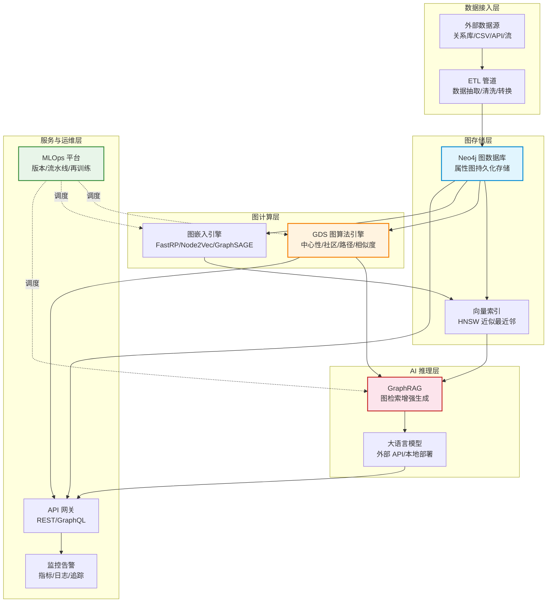
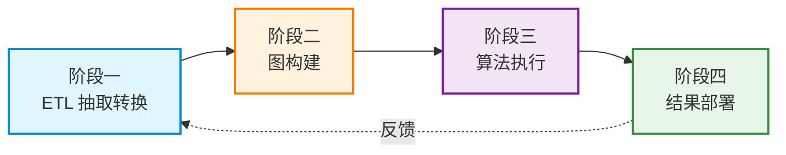
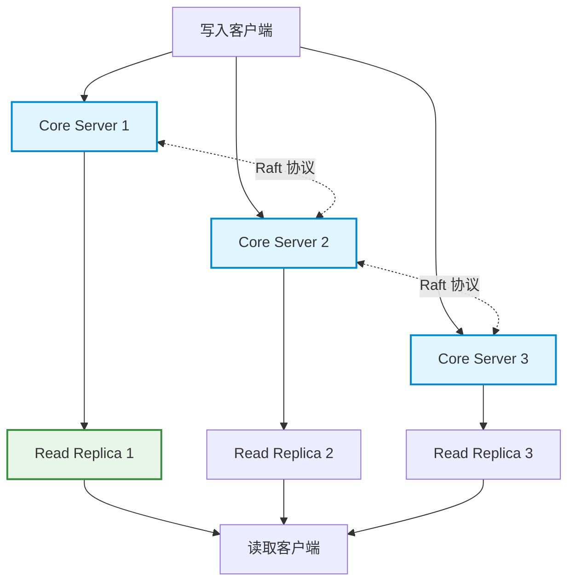

# 生产级图 AI 工作流

> **难度级别**：高级
> **预计阅读时间**：50 分钟
> **前置知识**：[图原生 AI 概念解析](../03-graph-native-ai/03-01-graph-native-ai-concept.md)、[GDS 实战指南](../02-graph-data-science/02-07-gds-practice.md)、[Neo4j 图像数据库服务设计](../05-image-applications/05-05-neo4j-image-database.md)

---

## 一、从抽象图论到生产级 AI 工作流

### 1.1 讲座核心主题回顾

本知识库围绕的讲座提出了一个核心论断：**"抽象图论与生产级 AI 工作流完美衔接"**。前文的 [图原生 AI 概念解析](../03-graph-native-ai/03-01-graph-native-ai-concept.md) 已从概念层面解读了这句话，本章则从工程实践层面展开——当一个研究团队或企业要把图算法、图嵌入、GraphRAG 等技术真正部署到生产环境中时，需要面对哪些系统性的工程挑战。

"生产级"（Production-grade）这个词是有严格含义的。一个能跑通 Demo 的 Jupyter Notebook 和一个支撑真实业务运行的 AI 系统，之间的差距犹如实验室化学与化工生产的区别。生产级系统要求：高可用（High Availability）、可扩展（Scalability）、可监控（Observability）、可回滚（Rollback）、可审计（Auditability）。学术原型往往只关注"能不能跑出结果"，而生产系统必须回答"出错了怎么办、数据更新了怎么办、模型漂移了怎么办"。

### 1.2 图论概念到工程能力的映射

图论（Graph Theory）提供了三百年来积累的抽象概念体系，而生产级 AI 工作流需要把这些概念转化为可调用的工程能力。下表展示了这一映射关系：

| 图论抽象概念 | 生产级工程实现 | 关键工程要求 |
|-------------|--------------|-------------|
| 最短路径（Shortest Path） | GDS Dijkstra / A* 过程调用 | 低延迟、支持动态权重 |
| 中心性（Centrality） | GDS PageRank / Betweenness 批量计算 | 增量计算、结果缓存 |
| 社区结构（Community） | GDS Louvain 周期性运行 | 结果稳定性、参数管理 |
| 子图（Subgraph） | GraphRAG 检索单元 | 查询优化、上下文长度控制 |
| 图同构（Isomorphism） | 图嵌入向量相似度检索 | 索引加速、近似搜索 |
| 连通性（Connectivity） | 连通分量算法 + 告警 | 实时监控、阈值管理 |

这种映射的价值在于：研究者不再需要从零实现图论算法，而是通过标准化的 API 调用即可将理论能力嵌入业务流程。这正是"完美衔接"的工程含义——理论优美性与工程可用性不再是二选一的取舍。

---

## 二、生产级图 AI 工作流的组件架构

一个完整的生产级图 AI 工作流并非单一系统，而是由多个组件协同构成的流水线。下图展示了其整体架构：



### 2.1 各层职责说明

| 层次 | 核心组件 | 职责定位 | 关键技术 |
|------|---------|---------|---------|
| 数据接入层 | ETL 管道 | 从异构数据源抽取、清洗、转换数据 | Apache Airflow / Neo4j Data Importer |
| 图存储层 | Neo4j + 向量索引 | 持久化存储属性图与嵌入向量 | Neo4j 5.x / HNSW 向量索引 |
| 图计算层 | GDS + 嵌入引擎 | 执行图算法与图嵌入计算 | Neo4j GDS / PyTorch Geometric |
| AI 推理层 | GraphRAG + LLM | 图检索增强的智能生成 | LangChain / LangGraph / OpenAI API |
| 服务与运维层 | API 网关 + MLOps | 对外服务与全生命周期管理 | FastAPI / MLflow / Prometheus |

---

## 三、数据管道设计

数据管道（Data Pipeline）是生产级工作流的血管系统。对于图 AI 工作流，数据管道分为四个阶段：ETL 抽取转换、图构建、算法执行、结果部署。

### 3.1 四阶段管道



**阶段一：ETL 抽取转换**

从关系型数据库、CSV 文件、API 接口等异构数据源抽取数据，经过清洗、去重、标准化后，转换为图可用的节点与关系格式。对于图书情报领域，这一阶段对应着将 MARC 记录、Dublin Core 元数据、规范文档等转换为图节点与关系。

**阶段二：图构建**

将 ETL 输出的数据写入 Neo4j，建立节点、关系、属性、索引与约束。此阶段需要特别关注实体对齐（Entity Alignment）——同一实体在不同来源中可能有不同标识，需要在写入时进行合并。

```cypher
// 批量导入图像节点（使用 UNWIND 提高效率）
UNWIND $image_batch AS row
MERGE (i:Image {image_id: row.id})
SET i.file_path = row.path,
    i.width = row.width,
    i.height = row.height,
    i.upload_date = date(row.date)
```

**阶段三：算法执行**

在图数据上运行 GDS 算法与图嵌入。此阶段通常涉及图投影（Graph Projection）——将 Neo4j 中的图数据映射到 GDS 内存空间进行高效计算。算法结果可以选择 stream（流式返回）、write（写回图）、mutate（仅留于投影内存）等模式。

**阶段四：结果部署**

将算法结果部署为可查询的服务。例如，PageRank 计算出的节点重要性分数写回图后，可通过 Cypher 查询被 API 层调用；图嵌入向量写入向量索引后，可支撑相似度检索。

### 3.2 管道编排工具对比

| 工具 | 定位 | 图 AI 场景适用性 | 优势 |
|------|------|----------------|------|
| Apache Airflow | 通用 DAG 调度 | 高，支持复杂依赖 | 成熟稳定、生态丰富 |
| Neo4j Aura CLI | Neo4j 云端管理 | 中，专注 Neo4j 操作 | 与 Neo4j 深度集成 |
| Prefect | 现代 Python 工作流 | 高，Python 友好 | 动态 DAG、开发体验好 |
| Kubeflow Pipelines | Kubernetes 原生 | 高，适合大规模部署 | 容器化、可扩展 |
| 自定义脚本 | 轻量方案 | 低，适合原型 | 简单直接、无额外依赖 |

---

## 四、MLOps for Graph

### 4.1 什么是 MLOps for Graph

MLOps（Machine Learning Operations）是机器学习工程实践的方法论，关注模型的全生命周期管理。MLOps for Graph 则是将这一方法论适配到图 AI 场景——图数据有独特的挑战：图的拓扑结构会随时间变化（增删节点与边），图嵌入需要随结构变化而更新，图算法的参数调优比传统 ML 更复杂。

| MLOps 环节 | 传统 ML 关注点 | 图 AI 额外关注点 |
|-----------|--------------|----------------|
| 数据版本管理 | 训练集快照 | 图结构快照（节点+边版本） |
| 模型版本管理 | 模型权重 | 嵌入模型 + 算法参数 + 图模式 |
| 监控 | 预测准确率漂移 | 图拓扑漂移 + 嵌入质量退化 |
| 再训练 | 定期或触发式 | 图增量更新触发的增量嵌入 |
| 评估 | 留出集 / 交叉验证 | 图分割策略（转导式 vs 归纳式） |

### 4.2 图模型版本管理

图 AI 的"模型"比传统 ML 更复杂，它同时包含算法参数、图模式定义和嵌入权重。一个实用的版本管理策略是"三元组版本化"：

1. **图模式版本**（Graph Schema Version）：记录节点标签、关系类型、属性的变更；
2. **算法配置版本**（Algorithm Config Version）：记录 GDS 算法参数（如 PageRank 的阻尼系数、Louvain 的分辨率参数）；
3. **嵌入权重版本**（Embedding Weight Version）：记录图嵌入的维度、训练数据范围、模型文件。

### 4.3 图 AI 系统的监控指标

| 监控类别 | 关键指标 | 异常含义 | 响应策略 |
|---------|---------|---------|---------|
| 图结构 | 节点数 / 边数变化率 | 数据管道异常或攻击 | 告警 + 数据溯源 |
| 算法质量 | PageRank 分布偏移 | 图拓扑发生结构性变化 | 触发重新计算 |
| 嵌入质量 | 近邻召回率下降 | 嵌入退化、图结构漂移 | 触发再训练 |
| 检索性能 | GraphRAG 查询延迟 P99 | 索引膨胀或查询复杂度上升 | 索引重建 / 查询优化 |
| 生成质量 | LLM 回答事实一致性 | 知识图谱过时或 LLM 幻觉 | 知识更新 + Prompt 调整 |

### 4.4 再训练策略

图嵌入的再训练（Retraining）不需要每次图更新都全量重算，可采取增量策略：

- **全量再训练**：图结构发生大规模变化（如批量导入新数据源）时执行，用 FastRP 或 Node2Vec 重新计算所有节点嵌入；
- **增量更新**：少量节点/边变更时，利用 GraphSAGE 的归纳式（Inductive）能力，仅对新节点计算嵌入；
- **触发条件**：设定阈值，如新增节点超过总数 5%、或嵌入召回率下降超过 10% 时自动触发。

---

## 五、Neo4j 在生产环境的部署模式

### 5.1 部署模式对比

Neo4j 提供多种部署模式，适配不同规模的业务需求：

| 部署模式 | 适用场景 | 高可用 | 可扩展性 | 运维成本 |
|---------|---------|--------|---------|---------|
| Neo4j Desktop | 本地开发与学习 | 无 | 无 | 极低 |
| Neo4j Community（单机） | 小型应用、原型验证 | 无 | 垂直扩展 | 低 |
| Neo4j Enterprise（因果集群） | 中大型生产系统 | 高 | 读副本水平扩展 | 中 |
| Neo4j Aura（云托管） | 快速上线、免运维 | 高 | 云端弹性扩展 | 低（托管） |
| Neo4j AuraDS（云 GDS） | 需要图算法的云应用 | 高 | 云端弹性 + GDS | 低（托管） |

### 5.2 因果集群架构

Neo4j 因果集群（Causal Cluster）是生产环境的主流部署方式。其核心设计包括：

- **核心服务器**（Core Server）：负责写入，通过 Raft 协议保证强一致性；
- **读副本**（Read Replica）：负责读取，可水平扩展至数十个节点；
- **因果一致性**（Causal Consistency）：客户端可确保"先写后读"的一致性语义。



对于以读为主（检索、问答）的图 AI 应用，读副本可大量扩展以应对高并发查询，而核心服务器保持少量（通常 3 或 5 个）以确保写入一致性与故障容错。

---

## 六、与云 AI 平台集成

生产级图 AI 工作流通常需要与云平台的 AI 服务集成，以利用云端 GPU 算力、托管模型和 MLOps 工具链。

### 6.1 Neo4j 与主流云 AI 平台对比

| 云平台 | AI 服务 | 与 Neo4j 集成方式 | 典型用途 |
|--------|--------|------------------|---------|
| Google Vertex AI | 模型训练 / 预测 / 向量化 | Neo4j Vertex AI 集成插件 | 图嵌入训练、LLM 推理 |
| AWS SageMaker | 模型训练 / 端点部署 | SageMaker Processing + Neo4j Python Driver | 批量图计算、GNN 训练 |
| Azure ML | 模型管理 / 管道 | Azure ML Pipeline + Neo4j Connector | 企业级 MLOps |
| Neo4j AuraDS | 托管 GDS | 原生集成 | 无需自建 GDS 基础设施 |

### 6.2 典型集成架构：Neo4j + Google Vertex AI

以 Google Vertex AI 为例，一个典型的集成架构是：Neo4j 负责图存储与图遍历，Vertex AI 负责嵌入训练与 LLM 推理，两者通过 Python SDK 桥接。

```python
from google.cloud import aiplatform
from neo4j import GraphDatabase

# 1. 从 Neo4j 导出图数据到 Vertex AI 进行 GNN 训练
driver = GraphDatabase.driver("bolt://neo4j:7687", auth=("neo4j", "password"))
with driver.session() as session:
    # 导出节点与边
    nodes = session.run("MATCH (n) RETURN id(n) as id, labels(n) as labels")
    edges = session.run("MATCH (a)-[r]->(b) RETURN id(a) as src, id(b) as dst, type(r) as rel")

# 2. 在 Vertex AI 上训练 GraphSAGE 模型
aiplatform.init(project="my-project", location="us-central1")
# ... GNN 训练代码 ...

# 3. 将训练好的嵌入写回 Neo4j 向量索引
with driver.session() as session:
    for node_id, embedding in trained_embeddings.items():
        session.run(
            "MATCH (n) WHERE id(n) = $nid SET n.embedding = $emb",
            nid=node_id, emb=embedding.tolist()
        )
```

### 6.3 LangChain 集成

除了云平台的原生集成，LangChain 框架提供了更高层次的抽象，使得 GraphRAG 的实现变得简洁：

```python
from langchain_community.graphs import Neo4jGraph
from langchain.chains import GraphCypherQAChain
from langchain_openai import ChatOpenAI

# 连接 Neo4j
graph = Neo4jGraph(url="bolt://localhost:7687", username="neo4j", password="password")

# 创建 GraphRAG 问答链
chain = GraphCypherQAChain.from_llm(
    llm=ChatOpenAI(temperature=0),
    graph=graph,
    verbose=True
)

# 自然语言查询图数据库
answer = chain.invoke({"query": "数据库中有多少幅人骑马的图像？"})
```

---

## 七、图书情报领域关联

### 7.1 生产级思维对图书情报实践的启示

图书情报领域的研究者往往更熟悉"研究型工作流"——在本地环境中处理数据、运行分析、产出论文。生产级工作流的思维方式带来几点重要启示：

| 维度 | 研究型工作流 | 生产级工作流 | 对图书情报的启示 |
|------|------------|------------|----------------|
| 数据更新 | 一次性导入快照 | 持续增量更新 | 知识服务需支持实时更新 |
| 结果复现 | 依赖特定环境 | 容器化、版本化 | 数字图书馆系统需可复现 |
| 故障恢复 | 重新运行脚本 | 自动回滚与告警 | 知识系统需具备容错能力 |
| 性能要求 | 可接受较长运行时间 | 低延迟、高并发 | 面向用户的服务需优化性能 |
| 可审计性 | 论文记录参数 | 全链路日志 | 知识溯源需工程化保障 |

### 7.2 数字图书馆的生产级图 AI 应用

在数字图书馆场景中，生产级图 AI 工作流可以支撑以下应用：

1. **实时知识图谱更新**：新书入库时自动抽取实体与关系，增量更新知识图谱，无需全量重建；
2. **GraphRAG 参考咨询**：读者用自然语言提问，系统通过图检索 + LLM 生成提供可溯源的答案，替代传统的人工参考咨询；
3. **学术图谱动态分析**：引文网络、共词网络的分析从"离线快照"升级为"实时计算"，研究者可随时获取最新的学科热点与趋势；
4. **多源知识融合**：将馆藏目录、规范文档、外部知识库（如 Wikidata）融合为统一的知识图谱，通过实体对齐消除歧义。

### 7.3 从研究到生产的迁移路径

对于图书情报领域的研究者，将研究成果迁移到生产环境建议遵循以下路径：

- **第一步**：在 Neo4j Desktop / Aura 免费版上完成原型验证，确认图模型与查询逻辑可行；
- **第二步**：使用 Docker Compose 搭建本地多容器环境（Neo4j + Python 服务 + 模型服务），模拟生产架构；
- **第三步**：引入 Airflow 或 Prefect 编排数据管道，实现自动化 ETL 与算法调度；
- **第四步**：部署到云平台（Neo4j Aura + Vertex AI / SageMaker），配置监控与告警；
- **第五步**：建立 MLOps 流程，实现模型版本管理与自动再训练。

---

## 八、小结

生产级图 AI 工作流是将抽象图论转化为工程能力的系统化方法。它由数据接入、图存储、图计算、AI 推理、服务运维五层构成；数据管道涵盖 ETL、图构建、算法执行、结果部署四个阶段；MLOps for Graph 在传统 MLOps 基础上增加了图结构版本管理与拓扑漂移监控；Neo4j 提供从单机到因果集群到云托管的多种部署模式；与 Google Vertex AI、AWS SageMaker 等云平台的集成使得图 AI 能力可弹性扩展。

对于图书情报领域而言，生产级思维的核心启示是：知识服务不应停留在"离线分析 + 静态展示"的模式，而应走向"实时更新 + 智能生成 + 可溯源"的生产级服务。这正是图原生 AI 从概念走向落地的工程路径。

---

> **延伸阅读**：
> - [图原生 AI 概念解析](../03-graph-native-ai/03-01-graph-native-ai-concept.md)
> - [性能优化策略](./06-03-performance-optimization.md)
> - [未来发展方向](./06-04-future-directions.md)
> - [汇报大纲](../07-presentation/07-01-presentation-outline.md)
