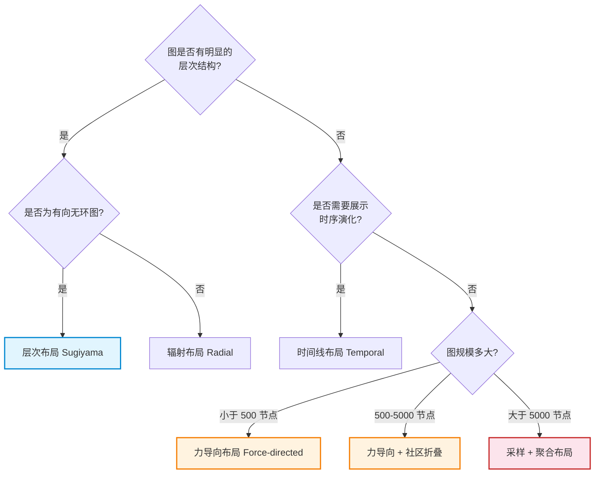
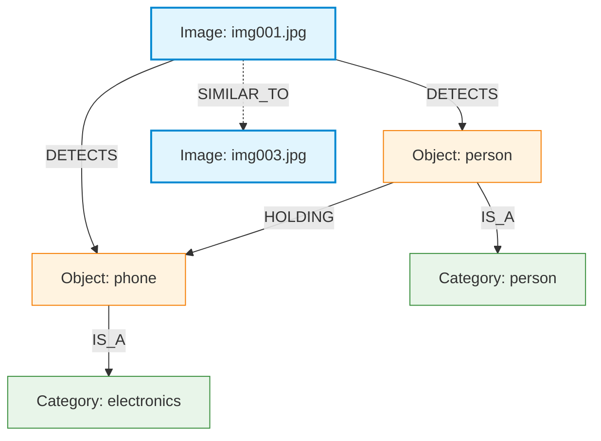
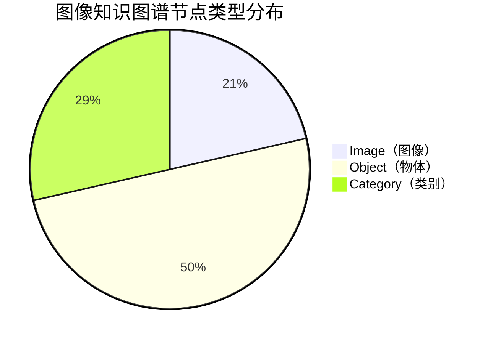

# 图布局与可视化

> **难度级别**：高级
> **预计阅读时间**：45 分钟
> **前置知识**：[GDS 实战指南](../02-graph-data-science/02-07-gds-practice.md)、[Neo4j 架构与存储引擎](../01-foundations/01-03-neo4j-architecture.md)、[图像知识图谱](../05-image-applications/05-01-image-knowledge-graph.md)

---

## 一、图可视化为何重要

图数据库的价值不仅在于存储与查询，更在于将复杂的关系网络以视觉形式呈现给人类认知。图可视化（Graph Visualization）是图数据分析的最后一步，也是最关键的一步——它将抽象的拓扑结构转化为可被肉眼理解的二维或三维布局，使研究者能够直观地发现模式、异常与趋势。

对于图书情报领域而言，图可视化有着特殊的意义。引文网络图、共词分析图、知识图谱可视化是该领域研究者的日常工具。从 VOSviewer 到 CiteSpace，从 Gephi 到 Neo4j Bloom，图可视化工具的演进反映了知识组织方式从"表格著录"到"网络呈现"的范式变迁。理解图布局算法的原理，有助于研究者选择合适的可视化方案，并正确解读可视化结果。

---

## 二、图布局算法

图布局算法（Graph Layout Algorithm）的核心任务是为图中的每个节点分配一个二维或三维坐标，使得图的拓扑结构以清晰的方式呈现。不同的布局算法适用于不同类型的图结构和不同的分析目的。

### 2.1 布局算法对比

| 布局类型 | 核心原理 | 适用场景 | 优势 | 局限 |
|---------|---------|---------|------|------|
| 力导向布局（Force-directed） | 节点间排斥力与边吸引力平衡 | 通用网络、社交网络、知识图谱 | 自动揭示社区结构、美观 | 大图计算慢、布局不稳定 |
| 层次布局（Hierarchical / Sugiyama） | 按层级分层排列、最小化交叉 | 有向无环图（DAG）、组织结构、流程图 | 层次清晰、适合有向图 | 仅适合层次结构、大图效果差 |
| 圆形布局（Circular） | 节点均匀排列在圆周上 | 环形结构、小规模图、类别对比 | 简单高效、无遮挡 | 无法体现社区结构 |
| 正交布局（Orthogonal） | 边以水平/垂直线段表示 | 网络拓扑图、UML 图 | 边不交叉、工程感强 | 美观性较低 |
| 辐射布局（Radial） | 以中心节点为圆心向外辐射 | 展示中心性、层级辐射 | 突出中心节点 | 非中心节点拥挤 |
| 时间线布局（Temporal） | 按时间轴排列节点 | 引文网络、事件演化 | 展示时序演化 | 需时间属性 |

### 2.2 力导向布局详解

力导向布局（Force-directed Layout）是最常用的图布局算法，其核心思想源于物理学：将节点视为带电粒子（相互排斥），将边视为弹簧（相互吸引），通过模拟物理系统的力学平衡来确定节点位置。

经典的 Fruchterman-Reingold 算法定义了两种力：

- **排斥力**（Repulsive Force）：所有节点对之间存在的排斥力，与距离成反比，防止节点重叠；
- **吸引力**（Attractive Force）：仅存在于有边连接的节点对之间，与距离成正比，使相连节点靠近。

当这两种力达到平衡时，图的布局自然地呈现出社区结构——密集连接的节点聚集在一起，稀疏连接的节点相互远离。Neo4j Browser 的默认可视化即采用力导向布局。

### 2.3 层次布局详解

层次布局（Hierarchical Layout），又称 Sugiyama 框架，专为有向无环图（Directed Acyclic Graph，DAG）设计。它通过四个步骤生成布局：

1. **分层**（Layering）：为每个节点分配一个层级，保证边的方向从上层指向下层；
2. **排序**（Ordering）：在同一层内排列节点顺序，最小化边交叉数；
3. **坐标分配**（Coordinate Assignment）：为节点分配 x 坐标，保证视觉间距均匀；
4. **边路由**（Edge Routing）：绘制边的路径，处理长边与回环。

层次布局非常适合展示流程、依赖关系、组织结构。在图书情报领域，文献的分类层级体系、本体中的概念继承关系都适合用层次布局呈现。

### 2.4 布局选择决策树



---

## 三、Neo4j Bloom 可视化工具

### 3.1 Bloom 简介

Neo4j Bloom（Neo4j 数据可视化应用）是 Neo4j 提供的交互式图可视化工具，专为业务用户与分析师设计。与 Neo4j Browser（面向开发者的查询工具）不同，Bloom 允许用户通过自然语言搜索短语（Search Phrases）而非 Cypher 查询来探索图数据，大幅降低了图可视化的使用门槛。

### 3.2 Bloom 核心功能

| 功能 | 说明 | 图像知识图谱应用 |
|------|------|----------------|
| 搜索短语 | 用自然语言定义查询模板 | "显示与 X 相似的图像" |
| 场景（Perspectives） | 定义可视化视角与样式规则 | 为不同节点类型设置颜色与图标 |
| 交互式探索 | 点击展开邻居、路径追溯 | 从物体节点展开关联图像 |
| 布局切换 | 实时切换力导向/层次/圆形布局 | 对比不同布局下的社区结构 |
| 过滤器 | 按属性筛选节点与边 | 按置信度过滤视觉关系 |
| 导出 | 导出 PNG/SVG 图片 | 用于论文与汇报 |

### 3.3 Bloom 搜索短语示例

Bloom 的搜索短语（Search Phrases）是其核心特色，允许用户定义可参数化的查询模板：

```
// 搜索短语：查找与指定图像内容相似的图像
:find-similar-images $image_name => 
  MATCH (i:Image {filename: $image_name})-[:CONTENT_SIMILAR]->(s:Image)
  RETURN i, s

// 搜索短语：展示某物体的视觉关系网络
:show-object-relations $object_category =>
  MATCH (o:Object {category: $object_category})-[r]->(t)
  RETURN o, r, t

// 搜索短语：查找某社区的核心图像
:cluster-center $cluster_id =>
  MATCH (i:Image {imageCluster: $cluster_id})
  RETURN i
  ORDER BY i.imageImportance DESC
  LIMIT 5
```

### 3.4 Bloom 与 Neo4j Browser 对比

| 对比维度 | Neo4j Browser | Neo4j Bloom |
|---------|--------------|-------------|
| 目标用户 | 开发者、数据库管理员 | 业务分析师、领域专家 |
| 查询方式 | Cypher 查询语言 | 搜索短语 + 可视化交互 |
| 可视化能力 | 基础力导向布局 | 多布局 + 样式规则 + 交互探索 |
| 适用场景 | 查询调试、快速验证 | 深度探索、报告展示 |
| 许可方式 | 社区版免费 | 需要 Enterprise 许可或 Bloom 插件 |

---

## 四、图布局样本数据的使用方法

### 4.1 样本数据回顾

在 [GDS 实战指南](../02-graph-data-science/02-07-gds-practice.md) 的第 2.1 节中，我们导入了"图布局样本数据"——一个简化的图像知识图谱，包含 6 幅图像、14 个物体、8 个类别，以及 DETECTS、IS_A、SIMILAR_TO 和若干语义关系。这个数据集规模适中，非常适合用于可视化练习。

### 4.2 在 Neo4j Browser 中可视化

导入样本数据后，可以在 Neo4j Browser 中直接进行可视化探索：

```cypher
// 可视化全图（限制节点数避免视觉过载）
MATCH (n)-[r]->(m)
RETURN n, r, m
LIMIT 100;

// 聚焦于图像相似网络
MATCH (img1:Image)-[r:SIMILAR_TO|CONTENT_SIMILAR]->(img2:Image)
RETURN img1, r, img2;

// 聚焦于物体的视觉关系网络
MATCH (o:Object)-[r:HOLDING|SITTING_ON|USING|READING|NEAR|PETTING]->(o2:Object)
RETURN o, r, o2;

// 展示类别层次结构（适合层次布局）
MATCH (c:Category)-[:IS_A]->(parent)
RETURN c, parent
```

### 4.3 利用 GDS 算法结果增强可视化

GDS 算法计算出的属性可以用于增强可视化效果——例如用节点大小表示 PageRank 重要性，用节点颜色表示 Louvain 社区归属：

```cypher
// 可视化带重要性（大小）与社区（颜色）的图像网络
MATCH (img:Image)-[r:SIMILAR_TO]->(img2:Image)
RETURN img, r, img2,
       img.imageImportance AS importance,
       img.imageCluster AS cluster
ORDER BY importance DESC;
```

在 Neo4j Browser 中，可以通过点击节点属性旁边的圆形图标，将属性映射到视觉样式：将 `imageImportance` 映射为节点大小，将 `imageCluster` 映射为节点颜色，即可生成信息丰富的可视化图。

---

## 五、Python 可视化方案对比

除了 Neo4j 自带的工具，Python 生态提供了丰富的图可视化方案。下表对比了主流方案：

| 工具 | 定位 | 优势 | 局限 | 适用场景 |
|------|------|------|------|---------|
| NetworkX + Matplotlib | 基础图分析 + 静态图 | 轻量、与 GDS Python 客户端无缝集成 | 可视化效果朴素、交互性弱 | 快速原型、分析报告 |
| PyVis | 交互式网页可视化 | 基于 Vis.js、生成 HTML、交互友好 | 大图性能一般 | 交互式探索、网页嵌入 |
| D3.js（JavaScript） | 自定义可视化 | 完全可控、效果精美 | 学习成本高、需前端开发 | 定制可视化、高级展示 |
| PyTorch Geometric 可视化 | GNN 嵌入可视化 | 与 GNN 训练集成、支持嵌入降维 | 仅适合嵌入空间 | 嵌入分析、模型调试 |
| Plotly | 交互式科学可视化 | 支持悬停信息、3D 布局 | 图布局算法需自行实现 | 学术论文、交互报告 |

### 5.1 NetworkX + Matplotlib 示例

```python
import networkx as nx
import matplotlib.pyplot as plt
from neo4j import GraphDatabase

# 从 Neo4j 读取图数据
driver = GraphDatabase.driver("bolt://localhost:7687", auth=("neo4j", "password"))
G = nx.DiGraph()

with driver.session() as session:
    # 读取节点
    nodes = session.run("MATCH (n) RETURN id(n) as id, labels(n)[0] as label, n.filename as name")
    for node in nodes:
        G.add_node(node["id"], label=node["label"], name=node["name"])
    
    # 读取边
    edges = session.run("MATCH (a)-[r]->(b) RETURN id(a) as src, id(b) as dst, type(r) as rel")
    for edge in edges:
        G.add_edge(edge["src"], edge["dst"], relation=edge["rel"])

# 力导向布局
pos = nx.spring_layout(G, k=1.5, iterations=50)

# 按节点类型着色
color_map = {"Image": "#42a5f5", "Object": "#ff7043", "Category": "#66bb6a"}
colors = [color_map.get(G.nodes[n].get("label", ""), "#999") for n in G.nodes]

# 绘图
plt.figure(figsize=(12, 8))
nx.draw(G, pos, node_color=colors, node_size=300, with_labels=False, arrows=True, edge_color="#ccc")
plt.title("Image Knowledge Graph - Force-directed Layout")
plt.savefig("graph_layout.png", dpi=150, bbox_inches="tight")
```

### 5.2 PyVis 交互式可视化示例

```python
from pyvis.network import Network
from neo4j import GraphDatabase

# 从 Neo4j 读取数据
driver = GraphDatabase.driver("bolt://localhost:7687", auth=("neo4j", "password"))

net = Network(height="600px", width="100%", notebook=True, directed=True)
net.barnes_hut()  # 使用力导向布局

with driver.session() as session:
    nodes = session.run("MATCH (n) RETURN id(n) as id, labels(n)[0] as label, coalesce(n.filename, n.category, n.object_id) as title")
    for node in nodes:
        net.add_node(node["id"], label=node["title"], group=node["label"])
    
    edges = session.run("MATCH (a)-[r]->(b) RETURN id(a) as src, id(b) as dst, type(r) as label")
    for edge in edges:
        net.add_edge(edge["src"], edge["dst"], label=edge["label"])

# 生成交互式 HTML
net.show("interactive_graph.html")
```

PyVis 生成的 HTML 文件可在浏览器中打开，支持拖拽节点、悬停查看属性、缩放等交互操作，非常适合汇报演示。

---

## 六、图像知识图谱的可视化设计原则

### 6.1 视觉编码原则

图像知识图谱包含多种节点类型（图像、物体、场景、概念）和多种关系类型（检测、语义关系、相似关系），可视化设计需要遵循清晰的视觉编码原则：

| 视觉通道 | 映射对象 | 设计建议 | 示例 |
|---------|---------|---------|------|
| 节点颜色 | 节点类型 | 为每种标签分配区分度高的颜色 | Image=蓝、Object=橙、Category=绿 |
| 节点大小 | 重要性/度 | 用 PageRank 或度数映射大小 | 重要图像更大 |
| 节点形状 | 节点类别 | 用形状区分大类 | 图像=方形、物体=圆形 |
| 边颜色 | 关系类型 | 为每种关系分配颜色 | HOLDING=红、NEAR=灰 |
| 边粗细 | 关系强度/置信度 | 用 confidence 映射粗细 | 高置信度更粗 |
| 边样式 | 关系性质 | 实线=直接关系、虚线=相似关系 | SIMILAR_TO 用虚线 |

### 6.2 避免视觉过载

当图规模增大时，可视化容易陷入"毛线球"状态——节点与边密集交织，无法辨识任何结构。应对策略包括：

1. **限制显示范围**：用 `LIMIT` 子句或深度限制控制返回的节点数量；
2. **社区折叠**：将同一社区的节点折叠为超级节点，仅展示社区间关系；
3. **按需展开**：初始只显示核心节点，用户点击后逐层展开邻居；
4. **过滤弱连接**：按置信度或权重阈值过滤低质量边；
5. **分面展示**：按节点类型或关系类型分多张图展示，而非全盘堆叠。

### 6.3 图书情报领域的可视化传统

图书情报领域有丰富的图可视化传统，图布局样本数据的使用方法可借鉴这些经验：

| 传统工具 | 典型可视化 | 布局算法 | 对应 Neo4j 方案 |
|---------|----------|---------|----------------|
| VOSviewer | 共词网络图、引文网络图 | 基于相似度的力导向变体 | Neo4j Bloom + GDS 相似度 |
| CiteSpace | 知识领域演进图 | 时间线 + 力导向混合 | 时间线布局 + GDS |
| Gephi | 多类型网络可视化 | ForceAtlas2（力导向改进） | Neo4j Bloom + Gephi 导出 |
| Pajek | 大型网络分析 | Kamada-Kawai 等多种布局 | NetworkX + 自定义布局 |

---

## 七、Mermaid 图表示例

Mermaid 是一种基于文本的图表描述语言，可在 Markdown 中直接渲染。本知识库大量使用 Mermaid 绘制架构图与流程图。以下展示几种适用于图 AI 知识库的 Mermaid 图类型。

### 7.1 流程图（Flowchart）


### 7.2 关系图（用于展示节点关系）



### 7.3 饼图（用于展示数据分布）



---

## 八、小结

图布局与可视化是图数据分析的"最后一公里"——将抽象的拓扑结构转化为人类可理解的视觉表达。力导向布局适合揭示社区结构，层次布局适合展示有向层级，圆形布局适合小规模对比；Neo4j Bloom 提供了面向业务用户的交互式可视化能力，Python 生态（NetworkX / PyVis / D3.js）则提供了灵活的编程式可视化方案。

对于图像知识图谱，可视化设计应遵循清晰的视觉编码原则——用颜色区分类型、用大小表示重要性、用边样式区分关系性质。对于图书情报领域，图可视化并非新事物——VOSviewer、CiteSpace 等工具早已是该领域的标配，理解图布局算法的原理有助于研究者更准确地解读和设计可视化方案。

---

> **延伸阅读**：
> - [GDS 实战指南](../02-graph-data-science/02-07-gds-practice.md)
> - [图像知识图谱](../05-image-applications/05-01-image-knowledge-graph.md)
> - [生产级图 AI 工作流](./06-01-production-workflow.md)
> - [幻灯片结构建议](../07-presentation/07-04-slides-structure.md)
