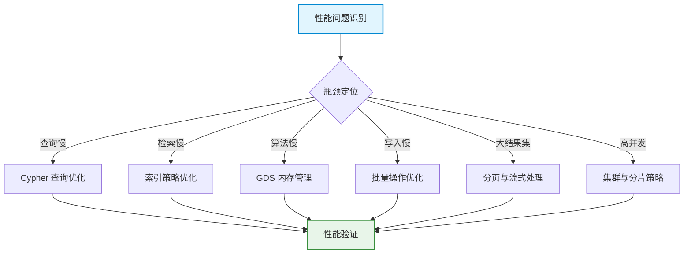
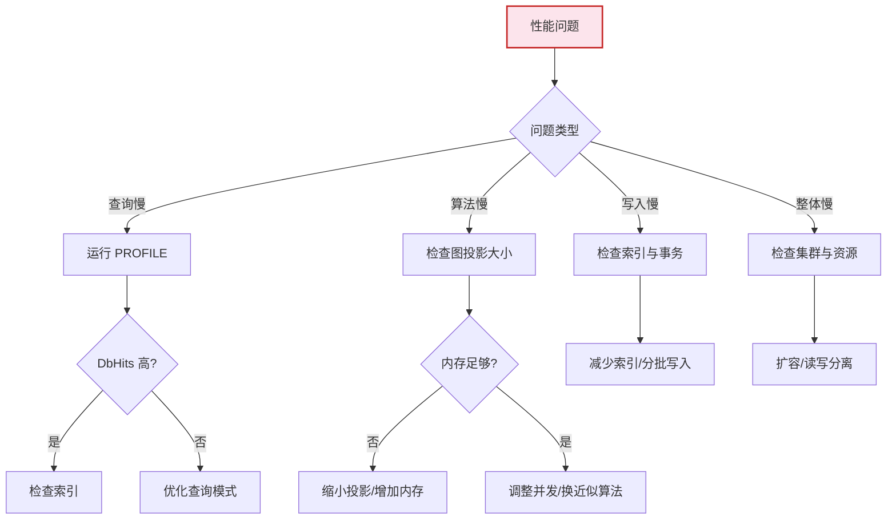

# 性能优化策略

> **难度级别**：高级
> **预计阅读时间**：50 分钟
> **前置知识**：[Cypher 查询语言](../01-foundations/01-04-cypher-query-language.md)、[GDS 图目录与图投影](../02-graph-data-science/02-02-graph-catalog.md)、[生产级图 AI 工作流](./06-01-production-workflow.md)

---

## 一、性能优化的整体框架

图数据库与图 AI 系统的性能优化是一个系统工程，涉及从查询层到存储层、从单机到集群的多个维度。当数据规模从几千节点增长到数百万节点，当查询从单跳匹配扩展到多跳遍历加向量检索，未经优化的系统会迅速遇到瓶颈。

性能优化应遵循"测量优先"原则——先用分析工具定位瓶颈，再针对性优化，而非盲目调参。Neo4j 提供了从查询计划分析到集群监控的完整工具链，本章将系统介绍这些工具与优化策略。



---

## 二、Cypher 查询优化

### 2.1 EXPLAIN 与 PROFILE 分析

Neo4j 提供两个查询分析命令：`EXPLAIN` 查看查询计划但不执行，`PROFILE` 执行查询并返回每一步的实际开销。

```cypher
// EXPLAIN：查看查询计划（不执行）
EXPLAIN
MATCH (img:Image)-[:DETECTS]->(o:Object)-[:IS_A]->(c:Category {name: 'person'})
RETURN img.filename, count(o) AS objectCount
ORDER BY objectCount DESC;

// PROFILE：执行并查看每步开销
PROFILE
MATCH (img:Image)-[:DETECTS]->(o:Object)-[:IS_A]->(c:Category {name: 'person'})
RETURN img.filename, count(o) AS objectCount
ORDER BY objectCount DESC;
```

`PROFILE` 输出中需要关注的关键指标：

| 指标 | 含义 | 异常信号 |
|------|------|---------|
| Rows | 该操作产出的行数 | 远大于预期结果集说明中间结果过多 |
| DbHits | 数据库访问次数 | DbHits 过高说明缺少索引或遍历范围过大 |
| Time | 该操作耗时 | 定位最慢的操作步骤 |
| EstimatedRows | 优化器估算的行数 | 与实际 Rows 差距过大说明统计信息过时 |

### 2.2 常见查询优化模式

| 优化模式 | 问题场景 | 优化方法 | 示例 |
|---------|---------|---------|------|
| 尽早过滤 | 查询扫描过多节点 | 在 MATCH 后立即用 WHERE 过滤 | `MATCH (n:Image) WHERE n.width > 1000` |
| 参数化查询 | 查询拼接字符串 | 使用 `$param` 参数 | `MATCH (n) WHERE n.id = $id` |
| 避免笛卡尔积 | 多 MATCH 子句产生交叉 | 用单一路径表达式替代 | `MATCH (a)-[:R]->(b)-[:S]->(c)` |
| 限制遍历深度 | 无限深度遍历 | 使用 `*1..3` 限定跳数 | `MATCH (a)-[*1..3]->(b)` |
| 使用索引 | 属性查找全表扫描 | 创建索引并在 WHERE 中使用 | `CREATE INDEX FOR (n:Image) ON (n.filename)` |
| 聚合下推 | 先展开再聚合 | 在路径中直接聚合 | `MATCH (a)-[:R]->(b) RETURN a, count(b)` |

### 2.3 查询优化实例

**优化前（低效查询）**：

```cypher
// 问题：先匹配所有图像，再过滤——产生大量中间结果
MATCH (img:Image), (o:Object)
WHERE img.filename = 'img001.jpg' AND o.category = 'person'
RETURN img, o;
```

**优化后（高效查询）**：

```cypher
// 优化：利用索引定位单一图像，再遍历关联物体
MATCH (img:Image {filename: 'img001.jpg'})-[:DETECTS]->(o:Object {category: 'person'})
RETURN img, o;
```

优化前查询会产生图像与物体的笛卡尔积，再过滤；优化后查询利用索引精确定位起始节点，沿关系遍历，DbHits 从数万次降低到个位数。

---

## 三、索引策略

### 3.1 索引类型对比

Neo4j 支持多种索引类型，每种索引服务于不同的查询模式。在图 AI 工作流中，往往需要多种索引协同工作。

| 索引类型 | 全称 | 适用查询 | 实现原理 | 创建语法 |
|---------|------|---------|---------|---------|
| B-tree 索引 | 平衡树索引 | 精确匹配、范围查询 | B+树结构，O(log n) 查找 | `CREATE INDEX FOR (n:Label) ON (n.prop)` |
| 全文索引 | Full-text Index | 文本分词检索 | Apache Lucene 倒排索引 | `CREATE FULLTEXT INDEX ...` |
| 向量索引 | Vector Index | 向量相似度检索 | HNSW 近似最近邻 | `CREATE VECTOR INDEX ...` |
| 点索引 | Point Index | 地理空间查询 | R-tree 空间索引 | `CREATE INDEX ... ON (n.location)` |
| 唯一约束 | Unique Constraint | 唯一性保证 + 查找 | B-tree + 唯一性校验 | `CREATE CONSTRAINT ... REQUIRE ... IS UNIQUE` |

### 3.2 索引选择指南

| 查询场景 | 推荐索引 | 示例查询 |
|---------|---------|---------|
| 按 ID 精确查找图像 | 唯一约束 | `MATCH (i:Image {filename: 'img001.jpg'})` |
| 按类别范围筛选物体 | B-tree 索引 | `WHERE o.confidence > 0.9` |
| 按描述文本检索 | 全文索引 | `WHERE i.description CONTAINS 'sunset'` |
| 视觉相似图像检索 | 向量索引 | 向量相似度 KNN 查询 |
| 按标签批量查找 | B-tree 索引 | `WHERE c.name IN ['person', 'dog']` |
| 地理位置查询 | 点索引 | `WHERE distance(i.gps, point) < 1000` |

### 3.3 索引创建与维护

```cypher
// B-tree 索引（精确匹配与范围查询）
CREATE INDEX object_confidence IF NOT EXISTS
FOR (o:Object) ON (o.confidence);

// 全文索引（文本检索）
CREATE FULLTEXT INDEX image_description IF NOT EXISTS
FOR (i:Image) ON EACH [i.description, i.title];

// 向量索引（相似度检索）
CREATE VECTOR INDEX image_embedding IF NOT EXISTS
FOR (i:Image) ON (i.embedding)
OPTIONS {
  indexConfig: {
    `vector.dimensions`: 512,
    `vector.similarity_function`: 'cosine'
  }
};

// 查看所有索引
SHOW INDEXES YIELD name, type, entityType, labelsOrTypes, properties;

// 索引使用情况监控
SHOW INDEXES YIELD name, type, populationPercent, state
WHERE state <> 'ONLINE';
```

### 3.4 索引使用注意事项

1. **索引并非万能**：索引加速查找但增加写入开销，每次写入需同步更新索引；
2. **避免过度索引**：只为高频查询字段创建索引，低频字段不值得索引维护成本；
3. **监控索引状态**：索引可能处于 `POPULATING`（构建中）或 `FAILED`（失败）状态，需定期检查；
4. **复合索引 vs 单属性索引**：多字段联合查询适合复合索引，但复合索引不支持部分字段查询。

---

## 四、GDS 内存管理

### 4.1 图投影与内存

GDS 的所有算法都在内存中执行，图投影（Graph Projection）将 Neo4j 存储中的图数据加载到 GDS 内存空间。图投影的大小直接决定了内存消耗，是 GDS 性能优化的核心。

```cypher
// 创建图投影前先估算内存需求
CALL gds.graph.project.estimate(
    'Image',                    // 节点标签
    {SIMILAR_TO: {orientation: 'UNDIRECTED'}},  // 关系类型
    {nodeProperties: ['filename'], relationshipProperties: ['score']}
)
YIELD requiredMemory, nodeCount, relationshipCount, bytesMin, bytesMax;
```

### 4.2 内存管理策略

| 策略 | 说明 | 适用场景 |
|------|------|---------|
| 缩小投影范围 | 仅投影需要的标签与关系 | 大图中只需分析子图 |
| 原生投影 vs Cypher 投影 | 原生投影更快，Cypher 投影更灵活 | 生产用原生，探索用 Cypher |
| 属性按需加载 | 只加载算法需要的属性 | 避免加载无用属性 |
| 及时删除投影 | 算法执行后立即 drop | 释放内存供其他任务使用 |
| 并发控制 | 调整 `concurrency` 参数 | 平衡 CPU 利用与内存占用 |

### 4.3 GDS 内存配置

```cypher
// 查看 GDS 内存配置
CALL gds.debug.sysInfo()
YIELD key, value
WHERE key STARTS WITH 'gds';

// 查看当前所有图投影及其内存占用
CALL gds.graph.list()
YIELD graphName, nodeCount, relationshipCount, memoryUsage;
```

在 `neo4j.conf` 中配置 GDS 内存：

```properties
# GDS 内存配置
dbms.memory.heap.initial_size=4G
dbms.memory.heap.max_size=8G
dbms.memory.pagecache.size=4G

# GDS 并发度（默认为 CPU 核心数）
gds.concurrent.execution.enabled=true
```

### 4.4 大图处理策略

当图规模超过单机内存容量时，可采取以下策略：

1. **图分区**：按时间、类别或社区将大图切分为多个子图，分批分析；
2. **采样算法**：使用近似算法（如近似 Betweenness Centrality）降低计算复杂度；
3. **流式处理**：使用 `stream` 模式逐批返回结果，而非 `write` 模式一次性写回；
4. **子图投影**：用 Cypher 投影先过滤再投影，仅加载需要的子图。

---

## 五、批量操作优化

### 5.1 UNWIND 批量写入

逐条创建节点的效率极低，`UNWIND` 子句可将列表展开为行，实现批量写入：

```cypher
// 低效：逐条创建（不推荐）
CREATE (i1:Image {filename: 'img001.jpg', width: 1920});
CREATE (i2:Image {filename: 'img002.jpg', width: 1280});
-- 每条语句独立事务，开销巨大

// 高效：UNWIND 批量创建（推荐）
UNWIND [
    {fn: 'img001.jpg', w: 1920},
    {fn: 'img002.jpg', w: 1280},
    {fn: 'img003.jpg', w: 1920}
] AS row
MERGE (i:Image {filename: row.fn})
SET i.width = row.w;
```

### 5.2 批量导入工具对比

| 工具 | 导入方式 | 性能 | 适用场景 |
|------|---------|------|---------|
| Cypher + UNWIND | 事务内批量 | 中等（万级/秒） | 增量更新、小批量导入 |
| `LOAD CSV` | 从 CSV 文件导入 | 中高（十万级/秒） | 中等规模数据初始化 |
| `neo4j-admin import` | 离线批量导入 | 极高（百万级/秒） | 全量初始化、大规模数据 |
| APOC `apoc.load.json` | 从 JSON 导入 | 中等 | API 数据导入 |
| Kafka / Neo4j Streams | 流式实时导入 | 高（实时） | 实时数据管道 |

### 5.3 LOAD CSV 示例

```cypher
// 从 CSV 批量导入图像数据
LOAD CSV WITH HEADERS FROM 'file:///images.csv' AS row
CALL {
    WITH row
    MERGE (i:Image {filename: row.filename})
    SET i.width = toInteger(row.width),
        i.height = toInteger(row.height),
        i.description = row.description
} IN TRANSACTIONS
OF 1000 ROWS;  // 每 1000 行一个事务
```

`IN TRANSACTIONS` 子句（Neo4j 5.x）允许在批量导入时分批提交事务，避免单事务过大导致内存溢出。

---

## 六、分页与流式处理

### 6.1 分页查询

当结果集很大时，分页查询可避免一次性返回过多数据：

```cypher
// Cypher 分页查询（SKIP + LIMIT）
MATCH (img:Image)-[:DETECTS]->(o:Object)
WITH img, count(o) AS objCount
ORDER BY objCount DESC
SKIP 20 LIMIT 10  // 第 3 页，每页 10 条
RETURN img.filename, objCount;
```

| 分页方式 | 语法 | 性能特点 | 适用场景 |
|---------|------|---------|---------|
| SKIP + LIMIT | `SKIP n LIMIT m` | 深翻页性能下降（需跳过 n 行） | 浅分页 |
| 游标分页 | `WHERE id > $last_id` | 稳定，不受数据变化影响 | 深分页、API |
| 索引分页 | 基于有序索引列 | 高效 | 大数据集 |

### 6.2 流式处理

对于不需要一次性获取全部结果的场景（如导出、分析），流式处理可降低内存压力：

```python
from neo4j import GraphDatabase

driver = GraphDatabase.driver("bolt://localhost:7687", auth=("neo4j", "password"))

# 流式读取：逐批获取结果，避免内存溢出
with driver.session() as session:
    result = session.run("""
        MATCH (img:Image)-[:DETECTS]->(o:Object)
        RETURN img.filename AS image, o.category AS category, o.confidence AS conf
    """)
    
    # 逐条处理，而非 collect() 一次性加载
    batch = []
    for record in result:
        batch.append({
            "image": record["image"],
            "category": record["category"],
            "confidence": record["conf"]
        })
        if len(batch) >= 1000:
            process_batch(batch)  # 处理一批
            batch = []
    if batch:
        process_batch(batch)  # 处理剩余
```

---

## 七、集群与分片策略

### 7.1 Neo4j 集群架构

当单机无法满足性能需求时，Neo4j 因果集群（Causal Cluster）提供水平扩展能力。集群架构详见 [生产级图 AI 工作流](./06-01-production-workflow.md) 的部署模式部分。

### 7.2 读写分离策略

| 操作类型 | 目标节点 | 路由方式 | 说明 |
|---------|---------|---------|------|
| 写入操作 | Core Server | `bolt://` 路由 | 写入需通过 Core 保证一致性 |
| 实时查询 | Read Replica | `bolt+routing://` | 读副本分担查询负载 |
| GDS 计算 | Core Server | 直连 | GDS 需要本地数据访问 |
| GraphRAG 查询 | Read Replica | `bolt+routing://` | 问答查询可走读副本 |
| 批量导入 | Core Server | 直连 | 批量写入需走 Core |

### 7.3 分片（Sharding）考量

Neo4j 本身不原生支持自动分片（Sharding），因为图的遍历天然需要跨节点访问邻居，分片会导致大量跨分片查询。替代方案包括：

1. **应用层分片**：按业务维度（如时间、地域）将数据分到不同 Neo4j 实例，查询时路由到对应实例；
2. **联合查询**：用 Neo4j Fabric 在多个数据库上执行联合查询；
3. **图分区**：用 GDS 社区发现算法将图划分为社区，各社区分布到不同节点。

| 策略 | 优势 | 局限 | 适用场景 |
|------|------|------|---------|
| 应用层分片 | 简单直接 | 跨分片查询需应用层处理 | 数据天然可分割 |
| Neo4j Fabric | 透明联合查询 | 性能有损耗、配置复杂 | 多数据库联邦 |
| 图分区 | 最小化跨分片查询 | 分区需定期重算 | 大规模图分析 |

---

## 八、常见性能问题排查表

| 症状 | 可能原因 | 排查方法 | 解决方案 |
|------|---------|---------|---------|
| 查询超时 | 缺少索引或遍历范围过大 | `PROFILE` 查看 DbHits | 创建索引、限制深度 |
| GDS 内存溢出（OOM） | 图投影过大 | `gds.graph.list()` 查看内存 | 缩小投影、增加堆内存 |
| 写入缓慢 | 索引过多或事务过大 | 检查索引数量与事务大小 | 减少索引、分批写入 |
| 全文检索慢 | 索引未构建或过时 | `SHOW INDEXES` 检查状态 | 重建索引 |
| 向量检索慢 | HNSW 参数不当 | 检查 `m`、`efConstruction` 参数 | 调参、重建索引 |
| 集群同步延迟 | 网络瓶颈或写入压力大 | 监控 Core-Replica 延迟 | 增加读副本、优化写入 |
| GraphRAG 响应慢 | LLM API 延迟或子图过大 | 测量子图提取与 LLM 各自耗时 | 限制子图大小、缓存结果 |
| 可视化卡顿 | 节点过多 | 检查返回节点数 | 限制 LIMIT、社区折叠 |

### 排查流程



---

## 九、图书情报领域关联

### 9.1 性能优化的领域意义

图书情报领域的数据规模虽不及互联网企业，但有其独特的性能挑战：

| 场景 | 数据规模 | 性能挑战 | 优化重点 |
|------|---------|---------|---------|
| 引文网络分析 | 百万级论文 | 多跳路径查询慢 | 索引优化、深度限制 |
| 馆藏知识图谱 | 十万级图书 | 实体对齐与合并 | 批量写入优化 |
| 全文检索 | 百万级元数据 | 检索响应慢 | 全文索引调优 |
| GraphRAG 问答 | 任意规模 | LLM 延迟 + 子图提取 | 子图大小控制、结果缓存 |
| 共词分析 | 万级关键词 | 社区发现计算量大 | 图投影范围控制 |

### 9.2 从离线到实时的性能跃迁

传统图书情报分析工具（如 VOSviewer、CiteSpace）以"离线批处理"为主——导入数据、运行分析、导出结果，整个过程可能耗时数小时。Neo4j + GDS 的性能优化使得这些分析可以走向"准实时"：

- **增量更新**：新论文入库时增量更新引文网络，无需全量重建；
- **交互式分析**：研究者调整参数后秒级返回结果，而非等待批处理完成；
- **并发服务**：多个研究者可同时查询同一知识图谱，读副本支撑并发。

### 9.3 优化实践建议

对于图书情报领域的研究者，性能优化建议遵循以下优先级：

1. **先建索引**：为所有查询入口字段创建索引，这是最低成本的优化；
2. **再用 PROFILE**：对慢查询运行 PROFILE，定位 DbHits 最高的操作；
3. **控制投影**：GDS 分析时用 Cypher 投影先过滤子图，避免全图加载；
4. **批量写入**：数据初始化用 `neo4j-admin import`，增量更新用 UNWIND 批量；
5. **读写分离**：多人使用时部署因果集群，查询走读副本。

---

## 十、小结

性能优化是图 AI 系统从原型走向生产的关键环节。Cypher 查询优化的核心是"索引优先、尽早过滤、避免笛卡尔积"；索引策略需要 B-tree、全文、向量三类索引协同；GDS 内存管理的关键是控制图投影大小与及时释放；批量操作用 UNWIND 和 `neo4j-admin import` 实现高效写入；分页与流式处理应对大结果集；集群与分片策略支撑高并发与大规模场景。

对于图书情报领域，性能优化的意义在于将传统的"离线批处理"分析模式升级为"准实时交互式"服务，使知识图谱分析从"一次性研究"走向"持续性服务"。

---

> **延伸阅读**：
> - [Cypher 查询语言](../01-foundations/01-04-cypher-query-language.md)
> - [GDS 图目录与图投影](../02-graph-data-science/02-02-graph-catalog.md)
> - [生产级图 AI 工作流](./06-01-production-workflow.md)
> - [GDS 实战指南](../02-graph-data-science/02-07-gds-practice.md)
