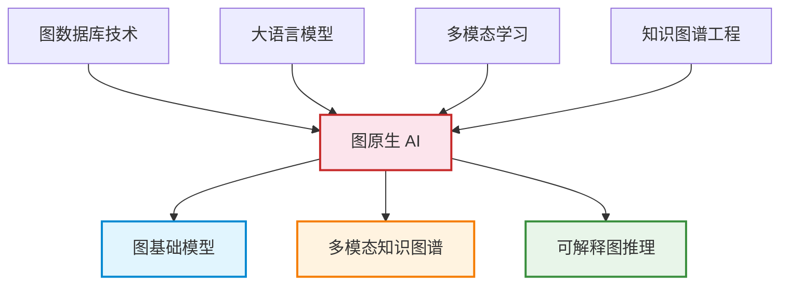
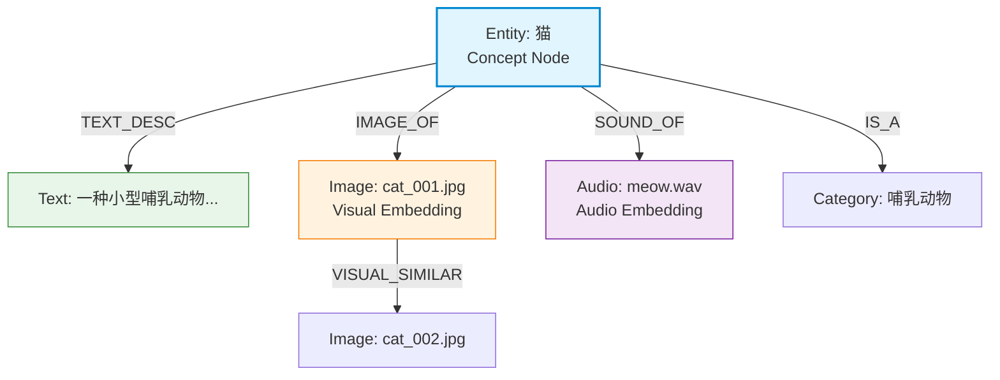
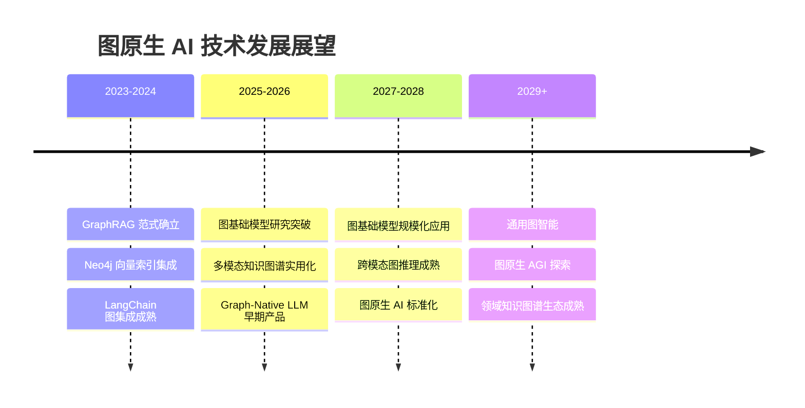

# 未来发展方向

> **难度级别**：高级
> **预计阅读时间**：45 分钟
> **前置知识**：[图原生 AI 概念解析](../03-graph-native-ai/03-01-graph-native-ai-concept.md)、[图嵌入总览](../04-gnn-embeddings/04-02-graph-embedding-overview.md)、[GraphRAG 架构详解](../03-graph-native-ai/03-02-graphrag-architecture.md)

---

## 一、图原生 AI 的发展趋势

### 1.1 从"图增强 AI"到"图原生 AI"

图与人工智能的结合经历了三个阶段的演进：

| 阶段 | 范式 | 代表技术 | 图的角色 |
|------|------|---------|---------|
| 第一阶段 | 图增强 AI（Graph-Enhanced AI） | 知识图谱作为外部知识源 | 事后补充，非核心 |
| 第二阶段 | 图集成 AI（Graph-Integrated AI） | GraphRAG、图嵌入检索 | 检索环节的核心 |
| 第三阶段 | 图原生 AI（Graph-Native AI） | 图基础模型、图原生 LLM | 全生命周期的第一性结构 |

当前我们正处于第二阶段向第三阶段过渡的关键时期。Neo4j 提出的图原生 AI 范式已经确立了"以图结构为中心"的工程框架，而未来的发展方向则是让图结构从"被检索的存储"走向"被理解的表示"——让模型原生地理解图的拓扑语言，而非依赖外部的图算法与嵌入转换。

### 1.2 技术融合趋势

图原生 AI 的未来不是单一技术的突破，而是图数据库、大语言模型、多模态学习与知识图谱工程四条技术线的深度融合。下文将逐一展开这些方向。

---

## 二、多模态知识图谱

### 2.1 从单模态到多模态

传统知识图谱以文本三元组（主语—谓词—宾语）为核心，主要表示语言层面的实体与关系。多模态知识图谱（Multimodal Knowledge Graph，MMKG）则将图像、文本、音频、视频等多种模态的数据统一为图结构表示，使知识图谱不仅能"读"文字，还能"看"图像、"听"音频。

| 模态 | 节点类型 | 关系类型 | 嵌入方式 |
|------|---------|---------|---------|
| 文本 | 实体、概念 | 语义关系、层级关系 | 文本嵌入（BERT / Word2Vec） |
| 图像 | 图像、物体、场景 | 视觉关系、相似关系 | 视觉嵌入（CLIP / ResNet） |
| 音频 | 音频片段、声学事件 | 时序关系、相似关系 | 音频嵌入（Audio2Vec / Wav2Vec） |
| 视频 | 视频帧、动作、场景 | 时序关系、因果关系 | 时空嵌入（3D-CNN / VideoBERT） |

### 2.2 多模态统一图表示

多模态知识图谱的核心挑战在于"对齐"——如何让不同模态的表示在同一图空间中可比、可推理。当前的主流方案是跨模态对齐（Cross-modal Alignment）：

1. **共享嵌入空间**：用 CLIP 等跨模态模型将图像与文本映射到同一向量空间，使得"猫的图片"与"猫"的文字描述在向量空间中相邻；
2. **跨模态关系边**：在图中显式建立跨模态关系，如 `IMAGE_OF`（图像对应实体）、`DESCRIBED_BY`（实体由文本描述）；
3. **多模态节点属性**：同一节点同时持有文本描述、图像嵌入、音频特征等多种模态的属性。

### 2.3 在图像知识图谱中的体现

本知识库 [图像应用篇](../05-image-applications/05-01-image-knowledge-graph.md) 讨论的图像知识图谱，本质上是多模态知识图谱的一个子集——它已经融合了图像（视觉模态）与文本标签（语言模态）。未来的发展方向是将更多模态纳入：

- **时序模态**：为图像关联拍摄时间，构建时序演化图；
- **空间模态**：为图像关联 GPS 坐标，构建空间邻近图；
- **音频模态**：为视频帧关联音轨，构建视听关联图；
- **文本模态**：为图像关联描述文本、用户评论，构建语义关联图。

---

## 三、大语言模型与知识图谱的深度融合

### 3.1 当前集成模式的局限

当前的 LLM 与知识图谱集成主要采取"检索增强"模式——LLM 作为推理引擎，知识图谱作为检索源。这种模式存在两个根本局限：

1. **LLM 不"理解"图结构**：GraphRAG 将子图序列化为文本后注入 LLM，LLM 看到的是"平铺的关系描述"，而非真正的图拓扑结构；
2. **知识图谱是静态的**：LLM 在生成过程中发现的新知识无法实时回写知识图谱，知识更新滞后。

### 3.2 融合方向

| 融合方向 | 核心思路 | 技术路径 | 当前阶段 |
|---------|---------|---------|---------|
| 图结构感知的 LLM | 让 LLM 原生理解图拓扑 | 图结构 token 化、图 Transformer | 早期研究 |
| LLM 驱动的知识图谱构建 | 用 LLM 自动抽取实体与关系 | 信息抽取 + LLM 理解 | 已实用 |
| LLM 驱动的知识图谱推理 | LLM 作为推理引擎遍历图谱 | 多步推理 + 图查询生成 | GraphRAG 阶段 |
| 知识图谱作为 LLM 记忆 | 图谱作为 LLM 的持久化外部记忆 | 读写双向交互 | 实验阶段 |
| 双向学习 | LLM 训练中融入图结构信号 | 图增强预训练 | 前沿研究 |

### 3.3 从 GraphRAG 到 Graph-Native LLM

GraphRAG 是当前 LLM 与知识图谱集成的成熟方案，但它仍是"检索增强"范式——图是被检索的对象，而非被理解的结构。未来的终极目标是**图原生大语言模型**（Graph-Native LLM）：

- **图结构 token 化**：将图的节点、边、路径编码为 LLM 可处理的 token 序列，使 LLM 能直接"阅读"图结构；
- **图注意力机制**：在 Transformer 的注意力机制中融入图拓扑信息，使注意力计算考虑图距离而非仅 token 距离；
- **图引导的解码**：在 LLM 生成过程中，用知识图谱约束生成路径，确保生成内容遵循图中的事实关系。

---

## 四、图基础模型

### 4.1 什么是图基础模型

图基础模型（Graph Foundation Model，GFM）是借鉴大语言模型"预训练 + 微调"范式，在图数据上预训练的通用模型。如同 BERT/GPT 在大规模文本上预训练后可适配多种 NLP 任务，图基础模型在大规模图数据上预训练后，可适配节点分类、链路预测、图分类等多种图任务，且无需从零训练。

| 对比维度 | 传统 GNN（如 GCN/GAT） | 图基础模型（GFM） |
|---------|----------------------|------------------|
| 训练方式 | 每个任务从零训练 | 大规模预训练 + 少样本微调 |
| 泛化能力 | 仅限训练图 | 可迁移到新图、新领域 |
| 新节点处理 | 需重新训练（转导式）或归纳式 | 零样本/少样本推理 |
| 规模 | 单图、百万级节点 | 多图、十亿级节点 |
| 模态 | 仅图结构 | 图 + 文本 + 多模态 |

### 4.2 图基础模型的技术挑战

图基础模型面临比语言基础模型更独特的技术挑战：

1. **图结构异质性**：不同图的节点度数分布、直径、社区结构差异巨大，难以用统一模型覆盖；
2. **无统一"词汇表"**：文本有天然的 token 边界，图没有天然的"图 token"定义；
3. **跨图迁移**：不同领域图的语义完全不同（社交网络 vs 分子图），如何迁移是开放问题；
4. **规模可变性**：图的大小可从几十节点到数十亿节点，模型需适配不同规模。

### 4.3 当前研究进展

| 模型/方向 | 核心贡献 | 局限 |
|----------|---------|------|
| GraphMAE | 图掩码自编码预训练 | 仅限同质图 |
| GraphGPT | 图结构 token 化 + 自回归预训练 | 规模有限 |
| OFA（One For All） | 统一图-文本表示框架 | 跨域迁移仍有限 |
| GraphAny | 零样本图推理 | 仅小图验证 |
| Neo4j + GDS 嵌入 | 工程化图嵌入（FastRP/GraphSAGE） | 非基础模型，需任务适配 |

图基础模型目前仍处于学术研究早期，距离像 GPT 那样"一个模型通用所有任务"还有较长的路。但这一方向代表了图 AI 的终极愿景——让图结构像文本一样拥有通用预训练模型。

---

## 五、可解释 AI 与图推理

### 5.1 图结构的天然可解释性

图结构相比向量空间有一个天然优势：**可解释性**（Explainability）。向量检索返回"最相似"的结果，但无法解释"为什么相似"；而图遍历返回的结果附带完整的路径——从起点到终点的每一条边都是可解读的推理链。

| AI 范式 | 可解释性 | 解释形式 |
|--------|---------|---------|
| 黑盒深度学习 | 低 | 仅能通过事后归因（如 Grad-CAM） |
| 纯向量 RAG | 中低 | 返回相似文本块，无法解释关联逻辑 |
| GraphRAG | 中高 | 返回子图路径，可追溯推理链 |
| 图规则推理 | 高 | 显式规则，完全可解释 |
| 图嵌入 + GNN | 中 | 嵌入空间可视化 + 注意力权重 |

### 5.2 图推理的可解释路径

可解释图推理（Explainable Graph Reasoning）致力于让图 AI 的推理过程对人类透明：

1. **路径解释**：GraphRAG 不仅返回答案，还返回从问题实体到答案实体的图路径，用户可验证推理逻辑；
2. **子图归因**：识别对推理结果贡献最大的子图结构，类似于图像 AI 中的显著性区域；
3. **注意力可视化**：在 GAT 等注意力机制 GNN 中，可视化节点间的注意力权重，揭示模型"关注"哪些邻居；
4. **规则提取**：从 GNN 中提取人类可读的图推理规则，架起符号推理与神经推理的桥梁。

### 5.3 对图书情报领域的特殊意义

可解释 AI 与图推理的结合对图书情报领域有特殊意义——该领域长期追求"可溯源的知识服务"（Traceable Knowledge Service）。传统向量 RAG 的"黑盒相似度"无法满足学术场景对溯源的严格要求，而图推理的路径可解释性天然契合引文追溯、知识基因追踪等需求。

---

## 六、图书情报领域的机遇与挑战

### 6.1 机遇

图原生 AI 的发展为图书情报领域带来多重机遇：

| 机遇方向 | 具体表现 | 技术支撑 |
|---------|---------|---------|
| 数字图书馆智能化 | 从关键词检索升级为图推理 + 语义检索 | GraphRAG + 向量索引 |
| 学术图谱自动化 | 自动构建引文网络、作者网络、主题网络 | LLM 信息抽取 + 图数据库 |
| 知识服务个性化 | 基于用户-知识图谱的个性化推荐 | 图嵌入 + 链路预测 |
| 多模态数字资源管理 | 统一管理图像、文本、音视频资源 | 多模态知识图谱 |
| 可溯源智能问答 | GraphRAG 支撑的参考咨询服务 | 图推理 + LLM |

### 6.2 挑战

机遇与挑战并存，图书情报领域在拥抱图原生 AI 时面临以下挑战：

| 挑战方向 | 具体困难 | 应对思路 |
|---------|---------|---------|
| 技术门槛 | 图数据库、GNN、GraphRAG 技术栈学习成本高 | 渐进式学习、利用 Neo4j 生态降低门槛 |
| 数据质量 | 馆藏元数据质量参差不齐，实体对齐困难 | AI 辅助数据清洗、人工审核 |
| 领域适配 | 通用图 AI 工具需适配图书情报场景 | 开发领域专用图模式与算法配置 |
| 人才缺口 | 同时掌握图书情报与图 AI 的复合型人才稀缺 | 跨学科培养、本研究知识库式的学习资源 |
| 评估标准 | 图 AI 在知识服务中的效果评估缺乏标准 | 建立领域评估基准与评测数据集 |

### 6.3 可发表研究方向

对于图书情报领域的研究生，以下方向具有较高的学术价值与可发表性：

1. **GraphRAG 在参考咨询中的应用研究**：对比 GraphRAG 与传统向量 RAG 在学术问答场景的效果差异，可投向图书情报学核心期刊；
2. **基于图嵌入的文献相似性研究**：用 FastRP / GraphSAGE 对引文网络做嵌入，对比传统共被引分析与图嵌入在文献推荐中的效果；
3. **多模态数字藏品知识图谱构建**：将博物馆/图书馆的图像藏品构建为多模态知识图谱，探索可视化与检索方案；
4. **图 AI 可解释性在知识溯源中的应用**：利用图推理的路径可解释性，设计可溯源的知识发现系统，契合该领域对溯源的重视；
5. **大语言模型驱动的知识图谱自动构建**：研究如何用 LLM 从非结构化学术文本中自动抽取实体与关系，构建学科知识图谱。

---

## 七、技术发展时间线展望

需要强调的是，以上时间线是基于当前技术趋势的合理推测，实际发展速度可能更快或更慢。对于研究者而言，重要的不是预测准确的时间点，而是理解技术演进的方向与逻辑，为自己的研究选题提供前瞻性视角。

---

## 八、小结

图原生 AI 的未来发展方向可以概括为四条主线：多模态知识图谱将图像、文本、音频统一为图表示；大语言模型与知识图谱的深度融合将从"检索增强"走向"图原生理解"；图基础模型试图在图数据上复现"预训练 + 微调"的成功范式；可解释 AI 与图推理的结合将使 AI 的推理过程透明可溯。

对于图书情报领域，这些发展方向既是机遇也是挑战。机遇在于：图原生 AI 与该领域对"结构化知识组织"的追求高度同构，数字图书馆、学术图谱、知识服务都将受益于技术进步。挑战在于：技术门槛、数据质量、领域适配、人才缺口需要系统性应对。对于研究生而言，GraphRAG 应用、图嵌入文献分析、多模态知识图谱、可解释知识溯源等方向具有较高的学术价值与可发表性。

---

> **延伸阅读**：
> - [图原生 AI 概念解析](../03-graph-native-ai/03-01-graph-native-ai-concept.md)
> - [图嵌入总览](../04-gnn-embeddings/04-02-graph-embedding-overview.md)
> - [GraphRAG 架构详解](../03-graph-native-ai/03-02-graphrag-architecture.md)
> - [汇报大纲](../07-presentation/07-01-presentation-outline.md)
