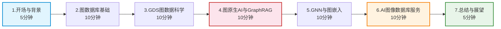
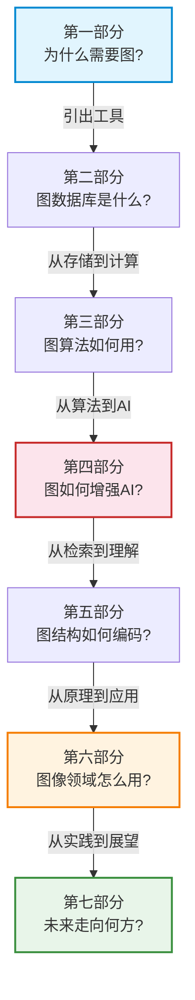

# 汇报大纲

> **难度级别**：进阶
> **预计阅读时间**：30 分钟
> **前置知识**：建议先通读本知识库第 0 篇至第 5 篇核心内容

---

## 一、汇报定位与目标

### 1.1 汇报场景

本次汇报为学术组会研讨会，主题为"利用 Neo4j 的 AI 图像数据库服务"。面向听众为信息资源管理（图书情报）领域的导师与同学，预期时长 45-60 分钟。听众具备基本的数据库与机器学习概念，但对图数据库与图 AI 领域可能不熟悉。

### 1.2 汇报目标

| 目标层次 | 具体目标 | 对应知识库内容 |
|---------|---------|--------------|
| 知识传递 | 让听众理解图数据库、GDS、GraphRAG、GNN 的基本概念 | 第 1-4 篇 |
| 主题阐释 | 讲清楚"AI 图像数据库服务"的技术内涵与架构 | 第 5 篇 |
| 论点支撑 | 用 5 个核心论点串联讲座的"抽象图论到生产级 AI"主线 | [核心论点要点](./07-02-key-talking-points.md) |
| 领域关联 | 建立图 AI 与图书情报领域的关联，体现专业视角 | 各篇图书情报关联小节 |
| 互动准备 | 预设问答，展示对主题的深入理解 | [问答准备](./07-03-qanda-preparation.md) |

### 1.3 叙事主线

整场汇报围绕一条叙事主线展开：**关系数据复杂性激增 → 传统 AI 在非欧几里得空间失效 → 图原生方法的必要性 → Neo4j GDS 连接理论与实践 → 图嵌入编码结构信息 → GraphRAG 实现图原生 AI → 图数据库为 AI 图像管理提供结构化基础**。

这条主线既是讲座的技术逻辑，也是汇报的叙事骨架。每个部分都应明确服务于这条主线的推进，而非孤立的知识点罗列。

---

## 二、七部分结构与时间分配

### 总体结构概览

### 时间分配表

| 部分 | 主题 | 时长 | 累计 | 核心目的 |
|------|------|------|------|---------|
| 1 | 开场与背景引入 | 5 分钟 | 5 分钟 | 建立问题意识 |
| 2 | 图数据库与 Neo4j 基础 | 10 分钟 | 15 分钟 | 引入核心工具 |
| 3 | GDS 图数据科学工具 | 10 分钟 | 25 分钟 | 展示图算法能力 |
| 4 | 图原生 AI 与 GraphRAG | 10 分钟 | 35 分钟 | 阐释核心范式 |
| 5 | GNN 与图嵌入技术 | 10 分钟 | 45 分钟 | 深入技术原理 |
| 6 | AI 图像数据库服务应用 | 10 分钟 | 55 分钟 | 回归讲座主题 |
| 7 | 总结与展望 | 5 分钟 | 60 分钟 | 升华与展望 |

---

## 三、各部分详细大纲

### 第一部分：开场与背景引入（5 分钟）

**核心目的**：在 5 分钟内建立"为什么需要图数据库与图 AI"的问题意识。

**内容要点**：

1. **数据复杂性的激增**（2 分钟）
   - 现实世界数据本质上是非欧几里得数据（Non-Euclidean Data）——社交网络、引文网络、知识图谱
   - 传统关系型数据库与表格化 AI 在处理关系密集型数据时的局限
   - 用图书情报领域的引文网络为例：论文间的引用关系是天然的图结构

2. **讲座主题解读**（2 分钟）
   - "利用 Neo4j 的 AI 图像数据库服务"的两层含义：用图数据库管理 AI 图像数据 + 构建图像知识图谱实现智能服务
   - 核心论点预告："抽象图论与生产级 AI 工作流完美衔接"

3. **汇报路线图**（1 分钟）
   - 展示七部分结构图，让听众对全程有预期

**衔接逻辑**：从"问题"（关系数据复杂性）过渡到"工具"（图数据库），引出第二部分。

**可视化建议**：用一张"关系网络 vs 表格"的对比图开场，直观展示表格无法表达的关系结构。

---

### 第二部分：图数据库与 Neo4j 基础（10 分钟）

**核心目的**：让听众理解属性图模型与 Neo4j 的基本能力，为后续技术展开奠定基础。

**内容要点**：

1. **图论基础**（2 分钟）
   - 图的定义 G=(V,E)，节点、边、属性
   - 从欧拉七桥问题到现代图数据库的三百年演进

2. **属性图模型**（3 分钟）
   - 节点（Node）、关系（Relationship）、属性（Property）三要素
   - 与关系型数据库的对比（用表格）
   - 用图像知识图谱做建模示例：Image-DETECTS-Object-IS_A-Category

3. **Neo4j 与 Cypher**（3 分钟）
   - 无索引邻接（Index-Free Adjacency）的存储优势
   - Cypher 查询语言的 ASCII-art 语法（用一两个简单查询演示）
   - Neo4j 生态系统：GDS、Bloom、GenAI 插件

4. **图书情报关联**（2 分钟）
   - 知识图谱与本体、叙词表、关联数据的同构关系
   - 从 MARC 记录到属性图的迁移思路

**衔接逻辑**：从"存储与查询"过渡到"分析与计算"，引出 GDS。

**可视化建议**：属性图模型示意图 + 关系型 vs 图数据库对比表 + Cypher 查询示例截图。

---

### 第三部分：GDS 图数据科学工具（10 分钟）

**核心目的**：展示 Neo4j GDS 如何把图论算法工程化为可调用的过程，体现"理论到实践"的衔接。

**内容要点**：

1. **GDS 定位与能力**（2 分钟）
   - GDS（Graph Data Science）是 Neo4j 的图算法库，内置 65+ 算法
   - 四类算法：中心性、社区发现、相似度、路径发现

2. **核心算法演示**（4 分钟）
   - 中心性：PageRank 识别重要节点（用图像重要性举例）
   - 社区发现：Louvain 发现聚类结构（用图像聚类举例）
   - 相似度：Node Similarity 发现相似节点（用内容相似图像举例）
   - 路径发现：Dijkstra/A* 最短路径

3. **GDS 工作流**（2 分钟）
   - 五步工作流：图投影 → 算法执行 → 结果写回 → 查询 → 可视化
   - 用图布局样本数据演示完整流程

4. **图书情报关联**（2 分钟）
   - GDS 工作流与引文网络分析的对应关系
   - 从 VOSviewer 离线分析到 Neo4j 实时分析的升级

**衔接逻辑**：从"图算法"过渡到"图与 AI 的结合"，引出 GraphRAG。

**可视化建议**：GDS 算法分类表 + 工作流流程图 + 样本数据可视化截图。

---

### 第四部分：图原生 AI 与 GraphRAG（10 分钟）

**核心目的**：阐释图原生 AI 的核心范式，这是整场汇报的理论核心。

**内容要点**：

1. **图原生 AI 概念**（3 分钟）
   - 定义：以图结构作为 AI 第一性数据结构
   - 三大支柱：图存储、图算法与嵌入、GraphRAG
   - 与传统 AI 的对比（用表格）
   - 核心理念："关系即数据，上下文即图"

2. **GraphRAG 架构**（4 分钟）
   - RAG 的基础与局限：纯向量 RAG 缺乏结构化推理
   - GraphRAG = 向量检索 + 图遍历 + LLM 生成
   - GraphRAG vs Vector RAG 对比（用表格）
   - 混合检索：向量找入口，图遍历找关联

3. **Neo4j 向量索引**（2 分钟）
   - Neo4j 5.x 原生向量索引（HNSW）
   - 图索引 + 向量索引 + 全文索引三合一的优势

4. **图书情报关联**（1 分钟）
   - GraphRAG 对应参考咨询服务的自动化升级
   - 可溯源生成 vs LLM 幻觉问题

**衔接逻辑**：从"图检索增强"过渡到"图结构如何被模型理解"，引出图嵌入与 GNN。

**可视化建议**：图原生 AI 三大支柱图 + GraphRAG 架构图 + GraphRAG vs Vector RAG 对比表。

---

### 第五部分：GNN 与图嵌入技术（10 分钟）

**核心目的**：解释图嵌入如何将图结构信息编码为 AI 可用的向量，架起"图"与"AI"的桥梁。

**内容要点**：

1. **非欧几里得数据与图嵌入的必要性**（2 分钟）
   - 欧几里得 vs 非欧几里得数据（用图像 vs 社交网络对比）
   - 传统 ML 在图上的失效原因
   - 图嵌入的目标：把图结构映射为低维向量

2. **图嵌入方法谱系**（4 分钟）
   - 随机游走类：DeepWalk、Node2Vec（BFS/DFS 平衡）
   - 矩阵分解类：FastRP（高效随机投影）
   - 深度学习类：GraphSAGE（归纳式，可处理新节点）
   - GNN 类：GCN、GAT（消息传递 + 注意力）
   - 四种方法对比（用表格）

3. **GDS 中的图嵌入实践**（2 分钟）
   - GDS 内置四种嵌入算法：FastRP、Node2Vec、GraphSAGE、HashGNN
   - 嵌入结果写入向量索引支撑检索

4. **图书情报关联**（2 分钟）
   - 图嵌入对应向量空间模型（VSM）的发展
   - 引文网络嵌入用于文献推荐

**衔接逻辑**：从"图嵌入技术原理"过渡到"图像领域的具体应用"，回归讲座主题。

**可视化建议**：欧几里得 vs 非欧几里得对比图 + 嵌入方法分类图 + GDS 嵌入算法对比表 + 嵌入空间可视化（t-SNE 降维图）。

---

### 第六部分：AI 图像数据库服务应用（10 分钟）

**核心目的**：回归讲座标题，展示图数据库与图 AI 在图像管理领域的完整应用。

**内容要点**：

1. **图像知识图谱**（3 分钟）
   - 从图像文件到图像知识图谱：物体检测 + 关系识别 + 场景图生成
   - 图像知识图谱的节点与关系设计
   - 与传统图像编目的对比

2. **Neo4j 图像数据库服务架构**（4 分钟）
   - 四层架构：数据层、索引层、服务层、AI 层
   - 向量索引 + 图索引 + 全文索引三合一
   - GraphRAG 支撑的图像智能问答

3. **应用案例**（2 分钟）
   - 博物馆数字藏品管理（与图书情报最相关）
   - 简要提及医学影像、电商视觉搜索等案例

4. **图书情报视角**（1 分钟）
   - 从 DAM（数字资产管理）到图原生图像数据库的演进
   - 从资源管理到知识管理的范式变迁

**衔接逻辑**：从"应用实践"过渡到"总结与展望"，收束全场。

**可视化建议**：四层架构图 + 图像知识图谱建模图 + 场景图示例 + GraphRAG 问答演示截图。

---

### 第七部分：总结与展望（5 分钟）

**核心目的**：收束全场，重申核心论点，展望未来方向。

**内容要点**：

1. **核心论点回顾**（2 分钟）
   - 用一页幻灯片浓缩 5 个核心论点
   - 重申"抽象图论与生产级 AI 工作流完美衔接"的主题

2. **未来方向展望**（2 分钟）
   - 多模态知识图谱
   - 图基础模型
   - LLM 与知识图谱深度融合
   - 图书情报领域的机遇

3. **致谢与提问**（1 分钟）
   - 感谢听众
   - 开放提问

**可视化建议**：5 个核心论点总结图 + 未来发展方向时间线 + 致谢页。

---

## 四、各部分衔接逻辑与叙事线设计

### 4.1 衔接逻辑图

整场汇报的七个部分并非独立的知识模块，而是由一条叙事线串联的递进结构：

### 4.2 每个衔接点的设计

| 衔接点 | 从 | 到 | 衔接语句示例 |
|--------|---|---|------------|
| 1→2 | 问题意识 | 工具引入 | "既然关系数据需要图结构来表达，那么什么样的数据库能原生存储图？" |
| 2→3 | 存储查询 | 算法计算 | "图数据库不仅能查询关系，还能计算关系的结构特征——这就是 GDS。" |
| 3→4 | 图算法 | 图原生 AI | "图算法已经能发现结构模式，那么如何让 AI 也'看见'这些结构？" |
| 4→5 | 检索增强 | 结构编码 | "GraphRAG 用子图增强生成，但模型如何'理解'子图的拓扑？答案是图嵌入。" |
| 5→6 | 技术原理 | 应用实践 | "理解了图嵌入的原理，我们来看它在图像管理领域的完整应用。" |
| 6→7 | 应用实践 | 总结展望 | "从图像应用回到更宏观的视角，图原生 AI 的未来将走向何方？" |

### 4.3 叙事节奏控制

| 部分 | 节奏特征 | 设计意图 |
|------|---------|---------|
| 1 | 快速、悬念 | 用问题抓住注意力 |
| 2 | 稳健、基础 | 建立共同语言 |
| 3 | 渐快、演示 | 用算法效果激发兴趣 |
| 4 | 深沉、理论 | 核心论点，需要听众思考 |
| 5 | 技术密集 | 最难部分，需控制信息量 |
| 6 | 实用、直观 | 用案例让抽象落地 |
| 7 | 收束、升华 | 给听众留下整体印象 |

---

## 五、汇报准备检查清单

### 5.1 内容准备

- [ ] 七个部分的核心要点已提炼为关键词卡
- [ ] 5 个核心论点能脱稿阐述（参见 [核心论点要点](./07-02-key-talking-points.md)）
- [ ] 15-20 个预设问答已准备（参见 [问答准备](./07-03-qanda-preparation.md)）
- [ ] 每个衔接点的过渡语句已设计
- [ ] 图像知识图谱的建模示例可在白板或幻灯片上快速画出

### 5.2 演示准备

- [ ] Neo4j 环境已搭建并验证（Desktop 或 Aura）
- [ ] 图布局样本数据已导入
- [ ] GDS 算法演示脚本已测试
- [ ] GraphRAG 问答演示已跑通
- [ ] 网络环境已确认（如需调用 LLM API）
- [ ] 备用方案已准备（网络故障时的截图/录屏）

### 5.3 时间控制

- [ ] 每部分已计时演练
- [ ] 总时长控制在 50-55 分钟（留 5-10 分钟问答）
- [ ] 标记可压缩的部分（第五部分技术细节可适当精简）
- [ ] 标记可扩展的部分（第六部分案例可视时间增加）

---

## 六、灵活调整建议

### 6.1 根据听众反馈调整

| 听众状态 | 调整策略 |
|---------|---------|
| 对图数据库完全陌生 | 延长第二部分，压缩第五部分技术细节 |
| 对 AI/ML 背景较强 | 加深第四、五部分的技术深度 |
| 对图书情报关联感兴趣 | 扩展各部分的领域关联小节 |
| 时间不足（40 分钟版） | 合并第二三部分为"图数据库与 GDS"，压缩第五部分 |
| 时间充裕（70 分钟版） | 扩展第六部分案例，增加现场演示环节 |

### 6.2 根据汇报场景调整

- **组会汇报**（本场景）：学术性优先，强调论点与逻辑
- **课程展示**：增加基础概念解释，降低技术深度
- **学术会议**：聚焦创新点与研究价值，压缩基础部分
- **实践分享**：增加代码演示与操作细节

---

## 七、小结

本汇报大纲设计了 45-60 分钟的七部分结构，以"关系数据复杂性激增 → 图原生方法 → Neo4j GDS → 图嵌入 → GraphRAG → 图像应用 → 未来展望"为叙事主线。每个部分有明确的时间分配、核心目的与衔接逻辑。汇报的核心不在知识点的全面罗列，而在用 5 个核心论点串联起"抽象图论与生产级 AI 工作流完美衔接"这一讲座主题。

建议在准备过程中，先通读本知识库第 0-5 篇建立知识基础，再按照本大纲组织汇报内容，配合 [核心论点要点](./07-02-key-talking-points.md)、[问答准备](./07-03-qanda-preparation.md) 和 [幻灯片结构建议](./07-04-slides-structure.md) 完成全面准备。

---

> **延伸阅读**：
> - [核心论点要点](./07-02-key-talking-points.md)
> - [问答准备](./07-03-qanda-preparation.md)
> - [幻灯片结构建议](./07-04-slides-structure.md)
> - [知识地图](../00-overview/00-03-knowledge-map.md)
