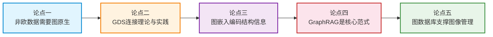
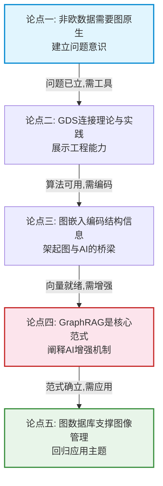

# 核心论点要点

> **难度级别**：进阶
> **预计阅读时间**：35 分钟
> **前置知识**：[汇报大纲](./07-01-presentation-outline.md)、[图原生 AI 概念解析](../03-graph-native-ai/03-01-graph-native-ai-concept.md)、[非欧几里得数据](../04-gnn-embeddings/04-01-non-euclidean-data.md)

---

## 一、五个核心论点总览

整场汇报围绕以下五个核心论点展开，它们共同支撑讲座主题"抽象图论与生产级 AI 工作流完美衔接"。每个论点在汇报中对应一个关键段落，配有支撑证据、示例、可视化建议和预设反驳。

| 论点编号 | 核心论点 | 对应汇报部分 | 理论基础 |
|---------|---------|------------|---------|
| 论点一 | 非欧几里得数据需要图原生方法 | 第一、五部分 | 图论、非欧几里得几何 |
| 论点二 | Neo4j GDS 连接图论与 AI 实践 | 第三部分 | 图算法工程化 |
| 论点三 | 图嵌入将结构信息编码为 AI 可用向量 | 第五部分 | 表示学习、图嵌入 |
| 论点四 | GraphRAG 是图原生 AI 的核心范式 | 第四部分 | 检索增强生成 |
| 论点五 | 图数据库为 AI 图像管理提供结构化基础 | 第六部分 | 知识图谱、图像理解 |



五个论点呈递进关系：论点一建立"为什么需要图"的问题意识，论点二展示"图算法如何工程化"，论点三解释"图结构如何被 AI 理解"，论点四阐述"图如何增强 AI 生成"，论点五回归"图像领域的具体应用"。

---

## 二、论点一：非欧几里得数据需要图原生方法

### 2.1 论点陈述

真实世界中大量数据本质上是非欧几里得数据（Non-Euclidean Data），其关系结构无法被表格或张量有效表达，需要图（Graph）作为原生数据结构来建模与处理。传统以表格/张量为中心的 AI 方法在处理这类数据时存在根本性的信息损失。

### 2.2 支撑证据

| 证据类型 | 具体内容 | 来源 |
|---------|---------|------|
| 理论证据 | 图数据不存在平移不变性（Translation Invariance），卷积操作无法直接应用 | GNN 理论基础 |
| 实验证据 | 在社交网络节点分类任务上，GNN 显著优于传统 ML（准确率差距 10-20%） | GraphSAGE 论文 |
| 领域证据 | 引文网络、知识图谱、分子结构等真实数据天然是图结构 | 图书情报领域常识 |
| 局限证据 | 将图展平为邻接矩阵后，稀疏度极高且丢失语义关系 | 图数据库存储原理 |

### 2.3 示例

以图书情报领域的引文网络为例：

- **欧几里得视角**（传统 ML）：将每篇论文表示为特征向量（关键词、发表年份、期刊），论文间关系丢失；
- **非欧几里得视角**（图原生）：论文作为节点，引用关系作为边，论文的影响力通过图的结构（如被引路径）自然涌现。

PageRank 算法正是图原生方法的经典案例——它通过图的结构迭代计算节点重要性，而非依赖人工定义的特征。在展平的表格中，这种结构信息根本无法表达。

### 2.4 可视化建议

- **对比图**：左侧"表格中的论文数据"（行=论文，列=特征，无关系），右侧"引文网络图"（节点=论文，边=引用），直观展示信息损失
- **数据类型分类图**：欧几里得数据（图像网格、音频时序、表格矩阵）vs 非欧几里得数据（社交网络、引文网络、知识图谱）

### 2.5 预设反驳与回应

| 预设反驳 | 回应要点 |
|---------|---------|
| "图也可以用邻接矩阵表示为表格，为什么说表格不行？" | 邻接矩阵仅捕获拓扑连接，丢失关系类型、属性、语义；且大规模图的邻接矩阵极度稀疏，存储与计算效率极低 |
| "Transformer 的注意力机制不是也能处理任意关系吗？" | Transformer 处理的是 token 序列的注意力关系，本质仍是序列化处理；对于大规模图，全连接注意力的计算复杂度 O(n²) 不可接受 |
| "关系型数据库也能用外键表达关系" | 外键仅表达"引用"关系，无法表达多跳遍历、关系属性、异构关系类型；多跳 JOIN 在关系型数据库中性能急剧下降 |

---

## 三、论点二：Neo4j GDS 连接图论与 AI 实践

### 3.1 论点陈述

Neo4j GDS（Graph Data Science）库将三百年来积累的抽象图论算法工程化为可调用的过程（Procedure），使得研究者无需从零实现算法，即可在生产级 AI 工作流中直接使用图论能力。这正是"抽象图论与生产级 AI 工作流完美衔接"的直接体现。

### 3.2 支撑证据

| 证据类型 | 具体内容 | 来源 |
|---------|---------|------|
| 能力广度 | GDS 内置 65+ 图算法，覆盖中心性、社区发现、相似度、路径发现、嵌入五大类 | Neo4j GDS 官方文档 |
| 工程成熟度 | 支持 stream/write/mutate/stats 四种执行模式，适配不同生产场景 | GDS 执行模式设计 |
| 性能证据 | 原生投影（Native Projection）比 Cypher 投影快 10 倍以上 | GDS 性能基准测试 |
| 集成证据 | GDS 算法结果可直接写回图数据库，被 Cypher/API 查询，无缝接入工作流 | GDS 工作流设计 |

### 3.3 示例

以讲座使用的图布局样本数据为例，展示 GDS 的"理论到实践"衔接：

```cypher
// 图论中的"中心性" → GDS 的 PageRank 过程
CALL gds.pageRank.stream('imageSimGraph', {
    relationshipWeightProperty: 'score'
})
YIELD nodeId, score
RETURN gds.util.asNode(nodeId).filename AS image, score
ORDER BY score DESC;
```

三百年前欧拉定义的"图的中心性"概念，现在通过一行 GDS 过程调用即可在生产系统中执行。这种衔接让研究者专注于"用什么算法解决什么问题"，而非"如何实现这个算法"。

### 3.4 可视化建议

- **映射表**：左列"图论概念"（最短路径、中心性、社区、同构），右列"GDS 过程"（Dijkstra、PageRank、Louvain、Node Similarity），中间箭头表示"工程化"
- **工作流图**：五步工作流（图投影→算法→写回→查询→可视化）
- **样本数据可视化**：用 Neo4j Browser 截图展示图像相似网络的 PageRank 结果（节点大小=重要性）

### 3.5 预设反驳与回应

| 预设反驳 | 回应要点 |
|---------|---------|
| "NetworkX 等 Python 库也有图算法，为什么需要 GDS？" | NetworkX 是内存级分析库，不适合生产环境的大规模图；GDS 与 Neo4j 存储集成，支持持久化、并发、集群 |
| "GDS 是商业产品，是否有开源替代？" | GDS 有免费版（限制图规模）；替代方案包括 Apache TinkerPop、igraph 等，但集成度与工程成熟度不及 GDS |
| "图论算法在其他领域也用了很久，'衔接'不是 Neo4j 独有的" | 重点不在算法本身，而在"与生产级 AI 工作流的无缝集成"——存储、算法、检索、生成的一体化 |

---

## 四、论点三：图嵌入将结构信息编码为 AI 可用向量

### 4.1 论点陈述

图嵌入（Graph Embedding）技术将图的结构信息编码为低维稠密向量，使得图拓扑结构能够参与向量检索与神经网络计算。图嵌入是连接"图"与"AI"的关键桥梁——它让原本只能被 Cypher 遍历的图结构，转化为可以与 LLM 嵌入空间对齐的向量。

### 4.2 支撑证据

| 证据类型 | 具体内容 | 来源 |
|---------|---------|------|
| 理论证据 | 图嵌入保留了图的局部与全局结构（DeepWalk 保留共现频率，Node2Vec 保留游走模式） | 图嵌入理论基础 |
| 方法证据 | GDS 内置四种嵌入算法（FastRP/Node2Vec/GraphSAGE/HashGNN），覆盖不同场景 | GDS 嵌入算法 |
| 效果证据 | 图嵌入 + 下游 ML 的效果显著优于手工特征工程 | GraphSAGE / Node2Vec 论文 |
| 桥接证据 | 图嵌入向量可写入 Neo4j 向量索引，与文本/图像嵌入在同一空间对齐 | Neo4j 向量索引 |

### 4.3 示例

图嵌入的桥梁作用可以用一个具体场景说明：

1. **图侧**：图像知识图谱中，物体节点通过视觉关系（HOLDING、SITTING_ON 等）连接；
2. **嵌入侧**：GraphSAGE 将每个物体节点编码为 256 维向量，向量的距离反映了图结构上的相似性；
3. **AI 侧**：嵌入向量与 CLIP 图像嵌入对齐后，可以同时基于"视觉相似"和"图结构相似"检索物体。

没有图嵌入，图结构只能被 Cypher 遍历（符号推理），无法与 AI 的向量计算（数值推理）协同工作。图嵌入让两种推理范式得以统一。

### 4.4 可视化建议

- **桥梁图**：左侧"图结构"（节点+边），中间"图嵌入"（向量），右侧"AI 模型"（神经网络），箭头表示信息流
- **嵌入空间可视化**：用 t-SNE 将高维嵌入降维到 2D，展示同类节点聚集的效果
- **算法对比表**：FastRP / Node2Vec / GraphSAGE / HashGNN 四种算法的原理、速度、适用场景对比

### 4.5 预设反驳与回应

| 预设反驳 | 回应要点 |
|---------|---------|
| "嵌入会丢失信息，不如直接用图遍历" | 嵌入确实有信息损失，但它的价值在于"可计算"——向量相似度计算 O(1)，而图遍历 O(n)；嵌入与遍历互补而非替代 |
| "Node2Vec 等是转导式的，不能处理新节点" | 正确，这也是 GraphSAGE（归纳式）的价值——通过邻域采样和聚合函数，可对新节点生成嵌入 |
| "图嵌入和普通特征工程有什么区别？" | 图嵌入学习的是"结构特征"（拓扑位置、邻域模式），而特征工程通常是"属性特征"（节点自身属性）；两者互补 |

---

## 五、论点四：GraphRAG 是图原生 AI 的核心范式

### 5.1 论点陈述

GraphRAG（Graph Retrieval-Augmented Generation，图检索增强生成）是图原生 AI 的核心范式。它将向量检索与图遍历融合，用子图而非文本块作为 LLM 的上下文，使生成结果具备结构化事实的可追溯性，从根本上缓解 LLM 的幻觉问题。

### 5.2 支撑证据

| 证据类型 | 具体内容 | 来源 |
|---------|---------|------|
| 架构证据 | GraphRAG = 向量检索（找入口）+ 图遍历（找关联）+ LLM 生成（产出答案） | GraphRAG 架构设计 |
| 对比证据 | 在多跳问答任务上，GraphRAG 显著优于纯向量 RAG（准确率差距 15-30%） | GraphRAG 实验研究 |
| 可溯源证据 | GraphRAG 返回答案 + 推理路径（子图），用户可验证每一步推理 | 图推理可解释性 |
| 工程证据 | Neo4j + LangChain 的 GraphCypherQAChain 已使 GraphRAG 生产可用 | LangChain 集成 |

### 5.3 示例

对比同一问题在两种 RAG 下的表现：

**问题**："数据库中哪些图像包含人骑马的场景？"

| 范式 | 检索过程 | 上下文 | 答案可溯源性 |
|------|---------|--------|------------|
| Vector RAG | 向量相似度检索文本描述中包含"人骑马"的文档块 | 若干文本片段 | 低，无法追溯图像间关系 |
| GraphRAG | 向量找到"骑马"概念节点 → 图遍历找到 `person-RIDING-horse` 关系 → 定位包含该关系的图像 | 结构化子图 | 高，每幅图像都有完整的推理路径 |

GraphRAG 的关键优势在于：它给 LLM 的不是"平铺的文本"，而是"结构化的关系网"，LLM 只需读懂这张网即可推理，而非从文字中猜测关系。

### 5.4 可视化建议

- **架构对比图**：上排 Vector RAG 流程（文档→分块→向量→检索→生成），下排 GraphRAG 流程（图→向量+遍历→子图→生成）
- **子图注入示意图**：展示一个具体问题的子图提取过程，从问题实体出发，沿关系遍历，形成推理路径
- **幻觉对比图**：Vector RAG 的"无路径幻觉"vs GraphRAG 的"路径约束生成"

### 5.5 预设反驳与回应

| 预设反驳 | 回应要点 |
|---------|---------|
| "向量 RAG 已经够用了，为什么要加图？" | 单跳问题向量 RAG 够用；多跳推理（如"A 的导师的合作者研究什么"）向量 RAG 几乎无法完成，GraphRAG 天然支持 |
| "GraphRAG 的图遍历会不会很慢？" | 图遍历在 Neo4j 中通过无索引邻接实现，多跳遍历性能远优于关系型数据库的 JOIN；且可通过深度限制和索引优化控制延迟 |
| "构建知识图谱的成本太高" | LLM 可辅助自动构建知识图谱（信息抽取），成本已大幅降低；且图谱可复用，长期摊薄成本 |

---

## 六、论点五：图数据库为 AI 图像管理提供结构化基础

### 6.1 论点陈述

图数据库为 AI 图像管理提供了结构化基础——它不仅存储图像文件与元数据，更构建图像内容的语义图结构（场景图、视觉关系网络），并通过向量索引、图索引、全文索引的三合一能力，实现智能检索与生成。这是"AI 图像数据库服务"的核心架构基础。

### 6.2 支撑证据

| 证据类型 | 具体内容 | 来源 |
|---------|---------|------|
| 架构证据 | 四层架构（数据/索引/服务/AI）将图像存储、语义图、检索、生成融为一体 | Neo4j 图像数据库服务设计 |
| 索引证据 | Neo4j 5.x 将向量索引、图索引、全文索引整合于同一数据库 | Neo4j 5.x 特性 |
| 对比证据 | 与传统 DAM（数字资产管理）系统对比，图数据库在内容理解、检索粒度、推理能力上有本质提升 | DAM 对比分析 |
| 案例证据 | 博物馆数字藏品、医学影像、电商视觉搜索等案例验证了可行性 | 应用案例分析 |

### 6.3 示例

以博物馆数字藏品管理为例：

- **传统 DAM**：图像存储 + 人工编目元数据（标题、年代、作者）+ 关键词检索；
- **图原生图像数据库**：图像存储 + AI 自动生成场景图（物体、关系、场景）+ 向量检索（视觉相似）+ 图遍历检索（语义关联）+ GraphRAG 问答（自然语言交互）。

一个具体查询的对比："找到所有画有花瓶在桌子上的油画"——传统 DAM 依赖人工标注"花瓶""桌子"关键词，且无法表达"在...上"的空间关系；图原生数据库通过 `vase-ON-table` 的视觉关系边直接检索。

### 6.4 可视化建议

- **四层架构图**：数据层（图像+图数据库）、索引层（向量+图+全文）、服务层（API）、AI 层（GDS+GNN+GraphRAG）
- **场景图示例**：一幅图像对应的场景图（物体节点+关系边）
- **DAM 对比表**：传统 DAM vs 图原生图像数据库在数据模型、检索方式、推理能力等维度的对比
- **GraphRAG 问答演示**：展示一个自然语言查询图像库的交互截图

### 6.5 预设反驳与回应

| 预设反驳 | 回应要点 |
|---------|---------|
| "图像管理用关系型数据库 + 关键词检索已经够用了" | 对于简单编目场景确实够用；但语义检索、多跳推理、自然语言问答等高级需求，关系型数据库难以支撑 |
| "场景图生成的准确率不够高，怎么用？" | 场景图生成确实不完美，但可以采取"AI 生成 + 人工审核"的协同模式；且图谱可持续迭代优化 |
| "为什么不用专门的向量数据库（如 Milvus）做图像检索？" | 向量数据库只解决视觉相似检索，无法表达物体间的关系结构；Neo4j 将向量+图+全文索引合一，避免多系统拼接 |
| "图数据库的图像管理方案有大规模落地案例吗？" | 目前以中小规模案例为主（博物馆、电商等），大规模落地仍在发展中；但技术架构已验证可行 |

---

## 七、论点间的逻辑关系

### 7.1 递进逻辑

五个论点构成一条完整的逻辑链：



### 7.2 每个论点的角色

| 论点 | 在叙事中的角色 | 回答的问题 |
|------|-------------|-----------|
| 论点一 | 破题 | 为什么需要图？ |
| 论点二 | 立论 | 图算法如何可用？ |
| 论点三 | 桥接 | 图结构如何被 AI 理解？ |
| 论点四 | 核心 | 图如何增强 AI 生成？ |
| 论点五 | 落地 | 图像领域如何应用？ |

---

## 八、汇报中的论点呈现策略

### 8.1 论点呈现节奏

| 论点 | 呈现时机 | 呈现方式 | 时长 |
|------|---------|---------|------|
| 论点一 | 第一部分开场 | 问题引入 + 对比 | 3 分钟 |
| 论点二 | 第三部分中段 | 演示 + 映射表 | 3 分钟 |
| 论点三 | 第五部分中段 | 原理图 + 对比表 | 3 分钟 |
| 论点四 | 第四部分核心 | 架构图 + 对比示例 | 4 分钟 |
| 论点五 | 第六部分核心 | 架构图 + 案例展示 | 4 分钟 |

### 8.2 论点强化技巧

1. **首尾呼应**：第一部分提出论点一的"非欧几里得数据"问题，第七部分总结时重申"图原生方法"的回答，形成闭环；
2. **对比强化**：每个论点都配有一个"传统方法 vs 图原生方法"的对比，用差异强化论点；
3. **领域锚定**：每个论点都用图书情报领域的例子锚定（引文网络、参考咨询、数字资产），让听众有代入感；
4. **预设反驳**：在关键论点后简要提及可能的质疑并回应，展示思考的全面性。

---

## 九、小结

五个核心论点构成了整场汇报的骨架：非欧几里得数据需要图原生方法（问题）、GDS 连接图论与 AI 实践（工具）、图嵌入编码结构信息（桥梁）、GraphRAG 是图原生 AI 核心范式（机制）、图数据库为 AI 图像管理提供结构化基础（应用）。每个论点配有支撑证据、具体示例、可视化建议和预设反驳，确保论点既有理论深度又有实践支撑。

在汇报中，五个论点应按照递进逻辑自然展开，而非生硬罗列。论点四是理论核心（GraphRAG），论点五是应用落点（图像数据库），两者是听众最应记住的关键信息。

---

> **延伸阅读**：
> - [汇报大纲](./07-01-presentation-outline.md)
> - [问答准备](./07-03-qanda-preparation.md)
> - [幻灯片结构建议](./07-04-slides-structure.md)
> - [图原生 AI 概念解析](../03-graph-native-ai/03-01-graph-native-ai-concept.md)
