# 幻灯片结构建议

> **难度级别**：进阶
> **预计阅读时间**：40 分钟
> **前置知识**：[汇报大纲](./07-01-presentation-outline.md)、[核心论点要点](./07-02-key-talking-points.md)、[问答准备](./07-03-qanda-preparation.md)

---

## 一、幻灯片总体规划

### 1.1 总体参数

| 参数 | 建议值 | 说明 |
|------|--------|------|
| 总页数 | 28-32 页 | 含封面、目录、内容、总结、致谢 |
| 汇报时长 | 50-55 分钟 | 留 5-10 分钟问答 |
| 平均每页时长 | 1.5-2 分钟 | 复杂页 3 分钟，过渡页 0.5 分钟 |
| 配图比例 | 60% 以上 | 图表优于文字，视觉优先 |
| 代码片段 | 4-6 处 | Cypher 查询 + GDS 调用演示 |
| 核心表格 | 5-6 张 | 对比类信息用表格呈现 |

### 1.2 幻灯片结构总览

```mermaid
flowchart TD
    subgraph 第一部分-开场
        S1[1.封面] --> S2[2.目录与路线图]
        S2 --> S3[3.问题引入]
    end
    subgraph 第二部分-图数据库基础
        S3 --> S4[4.图论基础]
        S4 --> S5[5.属性图模型]
        S5 --> S6[6.Neo4j与Cypher]
        S6 --> S7[7.图书情报关联]
    end
    subgraph 第三部分-GDS
        S7 --> S8[8.GDS概览]
        S8 --> S9[9.核心算法]
        S9 --> S10[10.算法演示]
        S10 --> S11[11.GDS工作流]
    end
    subgraph 第四部分-GraphRAG
        S11 --> S12[12.图原生AI概念]
        S12 --> S13[13.GraphRAG架构]
        S13 --> S14[14.GraphRAG vs Vector RAG]
        S14 --> S15[15.向量索引与混合检索]
    end
    subgraph 第五部分-GNN与嵌入
        S15 --> S16[16.非欧几里得数据]
        S16 --> S17[17.图嵌入方法谱系]
        S17 --> S18[18.GDS嵌入算法对比]
        S18 --> S19[19.嵌入可视化]
    end
    subgraph 第六部分-图像应用
        S19 --> S20[20.图像知识图谱]
        S20 --> S21[21.场景图生成]
        S21 --> S22[22.四层架构]
        S22 --> S23[23.GraphRAG图像问答]
        S23 --> S24[24.案例与图书情报视角]
    end
    subgraph 第七部分-总结
        S24 --> S25[25.核心论点回顾]
        S25 --> S26[26.未来方向]
        S26 --> S27[27.总结]
        S27 --> S28[28.致谢]
    end

    style S1 fill:#e1f5fe,stroke:#0288d1,stroke-width:2px
    style S12 fill:#fce4ec,stroke:#c62828,stroke-width:2px
    style S22 fill:#fff3e0,stroke:#f57c00,stroke-width:2px
    style S28 fill:#e8f5e9,stroke:#388e3c,stroke-width:2px
```



---

## 二、各幻灯片详细规划

### 第一部分：开场与背景引入（3 页，5 分钟）

#### 幻灯片 1：封面

| 要素 | 内容 |
|------|------|
| 标题 | 利用 Neo4j 的 AI 图像数据库服务 |
| 副标题 | 从抽象图论到生产级 AI 工作流 |
| 信息 | 汇报人 / 导师 / 日期 / 组会名称 |
| 配图 | 简洁的图网络背景图案 |
| 时长 | 0.5 分钟 |

#### 幻灯片 2：目录与路线图

| 要素 | 内容 |
|------|------|
| 标题 | 汇报路线图 |
| 内容 | 七部分结构与时间分配（用流程图展示） |
| 配图 | 七部分流程图（Mermaid 或手绘） |
| 时长 | 0.5 分钟 |
| 要点 | 让听众对全程有预期，标注重点部分 |

#### 幻灯片 3：问题引入——为什么需要图？

| 要素 | 内容 |
|------|------|
| 标题 | 关系数据的复杂性：表格 vs 图 |
| 内容 | 左侧"表格中的引文数据"（丢失关系），右侧"引文网络图"（保留关系） |
| 配图 | 表格 vs 图网络对比图 |
| 要点 | 真实世界数据是非欧几里得数据，表格展平丢失关系信息 |
| 时长 | 4 分钟 |
| 论点关联 | 论点一：非欧几里得数据需要图原生方法 |

---

### 第二部分：图数据库与 Neo4j 基础（4 页，10 分钟）

#### 幻灯片 4：图论基础

| 要素 | 内容 |
|------|------|
| 标题 | 图论：从欧拉到图数据库 |
| 内容 | G=(V,E) 定义、节点/边/属性、三百年简史 |
| 配图 | 柯尼斯堡七桥问题图 + 现代属性图示例 |
| 时长 | 2 分钟 |

#### 幻灯片 5：属性图模型

| 要素 | 内容 |
|------|------|
| 标题 | 属性图模型：节点、关系、属性 |
| 内容 | 三要素说明 + 图像知识图谱建模示例 |
| 配图 | Image-DETECTS-Object-IS_A-Category 属性图 |
| 代码 | 可附一行 Cypher 创建语句 |
| 时长 | 3 分钟 |

#### 幻灯片 6：Neo4j 与 Cypher

| 要素 | 内容 |
|------|------|
| 标题 | Neo4j：原生图数据库与 Cypher 查询语言 |
| 内容 | 无索引邻接优势 + Cypher ASCII-art 语法 + 生态系统 |
| 配图 | Neo4j 生态图（GDS/Bloom/GenAI/APOC） |
| 代码 | Cypher 查询示例（MATCH 语句） |
| 时长 | 3 分钟 |

**演示代码建议**：

```cypher
// 简单的 Cypher 查询演示
MATCH (img:Image)-[:DETECTS]->(o:Object {category: 'person'})
RETURN img.filename, o.object_id, o.confidence
ORDER BY o.confidence DESC
LIMIT 5;
```

#### 幻灯片 7：图书情报关联

| 要素 | 内容 |
|------|------|
| 标题 | 图数据库与图书情报的知识组织传统 |
| 内容 | 知识图谱 vs 本体/叙词表/关联数据的对应关系 |
| 配图 | 对应关系表 |
| 时长 | 2 分钟 |

---

### 第三部分：GDS 图数据科学工具（4 页，10 分钟）

#### 幻灯片 8：GDS 概览

| 要素 | 内容 |
|------|------|
| 标题 | Neo4j GDS：图论算法的工程化 |
| 内容 | GDS 定位、65+ 算法、四类算法分类 |
| 配图 | GDS 算法分类矩阵图 |
| 要点 | 论点二：GDS 连接图论与 AI 实践 |
| 时长 | 2 分钟 |

#### 幻灯片 9：核心算法介绍

| 要素 | 内容 |
|------|------|
| 标题 | GDS 四类核心算法 |
| 内容 | 中心性(PageRank)、社区发现(Louvain)、相似度(Node Similarity)、路径发现(Dijkstra) |
| 配图 | 四类算法的图像领域应用场景表 |
| 时长 | 3 分钟 |

#### 幻灯片 10：算法演示

| 要素 | 内容 |
|------|------|
| 标题 | GDS 算法演示：PageRank 识别重要图像 |
| 内容 | 用图布局样本数据演示 PageRank |
| 配图 | Neo4j Browser 截图（节点大小=PageRank值） |
| 代码 | GDS PageRank 调用代码 |
| 时长 | 3 分钟 |

**演示代码建议**：

```cypher
// GDS PageRank 演示
CALL gds.graph.project('imageSimGraph', 'Image', {
    SIMILAR_TO: {orientation: 'UNDIRECTED', properties: ['score']}
});

CALL gds.pageRank.stream('imageSimGraph', {
    relationshipWeightProperty: 'score'
})
YIELD nodeId, score
RETURN gds.util.asNode(nodeId).filename AS image, score
ORDER BY score DESC;

CALL gds.graph.drop('imageSimGraph');
```

#### 幻灯片 11：GDS 工作流

| 要素 | 内容 |
|------|------|
| 标题 | GDS 五步工作流 |
| 内容 | 图投影→算法→写回→查询→可视化 |
| 配图 | 五步工作流流程图 |
| 要点 | 与 VOSviewer 离线分析的对比（图书情报关联） |
| 时长 | 2 分钟 |

---

### 第四部分：图原生 AI 与 GraphRAG（4 页，10 分钟）

#### 幻灯片 12：图原生 AI 概念

| 要素 | 内容 |
|------|------|
| 标题 | 图原生 AI：以图结构为第一性数据结构 |
| 内容 | 定义、核心理念"关系即数据，上下文即图"、三大支柱 |
| 配图 | 三大支柱图（图存储→图算法嵌入→GraphRAG） |
| 要点 | 与传统 AI 对比表 |
| 时长 | 3 分钟 |

#### 幻灯片 13：GraphRAG 架构

| 要素 | 内容 |
|------|------|
| 标题 | GraphRAG：图检索增强生成 |
| 内容 | 向量检索（找入口）+ 图遍历（找关联）+ LLM 生成（产出答案） |
| 配图 | GraphRAG 架构流程图 |
| 要点 | 论点四：GraphRAG 是图原生 AI 核心范式 |
| 时长 | 3 分钟 |

#### 幻灯片 14：GraphRAG vs Vector RAG

| 要素 | 内容 |
|------|------|
| 标题 | GraphRAG vs Vector RAG 对比 |
| 内容 | 检索单元、推理能力、可溯源性的对比 |
| 配图 | 对比表 + 同一问题的两种 RAG 回答对比 |
| 时长 | 2 分钟 |

#### 幻灯片 15：向量索引与混合检索

| 要素 | 内容 |
|------|------|
| 标题 | Neo4j 向量索引：三索引合一 |
| 内容 | 向量索引(HNSW) + 图索引(B-tree) + 全文索引(Lucene) |
| 配图 | 三索引协同图 |
| 代码 | 向量索引创建语句 |
| 时长 | 2 分钟 |

**演示代码建议**：

```cypher
// 创建向量索引
CREATE VECTOR INDEX image_vec_index IF NOT EXISTS
FOR (i:Image) ON (i.embedding)
OPTIONS {
    indexConfig: {
        `vector.dimensions`: 512,
        `vector.similarity_function`: 'cosine'
    }
};
```

---

### 第五部分：GNN 与图嵌入技术（4 页，10 分钟）

#### 幻灯片 16：非欧几里得数据

| 要素 | 内容 |
|------|------|
| 标题 | 欧几里得 vs 非欧几里得数据 |
| 内容 | 图像(欧几里得) vs 社交网络(非欧几里得) + 传统ML在图上的失效 |
| 配图 | 数据类型分类图 |
| 要点 | 论点一深化：非欧几里得数据需要图原生方法 |
| 时长 | 2 分钟 |

#### 幻灯片 17：图嵌入方法谱系

| 要素 | 内容 |
|------|------|
| 标题 | 图嵌入：将结构编码为向量 |
| 内容 | 四类方法：随机游走(DeepWalk/Node2Vec)、矩阵分解(FastRP)、深度学习(GraphSAGE)、GNN(GCN/GAT) |
| 配图 | 嵌入方法分类树 |
| 要点 | 论点三：图嵌入是连接图与AI的桥梁 |
| 时长 | 3 分钟 |

#### 幻灯片 18：GDS 嵌入算法对比

| 要素 | 内容 |
|------|------|
| 标题 | GDS 四种嵌入算法对比 |
| 内容 | FastRP / Node2Vec / GraphSAGE / HashGNN 的原理、速度、适用场景 |
| 配图 | 四算法对比表 |
| 代码 | FastRP 调用示例 |
| 时长 | 3 分钟 |

**演示代码建议**：

```cypher
// FastRP 图嵌入
CALL gds.fastRP.write('imageObjectGraph', {
    embeddingDimension: 256,
    writeProperty: 'fastRP_embedding'
})
YIELD nodePropertiesWritten;
```

#### 幻灯片 19：嵌入可视化

| 要素 | 内容 |
|------|------|
| 标题 | 图嵌入空间可视化 |
| 内容 | t-SNE 降维后的嵌入散点图 |
| 配图 | 嵌入空间散点图（不同颜色=不同社区） |
| 要点 | 展示同类节点在嵌入空间聚集 |
| 时长 | 2 分钟 |

---

### 第六部分：AI 图像数据库服务应用（5 页，10 分钟）

#### 幻灯片 20：图像知识图谱

| 要素 | 内容 |
|------|------|
| 标题 | 从图像文件到图像知识图谱 |
| 内容 | 物体检测 + 关系识别 + 场景图生成 |
| 配图 | 图像→场景图转换示意图 |
| 时长 | 2 分钟 |

#### 幻灯片 21：场景图生成

| 要素 | 内容 |
|------|------|
| 标题 | 场景图：图像内容的结构化表示 |
| 内容 | 场景图定义、三元组、与Neo4j属性图对接 |
| 配图 | 一幅图像的场景图示例 |
| 时长 | 2 分钟 |

#### 幻灯片 22：四层架构

| 要素 | 内容 |
|------|------|
| 标题 | Neo4j 图像数据库服务：四层架构 |
| 内容 | 数据层 / 索引层 / 服务层 / AI 层 |
| 配图 | 四层架构图 |
| 要点 | 论点五：图数据库为 AI 图像管理提供结构化基础 |
| 时长 | 3 分钟 |

#### 幻灯片 23：GraphRAG 图像问答

| 要素 | 内容 |
|------|------|
| 标题 | GraphRAG 支撑的图像智能问答 |
| 内容 | 自然语言查询图像库的交互演示 |
| 配图 | GraphRAG 问答交互截图 |
| 代码 | LangChain GraphCypherQAChain 调用 |
| 时长 | 2 分钟 |

**演示代码建议**：

```python
# GraphRAG 图像问答演示
from langchain.chains import GraphCypherQAChain
from langchain_openai import ChatOpenAI
from langchain_community.graphs import Neo4jGraph

graph = Neo4jGraph(url="bolt://localhost:7687", username="neo4j", password="password")
chain = GraphCypherQAChain.from_llm(
    llm=ChatOpenAI(temperature=0), graph=graph, verbose=True
)
answer = chain.invoke({"query": "数据库中有多少幅人骑马的图像？"})
```

#### 幻灯片 24：案例与图书情报视角

| 要素 | 内容 |
|------|------|
| 标题 | 应用案例与图书情报视角 |
| 内容 | 博物馆数字藏品案例 + DAM 系统演进 + 从资源管理到知识管理 |
| 配图 | 传统 DAM vs 图原生图像数据库对比表 |
| 时长 | 1 分钟 |

---

### 第七部分：总结与展望（4 页，5 分钟）

#### 幻灯片 25：核心论点回顾

| 要素 | 内容 |
|------|------|
| 标题 | 五个核心论点 |
| 内容 | 一页浓缩五个论点及其逻辑关系 |
| 配图 | 五论点递进关系图 |
| 时长 | 2 分钟 |

#### 幻灯片 26：未来方向

| 要素 | 内容 |
|------|------|
| 标题 | 图原生 AI 的未来方向 |
| 内容 | 多模态知识图谱 / 图基础模型 / Graph-Native LLM / 可解释图推理 |
| 配图 | 技术发展时间线 |
| 时长 | 1 分钟 |

#### 幻灯片 27：总结

| 要素 | 内容 |
|------|------|
| 标题 | 总结：抽象图论与生产级 AI 的完美衔接 |
| 内容 | 重申主题 + 图书情报领域的机遇 |
| 时长 | 1 分钟 |

#### 幻灯片 28：致谢与提问

| 要素 | 内容 |
|------|------|
| 标题 | 谢谢，欢迎提问 |
| 内容 | 致谢导师与同学 + 联系方式 |
| 时长 | 1 分钟 |

---

## 三、关键可视化图表清单

以下图表是整场汇报中最关键的可视化元素，建议优先准备：

### 3.1 架构类图表

| 图表名称 | 所在幻灯片 | 类型 | 制作工具建议 |
|---------|-----------|------|------------|
| 七部分路线图 | 幻灯片 2 | 流程图 | Mermaid / PowerPoint |
| 属性图模型示例 | 幻灯片 5 | 关系图 | Neo4j Browser 截图 / 手绘 |
| Neo4j 生态图 | 幻灯片 6 | 环形图 | 手绘 / PowerPoint |
| GDS 算法分类矩阵 | 幻灯片 8 | 矩阵图 | 表格 / PowerPoint |
| GDS 五步工作流 | 幻灯片 11 | 流程图 | Mermaid |
| 图原生 AI 三大支柱 | 幻灯片 12 | 层次图 | Mermaid / 手绘 |
| GraphRAG 架构图 | 幻灯片 13 | 流程图 | Mermaid / 手绘 |
| 三索引协同图 | 幻灯片 15 | 架构图 | 手绘 / PowerPoint |
| 四层服务架构 | 幻灯片 22 | 层次图 | Mermaid / 手绘 |

### 3.2 对比类表格

| 表格名称 | 所在幻灯片 | 对比维度 |
|---------|-----------|---------|
| 表格 vs 图网络 | 幻灯片 3 | 数据表示、关系表达 |
| 图数据库 vs 关系型数据库 | 幻灯片 6 | 数据模型、查询方式、性能 |
| 图原生 AI vs 传统 AI | 幻灯片 12 | 数据结构、检索方式、推理能力 |
| GraphRAG vs Vector RAG | 幻灯片 14 | 检索单元、推理、可溯源性 |
| 四种嵌入算法对比 | 幻灯片 18 | 原理、速度、适用场景 |
| 传统 DAM vs 图原生数据库 | 幻灯片 24 | 数据模型、检索、推理能力 |

### 3.3 演示类截图

| 截图名称 | 所在幻灯片 | 获取方式 |
|---------|-----------|---------|
| Cypher 查询结果 | 幻灯片 6 | Neo4j Browser 运行截图 |
| PageRank 可视化 | 幻灯片 10 | Neo4j Browser 运行截图 |
| 嵌入空间散点图 | 幻灯片 19 | Python matplotlib 生成 |
| 场景图示例 | 幻灯片 21 | 场景图生成工具输出 |
| GraphRAG 问答交互 | 幻灯片 23 | LangChain 运行截图 |

---

## 四、时间分配总表

| 幻灯片范围 | 部分 | 页数 | 时长 | 累计 | 重点关注 |
|-----------|------|------|------|------|---------|
| 1-3 | 开场与背景 | 3 | 5 分钟 | 5 分钟 | 建立问题意识 |
| 4-7 | 图数据库基础 | 4 | 10 分钟 | 15 分钟 | 属性图模型 |
| 8-11 | GDS 工具 | 4 | 10 分钟 | 25 分钟 | 算法演示 |
| 12-15 | GraphRAG | 4 | 10 分钟 | 35 分钟 | 核心范式（重点） |
| 16-19 | GNN 与嵌入 | 4 | 10 分钟 | 45 分钟 | 嵌入桥梁作用 |
| 20-24 | 图像应用 | 5 | 10 分钟 | 55 分钟 | 四层架构（重点） |
| 25-28 | 总结展望 | 4 | 5 分钟 | 60 分钟 | 论点收束 |

### 时间控制技巧

| 技巧 | 说明 |
|------|------|
| 标记弹性页 | 标记 2-3 页可在时间不足时跳过的弹性页（如幻灯片 19、21） |
| 重点页加时 | 幻灯片 13（GraphRAG）和 22（四层架构）是核心，各多分配 1 分钟 |
| 代码演示限时 | 每个代码演示不超过 2 分钟，提前跑通避免现场等待 |
| 问答预留 | 严格控制 55 分钟内结束内容，留 5 分钟问答 |

---

## 五、幻灯片设计原则

### 5.1 视觉设计原则

| 原则 | 说明 | 反面示例 |
|------|------|---------|
| 一页一观点 | 每页只传达一个核心信息 | 一页塞入三个不相关概念 |
| 图优于文 | 能用图表就不用文字 | 全页文字段落 |
| 6x6 规则 | 每页不超过 6 行，每行不超过 6 个词 | 密密麻麻的文字 |
| 对比强化 | 用对比表突出差异 | 平铺直叙无对比 |
| 颜色一致性 | 全程使用统一配色方案 | 每页换颜色 |
| 字号可读 | 标题 28pt+，正文 18pt+，代码 14pt+ | 字号过小看不清 |

### 5.2 配色建议

| 元素 | 建议颜色 | 用途 |
|------|---------|------|
| 主色 | 深蓝 (#0288D1) | 标题、重点框 |
| 辅色 1 | 橙色 (#F57C00) | 强调、节点 |
| 辅色 2 | 绿色 (#388E3C) | 成功、正向 |
| 辅色 3 | 红色 (#C62828) | 警告、对比 |
| 背景 | 白色 / 浅灰 | 干净底色 |
| 正文 | 深灰 (#333333) | 阅读舒适 |

### 5.3 代码片段设计原则

1. **精简**：每段代码不超过 8 行，只展示核心逻辑
2. **高亮**：用颜色高亮关键语句（如 `MATCH`、`CALL gds.`）
3. **注释**：关键行加中文注释
4. **字号**：代码字号不小于 14pt，确保后排可读
5. **截图优于纯文本**：如有 Neo4j Browser 运行截图，优于纯代码文本

### 5.4 动画使用建议

| 动画类型 | 建议频率 | 适用场景 |
|---------|---------|---------|
| 淡入 | 适度 | 标题、要点逐条显示 |
| 流程动画 | 关键处 2-3 次 | 工作流步骤、架构层次 |
| 高亮动画 | 关键处 1-2 次 | 强调某个组件或路径 |
| 过度动画 | 避免 | 旋转、弹跳等分散注意力 |

---

## 六、弹性调整方案

### 6.1 40 分钟精简版（20 页）

| 保留部分 | 合并策略 |
|---------|---------|
| 开场（2 页） | 合并封面与目录 |
| 图数据库（3 页） | 合并图论与属性图 |
| GDS（3 页） | 合并概览与算法 |
| GraphRAG（3 页） | 保留全部 |
| GNN（3 页） | 合并方法谱系与对比 |
| 图像应用（3 页） | 合并场景图与架构 |
| 总结（3 页） | 保留全部 |

### 6.2 70 分钟扩展版（35 页）

| 扩展部分 | 增加内容 |
|---------|---------|
| GDS（+2 页） | 增加社区发现与相似度算法的独立演示页 |
| GraphRAG（+2 页） | 增加混合检索详解与 LangChain 集成页 |
| 图像应用（+2 页） | 增加博物馆案例详解与 DAM 演进路径页 |
| 性能优化（+1 页） | 增加索引策略与查询优化页 |

---

## 七、汇报前检查清单

### 7.1 内容检查

- [ ] 28 页幻灯片全部完成并审校
- [ ] 5 个核心论点在对应页面清晰呈现
- [ ] 4-6 个代码片段已验证可运行
- [ ] 5-6 张对比表格数据准确
- [ ] 所有截图已更新为最新版本
- [ ] 每页有明确的配图或图表

### 7.2 技术检查

- [ ] Neo4j 环境已搭建并验证
- [ ] 图布局样本数据已导入
- [ ] GDS 演示脚本已测试
- [ ] GraphRAG 问答已跑通
- [ ] 备用截图已准备（防网络故障）
- [ ] 幻灯片已导出 PDF 备份

### 7.3 演练检查

- [ ] 至少完整计时演练 2 次
- [ ] 总时长控制在 50-55 分钟
- [ ] 衔接语句已熟练
- [ ] 18 个预设问答已复习
- [ ] 标记了可跳过的弹性页

---

## 八、小结

本幻灯片结构建议规划了 28 页幻灯片，覆盖七部分汇报内容。每页有明确的内容要点、配图建议和时长分配。关键可视化图表包括 9 张架构图、6 张对比表格和 5 张演示截图。4-6 个代码片段覆盖 Cypher 查询、GDS 算法调用、向量索引创建和 GraphRAG 问答。时间分配表确保 55 分钟内完成内容、留 5 分钟问答。

幻灯片设计遵循"一页一观点、图优于文、对比强化"的原则，配色统一，代码精简高亮。建议汇报前完成内容、技术、演练三重检查，确保汇报顺利。

---

> **延伸阅读**：
> - [汇报大纲](./07-01-presentation-outline.md)
> - [核心论点要点](./07-02-key-talking-points.md)
> - [问答准备](./07-03-qanda-preparation.md)
> - [图布局与可视化](../06-advanced-topics/06-02-graph-layout-visualization.md)
